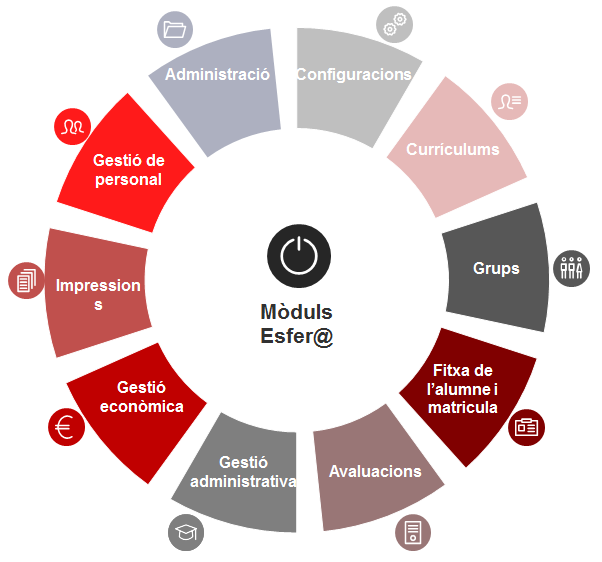

# Introducció

Aquest curs telemàtic té per objectiu conèixer les potencialitats d'Esfer@ per realitzar els processos administratius i les tasques de caràcter acadèmic que es fan en el centre.  
  
Esfer@ és l'aplicació del Departament d'Educació de suport a la gestió administrativa, acadèmica i econòmica dels centres docents públics. Aquesta nova eina va substituint progressivament l'aplicació SAGA.

### Estructura del material

Aquest material de formació es pot consultar de dues maneres diferents:

* [Per mòduls](../mgad1/index.md)
* [Per tasques agrupades per trimestres](https://ateneu.xtec.cat/wikiform/wikiexport/esfera/mgap1/index)

#### Per mòduls

El material està estructurat per mòduls tal com es mostra l'aplicació Esfer@. I dins de cada mòdul s'expliquen les opcions de menú corresponents. Els mòduls a Esfer@ són:

* [Grups](../mgad1/grups_i_doc/index.md)

  + [Grups assignats](../mgad1/grups_i_doc/g_assignats.md)
  + [Grups classe](../mgad1/grups_i_doc/g_classe.md)
  + [Agrupacions organitzatives](../mgad1/grups_i_doc/agrup_organ.md)
  + [Grups complementaris](../mgad1/grups_i_doc/g_complentari.md)
  + [Grups ZER](../mgad1/grups_i_doc/g_zer.md)
* [Matrícula i fitxa de l'alumne/a](../mgad1/mat/index.md)

  + [Fitxa de l'alumne/a](../mgad1/mat/fda/index.md)
  + [Matrícula d'alumnes (admissió o preinscripció)](../mgad1/mat/mat_pre.md)
  + [Matrícula d'alumnes del centre per continuïtat](../mgad1/mat/mat_cont.md)
  + [Resultat dels lots de matrícula](../mgad1/mat/mat_lot.md)
* [Configuracions](../mgad1/configuracions/index.md)

  + [Camps lliures (centre)](../mgad1/configuracions/camps_ll.md)
  + [Serveis](../mgad1/configuracions/serveis.md)
  + [Autoritzacions del personal del centre](../mgad1/configuracions/apc.md)
  + [Paràmetres del centre](../mgad1/configuracions/pc.md)
  + [Atenció a la diversitat](../mgad1/configuracions/at.md)
  + [Personal](../mgad1/configuracions/per.md)
* [Currículums](../mgad1/curric/index.md)

  + [Currículum del centre](../mgad1/curric/ccentre.md)
* [Avaluacions](../mgad1/avaluacions/index.md)

  + [Avaluacions parcials](../mgad1/avaluacions/ap/index.md)
  + [Avaluacions finals](../mgad1/avaluacions/af/index.md)
* [Gestió administrativa](../mgad1/gest_adm/index.md)

  + [Registre de la correspondència](../mgad1/gest_adm/reg_correspon.md)
  + [Certificats](../mgad1/gest_adm/certif.md)
  + [Arxius d'expedients](../mgad1/gest_adm/arx_exp.md)
  + [Petició de documentació](https://ateneu.xtec.cat/wikiform/wikiexport/esfera/mgad1/gest_adm/pet_docum)
  + [Expedients](../mgad1/gest_adm/exp.md)
  + [Avisos](../mgad1/gest_adm/avisos.md)
* [Publicacions](../mgad1/pub/index.md)

  + [Plantilles](../mgad1/pub/men_pla.md)
  + [Cua d'elaboració (plantilles)](../mgad1/pub/men_cuad.md)
  + [Etiquetes d'alumnes](../mgad1/pub/eti.md)
  + [Cua d'elaboració (etiquetes)](../mgad1/pub/men_cua_eti.md)
  + [Models](../mgad1/pub/mod.md)
  + [Cua d'elaboració (models)](../mgad1/pub/men_mod.md)
  + [Extraccions](../mgad1/pub/ext.md)
  + [Cua d'elaboració (extraccions)](../mgad1/pub/ext_cua.md)
* [Personal](../mgad1/personal/index.md)

  + [Dades del personal](../mgad1/personal/personal1.md)
  + [Professor pendent de nomenar](../mgad1/personal/per_pn.md)
  + [Visualitzar les meves dades](../mgad1/personal/per_lmd.md)
* [Gestió econòmica](../mgad1/geconomica/index.md)

  + [Pressupost](../mge1/bloc1/index.md)
  + [Registre d'operacions](../mge1/bloc2/index.md)
  + [Tresoreria](../mge1/bloc3/index.md)
  + [Liquidació d'impostos](../mge1/bloc4/index.md)
  + [Informes, consultes i extraccions](../mge1/bloc5/index.md)
  + [Factura electrònica](../mge1/bloc6/index.md)
  + [Paràmetres del centre](../mge1/bloc7/index.md)
  + [Administrador](../mge1/bloc8/index.md)
  + [Primer any de funcionament d’Esfer@](../mge1/bloc9/index.md)

#### Per tasques agrupades per trimestres

En aquest cas el material s'estructura per trimestres, i a cada trimestre hi ha una llista de les diferents tasques i funcions que cal fer.