# Sessió d'avaluació

**Continguts**   
  
**1** [Accés](aval-af-sessio.md#accés)   
  
**2** [Estats de l'avaluació final](aval-af-sessio.md#estats-de-lavaluació-final)   
  
**3** [Què es pot fer?](aval-af-sessio.md#què-es-pot-fer)

### Accés

S'accedeix des de **Avaluacions - Avaluacions finals - Sessió d'avaluació**

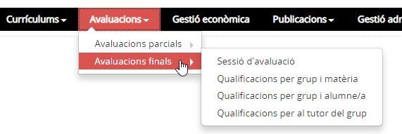*Imatge 1 - Avaluacions finals - Accés a Sessió d'avaluació*

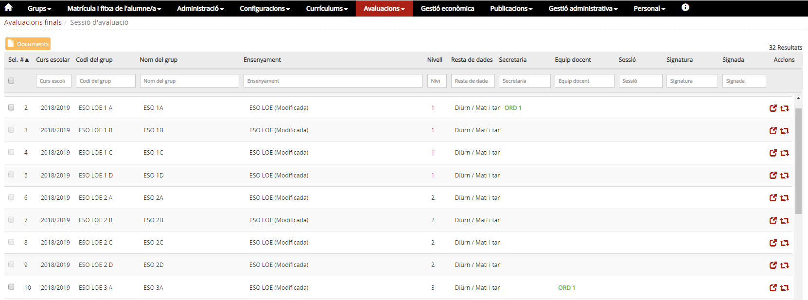*Imatge 2 - Avaluacions finals - Sessió d'avaluació*

Mostra la relació de tots els grups classe que té el centre pel curs escolar definit i indicat a **Curs defecte avaluació** de l'opció del menú **Paràmetres del centre** del mòdul **Configuracions**. Permet accedir a les funcionalitats, per a cada grup, de la gestió de les sessions d'avaluació final.  
  
  
No tots els ensenyaments tenen la mateixa estructura d'avaluacions, per la qual cosa el programa permet crear les avaluacions finals en funció de l'ensenyament.

* **EINF** - No hi ha avaluació final i no es pot crear cap sessió d'avaluació final.
* **EPRI** - Per cada grup classe, es pot crear una sessió d'**Avaluació final**.
* **ESO** - Per cada grup classe, es pot crear una sessió d'**Avaluació final ordinària** i una **Avaluació final extraordinària**.
* **Batxillerat** - Per cada grup classe, es pot crear una sessió d'**Avaluació final ordinària** i una **Avaluació final extraordinària**.
* **CF d'FP** - Per cada grup classe el centre pot crear fins a nou sessions d'avaluació final
* **CF d'APD** - Per cada grup classe el centre pot crear fins a tres sessions d'avaluació i una d'extraordinària

### Estats de l'avaluació final

Els estats de l'avaluació final són:

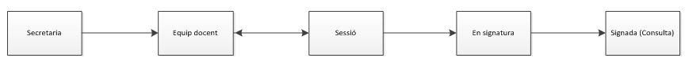*Imatge 3 - Avaluacions finals - Estats de l'avaluació*

* [Secretaria](aval-af-sessio.md#secretaria)
* [Equip docent](aval-af-sessio.md#equip-docent)
* [Sessió](aval-af-sessio.md#sessió)
* [En signatura](aval-af-sessio.md#en-signatura)
* [Signada](aval-af-sessio.md#signada)

**Els canvis d'estat de les avaluacions són seqüencials i irreversibles**   
No obstant això, es pot passar de l’estat equip docent a l’estat sessió i retrocedir l’estat de sessió a equip docent.

#### Secretaria

Es correspon amb la fase en la qual la secretaria prepara la sessió d'avaluació. Amb la col·laboració dels professors i ED, es comproven totes les dades, i si és el cas corregeix els errors.

##### En aquest estat que es pot fer?

* Accedint a **Qualificacions per grup i matèria**[1)](aval-af-sessio.md#1):

  + Es mostra la pantalla d'entrada de qualificacions de la matèria amb la relació alumnes que tenen la matèria al currículum, però no es poden entrar les notes.
* Accedint a **Qualificacions per grup i alumne**[2)](aval-af-sessio.md#2):

  + Es mostra la pantalla d'entrada de qualificacions de l'alumne, i es veuen tots els continguts que té assignats al currículum, però no es poden entrar les notes.
* En aquest estat ningú pot enregistrar res, però és útil per detectar i corregir les possibles errades en l'assignació del currículum de l'alumne.
* Qualsevol canvi que es faci al currículum dels alumnes es veu immediatament reflectit en l'avaluació.
* Qualsevol canvi que es faci en relació als alumnes dels grups es veu immediatament reflectit en l'avaluació

El canvi d'estat de **Secretaria** a **Equip docent** el pot executar qualsevol de l'equip directiu i el PAS.  
Aquest canvi d'estat no és immediat. Es fa efectiu l'endemà d'haver-lo sol·licitat.

#### Equip docent

Es correspon amb la fase en la qual el professorat enregistra els resultats de la seva valoració.

L'entrada de notes es pot fer:

* Per alumne
* Per matèria

Poden accedir i editar:

* Equip directiu (total)
* PAS (total)
* Professor (dels seus alumnes i matèries)
* Tutor (dels seus alumnes de tutoria)

Documents que es poden generar:

* Actes

Accés a la impressió:

* Equip directiu
* PAS
* Tutor (del seu grup de tutoria)

El canvi d'estat d'**Equip docent** a **Sessió** el pot executar:

* Equip directiu (total)
* PAS (total)
* Tutor (al seu grup de tutoria si així està configurat)

 

#### Sessió

Fa referència a la fase en la qual el professorat posa en comú els resultats de cada alumne, pren decisions i tanca els resultats de l'avaluació.

L'edició de notes es pot fer:

* Per alumne

Poden accedir i editar:

* Equip directiu (total)
* PAS (total)
* Tutor (dels seus alumnes de tutoria)

Poden accedir en mode consulta:

* Professor (dels seus alumnes i matèries)

Documents que es poden generar:

* Actes
* Butlletins

Accés a la impressió:

* Equip directiu
* PAS
* Tutor (del seu grup i dels seus alumnes de tutoria)

El canvi d'estat de **Sessió** a **En signatura** el pot executar:

* Equip directiu (total)

El canvi d'estat de **Sessió** a **Equip docent** el pot executar:

* Equip directiu (total)
* PAS (total)

 

#### En signatura

Es correspon amb el temps dedicat a fer el control de qualitat de les dades, a imprimir i signar les actes i imprimir butlletins.

L'edició de notes es pot fer:

* Per alumne

Poden accedir i editar:

* Equip directiu (total)
* PAS (total)

Poden accedir en mode consulta:

* Professor dels seus alumnes i matèries)
* Tutor (dels seus alumnes de tutoria)

Documents que es poden generar:

* Actes
* Butlletins

Accés a la impressió:

* Equip directiu
* PAS
* Tutor (del seu grup i dels seus alumnes de tutoria)

El canvi d'estat de **En signatura** a **Signada** el pot executar:

* Equip directiu (total)

 

#### Signada

Fa referència a la fase final del procés quan les actes s’arxiven.  
En aquest estat tot està en mode consulta.

Poden accedir en mode consulta:

* Equip directiu (total)
* PAS (total)
* Professor (als seus alumnes i matèries)
* Tutor (Dels seus alumnes de tutoria

Còpia de documents que es poden generar:

* Actes
* Butlletins

Accés a la impressió

* Equip directiu
* PAS
* Tutor (del seu grup i dels seus alumnes de tutoria)

 

---

### Què es pot fer?

Per cada grup:

* [Crear l'avaluació final](aval-af-sessio.md#crear-lavaluació-final)
* [Enregistrar els canvis d'estat de l'avaluació](aval-af-sessio.md#enregistrar-els-canvis-destat-de-lavaluació)
* [Generar la documentació de cada avaluació: Acta i butlletins](aval-af-sessio.md#generar-la-documentació-de-cada-avaluació-acta-i-butlletins)

Per a cada grup i cada sessió d'avaluació:

* [Enregistrar la data de l'avaluació](aval-af-sessio.md#enregistrar-la-data-de-lavaluació)
* [Enregistrar els acords de l'avaluació](aval-af-sessio.md#enregistrar-els-acords-de-lavaluació)
* [Enregistrar altres assistents a la sessió d'avaluació](aval-af-sessio.md#enregistrar-altres-assistents-a-la-sessió-davaluació)

#### Crear l'avaluació final

Del grup que es vol crear l'avaluació final es prem la icona  **Canvi estat**.

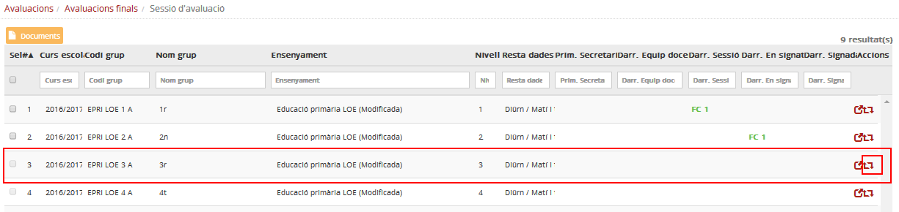*Imatge 4 - Avaluacions finals - Sessió d'avaluació - Accedir a la pantalla creació avaluació final*

Es prem la icona  **Afegeix**.

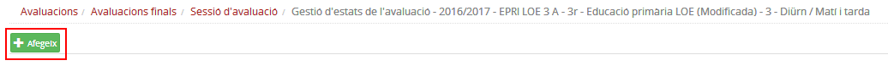*Imatge 5 - Avaluacions finals - Sessió d'avaluació - Crear avaluació final*

El sistema informa de què s'ha creat satisfactòriament l'avaluació i ha quedat en estat **Secretaria**.

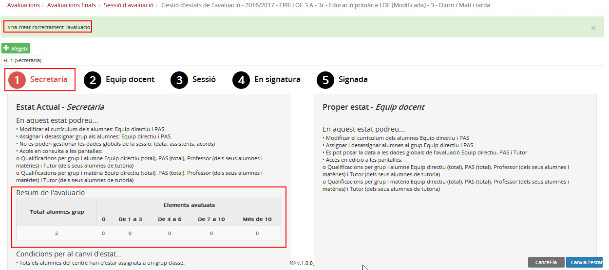*Imatge 6 - Avaluacions finals - Sessió d'avaluació - Avaluació final - Estat Secretaria*

A la pantalla es pot veure un resum de l'avaluació, així com què és pot fer a l'estat actual i al següent, i quin és l'estat actual, el qual apareix destacat en color vermell.

A la pantalla Sessió d'avaluació es pot veure que el grup té l'avaluació final creada i en estat Secretaria.

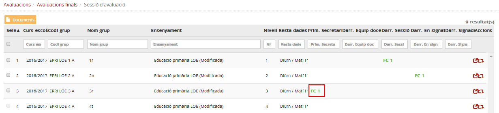*Imatge 7 - Avaluacions finals - Sessió d'avaluació - Avaluació final - Estat Secretaria*

 

#### Enregistrar els canvis d'estat de l'avaluació

Del grup que es vol canviar l'estat de l'avaluació final es prem la icona  **Canvi estat**.

*Imatge 8 - Avaluacions finals - Sessió d'avaluació - Accedir a la pantalla per canviar d'estat l'avaluació*

A continuació es prem el botó  **Canvi d'estat**

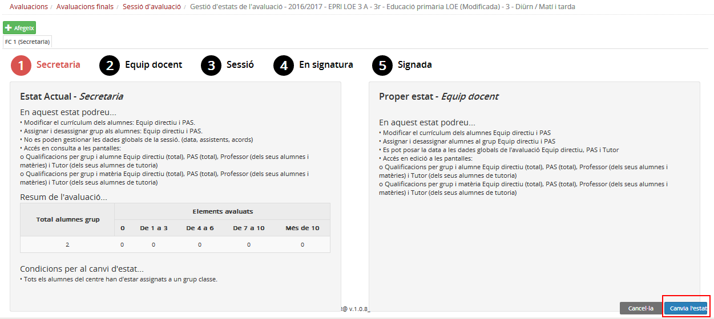*Imatge 9 - Avaluacions finals - Sessió d'avaluació - Canvi d'estat*

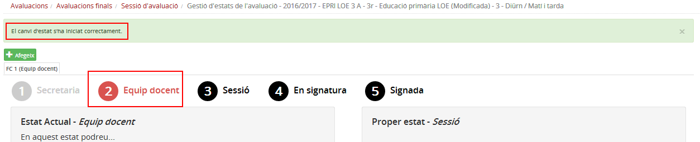*Imatge 10 - Avaluacions finals - Sessió d'avaluació - Canvi d'estat executat*

 

#### Generar la documentació de cada avaluació: Acta i butlletins

Cal anar a **Avaluacions > Avaluacions finals > Sessió d'avaluació**, seleccionar el grup del qual es vol obtenir l'acta i/o els butlletins, i clicar el botó  de la part superior.

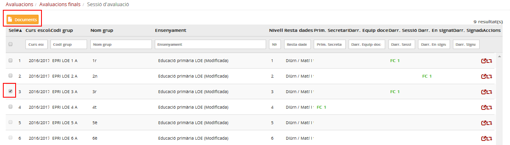*Imatge 11 - Avaluacions finals - Sessió d'avaluació - Obtenir actes i butlletins*

##### Actes

Al desplegable **Avaluació final de curs** se n'informa amb un **Sí** i es prem el botó . No cal seleccionar els alumnes. Es genera un document en format pdf

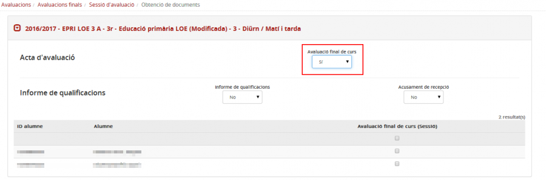*Imatge 12 - Avaluacions finals - Documents - Acta primària*

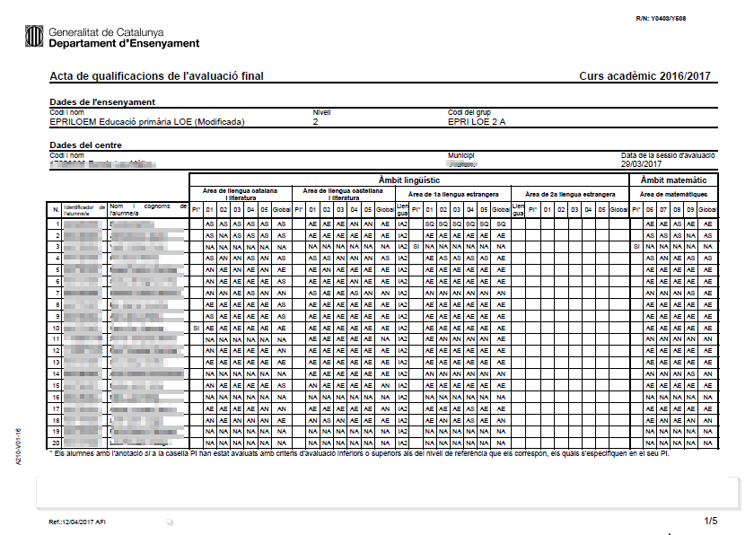*Imatge 13 - Avaluacions finals - Documents - Acta primària*

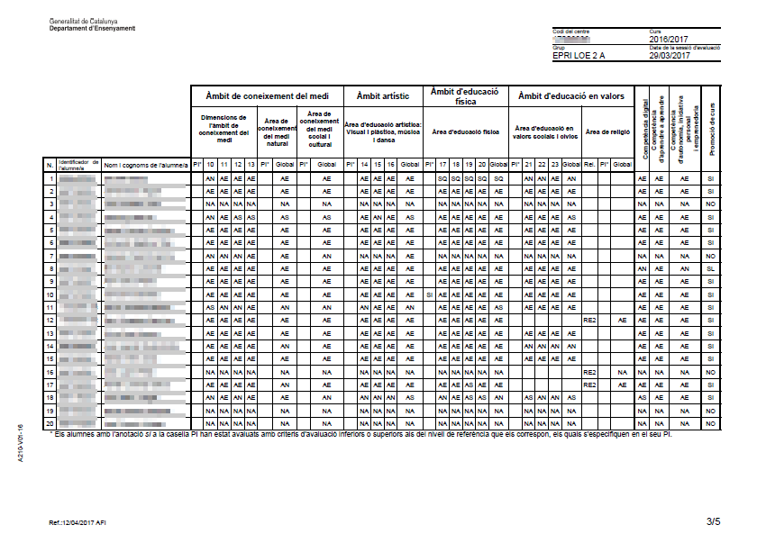*Imatge 14 - Avaluacions finals - Documents - Acta primària*

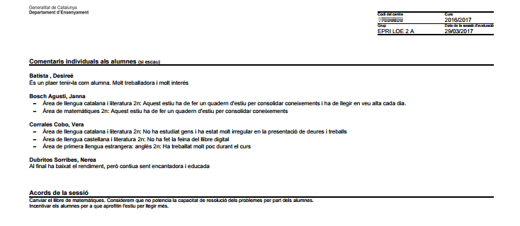*Imatge 15 - Avaluacions finals - Documents - Acta primària*

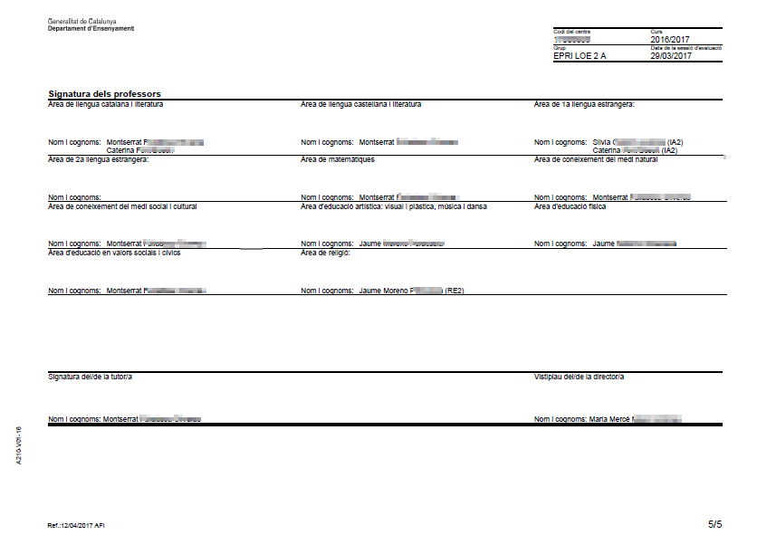*Imatge 16 - Avaluacions finals - Documents - Acta primària*

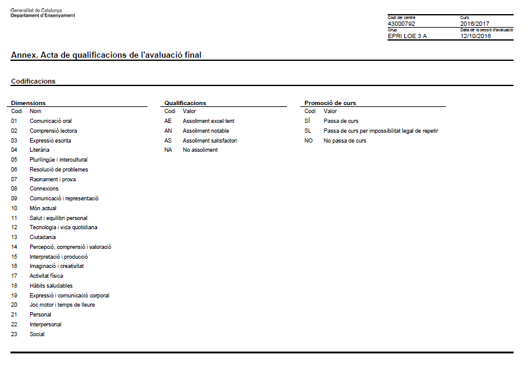*Imatge 17 - Avaluacions finals - Documents - Acta primària*

 

##### Butlletins

Al desplegable **Informe de qualificacions** se n'informa amb un **Sí**, es selecciona els alumnes i es prem el botó . Es genera un document zip amb els butlletins en format pdf

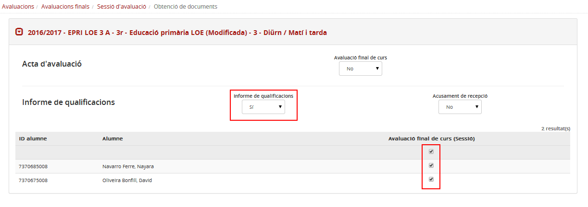*Imatge 18 - Avaluacions finals - Documents - Butlletins*

|  |  |
| --- | --- |
|  |  |

*Imatge 19 - Avaluacions finals - Documents - Butlletí primària*

 

#### Enregistrar la data de l'avaluació

 

[1)](aval-af-sessio.md#1)
S'ha de triar el grup i la matèria

[2)](aval-af-sessio.md#2)
S'ha de triar el grup i l'alumne