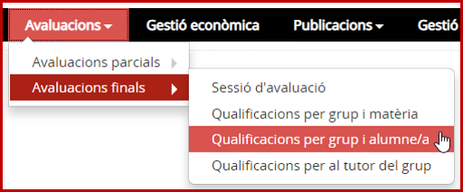
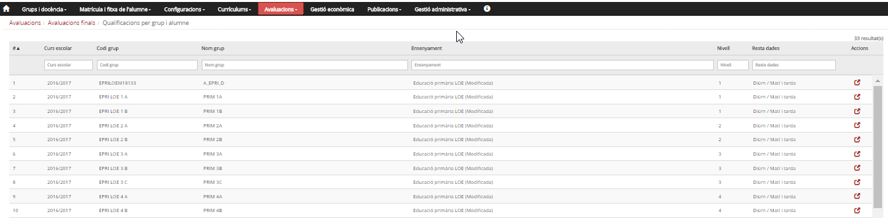
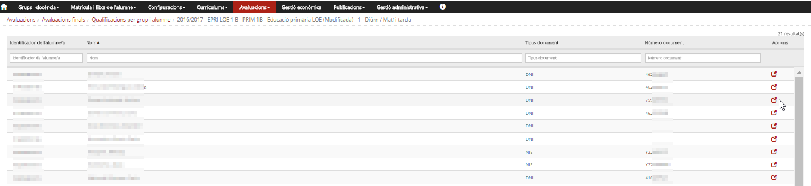
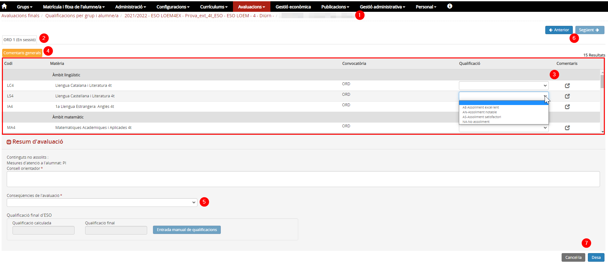

## Qualificacions per grup i alumne/a

* [Què és](grupalavalfinal.md#que-es)
* [Com s'hi accedeix](grupalavalfinal.md#com-shi-accedeix)
* [Quines operacions s'hi poden fer](grupalavalfinal.md#quines-operacions-shi-poden-fer)

### Què és

Des d'aquesta opció del menú **Avaluacions finals** del mòdul **Avaluacions** es poden entrar les qualificacions per grup i alumne/a.

### Com s'hi accedeix

Per accedir-hi s'ha de seleccionar l'opció del menú **Qualificacions per grup i alumne/a** del submòdul **Avaluacions finals** del mòdul **Avaluacions**.

*Imatge 1- Accés al menú Qualificacions per grup i alumne/a*

### Quines operacions s'hi poden fer

*Imatge 2 - Llista de grups classe*

La pantalla mostra la taula de grups i les sessions d'avaluació.

* Té una capçalera amb els camps: **Curs escolar**, **Codi del grup**, **Nom del grup**, **Ensenyament**, **Nivell**, **Resta de dades** [1)](grupalavalfinal.md#1) i **Accions**.
* Hi ha camps en blanc per poder delimitar la cerca.
* Hi ha una fila per a cada un dels grups classe del centre, per al curs escolar que s'hagi establert com a **Curs defecte d'avaluació** a l'opció del menú **Paràmetres del centre** del mòdul **Configuracions**.
* A la columna d'accions hi ha la icona . En prémer la icona d'un grup, mostra una taula amb la llista d'alumnes del grup.

*Imatge 3 - Llista d'alumnes del grup*  
La pantalla mostra la llista d'alumnes del grup:

* Té una capçalera amb els camps: **Identificador de l'alumne/a**, **Nom**, **Tipus de document**, **Número de document** i **Accions**.
* Hi ha camps en blanc per poder delimitar la cerca.
* A la columna d'accions hi ha la icona . En prémer la icona s'accedeix a la pantalla de qualificacions de l'alumne.

---

### Introduir/consultar les qualificacions de totes les matèries dels alumnes d'un grup (alumne per alumne)

En prémer la icona  d'un alumne, s'accedeix a una taula amb les matèries que l'alumne té al currículum; en funció del rol de la persona que hi accedeix i de l'estat de la sessió, es mostraran o es permetrà entrar-ne les qualificacions.
  
*Imatge 4 - Seccions de la pantalla*  
  
  
La pantalla està estructurada en diverses seccions:

1. **Fil d'Ariadna**: Amb la informació del grup classe, de l'identificador, i el nom i cognoms de l'alumne.
2. **Sessió d'avaluació**: Identifica la sessió d'avaluació del curs.
3. **Taula de matèries i qualificacions**: Relació de matèries, de les qualificacions i comentaris. [2)](grupalavalfinal.md#2)
4.  El botó permet entrar comentaris generals a l'avaluació de l'alumne.
5. **Resum de l'avaluació**: Aquestes dades només les pot entrar el tutor o l'equip directiu en estat Sessió.
6.  Botons que permeten anar a l'alumne anterior o al següent.
7.  Botons per sortir, sense enregistrar o guardant les qualificacions i comentaris.

---

Accions que es poden fer en funció dels estats de les sessions d'avaluació.

#### Accions que es poden fer en funció de l'estat de la sessió d'avaluació

| Estat | Rol | Accions que es poden fer |
| --- | --- | --- |
| Secretaria | Equip directiu i secretaria.[3)](grupalavalfinal.md#3) Els professors.[4)](grupalavalfinal.md#4) El tutor/a [5)](grupalavalfinal.md#5) | Revisar el currículum. Es pot accedir en mode "consulta" i veure les matèries que l'alumne té al currículum. |
| Equip docent | Equip directiu i secretaria amb autorització.[6)](grupalavalfinal.md#6) Els professors.[7)](grupalavalfinal.md#7) El tutor/a [8)](grupalavalfinal.md#8) | Entrar les qualificacions. |
| Sessió | Els professors | Accedir en mode de consulta als resultats de l'avaluació. Poden veure les qualificacions, però no modificar-les. |
| Equip directiu i secretaria amb autorització, i el tutor/a [9)](grupalavalfinal.md#9) | Revisió de les qualificacions i, si correspon, entrada de les qualificacions globals i de les conseqüències de l'avaluació. |
| En signatura | Equip directiu i secretaria.[10)](grupalavalfinal.md#10) Els professors.[11)](grupalavalfinal.md#11) El tutor/a [12)](grupalavalfinal.md#12) | Consulta de les matèries i qualificacions. |
| Signada | Equip directiu i secretaria.[13)](grupalavalfinal.md#13) Els professors.[14)](grupalavalfinal.md#14) El tutor [15)](grupalavalfinal.md#15) | Consulta de les matèries i qualificacions. |

---

[1)](grupalavalfinal.md#1)
Règim i torn.

[2)](grupalavalfinal.md#2)
Es poden posar comentaris a cada matèria prement la icona .

[3)](grupalavalfinal.md#3)
, [6)](grupalavalfinal.md#6)
, [10)](grupalavalfinal.md#10)
, [13)](grupalavalfinal.md#13)
De tots els alumnes.

[4)](grupalavalfinal.md#4)
, [7)](grupalavalfinal.md#7)
, [11)](grupalavalfinal.md#11)
, [14)](grupalavalfinal.md#14)
Només dels grups i matèries que tenen assignats.

[5)](grupalavalfinal.md#5)
, [8)](grupalavalfinal.md#8)
, [12)](grupalavalfinal.md#12)
, [15)](grupalavalfinal.md#15)
Dels alumnes del grup de tutoria.

[9)](grupalavalfinal.md#9)
Del grup.