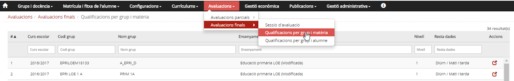
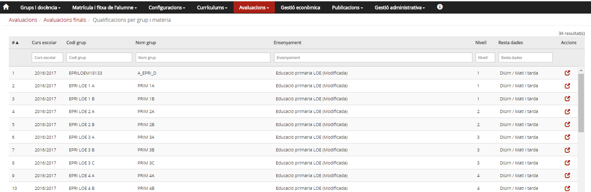
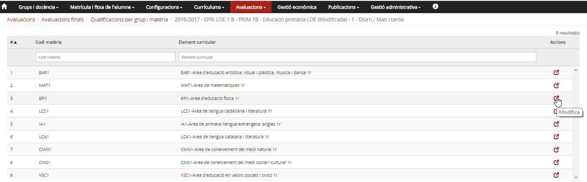
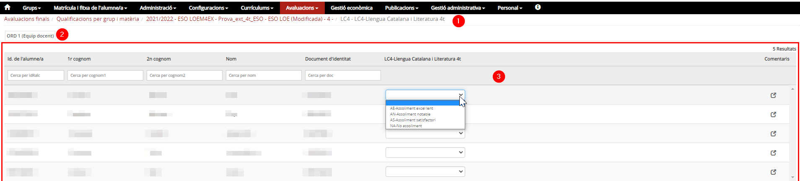

## Qualificacions per grup i matèria

* [Què és](grupmatavalfinal.md#què-és)
* [Com s'hi accedeix](grupmatavalfinal.md#com-shi-accedeix)
* [Quines operacions s'hi poden fer](grupmatavalfinal.md#quines-operacions-shi-poden-fer)

### Què és

Des d'aquesta opció del menú es poden entrar les qualificacions per grup i matèria.

### Com s'hi accedeix

Per accedir s'ha de seleccionar l'opció de menú **Qualificacions per grup i matèria** del submòdul **Avaluacions finals** del mòdul **Avaluacions**.
  
*Imatge 1- Accés al menú Qualificacions per grup i matèria*

### Quines operacions s'hi poden fer

#### Entrada de qualificacions

*Imatge 2 - Llista de grups classe* 
La pantalla mostra la taula de grups i les sessions d'avaluació.

* La taula té una capçalera amb els camps: **Curs escolar**, **Codi grup**, **Nom grup**, **Ensenyament**, **Nivell**, **Resta dades** [1)](grupmatavalfinal.md#1) i **Accions**.
* Hi ha camps en blanc per poder delimitar la cerca.
* Hi ha una fila per cada un dels grups classe del centre, per al curs escolar que s'hagi establert com a **Curs defecte d'avaluació** a l'opció del menú **Paràmetres del centre** del mòdul **Configuracions**.
* A la columna d'accions hi ha la icona . En prémer la icona d'un grup, es mostra una llista amb la llista de les matèries assignades al grup.

*Imatge 3 - Llista de matèries del grup*
  
La pantalla mostra la llista de matèries del grup:

* Té una capçalera amb els camps: **Codi matèria**, **Element curricular** i **Accions**.
* Hi ha uns camps en blanc per poder delimitar la cerca.
* A la columna d'accions hi ha la icona . En prémer la icona s'accedeix a la pantalla de qualificacions de la matèria.

En prémer la icona  d'un alumne, s'accedeix a una taula amb les matèries que l'alumne té al currículum; en funció del rol de la persona que hi accedeix i de l'estat de la sessió, es mostraran o es permetrà entrar-ne les qualificacions.
  
*Imatge 4 - Seccions de la pantalla*
  
La pantalla està estructurada en diverses seccions:

1. **Fil d'Ariadna**: Amb la informació del grup classe i matèria de la qual s'entren/consulten les qualificacions dels alumnes.
2. **Sessió d'avaluació**: Identifica la sessió d'avaluació del curs.
3. **Taula d'alumnes i qualificacions**: Relació d'alumnes del grup, qualificacions i comentaris. [2)](grupmatavalfinal.md#2)
4.  Botons per sortir, sense enregistrar o guardant les qualificacions i comentaris.

#### Accions que es poden fer en funció de l'estat de la sessió d'avaluació

| Estat | Rol | Accions que es poden fer |
| --- | --- | --- |
| Secretaria | Equip directiu i secretaria. [3)](grupmatavalfinal.md#3) Els professors. [4)](grupmatavalfinal.md#4) El tutor/a [5)](grupmatavalfinal.md#5) | Revisar el currículum. Es pot accedir en mode de consulta i veure les matèries que l'alumne té al currículum. |
| Equip docent | Equip directiu i secretaria amb autorització. [6)](grupmatavalfinal.md#6) Els professors. [7)](grupmatavalfinal.md#7) El tutor/a [8)](grupmatavalfinal.md#8) | Entrar les qualificacions. |
| Sessió | Els professors | Accedir en mode de consulta als resultats de l'avaluació. Poden veure les qualificacions, però no modificar-les. |
| Equip directiu i secretaria amb autorització i el tutor/a [9)](grupmatavalfinal.md#9) | Revisió de les qualificacions i, si correspon, entrada de les qualificacions globals i de les conseqüències de l'avaluació. |
| En signatura | Equip directiu i secretaria. [10)](grupmatavalfinal.md#10) Els professors. [11)](grupmatavalfinal.md#11) El tutor/a [12)](grupmatavalfinal.md#12) | Consulta de les matèries i qualificacions. |
| Signada | Equip directiu i secretaria. [13)](grupmatavalfinal.md#13) Els professors. [14)](grupmatavalfinal.md#14) El tutor/a [15)](grupmatavalfinal.md#15) | Consulta de les matèries i qualificacions. |

[1)](grupmatavalfinal.md#1)
Règim i torn.

[2)](grupmatavalfinal.md#2)
Es poden posar comentaris a cada alumne prement la icona .

[3)](grupmatavalfinal.md#3)
, [6)](grupmatavalfinal.md#6)
, [10)](grupmatavalfinal.md#10)
, [13)](grupmatavalfinal.md#13)
De tots els alumnes.

[4)](grupmatavalfinal.md#4)
, [7)](grupmatavalfinal.md#7)
, [11)](grupmatavalfinal.md#11)
, [14)](grupmatavalfinal.md#14)
Només dels grups i matèries que tenen assignats.

[5)](grupmatavalfinal.md#5)
, [8)](grupmatavalfinal.md#8)
, [12)](grupmatavalfinal.md#12)
, [15)](grupmatavalfinal.md#15)
Dels alumnes del grup de tutoria.

[9)](grupmatavalfinal.md#9)
Del grup de tutoria.