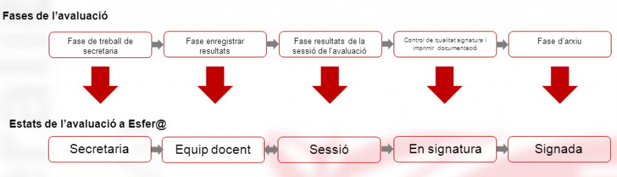
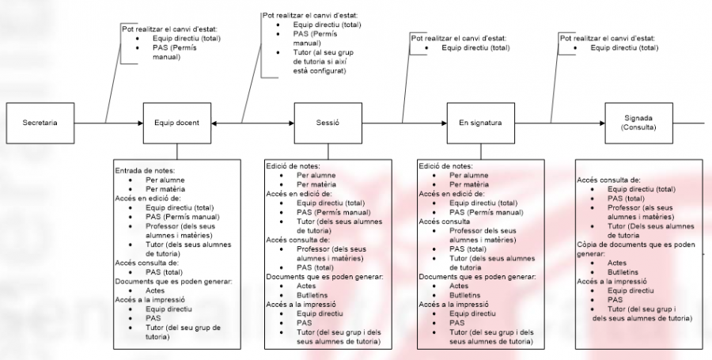

# Avaluacions finals

* [Què són](indexavalfinal.md#què-són)
* [Com s'hi accedeix](indexavalfinal.md#com-shi-accedeix)
* [Quines operacions s'hi poden fer](indexavalfinal.md#quines-operacions-shi-poden-fer)

### Què són

Les avaluacions finals són processos administratius on, d'acord amb la normativa, es valoren els aprenentatges i les competències adquirides per l'alumne en finalitzar un ensenyament, nivell, mòdul professional, etc.

#### Les avaluacions finals en els diferents ensenyaments

No tots els ensenyaments tenen la mateixa estructura d'avaluació, per la qual cosa, el programa permet crear les avaluacions finals en funció de l'ensenyament.

| Ensenyament | Av. final | Av. extraordinària | Observacions |
| --- | --- | --- | --- |
| **Educació infantil** |  |  | S'indica el pas de curs de cada infant. |
| **Educació primària** |  |  | A cada nivell, s'avaluen les àrees i les dimensions; a 2n, 4t i 6è s'avaluen també les competències transversals. |
| **ESO** |  |  | S'avaluen totes les matèries del currículum. |
| **Batxillerat** |  |  | S'avaluen totes les matèries del currículum. |
| **Cicles formatius** |  | | Es poden fer[1)](indexavalfinal.md#1) tantes avaluacions finals com sigui necessari. A cada sessió, s'avaluen totes les unitats formatives i els mòduls professionals que l'alumne tingui a la matrícula i que no hagi superat ja en una sessió d'avaluació anterior. [2)](indexavalfinal.md#2) |
| **Cicles formatius d'arts plàstiques i disseny** |  | | Es poden fer fins a tres sessions avaluacions finals; si es fa una tercera sessió, aquesta és extraordinària. A cada sessió, s'avaluen totes les unitats formatives i els mòduls professionals que l'alumne tingui a la matrícula i que no hagi superat ja en una sessió d'avaluació anterior. [3)](indexavalfinal.md#3) |

#### Fases i estats de les avaluacions finals

L’avaluació es desenvolupa en **fases** que en el programa es tradueixen en **estats**.
  
*Imatge 1 - Avaluacions finals - Correspondència entre fases i estats*
  
Les fases que es preveuen són:

* [Fase de treball de secretaria - Estat "Secretaria"](indexavalfinal.md#fase-de-treball-de-secretaria-estat-secretaria)
* [Fase d'entrada de resultats - Estat "Equip docent"](indexavalfinal.md#fase-dentrada-de-resultats-estat-equip-docent)
* [Fase de resultats de la sessió d'avaluació - Estat "Sessió"](indexavalfinal.md#fase-de-resultats-de-la-sessió-davaluació-estat-sessió)
* [Fase de comprovació de resultats, signatura i impressió dels resultats - Estat "En signatura"](indexavalfinal.md#fase-de-comprovació-de-resultats-signatura-i-impressió-dels-resultats-estat-en-signatura)
* [Fase d'arxiu - Estat "Signada"](indexavalfinal.md#fase-darxiu-estat-signada)

Es pot passar de l’estat equip docent a l’estat sessió i retrocedir l’estat de sessió a equip docent.  
Tota la resta de canvis d’estat de les avaluacions són **irreversibles**

---

#### Fase de treball de secretaria - Estat "Secretaria"

En aquesta fase s'han de fer les següents tasques:

* Creació de la sessió d'avaluació. [4)](indexavalfinal.md#4)
* Revisió de les dades. [5)](indexavalfinal.md#5)
* Fer el canvi d'estat, de **Secretaria** a **Equip docent**. [6)](indexavalfinal.md#6)

---

#### Fase d'entrada de resultats - "Estat equip docent"

En aquesta fase s'han de fer les tasques següents:

* Entrar les qualificacions:

  + Els professors han d'entrar les qualificacions als alumnes del grup. [7)](indexavalfinal.md#7)[8)](indexavalfinal.md#8)
  + El tutor o tutora del grup també pot veure i entrar les qualificacions de totes les matèries del grup. [9)](indexavalfinal.md#9)
  + L'equip directiu o el personal de secretaria també poden entrar les qualificacions de tots els grups i matèries. [10)](indexavalfinal.md#10)
* Fer el canvi d'estat d'**Equip docent** a **Sessió**. [11)](indexavalfinal.md#11)

---

#### Fase de resultats de la sessió d'avaluació - Estat "Sessió"

En aquesta fase s'han de fer les tasques següents:

* Impressió dels documents per a la sessió d'avaluació. [12)](indexavalfinal.md#12)
* Revisió de les qualificacions de totes les matèries dels alumnes. [13)](indexavalfinal.md#13)
* Completar l'avaluació dels alumnes i entrar les dades de la sessió d'avaluació; entrar les conseqüències de l'avaluació, la data de la sessió, els assistents i els acords. [14)](indexavalfinal.md#14)
* Fer el canvi d'estat **Sessió** a **En signatura**. [15)](indexavalfinal.md#15)

---

#### Fase de comprovació de resultats, signatura i impressió dels resultats - Estat "En signatura"

En aquesta fase s'han de fer les tasques següents:

* Impressió de les actes i els informes d'avaluació. [16)](indexavalfinal.md#16)
* Comprovar les dades. [17)](indexavalfinal.md#17)
* Fer el canvi d'estat de **En signatura** a **Signada**. [18)](indexavalfinal.md#18)

---

#### Fase d'arxiu - Estat "Signada"

En aquesta fase s'han de fer les tasques següents:

* Arxivar l'acta d'avaluació del grup. [19)](indexavalfinal.md#19)

---

#### Estats de les sessions d'avaluació

*Imatge 2 - Avaluacions finals - Estats de les sessions d'avaluació*

---

### Com s'hi accedeix

S'accedeix des d'**Avaluacions - Avaluacions finals - Sessió d'avaluació**

*Imatge 1 - Accés a Sessió d'avaluació*

*Imatge 2 - Pantalla d'una sessió d'avaluació*

Mostra la llista de tots els grups classe que té el centre per al curs escolar definit i indicat com a "Curs defecte avaluació" a l'opció del menú **Paràmetres del centre** del mòdul **Configuracions**. Permet accedir a les funcionalitats, per a cada grup, de la gestió de les sessions d'avaluació final.

---

### Quines operacions s'hi poden fer

| Acció | Secretaria | Equip docent | Sessió | En signatura | Signada |
| --- | --- | --- | --- | --- | --- |
| Modificacions, si escau, dels grups classe |  |  |  |  |  |
| Canviar l'estat de la sessió d'avaluació [20)](indexavalfinal.md#20) |  |  |  |  |  |
| Modificacions, si escau, del currículum dels alumnes [21)](indexavalfinal.md#21) |  |  |  |  |  |
| Entrar/Consultar qualificacions per grup i matèria [22)](indexavalfinal.md#22) [23)](indexavalfinal.md#23) |  |  |  |  |  |
| Entrar/Consultar qualificacions per grup i alumne/a [24)](indexavalfinal.md#24) |  |  |  |  |  |
| Preparar la sessió d'avaluació |  |  |  |  |  |
| Informar camps resum de l'avaluació |  |  |  |  |  |
| Entrada de les dades de la sessió d'avaluació [25)](indexavalfinal.md#25) |  |  |  |  |  |
| Impressió de les actes d'avaluació [26)](indexavalfinal.md#26) |  |  |  |  |  |
| Impressió dels informes d'avaluació [27)](indexavalfinal.md#27) |  |  |  |  |  |
| Arxiu de les actes |  |  |  |  |  |

[1)](indexavalfinal.md#1)
Fins a nou.

[2)](indexavalfinal.md#2)
, [3)](indexavalfinal.md#3)
En una mateixa sessió els continguts avaluats per primera vegada s'avaluen de forma ordinària i els que ja s'havien avaluat de forma extraordinària

[4)](indexavalfinal.md#4)
, [11)](indexavalfinal.md#11)
, [12)](indexavalfinal.md#12)
, [15)](indexavalfinal.md#15)
, [16)](indexavalfinal.md#16)
, [18)](indexavalfinal.md#18)
, [20)](indexavalfinal.md#20)
, [25)](indexavalfinal.md#25)
, [26)](indexavalfinal.md#26)
, [27)](indexavalfinal.md#27)
Opció del menú **Sessió**.

[5)](indexavalfinal.md#5)
Opció del menú **Entrada de qualificacions per grup i matèria** o **Entrada de qualificacions per grup i alumne/a**.

[6)](indexavalfinal.md#6)
Opció del menú Sessió.

[7)](indexavalfinal.md#7)
De tots els grups i de totes les matèries que imparteixen a cada grup.

[8)](indexavalfinal.md#8)
, [10)](indexavalfinal.md#10)
Opció del menú **Qualificacions per grup i matèria** o **Qualificacions per grup i alumne/a**.

[9)](indexavalfinal.md#9)
Opció del menú **Qualificacions per grup i alumne/a** o **Qualificacions per grup i matèria**.

[13)](indexavalfinal.md#13)
Opció del menú **Qualificacions per grup i alumne/a** o en mode de consulta per **Qualificacions per grup i matèria**.

[14)](indexavalfinal.md#14)
Les **conseqüències de l'avaluació** a l'opció del menú **Qualificacions per grup i alumne/a** i les dades de la **Sessió d'avaluació** a l'opció del menú **Sessió**.

[17)](indexavalfinal.md#17)
Revisant les actes i els informes.

[19)](indexavalfinal.md#19)
L'aplicació ho fa digitalment.

[21)](indexavalfinal.md#21)
Opció del menú **Qualificacions per grup i matèria** i **Qualificacions per grup i alumne/a**.

[22)](indexavalfinal.md#22)
, [23)](indexavalfinal.md#23)
Opció del menú **Qualificacions per grup i matèria**.

[24)](indexavalfinal.md#24)
Opció del menú **Qualificacions per grup i alumne/a**.