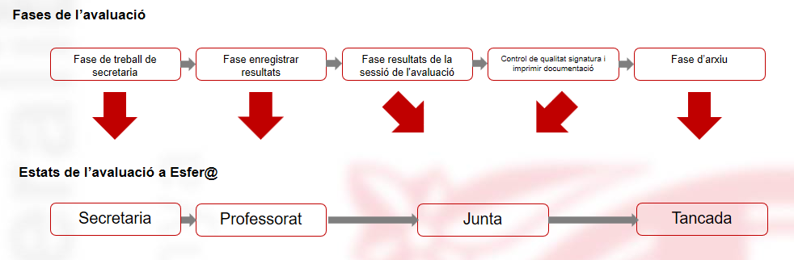

# Avaluacions parcials

* [Què són](omavparcila2.md#què-són)
* [Com s'hi accedeix](omavparcila2.md#com-shi-accedeix)
* [Quines operacions s'hi poden fer](omavparcila2.md#quines-operacions-shi-poden-fer)

### Què són

La normativa dóna llibertat als centres per organitzar les avaluacions parcials d'acord amb els seus objectius, reflectits en el PEC.

### Com s'hi accedeix

Per accedir-hi s'ha de seleccionar l'opció del menú **Avaluacions parcials** del mòdul **Avaluacions**.

### Quines operacions s'hi poden fer

A Esfer@ es deixa autonomia al centre per definir com vol fer les avaluacions parcials per a cada ensenyament:

* Què vol avaluar
* Com vol mostrar els resultats de l'avaluació
* Quantes sessions d'avaluació parcial es registren en el programa

A Esfer@ el centre pot escollir, per a cada ensenyament, entre dos modes diferents de fer les avaluacions parcials:

* Fer les avaluacions parcials seguint el model d'avaluació final **Basada en normativa**; cal definir pocs elements.
* Fer les avaluacions parcials amb el **Model d'avaluació parcial pròpia del centre**; cal definir-ho tot [1)](omavparcila2.md#1).

Per a cada ensenyament[2)](omavparcila2.md#2) el centre ha d'especificar el model d'avaluació que vol aplicar i, en el cas d'optar pel **Model d'avaluació parcial pròpia del centre**, concretar els literals que farà servir per a l'avaluació, i els **Elements propis del centre** que vol avaluar.

#### Definició del tipus d'avaluació

L'**equip directiu**, accedint a l'opció del menú **Model d'avaluacions parcials** del mòdul **Avaluacions parcials**, ha d'establir de quina manera vol fer les avaluacions parcials:

* Fer les avaluacions parcials **Basada en normativa**. Avaluar amb la mateixa estructura i funcionament que a l'avaluació final, amb els mateixos continguts i literals que ha establert la normativa.
* Fer les avaluacions parcials en **Model d'avaluació parcial pròpia del centre**. Avaluar els **Elements propis del centre** que el centre determini: avaluar per projectes, per àmbits genèrics, aspectes concrets… [3)](omavparcila2.md#3). El centre també escull els literals que vol fer servir a l'avaluació: si vol avaluar amb xifres, de manera qualitativa, amb frases o de manera combinada. En el model lliure sols es podrà fer l'entrada de qualificacions per **Grup i alumne/a**.

Donat que l'**educació infantil** no té avaluació final per normativa, per a aquest ensenyament sols es pot optar per avaluar amb el **Model d'avaluació parcial pròpia del centre**.

### Nombre de sessions d'avaluació

* El centre pot fer les avaluacions parcials que hagi establert en el PEC.
* El programa limita el nombre d'avaluacions parcials a 9. No cal que es concretin a l'inici del curs.

Les avaluacions parcials estan **totalment** deslligades de les avaluacions finals.

  

---

#### Fases de les sessions d'avaluació parcials

L'avaluació es desenvolupa en **fases** que en el programa es tradueixen en **estats**.*Imatge 2 - Avaluacions parcials - Correspondència entre fases i estats de les avaluacions parcials*

Les fases establertes són:

* [Fase de treball de secretaria - Estat "Secretaria"](omavparcila2.md#fase-de-treball-de-secretaria-estat-secretaria)
* [Fase d'entrada de resultats - Estat "Professors"](omavparcila2.md#fase-dentrada-de-resultats-estat-professors)
* [Fase de resultats de la sessió d'avaluació i fase de comprovació de resultats, signatura i impressió dels resultats - Estat "Junta"](omavparcila2.md#fase-de-resultats-de-la-sessió-davaluació-i-fase-de-comprovació-de-resultats-signatura-i-impressió-dels-resultats-estat-junta)
* [Fase d'arxiu - Estat "Tancada"](omavparcila2.md#fase-darxiu-estat-tancada)

#### Fase de treball de secretaria - Estat "Secretaria"

En aquesta fase s'han de fer les tasques següents:

* Crear la sessió d'avaluació, si escau (la 1a sessió es crea de forma automàtica després de triar el model d'avaluació parcial). [4)](omavparcila2.md#4)
* Si s'ha optat pel **Model d'avaluació parcial pròpia del centre**, crear els **Elements propis del centre**. [5)](omavparcila2.md#5)
* Creació del banc de frases, les frases i assignació d'aquestes als **Elements curriculars** o als **Elements propis del centre**. [6)](omavparcila2.md#6)
* Revisar les dades:

  + Si les avaluacions parcials es fan del tipus **Basada en la normativa**. [7)](omavparcila2.md#7)
  + Si les avaluacions parcials es fan amb el **Model d'avaluació parcial pròpia del centre**. [8)](omavparcila2.md#8)
* Fer el canvi d'estat, de **Secretaria** a **Professors**. Aquest canvi d'estat no és immediat. Es fa efectiu l'endemà d'haver-lo sol·licitat. [9)](omavparcila2.md#9)

---

#### Fase d'entrada de resultats - "Estat Professors"

En aquesta fase s'han de fer les tasques següents:

* Entrar les qualificacions:

  + Si les avaluacions parcials es fan com les finals els professors poden entrar les qualificacions. [10)](omavparcila2.md#10)
  + Si les avaluacions parcials es fan amb el model d'avaluació parcial **pròpia del centre**, les qualificacions sols les pot entrar el tutor, el personal de secretaria habilitat o l'equip directiu, i també la resta de docents si es vinculen els elements propis del centre de nivell I als continguts que imparteixen en el grup classe. [11)](omavparcila2.md#11)
* Fer el canvi d'estat **Professors** a **Junta**. [12)](omavparcila2.md#12).

---

#### Fase de resultats de la sessió d'avaluació i fase de comprovació de resultats, signatura i impressió dels resultats - Estat "Junta"

En aquesta fase s'han de fer les tasques següents:

* Imprimir els documents per a la sessió d'avaluació. [13)](omavparcila2.md#13)
* Revisar les qualificacions de totes les matèries dels alumnes. [14)](omavparcila2.md#14)
* Entrar les dades de la sessió d'avaluació; la data de la sessió, els assistents, acords. [15)](omavparcila2.md#15)
* Fer el canvi d'estat **Junta** a **Tancada**. [16)](omavparcila2.md#16)

---

#### Fase d'arxiu - Estat "Tancada"

En aquesta fase s'ha de fer la tasca següent:

* Arxivar l'acta d'avaluació del grup .

#### Accions durant el procés de les avaluacions parcials

| Acció | Secretaria | Professors | Junta | Tancada |
| --- | --- | --- | --- | --- |
| Canviar l'estat de la sessió d'avaluació [17)](omavparcila2.md#17) |  |  |  |  |
| Revisar els continguts que cal tenir en compte a l'avaluació dels alumnes [18)](omavparcila2.md#18) |  |  |  |  |
| Entrada de qualificacions per grup i matèria [19)](omavparcila2.md#19) |  |  |  |  |
| Consulta de qualificacions per grup i matèria [20)](omavparcila2.md#20) |  |  |  |  |
| Entrada de qualificacions per grup i alumne/a [21)](omavparcila2.md#21) |  |  |  | [22)](omavparcila2.md#22) |
| Entrada de les dades de la sessió d'avaluació [23)](omavparcila2.md#23) |  |  |  |  |
| Impressió de les actes d'avaluació [24)](omavparcila2.md#24) |  |  |  |  |
| Impressió dels informes d'avaluació [25)](omavparcila2.md#25) |  |  |  |  |
| Arxivar les actes |  |  |  |  |

#### Permisos d'accés segons les fases de les avaluacions

| Acció | Rol de Director / Equip directiu | Rol de Tutor | Rol de Professor | Rol de Secretaria | Permís manual |
| --- | --- | --- | --- | --- | --- |
| Canviar l'estat de la sessió d'avaluació [26)](omavparcila2.md#26) |  | [27)](omavparcila2.md#27) |  |  |  |
| Revisar els continguts que cal tenir en compte a l'avaluació dels alumnes [28)](omavparcila2.md#28) |  |  |  |  |  |
| Entrada de qualificacions per grup i matèria [29)](omavparcila2.md#29) |  |  |  |  |  |
| Consulta de qualificacions per grup i matèria [30)](omavparcila2.md#30) |  |  |  |  |  |
| Entrada de qualificacions per grup i alumne/a [31)](omavparcila2.md#31) |  |  |  |  |  |
| Entrada de les dades de la sessió d'avaluació [32)](omavparcila2.md#32) |  |  |  |  |  |
| Impressió de les actes d'avaluació [33)](omavparcila2.md#33) |  |  |  |  |  |
| Impressió dels informes d'avaluació [34)](omavparcila2.md#34) |  |  |  |  |  |
| Arxivar les actes [35)](omavparcila2.md#35) |  |  |  |  |  |

[1)](omavparcila2.md#1)
Què s'avalua i com s'avalua.

[2)](omavparcila2.md#2)
Abans d'iniciar el procés d'avaluació.

[3)](omavparcila2.md#3)
El centre pot crear **Elements propis del centre** de tres nivells.

[4)](omavparcila2.md#4)
, [32)](omavparcila2.md#32)
Opció del menú **Sessió**.

[5)](omavparcila2.md#5)
Opció del menú **Elements propis del centre** del mòdul **Avaluacions parcials**.

[6)](omavparcila2.md#6)
Opció del menú **Banc de frases** del mòdul **Avaluacions parcials**.

[7)](omavparcila2.md#7)
, [10)](omavparcila2.md#10)
Opció del menú **Qualificacions per grup i matèria** del mòdul **Avaluacions parcials** o **Qualificacions per grup i alumne/a** del mòdul **Avaluacions parcials**.

[8)](omavparcila2.md#8)
Només ho pot fer el tutor o tutora, el personal de secretaria o l'equip directiu des de l'opció del menú **Qualificacions per grup i alumne/a** del mòdul **Avaluacions parcials**.

[9)](omavparcila2.md#9)
Opció del menú **Sessió d'avaluació** del mòdul **Avaluacions parcials**.

[11)](omavparcila2.md#11)
Opció del menú **Qualificacions per grup i alumne/a** del mòdul **Avaluacions parcials**.

[12)](omavparcila2.md#12)
Opció del menú **Sessió d'avaluació**

[13)](omavparcila2.md#13)
, [16)](omavparcila2.md#16)
, [17)](omavparcila2.md#17)
, [23)](omavparcila2.md#23)
, [24)](omavparcila2.md#24)
, [25)](omavparcila2.md#25)
, [26)](omavparcila2.md#26)
, [33)](omavparcila2.md#33)
, [34)](omavparcila2.md#34)
Opció del menú **Sessió d'avaluació**.

[14)](omavparcila2.md#14)
Opció del menú **Qualificacions per grup i alumne/a** i si es fan les avaluacions com les finals es pot fer en mode de consulta per **Qualificacions per grup i alumne/a**.

[15)](omavparcila2.md#15)
A l'opció del menú **Sessió d'avaluació**.

[18)](omavparcila2.md#18)
, [21)](omavparcila2.md#21)
, [31)](omavparcila2.md#31)
Opció del menú **Qualificacions per grup i alumne/a**.

[19)](omavparcila2.md#19)
, [20)](omavparcila2.md#20)
, [28)](omavparcila2.md#28)
, [29)](omavparcila2.md#29)
, [30)](omavparcila2.md#30)
Opció del menú **Qualificacions per grup i matèria**.

[22)](omavparcila2.md#22)
Sols Equip directiu.

[27)](omavparcila2.md#27)
El pas de l'estat **En signatura** a **Signada** només el pot fer el director o l'equip directiu.

[35)](omavparcila2.md#35)
Ho fa el programa.