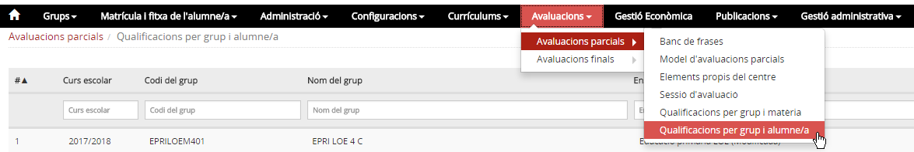
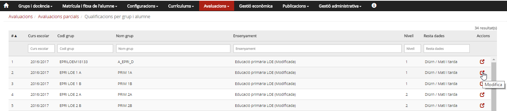
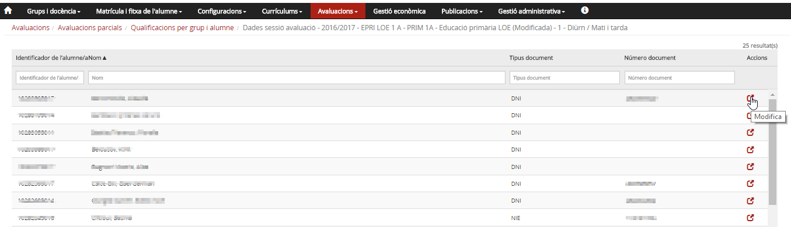
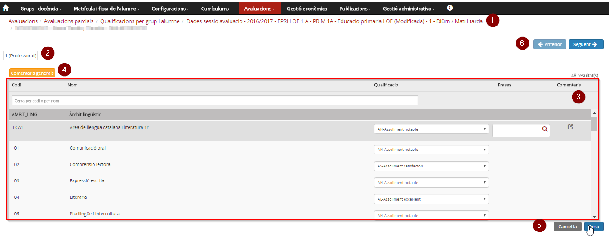
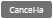
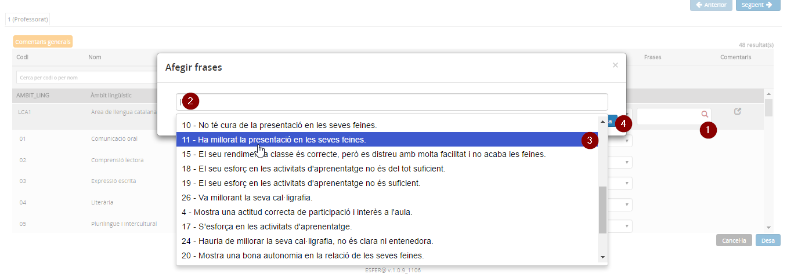

## Qualificacions per grup i alumne/a

* [Què són](omavpargrua.md#que-son)
* [Com s'hi accedeix](omavpargrua.md#com-shi-accedeix)
* [Quines operacions s'hi poden fer](omavpargrua.md#quines-operacions-shi-poden-fer)

### Què són

Des d'aquesta opció del menú es poden entrar les qualificacions per grup i alumne/a.

### Com s'hi accedeix

Per accedir-hi s'ha de seleccionar l'opció del menú **Qualificacions per grup i alumne/a** del submòdul **Avaluacions parcials** del mòdul **Avaluacions**.

*Imatge 1- Accés a l'opció Qualificacions per grup i alumne/a*

*Imatge 2 - Llista de grups classe*

La pantalla mostra la taula de grups:

* Té una capçalera amb els camps: **Curs escolar**, **Codi grup**, **Nom grup**, **Ensenyament**, **Nivell**, **Resta dades** [1)](omavpargrua.md#1) i **Accions**.
* Hi ha camps en blanc per poder delimitar la cerca.
* Hi ha una fila per a cada un dels grups classe del centre, per al curs escolar que s'hagi establert com a **Curs defecte d'avaluació** a l'opció del menú **Paràmetres del centre** del mòdul **Configuracions**.
* A la columna d'accions hi ha la icona . Al prémer la icona d'un grup, mostra una taula amb la llista d'alumnes del grup.

*Imatge 3 - Llista d'alumnes del grup*  
La pantalla mostra la llista d'alumnes del grup:

* Té una capçalera amb els camps: **Identificador de l'alumne/a**, **Nom**, **Tipus de document**, **Número de document** i **Accions**.
* Hi ha camps en blanc per poder delimitar la cerca.
* A la columna d'accions hi ha la icona . Al prémer la icona s'accedeix a la pantalla de qualificacions de l'alumne.

---

### Quines operacions s'hi poden fer

#### Introduir/consultar les qualificacions de totes les matèries dels alumnes d'un grup (alumne per alumne)

Al prémer la icona  d'un alumne, s'accedeix a una taula amb les matèries que l'alumne té al currículum; en funció del rol de la persona que hi accedeix i de l'estat de la sessió, es mostraran o es permetrà entrar-ne les qualificacions.
  
*Imatge 4 - Llista de matèries de l'alumne*  
  
  
La pantalla està estructurada en diverses seccions:

* **1 - Fil d'Ariadna**: Amb la informació del grup classe, de l'identificador i el nom i cognoms de l'alumne.
* **2 - Sessió d'avaluació**: Identifica la sessió d'avaluació del curs.
* **3 - Taula de matèries i qualificacions**: Relació de matèries, de les qualificacions, frases[2)](omavpargrua.md#2) i comentaris.[3)](omavpargrua.md#3)
* **4 -**  El botó permet entrar comentaris generals a l'avaluació de l'alumne.
* **5 -**  Botons per sortir, sense enregistrar o guardant les qualificacions i comentaris.
* **6 -**  Botons que permeten anar a l'alumne anterior o al següent.

Les icones  i  permeten entrar comentaris a l'avaluació de l'alumne en relació amb una matèria.

*  [Permet afegir, als comentaris de la matèria,](omavpargrua.md#permet-afegir-als-comentaris-de-la-materia) una frase del banc de frases assignat a l'element.
*  Permet editar/entrar comentaris.

#### Entrada de frases dels bancs de frases assignats a l'element avaluable

*Imatge 5 - Selecció d'una frase del banc de frases*

* Per entrar una frase del banc cal:

  1. Prémer la  de l'element que es vol comentar.
  2. Posar el cursor a la caixa de text **Afegir frases**.
  3. Seleccionar la frase en concret.[4)](omavpargrua.md#4)
  4. Prémer el botó  que hi ha a la finestra **Afegir frases**.[5)](omavpargrua.md#5)

#### Accions que es poden fer en funció de l'estat de la sessió d'avaluació

| Estat | Rol | Accions que es poden fer |
| --- | --- | --- |
| Secretaria | Equip directiu i secretaria.[6)](omavpargrua.md#6) Els professors.[7)](omavpargrua.md#7) El tutor/a [8)](omavpargrua.md#8) | Revisar el currículum. Es pot accedir en mode de consulta i veure les matèries que l'alumne té al currículum. |
| Equip docent | Equip directiu i secretaria amb autorització.[9)](omavpargrua.md#9) Els professors.[10)](omavpargrua.md#10) El tutor/a [11)](omavpargrua.md#11) | Entrar les qualificacions. |
| Sessió | Els professors | Accedir en mode de consulta als resultats de l'avaluació. Poden veure les qualificacions, però no modificar-les. |
| Equip directiu i secretaria amb autorització i el tutor/a[12)](omavpargrua.md#12) | Revisió de les qualificacions i si correspon entrada de les qualificacions. |
| En signatura | Equip directiu i secretaria.[13)](omavpargrua.md#13) Els professors.[14)](omavpargrua.md#14) El tutor/a [15)](omavpargrua.md#15) | Consulta de les matèries i qualificacions. |
| Signada | Equip directiu i secretaria.[16)](omavpargrua.md#16) Els professors.[17)](omavpargrua.md#17) El tutor/a [18)](omavpargrua.md#18) | Consulta de les matèries i qualificacions. |

---

[1)](omavpargrua.md#1)
Règim i torn.

[2)](omavpargrua.md#2)
Es poden posar frases del banc de frases assignat.

[3)](omavpargrua.md#3)
Es poden posar comentaris a cada matèria prement la icona .

[4)](omavpargrua.md#4)
Després d'haver seleccionat una frase, se'n pot afegir una altra tornant a situar el cursor a la caixa de text **Afegir frases**.

[5)](omavpargrua.md#5)
Després de prémer **Desa**, la frase es mostra dins dels comentaris de la matèria.

[6)](omavpargrua.md#6)
, [9)](omavpargrua.md#9)
, [13)](omavpargrua.md#13)
, [16)](omavpargrua.md#16)
De tots els alumnes.

[7)](omavpargrua.md#7)
, [10)](omavpargrua.md#10)
, [14)](omavpargrua.md#14)
, [17)](omavpargrua.md#17)
Només dels grups i matèries que tenen assignats.

[8)](omavpargrua.md#8)
, [11)](omavpargrua.md#11)
, [15)](omavpargrua.md#15)
, [18)](omavpargrua.md#18)
Dels alumnes del grup de tutoria.

[12)](omavpargrua.md#12)
Del grup de tutoria.