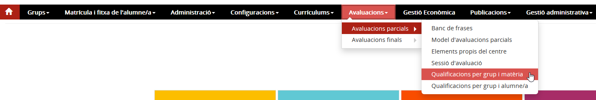
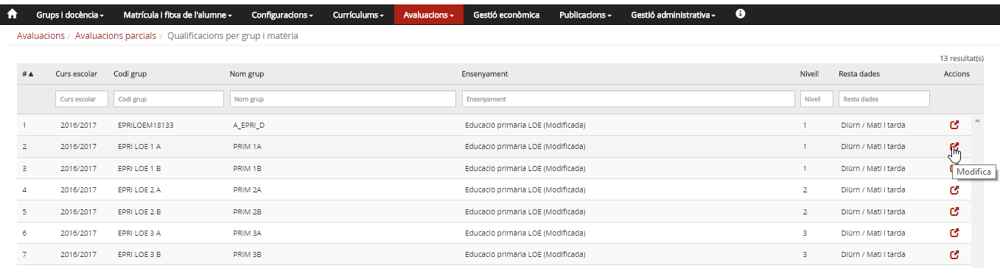
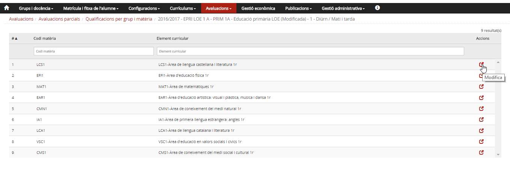
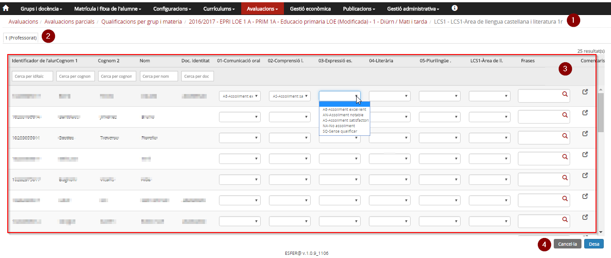
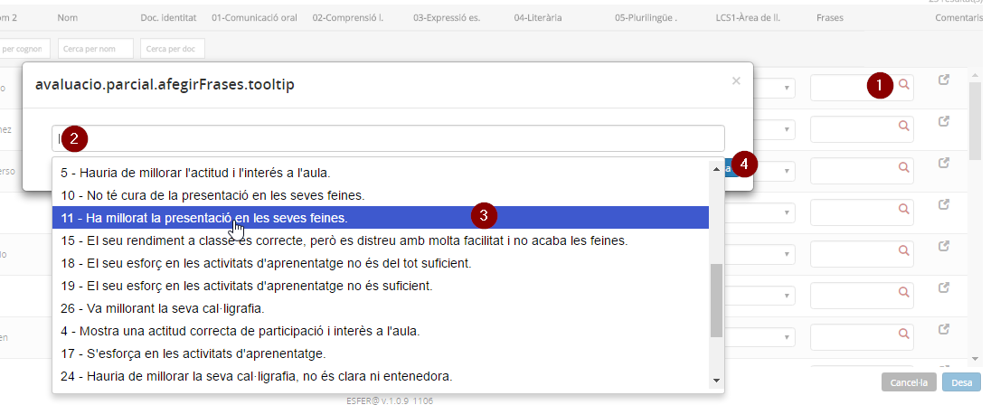

## Qualificacions per grup i matèria

* [Què són](omavpargrum.md#que-son)
* [Com s'hi accedeix](omavpargrum.md#com-shi-accedeix)
* [Quines operacions s'hi poden fer](omavpargrum.md#quines-operacions-shi-poden-fer)

### Què són

Si el centre ha optat per fer les **avaluacions parcials com les finals**, aquesta opció de menú permet introduir les qualificacions per grup i matèria.

Si es fan les avaluacions amb el **Model d'avaluació parcial pròpia del centre**, aquest accés **no està operatiu**.

### Com s'hi accedeix

Per accedir-hi s'ha de seleccionar l'opció de menú **Qualificacions per grup i matèria** del submòdul **Avaluacions parcials** del mòdul **Avaluacions**.
  
*Imatge 1- Accés a l'opció Qualificacions per grup i matèria*

### Quines operacions s'hi poden fer

*Imatge 2 - Relació de grups classe* 
La pantalla mostra la taula de grups i les sessions d'avaluació.

* Té una capçalera amb els camps: **Curs escolar**, **Codi del grup**, **Nom del grup**, **Ensenyament**, **Nivell**, **Resta dades**[1)](omavpargrum.md#1) i **Accions**.
* Hi ha camps en blanc per poder delimitar la cerca.
* Hi ha una fila per a cada un dels grups classe del centre, per al curs escolar que s'hagi establert com a **Curs per defecte d'avaluació** a l'opció del menú **Paràmetres del centre** del mòdul **Configuracions**.
* A la columna d'accions hi ha la icona . Al prémer la icona d'un grup, es mostra una taula amb la relació de les matèries assignades al grup.

*Imatge 3 - Llista de matèries del grup*  
La pantalla mostra la llista de matèries del grup:

* Té una capçalera amb els camps: **Codi matèria**, **Element curricular** i **Accions**.
* Hi ha camps en blanc per poder delimitar la cerca.
* A la columna d'accions hi ha la icona . Al prémer la icona s'accedeix a la pantalla de qualificacions de la matèria.

Al prémer la icona  d'un alumne, s'accedeix a una taula amb les matèries que l'alumne té al currículum; en funció del rol de la persona que hi accedeix i de l'estat de la sessió, es mostraran o es permetrà entrar-ne les qualificacions.
  
*Imatge 4 - Entrada de qualificacions per grup i matèria*  
  
La pantalla està estructurada en diverses seccions:

* **1 - Fil d'Ariadna**: Amb la informació del grup classe i matèria en què s'entren/consulten les qualificacions dels alumnes.
* **2 - Sessió d'avaluació**: Identifica la sessió d'avaluació del curs.
* **3 - Taula d'alumnes i qualificacions**: Relació d'alumnes del grup, qualificacions i comentaris.
* **4 -**   Botons per sortir, sense enregistrar o guardant les qualificacions i comentaris.

* Es pot seleccionar frases del banc de frases associat.

*Imatge 5 - Entrada de frases d'un banc*

* Per entrar una frase codificada s'ha de:

  1. Prémer la icona .
  2. Col·locar el cursor a la caixa de text de la pantalla d'entrada de frases.
  3. Seleccionar la frase.[2)](omavpargrum.md#2)
  4. Prémer el botó  que hi ha a la pantalla d'entrada de frases.[3)](omavpargrum.md#3)
*  Es poden escriure comentaris a cada alumne prement la icona .

Perquè totes les qualificacions i comentaris es desin, és imprescindible prémer el botó  que hi ha al peu de la pantalla.

#### Accions que es poden fer en funció de l'estat de la sessió d'avaluació

| Estat | Rol | Accions que es poden fer |
| --- | --- | --- |
| Secretaria | Equip directiu i administració. [4)](omavpargrum.md#4) Els professors.[5)](omavpargrum.md#5) El tutor/a [6)](omavpargrum.md#6) | Revisar el currículum. Es pot accedir en mode de consulta i veure les matèries que l'alumne té al currículum. |
| Professors | Equip directiu i administració amb autorització.[7)](omavpargrum.md#7) Els professors.[8)](omavpargrum.md#8) El tutor/a [9)](omavpargrum.md#9) | Entrar les qualificacions. |
| Junta | Els professors | Accedir en mode de consulta als resultats de l'avaluació. Poden veure les qualificacions, però no modificar-les. |
| Equip directiu i administració amb autorització i el tutor/a[10)](omavpargrum.md#10) | Revisió/entrada de les qualificacions. |
| Tancada | Equip directiu i administració. [11)](omavpargrum.md#11) Els professors.[12)](omavpargrum.md#12) El tutor/a [13)](omavpargrum.md#13) | Consulta de les matèries i qualificacions. |

[1)](omavpargrum.md#1)
Règim i torn.

[2)](omavpargrum.md#2)
Es pot afegir una altra frase, si després d'haver-ne seleccionat una es torna a situar el cursor a la caixa de frases.

[3)](omavpargrum.md#3)
En desar la frase passa a formar part dels comentaris de la matèria-alumne

[4)](omavpargrum.md#4)
, [7)](omavpargrum.md#7)
, [11)](omavpargrum.md#11)
De tots els alumnes.

[5)](omavpargrum.md#5)
, [8)](omavpargrum.md#8)
, [12)](omavpargrum.md#12)
Només dels grups i matèries que tenen assignats.

[6)](omavpargrum.md#6)
, [9)](omavpargrum.md#9)
, [13)](omavpargrum.md#13)
Dels alumnes del grup de tutoria.

[10)](omavpargrum.md#10)
Del grup de tutoria.