## Elements propis del centre

* [Què són](omavparpecs.md#què-són)
* [Com s'hi accedeix](omavparpecs.md#com-shi-accedeix)
* [Quines operacions s'hi poden fer](omavparpecs.md#quines-operacions-shi-poden-fer)

### Què són

* Els elements propis del centre són els elements avaluables que crea el centre per fer l'avaluació parcial d'acord amb el seu projecte educatiu.
* Permeten que el centre avaluï per projectes, per àmbits, per unitats de programació…
* Es presenta una estructura que pot tenir fins a tres nivells per tal que el centre pugui anar concretant l'objecte que s'ha d'avaluar.

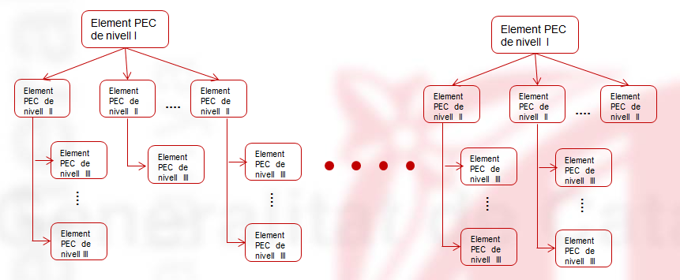*Imatge 1 - Estructura dels elements propis del centre*

* El centre pot escollir avaluar només elements del nivell I, o del nivell I i II, o dels tres nivells.
* A la taula dels elements propis del centre, a més dels de creació pròpia, es pot disposar d'una còpia dels normatius. [1)](omavparpecs.md#1)

### Com s'hi accedeix

Per accedir-hi, heu de seleccionar l'opció de menú **Elements propis del centre** del submòdul **Avaluacions parcials** del mòdul **Avaluacions**.  
  
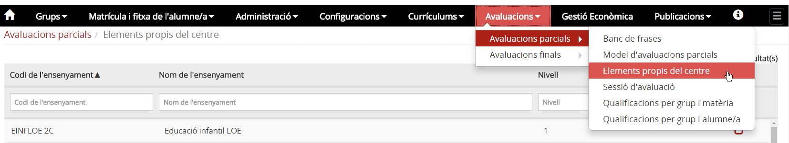*Imatge 2 - Accés a l'opció Elements propis del centre*

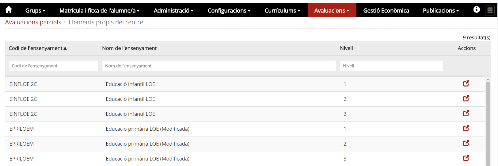*Imatge 3 - Llista d'ensenyaments i nivells del centre*

### Quines operacions s'hi poden fer

A la pantalla es mostra la taula dels ensenyaments i nivells que ofereix el centre, amb els camps **Codi de l'ensenyament**, **Nom de l'ensenyament**, **Nivell** i **Accions**.

* A sota de la capçalera hi ha uns camps en blanc per delimitar la cerca.
* Per gestionar els elements propis del centre s'ha de prémer la icona  que correspongui a l'ensenyament i nivell que es vulgui editar.

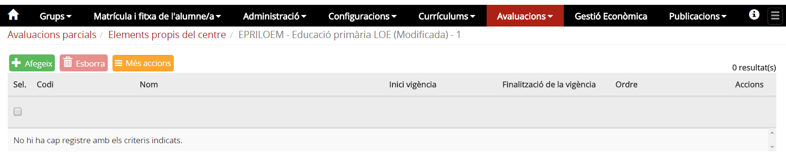*Imatge 4 - Taula buida dels elements propis del centre d'un ensenyament i nivell*

#### Creació d'elements propis del centre

Els **elements propis del centre** poden ser propis del centre o se'n pot fer una còpia dels normatius.

Per crear un nou element propi del centre cal prémer el botó  que hi ha a sobre de la taula.
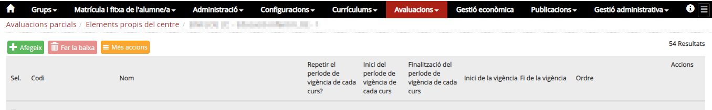*Imatge 4 - Accés a la creació d'un element propi del centre*
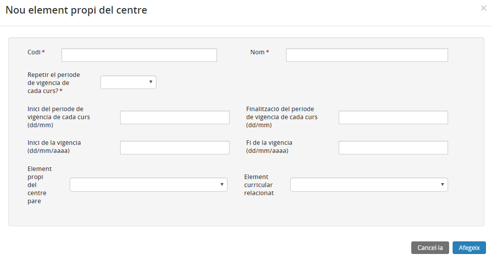*Imatge 5 - Pantalla d'entrada de dades de l'element* 
  
Heu d'entrar:

* **Codi** i **Nom** de l'element, que han de ser únics en relació amb els altres elements que corresponen a l'ensenyament i al nivell.
* **Repetir el període de vigència de cada curs?**: Posar el valor Si quan es vulgui repetir el període de vigència de l'element propi del centre
* **Inici del període de vigència de cada curs**: La data d'inici del període de vigència. Només dia i mes
* **Finalització del període de vigència de cada curs**: La data fi del període de vigència. Només dia i mes
* **Inici vigència** i **Finalització de la vigència**: La data d'inici és obligatòria i la data de finalització es pot deixar en blanc.
* **Element propi del centre pare** i **Element curricular relacionat**: Si l'element propi del centre que es crea és un element de 1r nivell (Pare) cal deixar en blanc els dos camps.

  + Si l'element depèn d'un element curricular normatiu, cal indicar amb quin es relaciona.
  + Si l'element depèn d'un altre element propi del centre, cal indicar amb quin es relaciona.

La definició del període de **vigència de cada curs** permet repetir periòdicament la vigència de l'element (per exemple, cada primer trimestre) indefinidament.

#### Còpia dels elements normatius

A la llista d'elements propis del centre s'hi pot afegir una còpia dels normatius. Per fer-ho cal prémer el botó  que hi ha sobre de la taula, i seleccionar l'opció **Copia l'estructura curricular**.

Es pot fer la còpia d'[algun dels elements curriculars](omavparpecs.md#algun-dels-elements-curriculars) sense mantenir la relació d'estructura[2)](omavparpecs.md#2), o bé fer la [de diversos elements mantenint l'estructura de relació.](omavparpecs.md#de-diversos-elements-mantenint-lestructura-de-relació) [3)](omavparpecs.md#3)

#### Còpia dels elements de forma independent

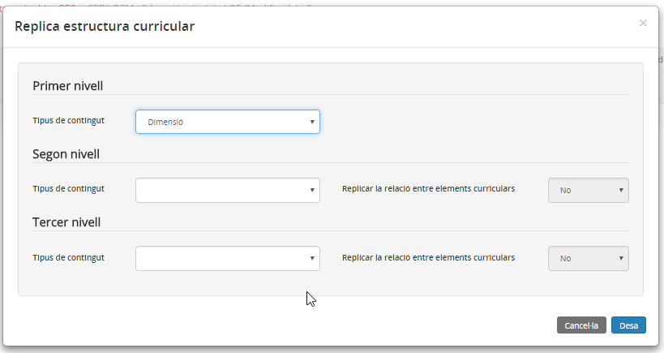*Imatge 6 - Pantalla per copiar els elements curriculars normatius sense mantenir l'estructura de relació*

* Per cada un dels nivells s'ha de seleccionar l'element que es vol copiar.
* Per finalitzar cal prémer el botó 

#### Còpia dels elements mantenint l'estructura de relació

Si es vol copiar més d'un element i mantenir l'estructura de relació, l'element que es recuperi en el nivell superior ha de ser també l'element immediatament superior en l'estructura dels elements curriculars.

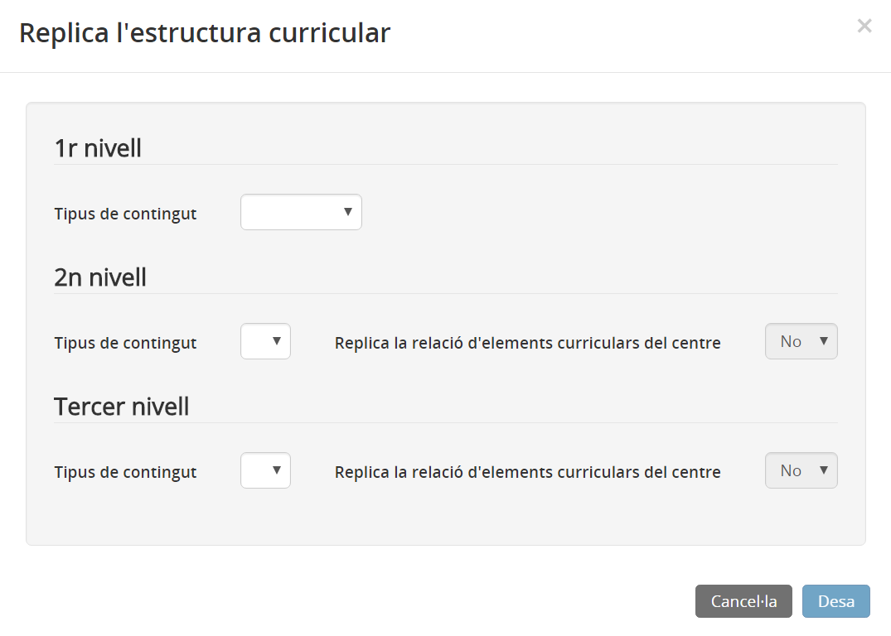*Imatge 7 - Pantalla per copiar els elements curriculars mantenint l'estructura de relació*

### Estructura dels elements propis del centre

Els elements propis del centre, a la pantalla de l'avaluació i en els informes de qualificacions, es mostren sempre organitzats d'acord amb l'estructura de relació que s'hagi establert. Si tots els elements són del mateix nivell, es mostrarà una llista sense cap relació organitzativa.

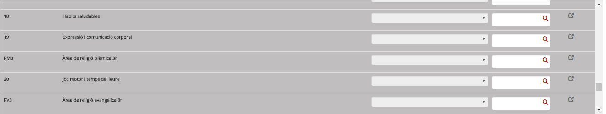*Imatge 8 - Llista d'elements propis del centre sense cap relació organitzativa*

Si s'hi ha establert la relació, tant a la pantalla d'entrada de qualificacions com als informes s'hi visualitzarà l'estructura següent:

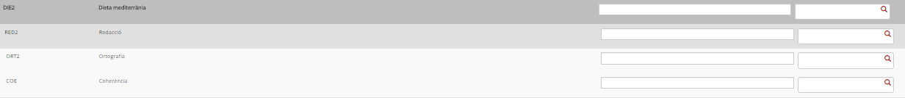*Imatge 9 - Llista d'elements propis del centre amb una relació organitzativa*

### Canviar l'estructura de relació dels elements propis del centre

En qualsevol moment es pot canviar l'estructura de relació entre diferents elements propis del centre. Per fer-ho cal editar l'element propi del centre i treure / posar / canviar l'element pare.

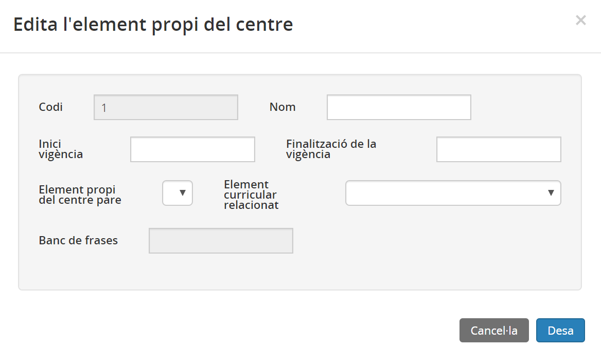*Imatge 10 - Edició de l'element pare*

[1)](omavparpecs.md#1)
Per exemple, es poden crear com a elements propis les competències claus i no avaluar les àrees.

[2)](omavparpecs.md#2)
Replicar els elements de forma independent, sense cap relació entre ells.

[3)](omavparpecs.md#3)
Copiar els elements pare i els seus fills mantenint la relació, per exemple les àrees o els mòduls i les unitats formatives.