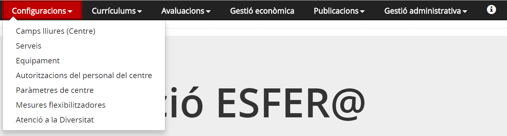

# Configuracions

El mòdul de configuracions serveix per establir els valors i paràmetres que adapten el programa a les característiques del centre.

La gestió d’aquests valors és clau per al bon funcionament del sistema. En general aquesta funció la fan els administradors de les aplicacions.

El perfil de l’administrador o gestor de configuracions de centre inclou coneixements amplis de la gestió del centre, de les funcions i necessitats del programa, tant particulars com globals, criteri i capacitat de decisió.

De tot això s'esdevè un perfil clau què:

Tingui coneixements amplis de la gestió del centre, de les funcions i necessitats del programa, tant particulars com globals.

Tingui criteri i capacitat de decisió.

---

## Accés

*Imatge 1 - Accés al menú Configuracions*

---

## Quí pot accedir?

**Director/a de centre**:

* Com a persona del centre responsable de la direcció, organització i funcionament del centre, així com de les seves dades, hi haurà funcionalitats que estaran reservades exclusivament a aquest càrrec.
* Accés complet a totes les funcionalitats d'aquest mòdul.

**Equip directiu**:

* Personal del centre que disposa d’un dels següents càrrecs unipersonals al centre: director, cap d’estudis o secretari.
* Constitueix l’òrgan de govern del centre docent.
* Accés complet a totes les funcionalitats d'aquest mòdul.

---

## Opcions del menú Configuracions

* [Camps lliures (Centre)](cnf.md#camps-lliures-centre)
* [Serveis](cnf.md#serveis)
* [Equipament](cnf.md#equipament)
* [Autoritzacions del personal del centre](cnf.md#autoritzacions-del-personal-del-centre)
* [Paràmetres de centre](cnf.md#parametres-de-centre)
* [Mesures flexibilitzadores](cnf.md#mesures-flexibilitzadores)
* [Atenció a la diversitat](cnf.md#atencio-a-la-diversitat)

