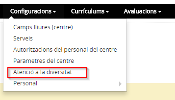
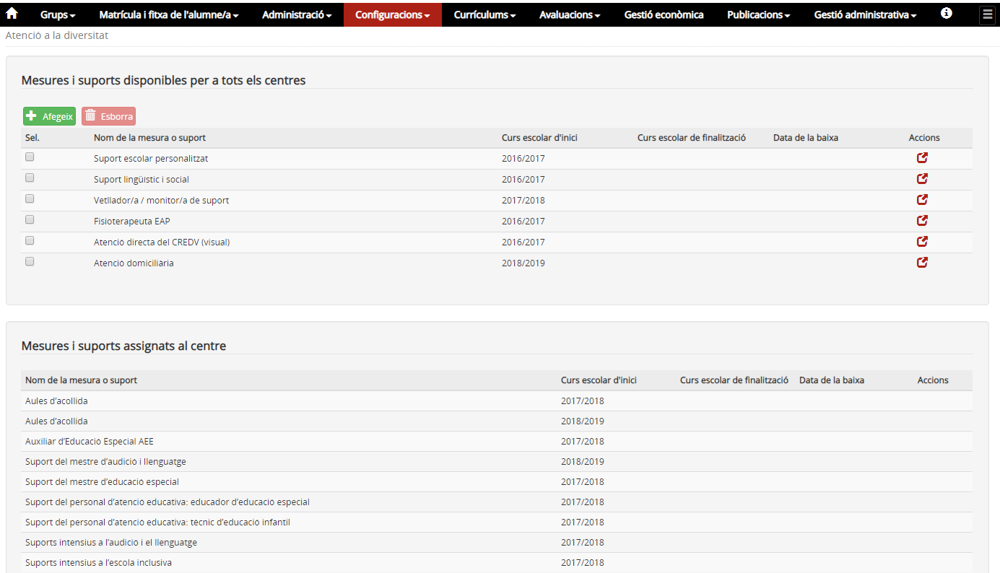
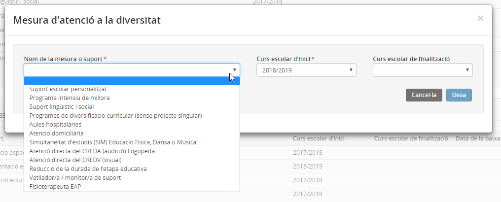

# Atenció a la diversitat

* [Què és](cnf-at_div.md#que-es)
* [Com s’hi accedeix](cnf-at_div.md#com-shi-accedeix)
* [Quines operacions s'hi poden fer](cnf-at_div.md#quines-operacions-shi-poden-fer)

  + [Mesures](cnf-at_div.md#mesures)
  + [Suports](cnf-at_div.md#suports)

## Què és

El centre disposa de mesures i de suports personals per atendre la diversitat dels alumnes.

Hi ha mesures i suports que tots els centres poden aplicar directament als alumnes mentre que n'hi ha d'altres que necessiten autorització i assignació del Departament d'Ensenyament.

Aquestes últimes només es mostraran si el centre les té assignades, l'usuari no les pot modificar ni eliminar.

Cal revisar i definir aquest apartat a inici de curs per tal de poder ajustar, posteriorment, les mesures i suports d'atenció a la diversitat de l'alumnat que ho necessiti en la seva fitxa personal.

Pel que fa a les mesures i suports que no requereixen autorització, el centre ha de definir els que aplicarà als alumnes perquè assoleixin els objectius fixats.

Els suports professionals amb què compta el centre poden formar part de la plantilla del propi centre o dels serveis educatius de zona. Aquests darrers es mostren a tots els centres en el benentès que els utilitzaran aquells alumnes que reuneixin els requisits necessaris.
  
  

---

## Com s'hi accedeix

**Configuracions > Atenció a la diversitat**

*Imatge 1 - Accés a l'apartat Atenció a la diversitat*
  
  

---

## Quines operacions s'hi poden fer

En accedir a la pantalla Atenció a la diversitat es mostren els blocs de:

* [Mesures i suports disponibles per a tots els centres](cnf-at_div.md#mesures-i-suports-disponibles-per-a-tots-els-centres), on el centre en pot afegir i treure d'entre les opcions del desplegable d'acord a les definides per les unitats administratives.
* [Mesures i suports assignats al centre](cnf-at_div.md#mesures-i-suports-assignats-al-centre), definits per les unitats administratives i que el centre no pot modificar.

La diferència rau en que n'hi ha que estan disponibles per a tots els centres i, en canvi, n'hi ha d'altres que, si escau, són assignades pel Departament d'Ensenyament.
  
*Imatge 2 - Llista de les mesures i suports*

---

#### Mesures i suports disponibles per a tots els centres

Les mesures i suports que es poden aplicar (si el centre les ha afegit al mòdul **Configuracions**) a la fitxa de l'alumne són:

| **Codi** | **Mesura/Suport** | **EINF** | **EPRI** | **ESO** | **Batxillerat** |
| --- | --- | --- | --- | --- | --- |
| AD-M02 | Programa de diversificació curricular (amb projecte singular) |  |  |  |  |
| AD-M03 | Unitat d’escolarització compartida (UEC) |  |  |  |  |
| AD-M04 | Programa de noves oportunitats |  |  |  |  |
| AD-M05 | Suport escolar personalitzat |  |  |  |  |
| AD-M07 | Suport lingüístic i social |  |  |  |  |
| AD-M08 | Programa intensiu de millora |  |  |  |  |
| AD-M09 | Programa de diversificació curricular (sense projecte singular) |  |  |  |  |
| AD-M10 | CEEPSIR Suport dels centres d’educació especial proveïdors de serveis i recursos |  |  |  |  |
| AD-S05 | Vetllador/a / monitor/a de suport |  |  |  |  |
| AD-S06 | Fisioterapeuta EAP |  |  |  |  |
| AD-S07 | Atenció directa del CREDA (audició) Logopeda |  |  |  |  |
| AD-S08 | Atenció directa del CREDV (visual) |  |  |  |  |
| AD-AH | Aules hospitalàries |  |  |  |  |
| AD-AD | Atenció domiciliària |  |  |  |  |
| AD-SIM | Simultaneïtat d’estudis (SIM) Educació Física, Dansa o Música. |  |  |  |  |
| AD-RDE | Reducció de la durada de l’etapa educativa |  |  |  |  |

Per afegir una mesura i/o suport assignat per a tots els centres, cal prémer el botó  del primer bloc.

A la finestra emergent cal **seleccionar la mesura o suport** i emplenar el camp **Curs escolar d'inici** (obligatori) i prémer el botó **Desa**.

*Imatge 3 - Pantalla per afegir mesures i suports assignats a tots els centres*

Si es vol eliminar una mesura i/o suport, cal seleccionar-la i prémer el botó . Només s'esborrarà si no s'ha aplicat a cap alumne.
  
  

---

#### Mesures i suports assignats al centre

Les mesures i suports que es poden aplicar (si el centre els té disponibles) a la fitxa de l'alumne són:

| **Codi** | **Mesura/Suport** | **EINF** | **EPRI** | **ESO** | **Batxillerat** |
| --- | --- | --- | --- | --- | --- |
| AD-S01 | Suport del mestre d’educació especial |  |  |  |  |
| AD-ALL | Suport del mestre d’audició i llenguatge |  |  |  |  |
| AD-ILS | Intèrprets de llenguatge de signes |  |  |  |  |
| AD-INSO | Suport del personal d’atenció educativa: tècnic d’integració social |  |  |  |  |
| AD-M06 | Aules d’acollida |  |  |  |  |
| AD-PSI | Suport del professor d’orientació educativa |  |  |  |  |
| AD-S02 | Suports intensius a l’audició i el llenguatge |  |  |  |  |
| AD-S03 | Suport del personal d’atenció educativa: educador d’educació especial |  |  |  |  |
| AD-S04 | Auxiliar d’Educació Especial AEE |  |  |  |  |
| AD-SIEI | Suports intensius a l’escola inclusiva |  |  |  |  |
| AD-SPE | Projectes específics de suport a l’audició i el llenguatge |  |  |  |  |
| AD-TEI | Suport del personal d’atenció educativa: tècnic d’educació infantil |  |  |  |  |

---