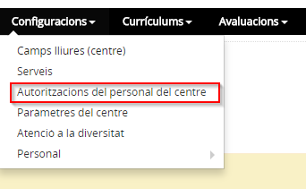
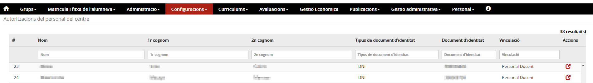
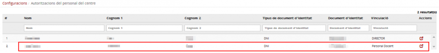
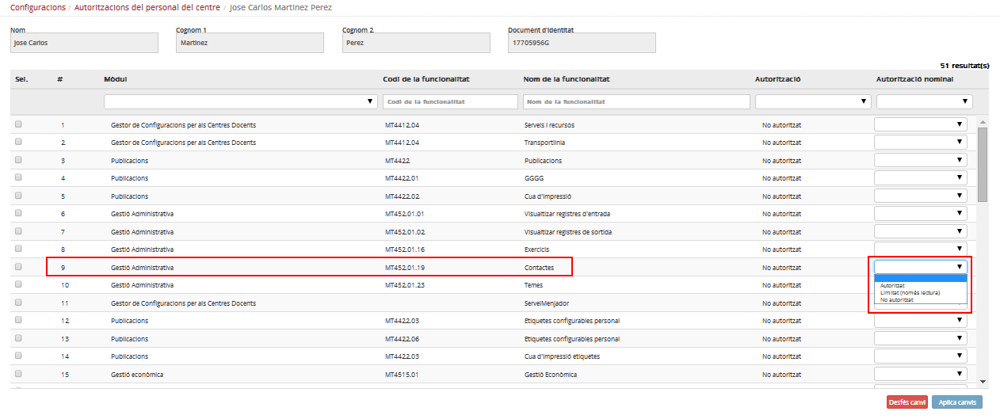
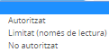
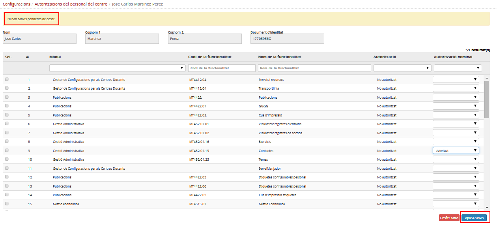
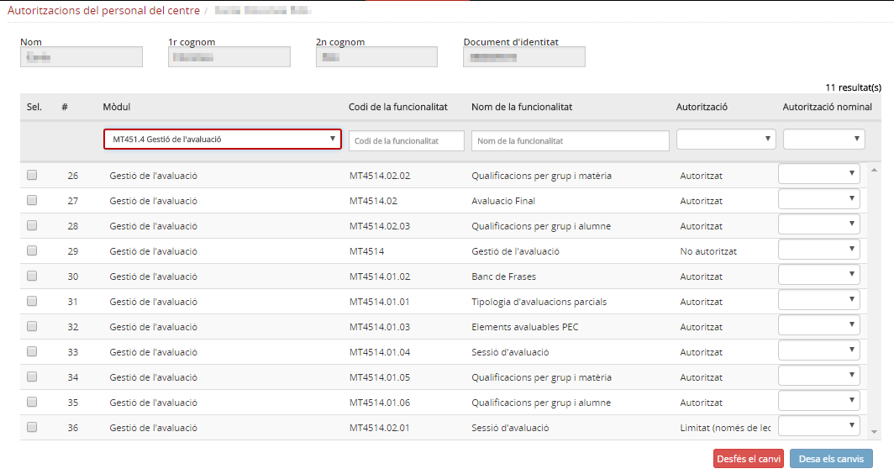

# Autoritzacions del personal del centre

* [Què són](cnf-aut_pc.md#que-son)
* [Com s'hi accedeix](cnf-aut_pc.md#com-shi-accedeix)
* [Quines operacions s'hi poden fer](cnf-aut_pc.md#quines-operacions-shi-poden-fer)

## Què són

Cada persona que treballa al centre té, segons el lloc de treball que ocupa, les autoritzacions necessàries a Esfer@ per portar a terme la seva tasca professional.

Aquestes autoritzacions estan atorgades per defecte i van lligades a la funció de la persona en el centre.

En moments determinats el director o directora del centre pot necessitar treure o donar permisos a una o més persones de manera extraordinària.

Les modificacions d'accessos són una atribució de la direcció del centre i sempre s'han d'entendre com a excepcionals. Cal, per tant, realitzar aquests canvis amb responsabilitat i amb caràcter temporal.

Els permisos extraordinaris que atorga el director/a poden ser complets o només de lectura.
  
  

---

## Com s'hi accedeix

Per accedir-hi, heu de seleccionar l'opció del menú **Autoritzacions del personal del centre** del mòdul **Configuracions**.

*Imatge 1 - Autoritzacions del personal del centre*

*Imatge 2 - Llista del personal del centre*

En la pantalla anterior es mostra la llista de les persones i la vinculació que tenen amb el centre. Segons la vinculació el personal pot ser:

* de suport;
* docent;
* un càrrec: director o directora, cap d'estudis, o secretari o secretària.

---

## Quines operacions s'hi poden fer

Cada usuari, en funció de la seva vinculació amb el centre, té associades unes característiques d'accés a les funcionalitats de l'aplicació.  
El tipus d'accés es pot modificar afegint o traient permisos des d'aquesta opció del menú.

#### Canviar el permís d'accés a una funcionalitat

Per canviar les característiques d'accés a una persona, s'ha de clicar a la icona  de la columna **Accions**.

*Imatge 3 - Selecció per canviar les característiques d'accés*

Tot seguit, apareix una finestra amb la llista de les funcionalitats de l'aplicació on s'hi pot donar accés.

*Imatge 4 - Llista d'autoritzacions d'un treballador del centre*

Després cal seleccionar la funcionalitat i escollir el nou permís al desplegable de la columna **Autorització nominal**.

Els valors possibles són:
*Imatge 5 - Valors possibles*

El sistema mostrarà un missatge avisant que per a mantenir els canvis s'ha de prémer el botó **Aplica els canvis** que hi ha a la part inferior dreta.

*Imatge 6 - Missatge d'avís per desar els canvis*
  
  
Si es volen llevar o donar permisos a un mòdul concret es pot fer una cerca, d'aquesta manera només es mostraran les funcionalitats corresponents.
*Imatge 7 - Llista d'autoritzacions a una funcionalitat d'un treballador del centre*

---