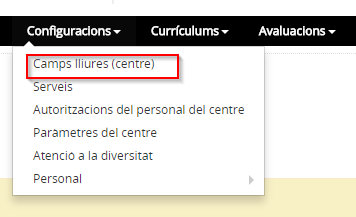
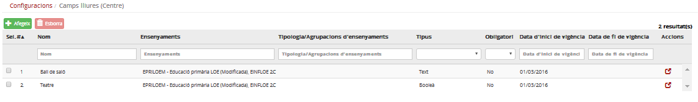
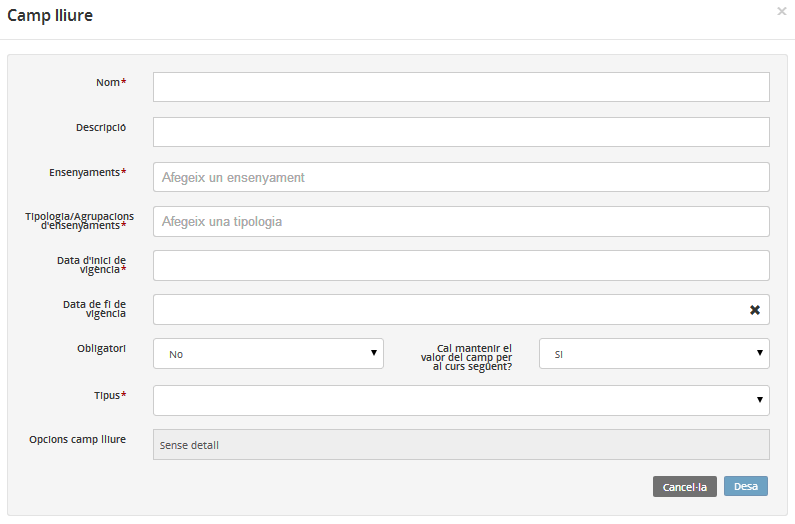
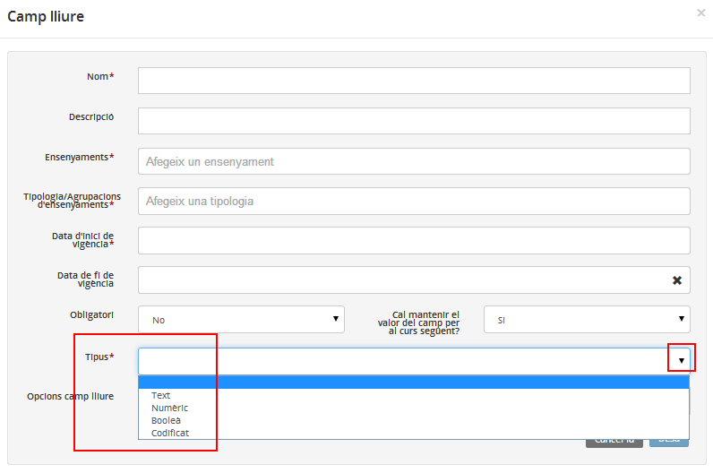
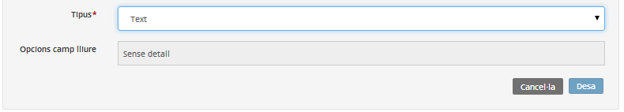
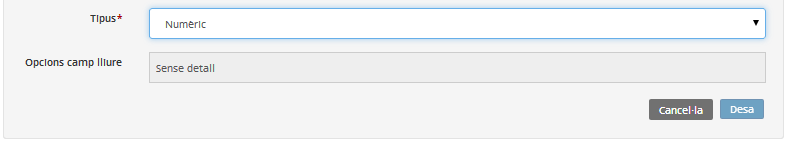
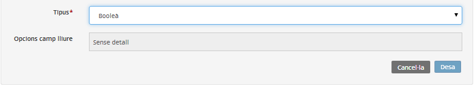
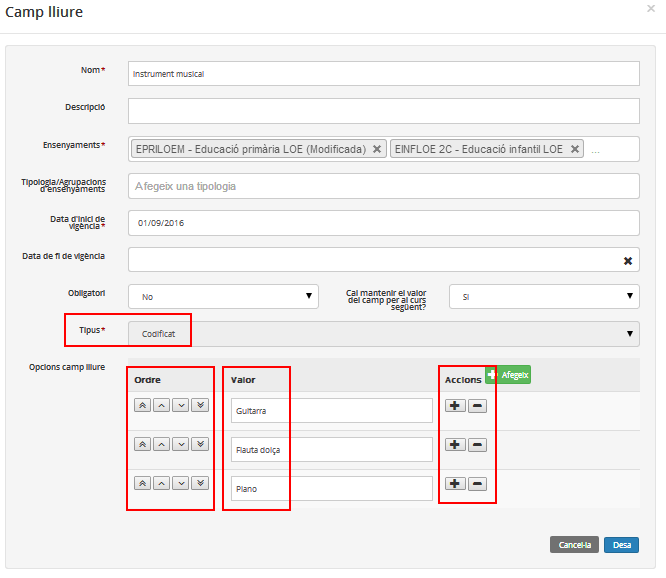
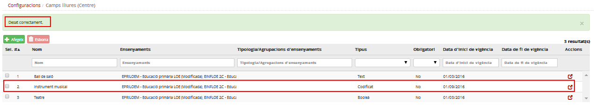

# Camps lliures

* [Què són](cnf-c_ll.md#que-son)
* [Com s'hi accedeix](cnf-c_ll.md#com-shi-accedeix)
* [Quines operacions s'hi poden fer](cnf-c_ll.md#quines-operacions-shi-poden-fer)
* [Tipus](cnf-c_ll.md#tipus)

### Què són

Els camps lliures són camps que el centre pot crear per desar les dades de l'alumne que no ha previst l'aplicació. Aquests camps s'emplenen en el formulari de matrícula i es consulten des de la fitxa de l'alumne. Es poden crear abans o després d'iniciar el període de matrícula.

Algunes de les dades que es poden desar en els camps lliures poden ser les activitats extraescolars, el carnet de biblioteca, l'autorització dels pares d'ús d'imatges de l'alumne, els delegats de curs, etc.

Els camps lliures poden contenir dades de text, dades numèriques, amb valors "Sí/No", o codificat, depenent de les necessitats de cada camp.

El centre també pot establir si els camps lliures es consideren obligatoris o no.
  
  

---

### Com s'hi accedeix

Per accedir-hi, heu de seleccionar l'opció del menú **Camps lliures (Centre)** del mòdul **Configuracions**.

*Imatge 1 - Accés a l'apartat Camps lliures*

*Imatge 2 - Llista de camps lliures definits*
  
  

---

### Quines operacions s'hi poden fer

Un cop definit un camp lliure, aquest és visible a la fitxa de l'alumne.
  
Un camp lliure es pot editar i eliminar si no s'ha emplenat per a cap alumne.
  
  

---

### Tipus

Hi ha quatre tipus de camps lliures: text, numèric, booleà i codificat.
Per crear-ne un de nou s'accedeix a **Configuracions > Camps lliures** i es prem el botó .
  
*Imatge 3 - Fitxa per crear un camp lliure (Centre)*
  
Els camps obligatoris estan marcats amb (\*).

* **Nom**: És el nom de la dada lliure que hi ha a la fitxa de l'alumne (FDA).
* **Descripció**: És una breu explicació de la dada lliure definida.
* **Ensenyaments**: Són els ensenyaments on es defineix que es mostri.
* **Tipologia/Agrupació d'ensenyaments**: És la tipologia o agrupació d'ensenyaments on es defineix que es mostri. No té aplicació a Educació Infantil i Primària.
* **Data d'inici de vigència**: És la data a partir de la qual es mostrarà el camp a la fitxa de l'alumne.
* **Data de fi de vigència**: És la data a partir de la qual es deixarà de mostrar el camp a la fitxa de l'alumne. Es pot deixar en blanc.
* **Obligatori**: És un desplegable amb els valors "Sí"/"No".
* **Cal mantenir el valor del camp per al curs següent?**: És un desplegable amb els valors "Sí"/"No". En cas afirmatiu el valor introduït a la fitxa de l'alumne es mantindrà per als cursos següents de l'ensenyament. Per exemple, un camp per especificar l'instrument musical que toca l'alumne.
* **Opcions del camp lliure**: S'activa quan se selecciona el tipus codificat.
* **Tipus**: En obrir el desplegable, es poden veure els tipus de dades lliures admeses. Cal seleccionar-ne una tipologia.

*Imatge 4 - Desplegable amb les opcions de camps lliures*

#### Tipus text

En aquest cas la dada lliure permet entrar qualsevol tipus de text.
*Imatge 5 - Camp lliure de tipus text (Centre)*

#### Tipus numèric

Permet escriure qualsevol text en format numèric. Per exemple, un camp per especificar el número del carnet de la biblioteca.
*Imatge 6 - Camp lliure de tipus numèric*

#### Tipus booleà

Aquest tipus de camp lliure permet seleccionar entre dues possibles respostes: **Sí** o **No**. Per exemple, un camp per determinar si l'alumne farà o no una activitat determinada.
*Imatge 7 - Camp lliure de tipus booleà*

#### Tipus codificat

En aquest cas, cal definir uns quants valors que es podran ordenar. Aquests valors formaran part d'una llista desplegable a la fitxa de l'alumne.
*Imatge 8 - Definició dels valors del camp lliure de tipus codificat*
  
*Imatge 9 - Llista de camps lliures creats*
  
  

---