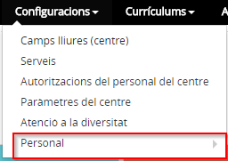
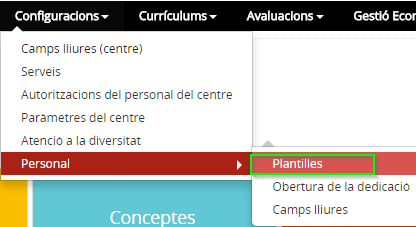
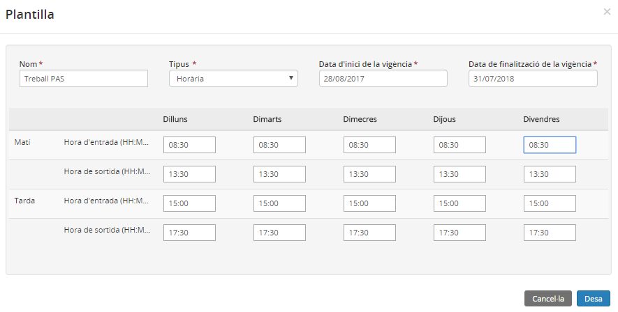
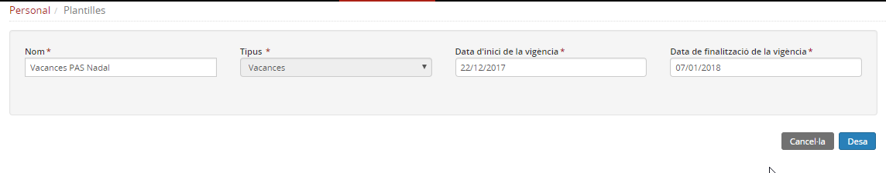
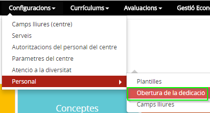
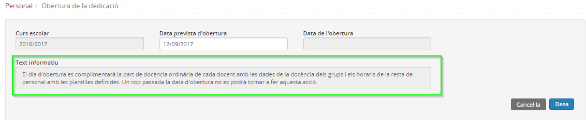
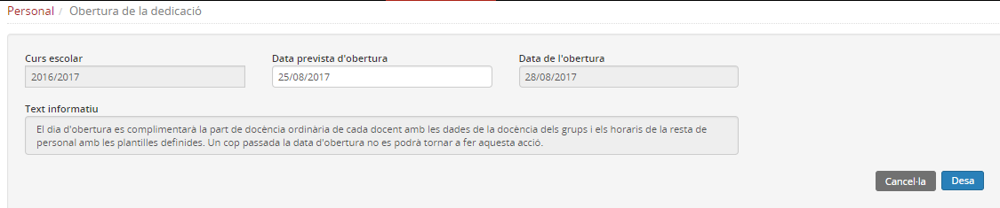
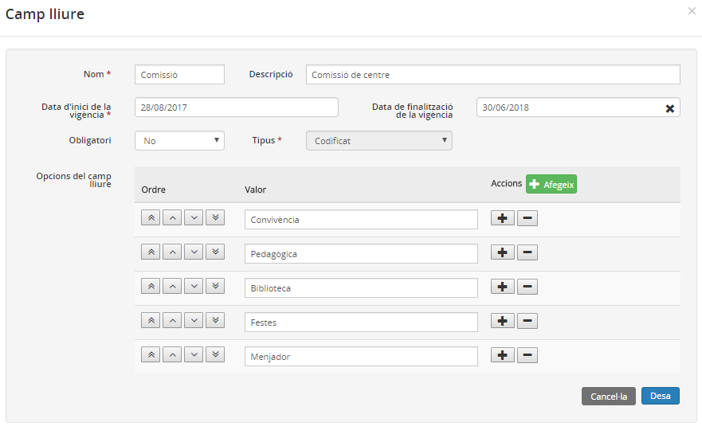
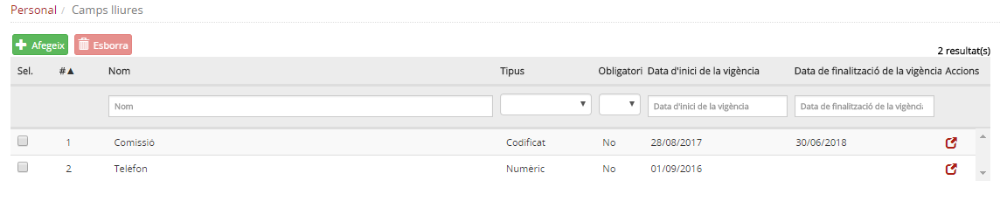
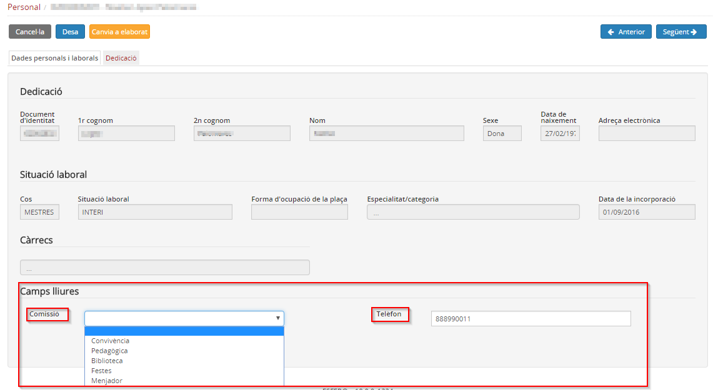

# Personal

* [Què és](cnf-pers.md#què-és)
* [Com s'hi accedeix](cnf-pers.md#com-shi-accedeix)
* [Quines operacions s'hi poden fer](cnf-pers.md#quines-operacions-shi-poden-fer)

### Què és

En aquesta opció de menú es defineixen diversos aspectes relacionats amb el personal del centre que posteriorment es reflectiran a la fitxa de cada persona.

---

### Com s'hi accedeix

Per accedir-hi, heu de seleccionar l'opció del menú **Personal** del mòdul **Configuracions**.

*Imatge 1 - Accés a l'apartat Personal*
  
  

---

### Quines operacions s'hi poden fer

Actualment hi ha tres apartats:

* [Plantilles](cnf-pers.md#plantilles)
* [Obertura de la dedicació](cnf-pers.md#obertura-de-la-dedicació)
* [Camps lliures](cnf-pers.md#camps-lliures)

#### Plantilles

Des d'aquesta opció del menú es poden crear plantilles horàries de treball i plantilles de vacances per al personal de suport del centre, és a dir, per al personal no docent.

Per tal que la funcionalitat de plantilles estigui operativa al mòdul **Personal** per al personal PAS, cal confeccionar-les abans de realitzar l'obertura de la dedicació.

  
  
*Imatge 2 - Accés a les Plantilles* 
  
  
Es poden crear dos tipus de plantilles:

* **Horària**:

*Imatge 3 - Plantilla horària*

* **Vacances**

*Imatge 4 - Plantilla de vacances* 
  
  
Les plantilles creades s'utilitzaran després a la fitxa del personal de suport per completar la seva dedicació.
  
  

---

#### Obertura de la dedicació

L'equip directiu ha de completar a Esfer@ la gestió dels grups de docència, és a dir, els grups classe i les agrupacions organitzatives, indicant els continguts que s'hi treballen i els mestres que els imparteixen.
  
  
Un cop fet això, el director o un membre de l'equip directiu ha d'accedir al menú **Obertura dedicació** del mòdul **Configuracions** per tal que la informació de docència de cada mestre passi a formar part de l'apartat **Dedicació** de la seva fitxa.
  
  
*Imatge 5 - Accés a l'Obertura de la dedicació*
  
  
Només cal posar la data prevista de l'obertura. Aquesta data no pot ser ni el dia en què es fa ni una data anterior, sempre ha de ser una data posterior.
  
  
*Imatge 6 - Obertura de la dedicació* 
  
  
Observeu el text informatiu que hi ha a la part inferior de la pantalla.
  
  
Posteriorment a la data indicada, quan s'hagi executat el procés d'obertura de la dedicació, es mostrarà la data en què s'ha realitzat.
  
  
*Imatge 7 - Obertura de la dedicació realitzada* 
  
  
Quan la dedicació ja està oberta, el personal del centre pot accedir-hi des de la seva fitxa, revisar-la i completar-la. Posteriorment l'equip directiu del centre l'haurà de validar.
  
  

---

#### Camps lliures

Els camps lliures són camps que el centre pot crear per desar dades del personal del centre que no consten a la fitxa.
  
  
*Imatge 8 - Creació d'un camp lliure de personal*
  
  
Els camps lliures poden contenir dades de text, dades numèriques, booleans (valors "Sí/No") o codificats, igual que en els camps lliures d'alumnes, depenent de les necessitats de cada camp.
  
El centre també pot establir si els camps lliures es consideren obligatoris o no.
  
*Imatge 9 - Relació de camps lliures de personal*
  
  
Un cop definit un camp lliure, aquest és visible a la fitxa del personal.
  
*Imatge 10 - Camp lliure a la fitxa del personal*
  
  
Un camp lliure es pot editar i eliminar si no s'ha emplenat per a cap persona.
  
  

---