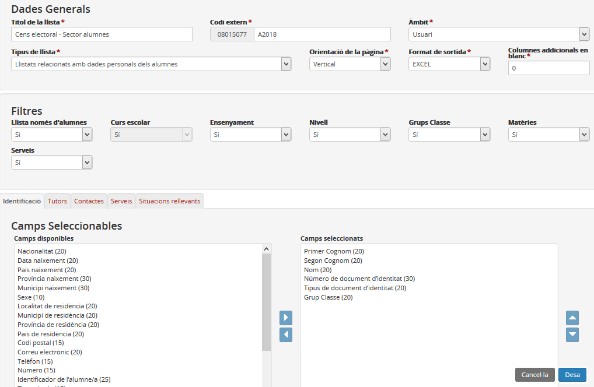
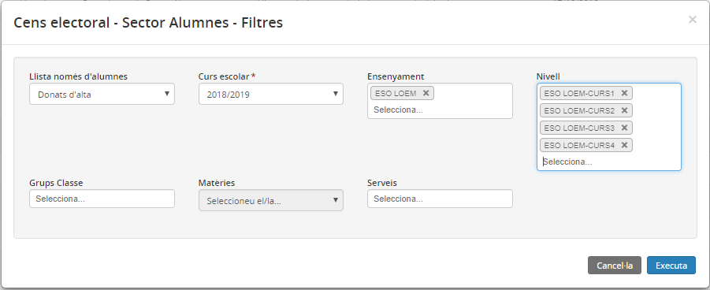
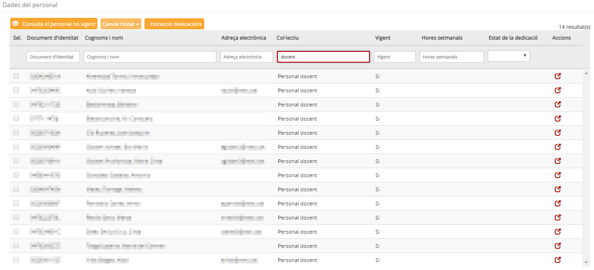
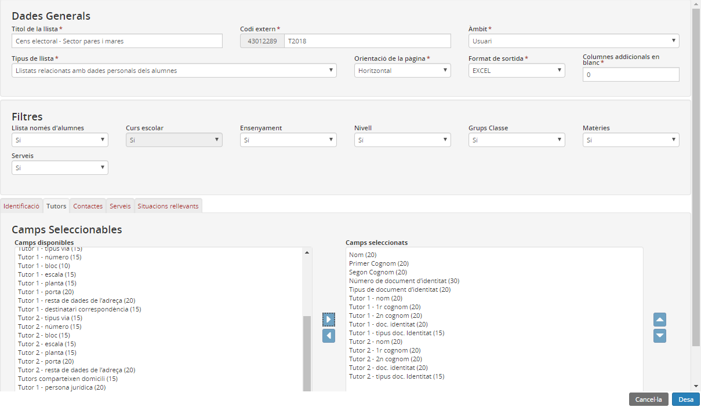

## Elaboració del cens eleccions consell escolar amb Esfer@

* [Sector alumnes](con_escolar.md#sector-alumnes)
* [Sector personal](con_escolar.md#sector-personal)
* [Sector pares i mares](con_escolar.md#sector-pares-i-mares)

### Sector alumnes

#### Pas 1. Afegir una plantilla

1. Accediu al menú **Publicacions** **>** **Plantilles**, i premeu el botó [Afegeix].

2. Empleneu els camps següents:

- Títol de la llista: Cens electoral – Sector alumnes  
- Codi extern: A2018  
- Àmbit: Usuari  
- Tipus de llista: Llistats relacionats amb les dades personals dels alumnes  
- Orientació de la pàgina: Horitzontal  
- Format de sortida: Excel  
- Filtres: Tots activats  
  
3. Afegiu els camps seleccionables següents de la pestanya "Identificació":  
- Primer cognom (20)  
- Segon cognom (20)  
- Nom (20)  
- Número de document d’identitat (30)  
- Tipus de document d’identitat (20)   
- Grup classe (20)  

Atenció! Cal anar en compte per **conservar l’ordre** correcte dels camps.

*Imatge 1- Dades seleccionables dels alumnes a afegir*

4. Per acabar premeu el botó [Desa].

#### Pas 2. Generar la plantilla

1. Torneu a accedir al menú **Publicacions > Plantilles**.

2. Seleccioneu la plantilla "Cens electoral – Sector alumnes" que acabeu de crear.

3. Premeu el botó [Executa].

4. A la finestra Filtres seleccioneu:

* els alumnes d’alta de l’actual curs escolar,
* els ensenyaments de secundària i els nivells de cada ensenyament, d’aquesta manera creareu un full de càlcul per a cada nivell i ensenyament.

*Imatge 2- Filtres a seleccionar per elaborar el cens sector alumnes*

#### Pas 3. Descarregar la plantilla

1. Aneu al menú **Cua d’elaboració (Plantilles)**.

2. Descarregueu-vos el document (un cop hagi finalitzat el procés).

3. Obriu el fitxer d’Excel i seleccioneu tot el contingut, menys les capçaleres.

4. Afegiu el logotip del vostre centre a la capçalera, el títol del document ("Cens electoral - Sector personal docent" o "Cens lectoral - Sector personal d'administració i serveis", segons escaigui) i numereu les pàgines.

5. Imprimiu la llista generada.

---

### Sector personal

#### Opció 1: des d’Esfera

1. Accediu al menú **Personal > Dades del personal**.

2. A la columna "Col·lectiu", filtrar per docent o personal d'administració i serveis, segons escaigui.

*Imatge 3 - Filtre i selecció del personal*

3. Seleccioneu les dades que mostra la pantalla, començant des del cantó dret de baix.

4. Copieu les dades i enganxeu-les a un document d’Excel.

5. Seleccioneu les columnes B i C.

6. Copieu-les i enganxeu-les en un full nou.

7. Reviseu les dades i feu les modificacions pertinents, si escau.

8. Afegiu el logotip del vostre centre a la capçalera, el títol del document ("Cens electoral - Sector personal docent" o "Cens lectoral - Sector personal d'administració i serveis", segons escaigui) i numereu les pàgines.

9. Imprimiu la llista generada.

#### Opció 2: des del GUAC

1. Accediu a l’aplicació GUAC.

2. Adreceu-vos al menú **Exportacions**.

3. Seleccioneu l’exportació "Persones del centre".

4. Obriu el fitxer CSV.

5. A la columna **Funció**, filtrar per "Funció de professor/a" o "Funció de suport administratiu".

6. Afegiu el logotip del vostre centre a la capçalera, el títol del document ("Cens electoral - Sector personal docent" o "Cens lectoral - Sector personal d'administració i serveis", segons escaigui) i numereu les pàgines.

7. Imprimiu la llista generada.

---

### Sector pares i mares

#### Pas 1. Afegir una plantilla

1. Accediu al menú **Publicacions > Plantilles**, i premeu el botó [Afegeix].

2. Empleneu els camps següents:

- Títol de la llista: Cens electoral – Sector mares i pares  
- Codi extern: T2018  
- Àmbit: Usuari  
- Tipus de llista: Llistats relacionats amb les dades personals dels alumnes  
- Orientació de la pàgina: Horitzontal  
- Format de sortida: Excel  
- Filtres: Tots activats  
  
3. Afegiu els camps seleccionables següents:

* Pestanya Identificació:

- Nom (20)  
- Primer cognom (20)  
- Segon cognom (20)  
- Número de document d’identitat (30)  
- Tipus de document d’identitat (20)

* Pestanya Tutors:

- Tutor 1 - nom (20)  
- Tutor 1 - 1r cognom (20)  
- Tutor 1 - 2n cognom (20)  
- Tutor 1 - doc. identitat (20)  
- Tutor 1 - tipus doc. identitat (15)  
- Tutor 2 - nom (20)  
- Tutor 2 - 1r cognom (20)  
- Tutor 2 - 2n cognom (20)  
- Tutor 2 - doc. identitat (20)  
- Tutor 2 - tipus doc. identitat (15)  

Atenció! Cal anar en compte per **conservar l’ordre** correcte dels camps.

*Imatge 4 - Dades seleccionables a afegir per elaborar cens secotr pares i mares*

4. Per acabar premeu el botó [Desa].

#### Pas 2. Generar la plantilla

1. Torneu a accedir al menú **Publicacions > Plantilles**.

2. Seleccioneu la plantilla "Cens electoral – Sector pares i mares" que acabeu de crear.

3. Premeu el botó [Executa].

#### Pas 3. Descarregar la plantilla

1. Aneu al menú **Cua d’elaboració (Plantilles)**.

2. Descarregueu-vos el document (un cop hagi finalitzat el procés).

3. Obriu el fitxer d’Excel i seleccioneu tot el contingut, menys les capçaleres.

#### Pas 4. Generar la llista del cens

1. Obriu el [següent fitxer](http://educacio.gencat.cat/documents/PC/GestioAdministrativa/Plantilla_cens_Sector_pares_i_mares.xlsm) .

2. Enganxeu el contingut de l’extracció del vostre centre en el full "Extracció".

3. Aneu al full "Cens", i premeu el botó [Genera llista].

4. Afegiu el logotip del vostre centre a la capçalera.

5. Imprimiu la llista generada.

---