# Elements curriculars

* [Què són](men_eleme.md#què-són)
* [Com s’hi accedeix](men_eleme.md#com-shi-accedeix)
* [Quines operacions s'hi poden fer](men_eleme.md#quines-operacions-shi-poden-fer)

### Què són

El terme **element curricular** serveix com a nom genèric per indicar cadascun dels elements amb què s'organitza acadèmicament un ensenyament.

Esfer@ és una aplicació que dóna suport a més d'un ensenyament i, per tant, cada ensenyament utilitza una terminologia diferent per referir-se a les unitats amb què s'organitza.

El terme **element curricular** fa referència als àmbits, àrees i dimensions en el cas de l'educació primària; a les matèries en el cas de l'ESO i del batxillerat, i a les unitats formatives i mòduls en el cas dels cicles formatius.  
  
Per a cada ensenyament, i d'acord amb la normativa vigent, el programa disposa d'una llista detallada de tots els elements curriculars.  
  
Aquests elements curriculars són les unitats formatives a les quals l'alumne es matricula (formen part de les dades curriculars de la matrícula) i, en conseqüència, de les quals l'alumne s'avaluarà a les avaluacions finals.
  
  
En els ensenyaments d'educació infantil i primària **els centres no poden crear elements curriculars**, no existeix a la normativa vigent aquesta possibilitat. En canvi, els centres poden crear continguts propis del centre en els ensenyaments de l'ESO, del batxillerat i dels cicles formatius.
  
  
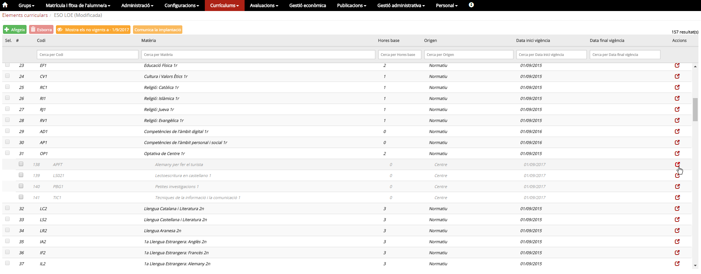*Imatge 1 - Llista d'elements curriculars d'ESO. En aquesta taula, a més dels continguts normatius, hi ha també continguts del centre (en gris i en cursiva).*
  
  

---

### Com s'hi accedeix

Per accedir-hi, heu de seleccionar l'opció del menú **Elements curriculars** del mòdul **Currículums**.  
  
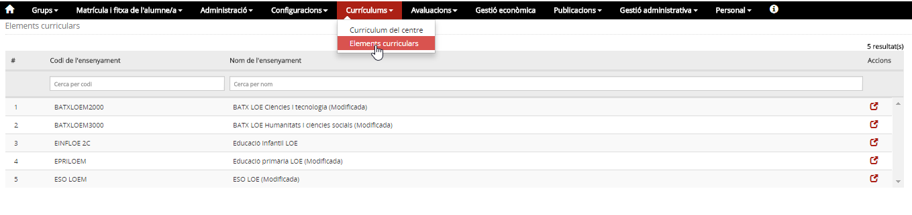*Imatge 2 - Opció del menú "Elements curriculars"*
  
La imatge anterior mostra una taula amb el codi i el nom dels diferents ensenyaments del centre, i per cadascun, a la columna d'accions, hi ha la icona  que permet accedir al detall.  
  
A la capçalera de les columnes hi ha el nom del camp. A sota, hi ha uns espais per poder aplicar filtres sobre la informació del detall.
  
  

### Quines operacions s'hi poden fer

* [Consultar](men_eleme.md#consultar) - Per veure la relació de tots els elements curriculars que corresponen a un ensenyament.
* [Editar (els continguts de centre)](men_eleme.md#editar-els-continguts-de-centre) - A ESO, batxillerat i cicles formatius, a més dels elements curriculars normatius, hi poden haver continguts del centre que, al llarg dels anys, aquest ha creat per a l'ensenyament.

  + [Modificar](men_eleme.md#modificar) - Permet corregir el nom i/o el pes de referència així com modificar les dates d'inici i de fi de la vigència (aquesta funció és especialment útil si hi ha continguts que han quedat obsolets. El fet de fer-los no vigents, evitarà afegir-los als currículums del centre, però no té cap efecte a les dades dels alumnes que els tenen al seu expedient).
  + [Crear](men_eleme.md#crear) - D'acord amb el PEC, crear nous continguts per poder-los assignar als currículums.
  + [Esborrar](men_eleme.md#esborrar) - El programa permet esborrar continguts si no hi ha cap alumne que els tingui al currículum o a l'expedient (per esborrar els creats per error, duplicats…).
  + [Mostrar/Ocultar els continguts no vigents a 01/09/yyyy](men_eleme.md#mostrarocultar-els-continguts-no-vigents-a-0109yyyy) - Permet veure/ocultar els continguts que ja no són vigents a la data de inici del curs escolar. Si és el cas, es pot treure o canviar la data de fi de la vigència perquè un contingut pugui tornar a ser vigent.
  + [Comunicar la implantació](men_eleme.md#comunicar-la-implantació) - Aquesta funció està reservada als cicles formatius i permet comunicar al Departament els mòduls de centre.

#### Consultar

**1)** Escollir l'opció del menú **Elements curriculars** del mòdul **Currículums**.
  
*Imatge 3 - Selecció d'elements curriculars*  
**2)** Prémer la icona  que correspon a l'ensenyament.
  
*Imatge 4 - Llista d'elements curriculars d'ESO*

* Es mostra una taula, amb tots els elements curriculars que corresponen a l'ensenyament, amb una casella de verificació (per marcar els que es vol esborrar), el codi, el nom, les hores de base, l'origen (si és normatiu o de centre) i les dades d'inici i fi de la vigència. A la columna d'accions hi ha la icona  per accedir-ne al detall.
* A la part superior de la taula hi ha tres botons , a les funcions de manteniment que es descriuen a continuació es detallen les funcions d'aquests botons i de la icona 
* Com en la pantalla anterior, a la capçalera de les columnes hi ha el nom del camp corresponent. A sota, hi ha uns espais per poder aplicar filtres sobre la informació. Per exemple, si a la caixa del camp "Nom" s'hi escriu **4**, el programa mostra totes les matèries de 4t.

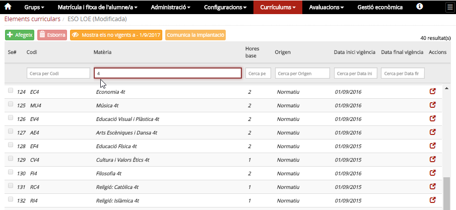*Imatge 5 - Llista d'elements curriculars de 4t d'ESO*
  
  

---

#### Modificar

**1)** Fer les accions corresponents a la funció [Consultar](men_eleme.md#consultar).
  
**2)** Cercar el contingut que es vol modificar.
Per facilitar la cerca, al filtre de la capçalera del camp "Nom" es pot escriure el nom del contingut o una **c** [1)](men_eleme.md#1) al camp "Origen" per a que sols mostri els de **c**entre.
  
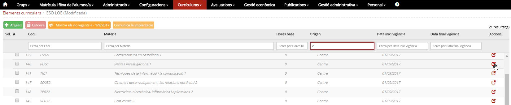*Imatge 6 - Llista d'elements curriculars de centre*
  
**3)** Prémer la icona  que correspongui a l'element que es vol editar

* El programa mostra la fitxa de l'element curricular. Al ser un contingut del centre, permet modificar-ne el nom, les dates d'inici i fi de la vigència i el camp "Comentaris".

**4)** Entrar les dades, per exemple, la data de fi de la vigència.
  
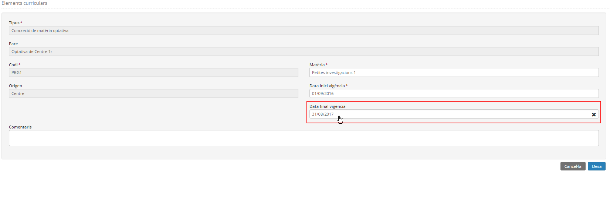*Imatge 7 - Element curricular amb data de baixa* 
  
**5)** Prémer el botó .
  
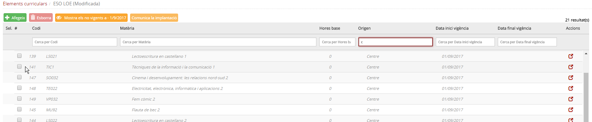*Imatge 8 - Visualització dels continguts vigents*

* Després de desar, en consultar els elements curriculars, s'observa que ja no es mostren els continguts no vigents.

---

#### Crear

**1)** Fer les accions corresponents a la funció [Consultar](men_eleme.md#consultar).
  
**2)** Prémer el botó  que hi ha sobre de la taula dels elements curriculars.
  
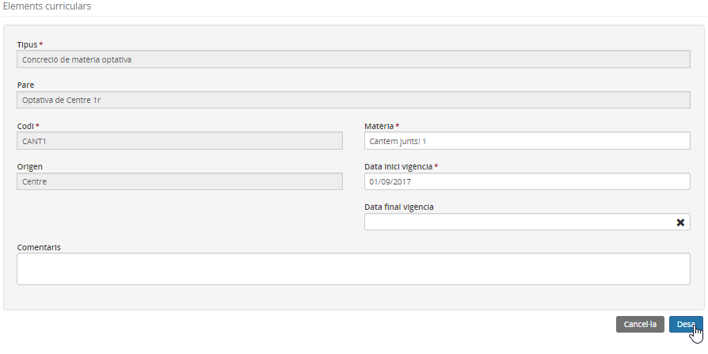*Imatge 9 - Pantalla de creació d'elements curriculars per l'ESO*  
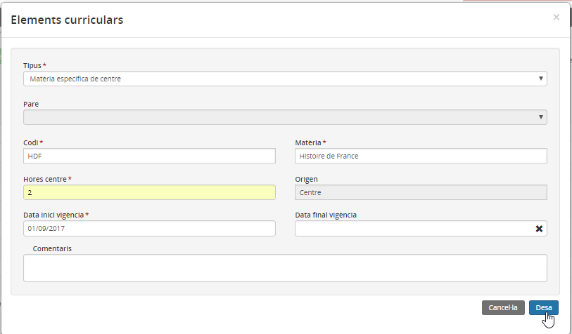*Imatge 10 - Pantalla de creació d'elements curriculars per el Batxillerat*

* El programa mostra la fitxa dels elements curriculars, amb els camps següents[2)](men_eleme.md#2):

  + **Tipus** - S'ha d'escollir l'opció en funció de l'ensenyament; ESO i batxillerat: Concreció de matèria optativa o Concreció de segona llengua estrangera i en el cas dels cicles formatius: Unitat formativa o Mòdul.
  + **Pare** - Identifica el contingut del qual depen el nou element i si es tracta d'un contingut de nivell superior es mostrarà en blanc. Si el tipus és Unitat formativa, s'ha d'escollir el mòdul. En el cas de l'ESO les optatives de centre les relacionarà al contingut "Optativa de centre" que serà el contingut al que s'ha de matricular l'alumne i que s'avaluarà a l'avaluació final.
  + **Codi** - S'ha d'entrar un codi alfanumèric i únic[3)](men_eleme.md#3). Per a l'ESO i el batxillerat, l'últim caràcter ha de ser un número en el cas que el contingut s'ofereixi a un nivell concret. En el cas dels cicles formatius el codi ha de ser un text.
  + **Nom/Matèria** - S'ha d'entrar el nom del contingut, que ha de ser únic[4)](men_eleme.md#4).
  + **Hores centre** - Aquest camp només surt a les matèries de batxillerat, s'hi ha d'entrar el nombre d'hores de classe setmanals que el centre ha establert per la matèria.
  + **Pes** - Aquest camp només surt als continguts de cicles formatius, el pes s'utilitza com a element de ponderació per calcular la qualificació final. En els cicles formatius d'FP i en els cicles formatius d’arts plàstiques i disseny de grau mitjà es mesura en hores i en els Cicles formatius d’arts plàstiques i disseny de grau superior en crèdits ETCS.
  + **Origen** - Centre (valor no modificable).
  + **Data d'inici** - Per defecte el programa posa la data del dia, però es pot modificar a (Per poder-los aplicar en el curs escolar és necessari que siguin vigents el dia **01/09/YYYY**).
  + **Data de fi** - Per defecte sense especificar. Cal especificar-la quan es vulgui establir la finalització de la vigència.
  + **Comentaris** - Camp no obligatori per entrar informació complementària.

**3)** Emplenar els camps obligatoris del formulari (s'identifiquen amb un \*).
  
**4)** Prémer el botó .
  
  

---

#### Esborrar

Per esborrar elements curriculars cal:
  
**1)** Fer les accions corresponents a la funció "[Consultar](men_eleme.md#consultar)"
  
**2)** Cercar el contingut que es vol esborrar. Per concretar la cerca, es pot utilitzar el filtre de la capçalera.
  
**3)** Marcar la casella de selecció corresponent al contingut.
  
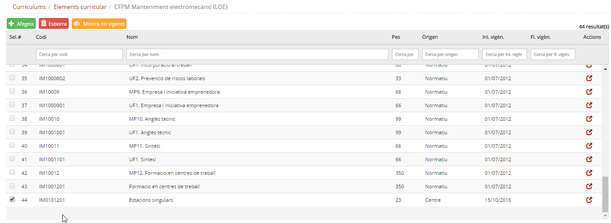*Imatge 11 - Llista de mòduls i unitats formatives d'un cicle formatiu i selecció d'un mòdul del centre per esborrar*
  
**4)** Prémer el botó . Apareix una pantalla demanant la conformitat per esborrar el contingut.
  
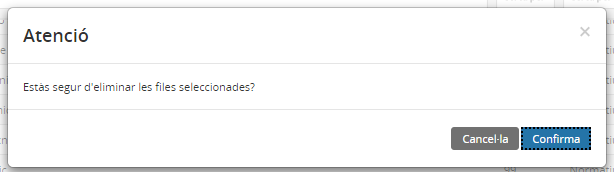*Imatge 12 - Pantalla de confirmació*
  
**5)** Prémer el botó .

* Es mostra el missatge assegurant que s'ha eliminat el contingut.

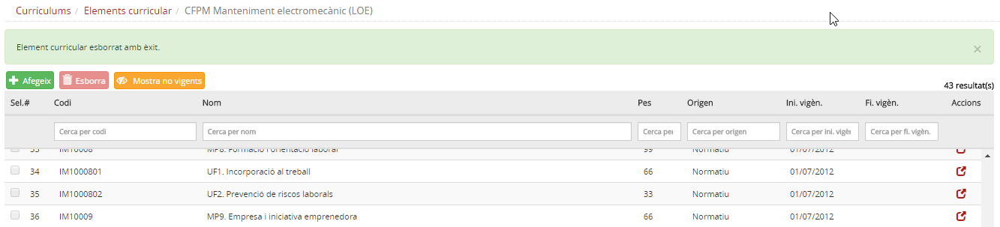*Imatge 13 - Pantalla amb el missatge tal com l'element s'ha esborrat.*
  
  

---

#### Mostrar/Ocultar els continguts no vigents a 01/09/YYYY

En la [consulta](men_eleme.md#consulta) dels elements curriculars d'un ensenyament, en qualsevol moment, es pot demanar al programa que mostri tots els continguts, tant els vigents com els no vigents.  
**Atenció, la vigència la mira en relació a la data de 01/09/YYYY on YYYY és l'any d'inici del curs escolar**
  
Si es prem el botó , el programa mostra tots els continguts.  
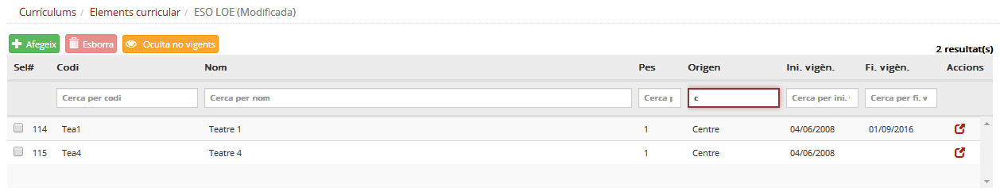*Imatge 14 - Llista de tots els continguts, inclosos els no vigents*

* Cal tenir en compte que el botó  canvia el nom quan se selecciona, i a la inversa.

---

[1)](men_eleme.md#1)
Per filtrar els continguts que del centre.

[2)](men_eleme.md#2)
Hi ha camps que sols es mostren en alguns ensenyaments

[3)](men_eleme.md#3)
En un vensenyament, no poden haver-hi dos continguts amb el mateix valor.

[4)](men_eleme.md#4)
En un ensenyament, no poden haver dos continguts amb el mateix valor.