## Resultats d'avaluacions finals

Les dades que s'inclouen en aquesta pestanya són:

* [Resultats d'avaluacions finals](fda-aa-avaluacions.md#resultats-davaluacions-finals)
* [Enregistrar diligències a l'acta](fda-aa-avaluacions.md#enregistrar-diligències-a-lacta)
* [Llista de diligències](fda-aa-avaluacions.md#llista-de-diligències)

### Resultats d'avaluacions finals

En aquesta pantalla es mostren les dades registrades a les avaluacions finals de l'ensenyament.
  
  
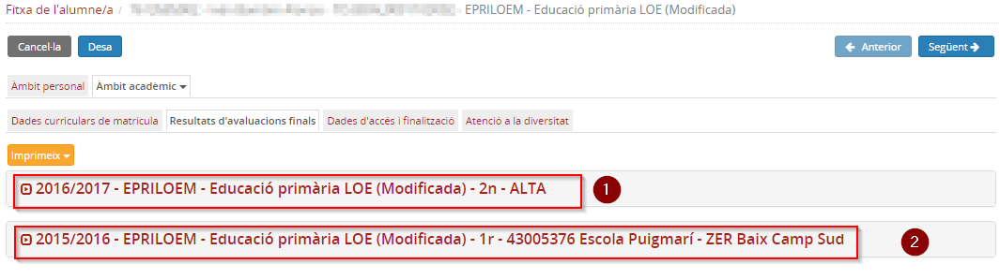*Imatge 1 - Accés a dades de l'avaluació de l'àmbit acadèmic*

A la pestanya **Resultats d'avaluacions finals** es prem sobre l'ensenyament del què volem veure les notes enregistrades.
  
  
1. Resultats de les avaluacions finals del curs 2016/2017, si escau, realitzades a Esfer@.
  
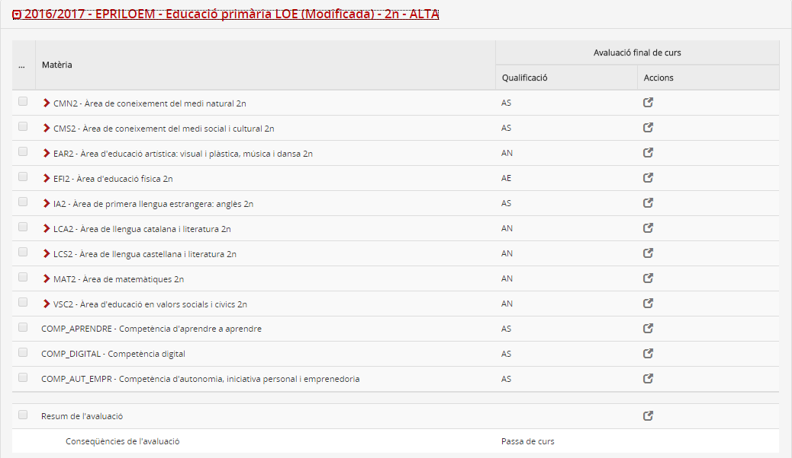*Imatge 2 - Dades de l'avaluació final realitzada a Esfer@*
  
Les dades de les avaluacions finals realitzades a Esfer@ es mostren en aquesta pantalla de la fitxa de l'alumne/a només quan l'**avaluació final** està en estat **Signada**  
  
  
2. Resultats de les avaluacions finals, del mateix ensenyament, si és el cas, que es van migrar de SAGA.
  
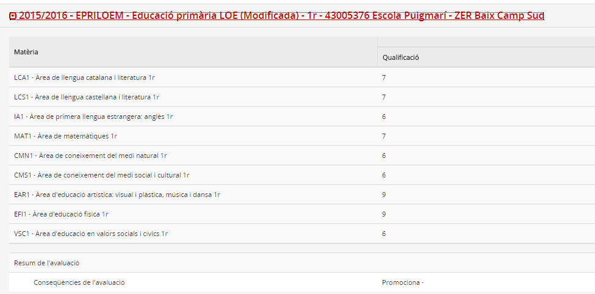*Imatge 3 - Dades de l'avaluació final realitzada a SAGA*
  
  

---

### Enregistrar diligències a l'acta

Quan les avaluacions finals estan signades no és possible modificar cap qualificació. Si, malgrat tot, és necessari modificar alguna dada, caldrà registrar una **diligència a l'acta**, és a dir, modificar una qualificació a la mateixa acta d'avaluació.
  
  
Les **diligències a l'acta** sobre les qualificacions de les avaluacions realitzades a Esfer@ s'enregistren des d'aquesta pantalla de la **Fitxa de l'Alumne**, des de la qual, es pot obtenir també **la relació de diligències** que s'hagin enregistrat a l'alumne/a.
  
  
Per enregistrar una diligència a l'acta cal clicar la icona de la qualificació que es vol modificar:
  
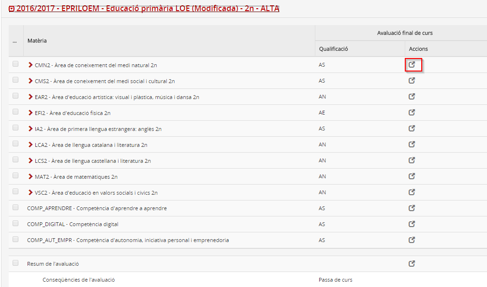*Imatge 4 - Accés a enregistrar diligències*   
la qual cosa obrirà una finestra modal on caldrà prémer el botó [**Afegeix**]:

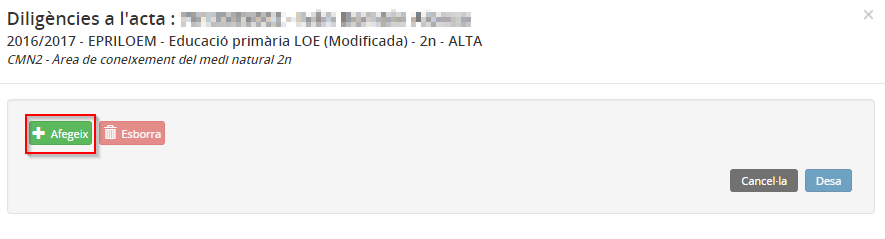*Imatge 5 - Afegir una diligència*  
A continuació cal entrar la nova qualificació i prémer el botó [**Desa**]:

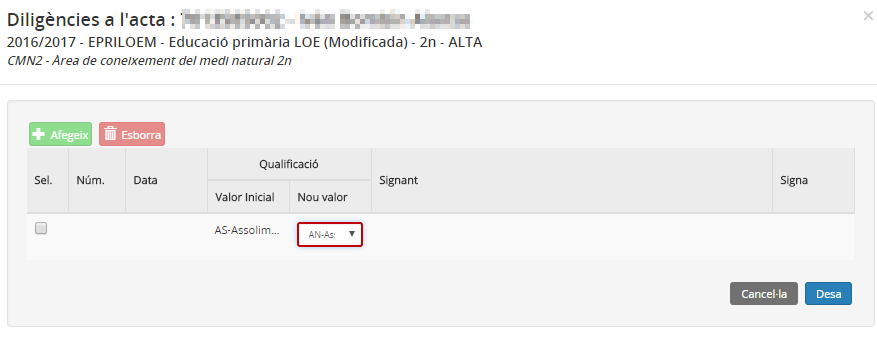*Imatge 6 - Enregistrar la diligència*

En enregistrar una diligència, aquesta queda en estat **Pendent de signar**.

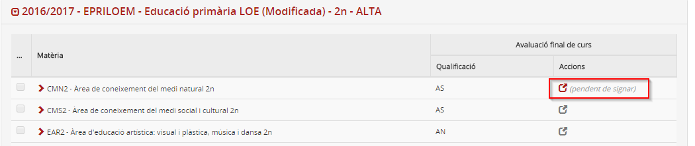*Imatge 7 - Diligència pendent de signar*  
El director/a o secretari/secretària del centre han de signar la diligència perquè aquesta sigui vàlida.  
En aquest cas, en accedir a la diligència pendent de signar es mostra una icona per a procedir a signar-la:
  
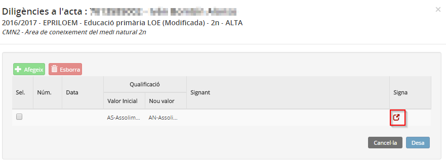*Imatge 8 - Signar una diligència*
  
En prémer la icona es mostrarà un avís:  
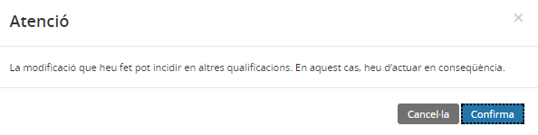*Imatge 9 - Avís en signar una diligència*
  
Cal clicar el botó [**Confirma**] i a continuació el botó [**Desa**] per guardar els canvis. Ara la diligència ja és vàlida a tots els efectes:  
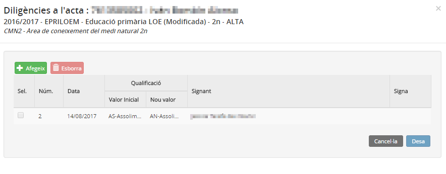*Imatge 10 - Diligència signada*
  
A la pantalla de les qualificacions de l'alumne/a sempre es mostrarà la icona de color vermell per indicar que la qualificació que es mostra és el resultat d'una diligència:  
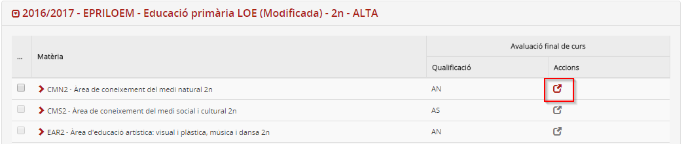*Imatge 11 - Resultats de l'avaluació amb diligència signada*
  
  

Sobre les qualificacions migrades de SAGA no es poden fer diligències a l'acta, en aquest cas, s'han de fer **diligències a l'expedient** des del menú **Expedient** del mòdul de **Gestió administrativa**.

### Diligències a les qualificacions finals

Quan es fan diligències a les qualificacions finals de les matèries d'un ensenyament que condicionen la qualificació final de l’ensenyament, cal recalcular-la i fer una diligència a la qualificació final de l’ensenyament.

Quan es fa una diligència a una qualificació final de l’ensenyament que ja ha estat enviada a al RALC, també cal esmenar la qualificació final a la RTA.

---

### Llista de diligències

Des del botó [Imprimeix] d'aquesta pantalla es pot obtenir la relació impresa de les diligències que afectin l'alumne/a:  
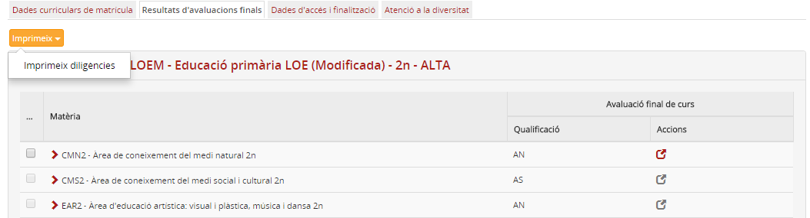*Imatge 12 - Obtenir llista de diligències*  

---