## Dades curriculars de matrícula

En aquest apartat es troben les dades del currículum actual i la seva concreció d'acord a les casuístiques personals de cada alumne/a.

* [Què és](fda-aa-curriculars.md#què-és)
* [Com s'hi accedeix](fda-aa-curriculars.md#com-shi-accedeix)
* [Quines operacions s'hi poden fer](fda-aa-curriculars.md#quines-operacions-shi-poden-fer)

### Què és

Les dades que s'inclouen en aquesta pestanya són:

* [Dades de l'ensenyament](fda-aa-curriculars.md#dades-de-lensenyament)
* [Currículum](fda-aa-curriculars.md#currículum)
* [Altres dades curriculars](fda-aa-curriculars.md#altres-dades-curriculars)

#### Dades de l'ensenyament

A la part superior de la pestanya es mostren les dades identificatives de l'ensenyament. Alguns camps estan inhabilitats, perquè la informació que contenen és propietat del RALC i no es pot canviar.

Hi ha dos camps que es poden modificar:

* Data de la matrícula
* Nivell

Els camps marcats amb un asterisc vermell (*\**) són obligatoris.

En desar, si se n'ha canviat el valor, aquest també es canviarà al RALC sempre que s'acompleixin els controls de l'aplicació.

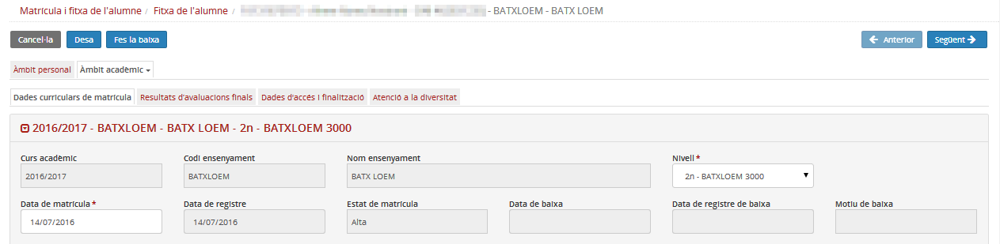*Imatge 1 - Dades de l'ensenyament de la fitxa de l'alumne*

### Currículum

En aquest apartat es mostra el currículum que s'ha assignat a l'alumne en formalitzar la matrícula.
  
  
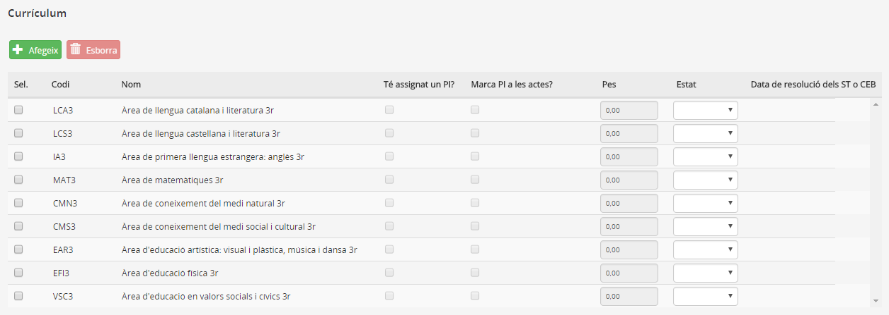*Imatge 2 - Currículum assignat a un alumne de batxillerat*
  
  

En els ensenyaments **Educació Infantil** i **Educació Primària** el programa **no té en compte el Pes dels continguts**, es poden deixar tots a zero.
Cal recordar que el pes es determina en crear el currículum de centre.

### Altres dades curriculars

Al final de la pestanya hi ha un conjunt de camps que completen les dades curriculars de l'ensenyament:
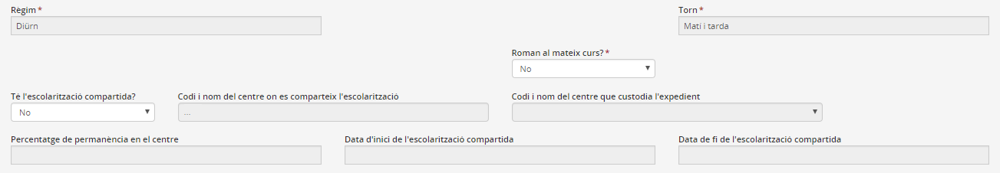*Imatge 3 - Altres dades curriculars de primària i infantil*
  
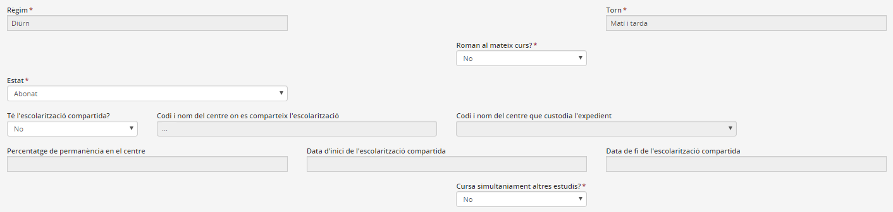*Imatge 4 - Altres dades curriculars d'educació secundària obligatòria*
  
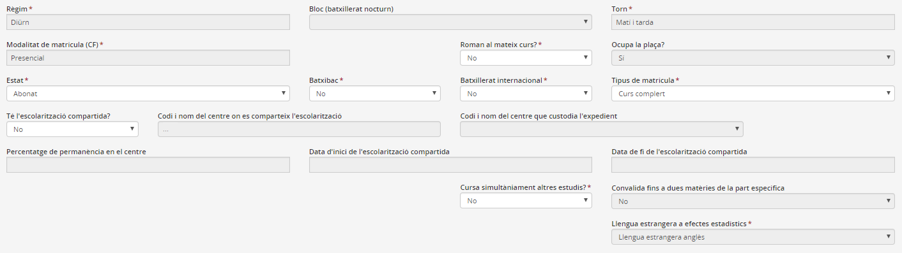*Imatge 5 - Altres dades curriculars de batxillerat*
  
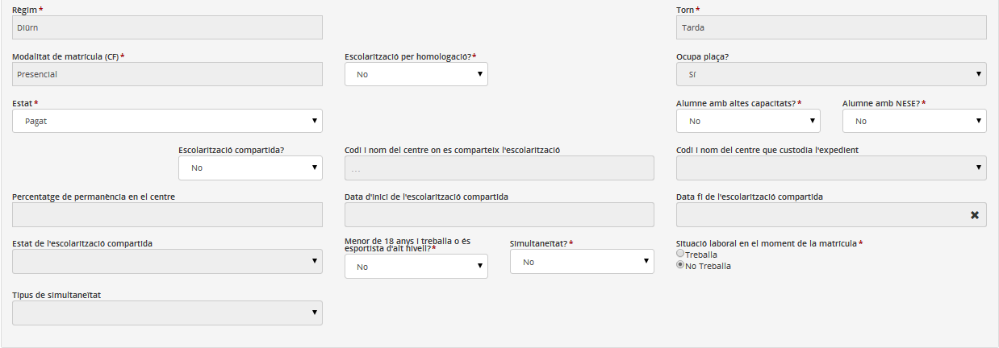*Imatge 6 - Altres dades curriculars de cicles formatius*
  

Per **mantenir els canvis** fets en qualsevol pestanya de l'Àmbit acadèmic, cal **prémer el botó** .

### Com s'hi accedeix

Per accedir-hi cal clicar a la pestanya Àmbit acadèmic del mòdul Matrícula i fitxa de l'alumne/a, seleccionar l'ensenyament, i a continuació prémer la pestanya "Dades curriculars de matrícula":

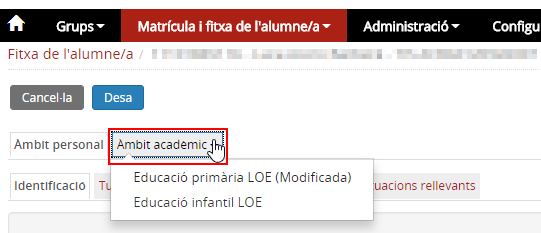*Imatge 6 - Seleccionar l'ensenyament*

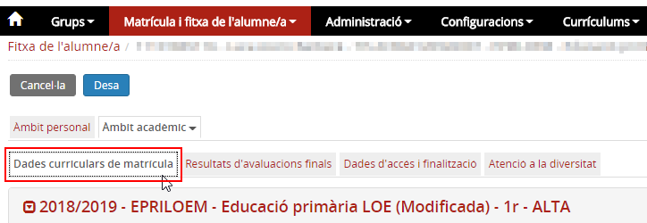*Imatge 7 - Accés a Dades curriculars de matrícula*

### Quines operacions s'hi poden fer

Les operacions que es poden realitzar des d'aquesta pantalla són:

* [Modificar el currículum](fda-aa-curriculars.md#modificar-el-currículum)
* [Marcar les matèries afectades pel PI](fda-aa-curriculars.md#marcar-les-matèries-afectades-pel-pi)
* [Especificar matèries pendents de cursos anteriors](fda-aa-curriculars.md#especificar-matèries-pendents-de-cursos-anteriors)
* [Canviar de nivell](fda-aa-curriculars.md#canviar-de-nivell)
* [Indicar les dades de l'escolarització compartida](fda-aa-curriculars.md#indicar-les-dades-de-lescolarització-compartida)
* [Fer la baixa de la matrícula](fda-aa-baixa_matricula.md)
* [Situacions singulars](fda-aa-curriculars.md#situacions-singulars)

  + [Especificitats de l'educació primària](fda-aa-esp_epri.md)
  + [Especificitats de l'ESO](fda-aa-esp_eso.md)
  + [Especificitats del batxillerat](fda-aa-esp_bat.md)

#### Modificar el currículum

En formalitzar la matrícula de l'alumne se li ha d'assignar un currículum que prèviament cal haver creat al menú **Currículums**.  
També s'especifiquen les matèries pendents segons l'ensenyament.

En aquest bloc de dades, si és necessari, es poden fer canvis en les matèries del currículum. S'ha de tenir en compte, però, que en desar el sistema comprova que la suma d'hores sigui la correcta.

Per canviar una matèria cal prémer el botó  que hi ha sota de la relació de matèries.

A la finestra emergent, cal triar del desplegable el currículum d'on s'ha de seleccionar la matèria.

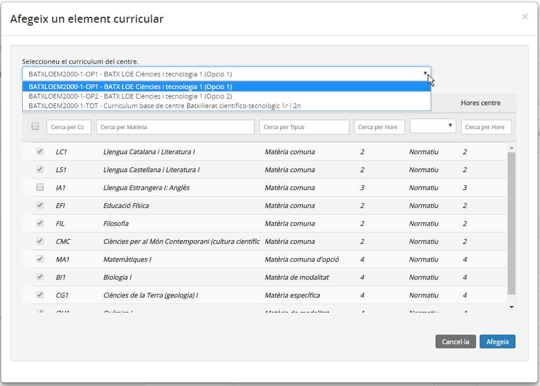*Imatge 8 - Selecció d'un currículum del centre per canviar-ne una matèria*

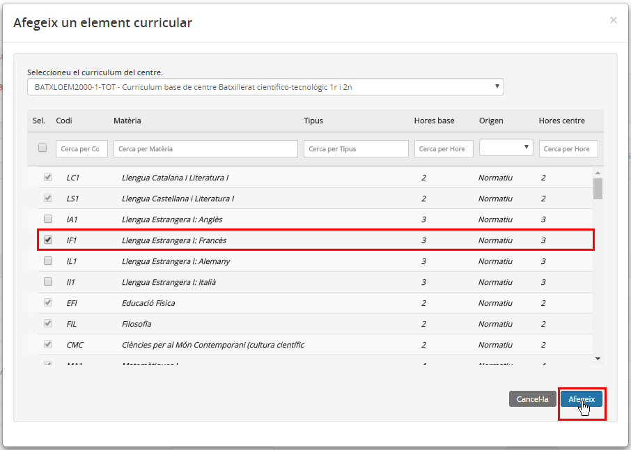*Imatge 9 - Selecció de les matèries del currículum del centre*

Fins que no s'ha seleccionat alguna matèria, no s'activa el botó .

Finalment s'ha de prémer per afegir les matèries marcades al currículum de l'alumne.

Per eliminar una matèria del currículum cal marcar-la i prémer el botó .

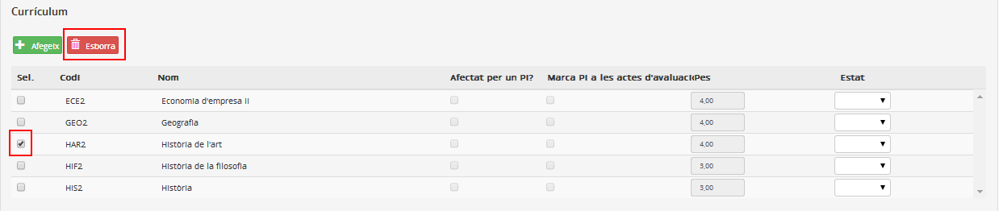*Imatge 10 - Eliminació d'una matèria del currículum de l'alumne*
  

#### Marcar les matèries afectades pel PI

Tant al currículum com a les matèries pendents dels cursos anteriors hi ha dues columnes:

* **Afectat per un PI**: Només es pot marcar si s'ha especificat a la pestanya "Atenció a la diversitat"
* **Marca PI a les actes d'avaluació**: S'ha de marcar si es vol que es mostri a les actes d'avaluació

Si s'ha especificat que l'alumne té un pla individualitzat, la columna **Pes** és editable.

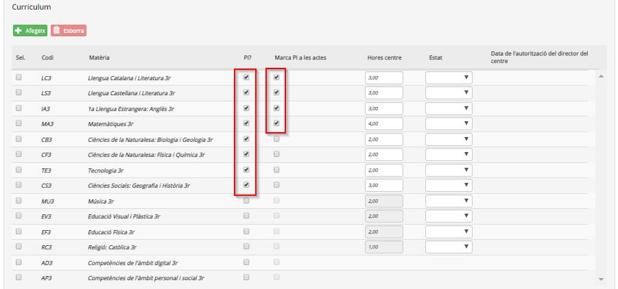*Imatge 11 - Alumne amb un pla individualitzat*
  
  

---

#### Especificar matèries pendents de cursos anteriors

Si l'alumne té matèries pendents (segons l'ensenyament) aquestes s'han d'especificar en el moment de formalitzar la matrícula, però des de l'apartat **Matèries pendents de cursos anteriors**.

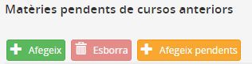*Imatge 12 - Especificació de les matèries pendents*

Les matèries pendents es poden afegir:

* De manera **manual**, clicant el botó .

A la finestra emergent es marquen les matèries que corresponguin i es prem el botó 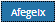.

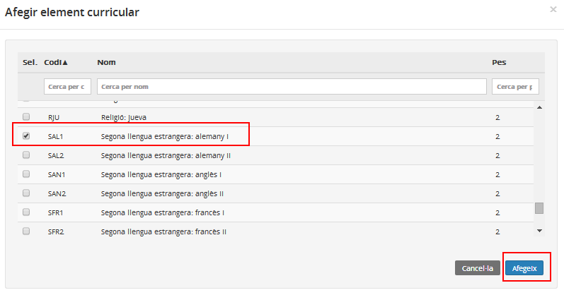*Imatge 13 - Selecció de les matèries pendents*

\* De manera **automàtica**, amb el botó .  
En clicar el botó , Esfer@ mostra:

* Sense seleccionar, les matèries que haurien de constar com a pendents.

* Seleccionades, les matèries sobreres. En aquest cas, per esborrar-les, cal clicar el botó 

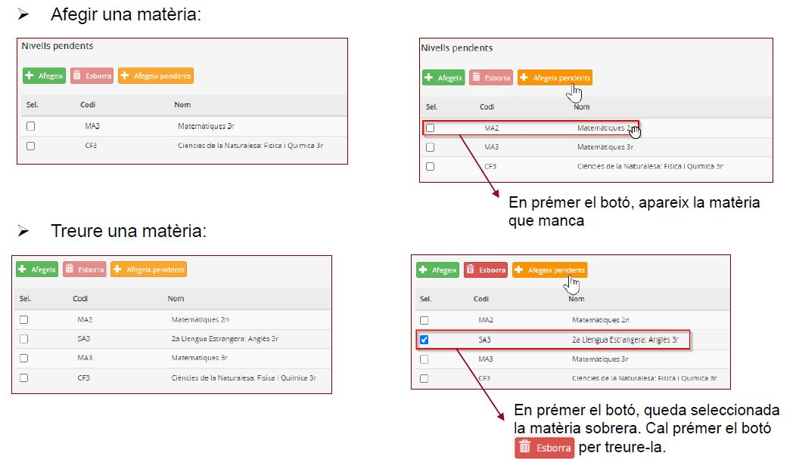*Imatge 14 - Comportament del botó 'Afegir pendents'*  
  
  

#### Canviar de nivell

La matrícula en estat Alta d'un alumne es pot canviar de nivell sempre que l'ensenyament ho permeti i l'alumne reuneixi els requisits necessaris per estar matriculat a un nivell diferent.  
En principi hi ha dues situacions que poden requerir un canvi de nivell:

* Alumne que cal **endarrerir de nivell**:

  + Alumne que ha de romandre un curs més al nivell anterior.
  + Alumne del qual es decideix endarrerir un nivell.

En aquests dos casos l'edat de l'alumne ho ha de permetre.

* Alumne que cal **avançar de nivell**:

  + Alumne matriculat com a repetidor però que no ho ha de ser.
  + Alumne d'altes capacitats.

Si es tracta d'un alumne d'altes capacitats que cal avançar de nivell, cal tenir en compte que l'edat de l'alumne serà inferior a la permesa, per la qual cosa, abans de fer el canvi de nivell s'ha d'haver informat al programa que es tracta d'un alumne de **NESE** amb motiu **Altes capacitats**. Aquesta circumstància permetrà matricular l'alumne a un nivell que, per edat, no li correspon.

  
  
En qualsevol cas cal seguir les passes següents:
  
  
**1**. Accedir a la pantalla **Dades curriculars de matrícula**.
  
  
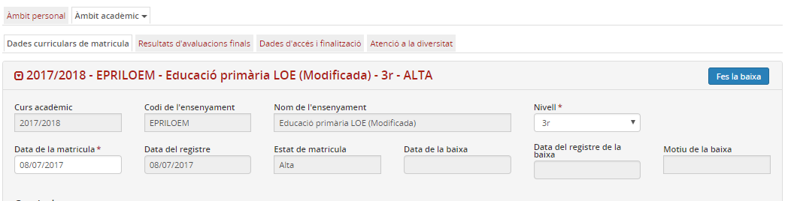*Imatge 16 - Dades de l'ensenyament de la fitxa de l'alumne/a*
  
  
**2**. Seleccionar la matrícula en estat Alta sobre la que es vol actuar.  
  
**3**. Canviar el nivell en el desplegable. El programa mostrarà un missatge que cal **confirmar**:
  
  
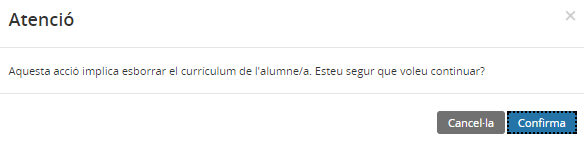*Imatge 17 - Missatge en fer un canvi de nivell*
  
  
**4**. Posar el **currículum** del nou nivell a l'alumne/a:
  
  
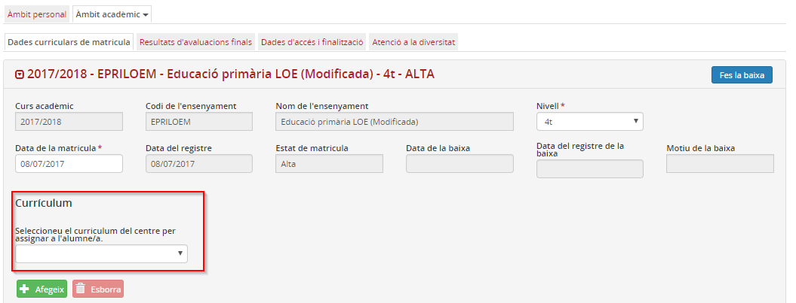*Imatge 18 - L'alumne no té currículum*
  
  
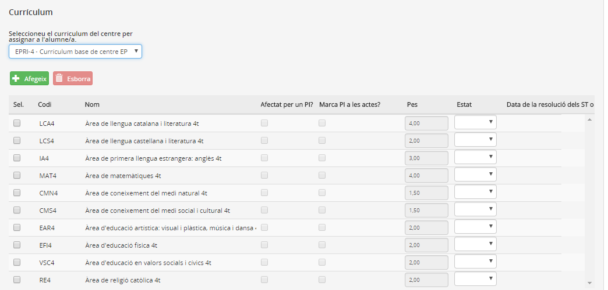*Imatge 19 - Nou currículum de l'alumne/a*
  
  
**5**. **Desar** els canvis.
  
  

#### Indicar les dades de l'escolarització compartida

Quan a un alumne se li assigna escolarització compartida, cal seguir les passes següents:
  
1. Triar l'opció "Sí" del desplegable "Té l'escolarització compartida?".
  
2. Emplenar la resta de dades relacionades amb l'escolarització compartida que s'activen:
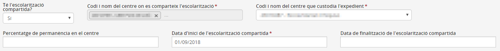*Imatge 20 - Dades de l'escolarització compartida*

---