## Especificitats del batxillerat

Els casos singulars propis del batxillerat són:

* [Canvi de modalitat](fda-aa-esp_bat.md#canvi-de-modalitat)
* [Simultaneïtat d'estudis](fda-aa-esp_bat.md#simultaneitat-destudis)
* [Batxibac](fda-aa-esp_bat.md#batxibac)
* [Batxillerat internacional](fda-aa-esp_bat.md#batxillerat-internacional)
* [Batxillerat nocturn](fda-aa-esp_bat.md#batxillerat-nocturn)
* [Renúncia de matèries pendents](fda-aa-esp_bat.md#renuncia-de-materies-pendents)

### Canvi de modalitat

En el cas que un alumne demani fer el canvi de modalitat, cal:

1. **Donar de baixa** la matrícula actual de l'alumne
  
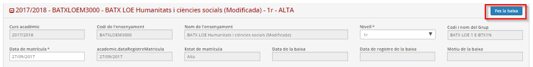*Imatge 1 - Fer la baixa de la matrícula*

2. Tornar a matricular-lo des de l'opció del menú **Matrícula d'alumnes (admissió o preinscripció)** del mòdul **Matrícula i fitxa de l'alumne/a**.
  
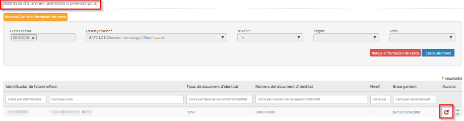*Imatge 2 - Matrícula d'alumnes (admissió o preinscripció)*

### Simultaneïtat d'estudis

En el cas d'alumnes que simultaniegen estudis, cal:

1. A la pantalla **Dades curriculars de matrícula**:
Cal triar l'opció "Sí" del desplegable "Simultaneïtat d'estudis?", i a continuació triar l'opció "Convalidat" del desplegable "Estat" en les matèries corresponents.
  
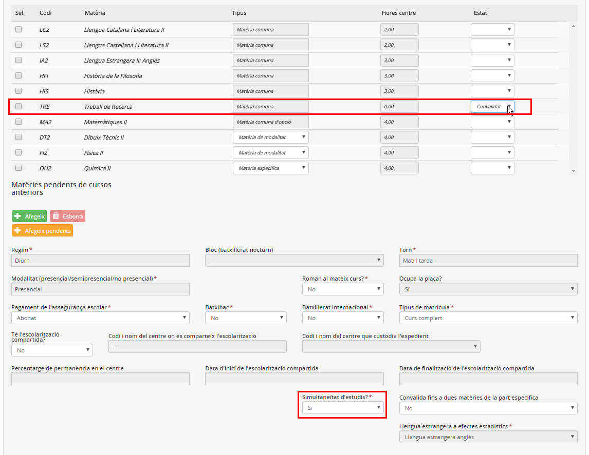*Imatge 3 - Indicar simultaneïtat d'estudis i matèries convalidades*

### Batxibac

* **[Més informació](http://xtec.gencat.cat/ca/curriculum/batxillerat/baccalaureat/)**

Els alumnes que cursen aquest ensenyament, a més de les matèries pròpies del batxillerat, s'han de matricular d'unes matèries específiques del batxibac, que s'han de crear prèviament com a matèries de centre:
  
1. Crear la matèria de centre des de l'opció del menú **Elements curriculars** del mòdul **Currículums**:
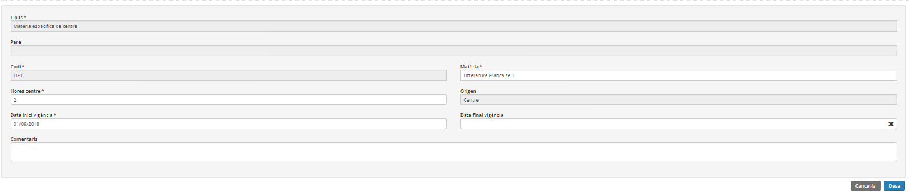*Imatge 4 - Detall de la creació d'una matèria de centre*
  
2. Incorporar les matèries pròpies del batxibac als currículums de centre a l'opció del menú **Currículum del centre** del mòdul **Currículums**:
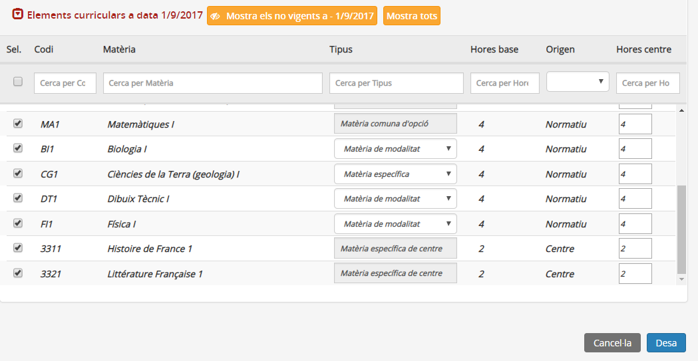*Imatge 5 - Incorporació de les matèries pròpies del batxibac als currículums del centre*
  
3. Identificar en les dades **Dades curriculars de matrícula** del mòdul **Matrícula i fitxa de l'alumne/a** que l'alumne cursa batxibac i afegir les matèries pròpies del batxibac al seu currículum.
  
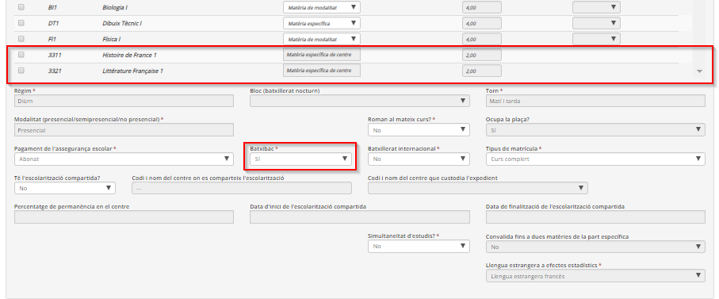*Imatge 6 - Identificació del batxibac i currículum de l'alumne/a*

Si el centre imparteix una matèria comuna en francès, aquesta no canvia perquè els continguts són els mateixos. Per tant, es considera la mateixa matèria comuna i no s'ha de crear una de nova.

### Batxillerat internacional

Pels alumnes que cursen aquest batxillerat, l'aplicació recull únicament les matèries LOEM:
  
1. Identificar en les dades **Dades curriculars de matrícula** del mòdul **Matrícula i fitxa de l'alumne/a** que l'alumne cursa batxillerat internacional.
  
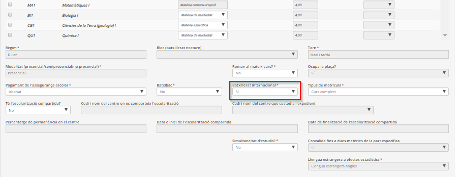*Imatge 7 - Identificació del batxillerat internacional*
  

### Batxillerat nocturn

Pels alumnes que cursen batxillerat amb règim nocturn, a la pantalla **Dades curriculars de matrícula** del mòdul **Matrícula i fitxa de l'alumne/a** es recull:
  
- Règim: nocturn  
- Bloc (batxillerat nocturn) amb les opcions "BI", "BII" i "BIII", segons el bloc de matèries que correspongui.  
- Torn: vespre  
- Tipus de matrícula: "Curs complet" (si l'alumne/a cursa totes les matèries del nivell), "Flexibilització" (si l'alumne/a preveu acabar l'ensenyament en tres cursos), i "Soltes" (si l'alumne/a únicament es matricula d'alguna matèria).
  
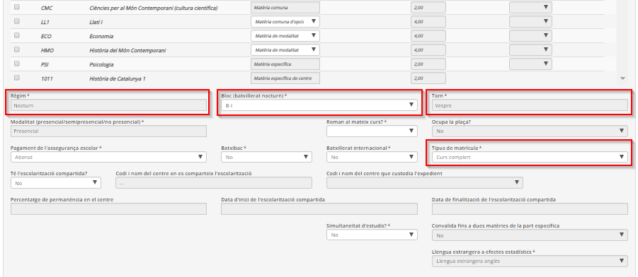*Imatge 8 - Detall de les dades curriculars d'un alumne de batxillerat nocturn*

### Renúncia de matèries pendents

En el cas que l'alumne vulgui canviar una matèria pendent per una altra del mateix tipus, cal:

1. A la pantalla **Dades curriculars de matrícula** del mòdul **Matrícula i fitxa de l'alumne/a**, a l'apartat **Matèries pendents de cursos anteriors**, prémer el botó [Afegeix]

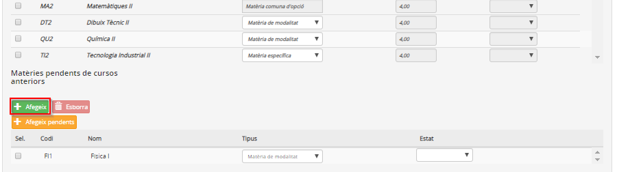*Imatge 9 - Afegir la nova matèria*

2. Afegir la nova matèria que constarà com a pendent, seleccionant-la d'entre la relació de matèries de la finestra emergent.

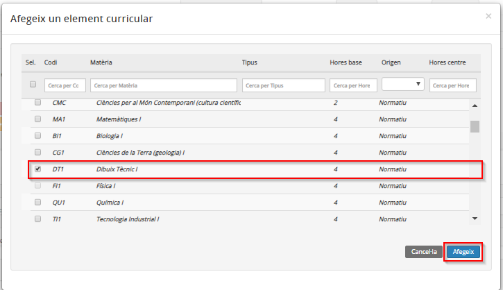*Imatge 10 - Seleccionar la nova matèria*

3. Seleccionar l'opció "Renúncia" del desplegable "Estat" per a la matèria a la qual es vol renunciar, i "Nova pendent" per a la nova matèria seleccionada.

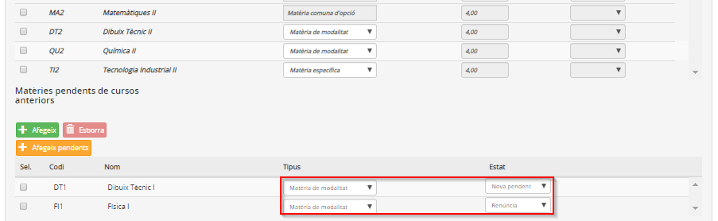*Imatge 11 - Detall de l'estat de les matèries pendents*

El tipus de les dues matèries, a la qual es renuncia i la nova pendent, han de ser iguals.

