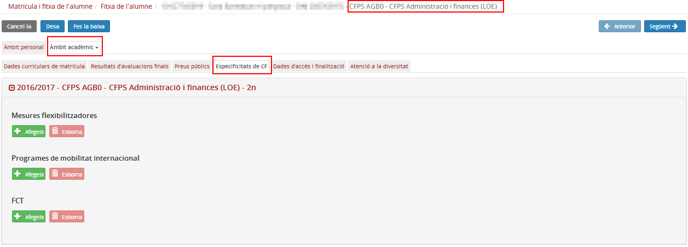
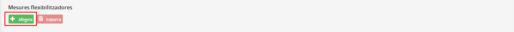
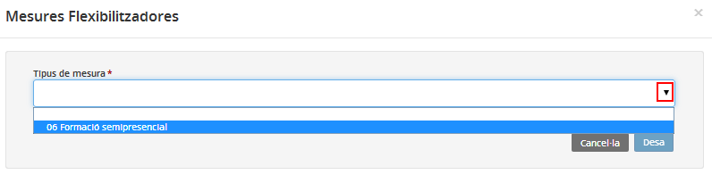
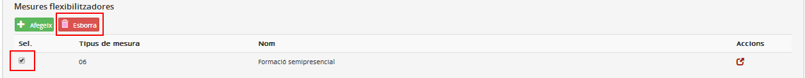
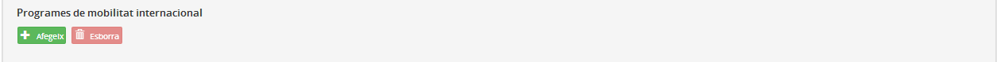
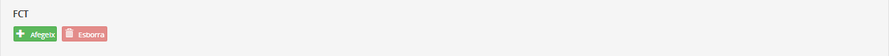
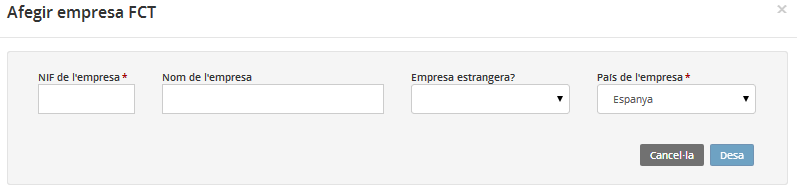

## Especificitats dels cicles formatius

És visible només per als ensenyaments dels cicles formatius.

Aquesta pestanya permet completar les dades específiques dels cicles formatius. Es poden completar en el moment de formalitzar la matrícula o a posteriori.

*Imatge 1 - Accés a Especificitats dels cicles formatius*

Els blocs de dades són els següents:

* [Mesures flexibilitzadores](fda-aa-esp_cf.md#mesures-flexibilitzadores)
* [Programes de mobilitat internacional](fda-aa-esp_cf.md#programes-de-mobilitat-internacional)
* [Formació en centres de treball](fda-aa-esp_cf.md#formacio-en-centres-de-treball)

### Mesures flexibilitzadores

Les mesures que es poden aplicar **es gestionen des del mòdul Configuracions**: La majoria de mesures les ha d'autoritzar el Departament i una l'ha de comunicar el centre al Departament conforme la implanta.

| Codi de mesura | Nom de la mesura | Observacions |
| --- | --- | --- |
| 01 | Impartició parcial de cicles | L'autoritza el Departament |
| 02-02A | Distribució temporal extraordinària | L'autoritza el Departament |
| 03-03B | Matrícula parcial. D'oferta específica de cicles formatius | L'autoritza el Departament |
| 03-03C | Matrícula parcial. D'oferta específica de cicles formatius organitzada pel Departament | L'autoritza el Departament |
| 04 | Impartició d’unitats formatives en entorna laborals | L'autoritza el Departament |
| 05 | Oferta a col·lectius singulars | L'autoritza el Departament |
| 06 | Formació semipresencial | El centre comunica al Departament que la impartirà |
| 07-07A | Formació professional en alternança simple | L'autoritza el Departament |
| 07-07B | Formació professional en alternança dual | L'autoritza el Departament |
| 08 | Oferta de cicles en zones de baixa densitat | L'autoritza el Departament |

Per afegir una mesura flexibilitzadora cal prémer el botó  del bloc de dades.

*Imatge 2 - Botó per afegir una mesura flexibilitzadora*

*Imatge 3 - Afegiment d'una mesura flexibilitzadora*

En seleccionar la mesura i prémer el botó  de la finestra emergent, la mesura queda afegida a la llista de mesures que s'apliquen a l'alumne.

Segons la mesura seleccionada cal emplenar diferents camps.

| Codi | Nom de la mesura | Indicacions en l'àmbit de l'alumne |
| --- | --- | --- |
| 01 | Impartició parcial de cicles | – |
| 02-02A | Distribució temporal extraordinària | -Indicar que s’hi acull. |
| 03-03B | Matrícula parcial. D'oferta específica de cicles formatius | - Indicar que s’hi acull.\\- Si no té els requisits d'accés, cal marcar-ho en el camp corresponent.\\- Identificador del conveni. (S’ha d’escollir el conveni dels disponibles per la mesura segons el mòdul **Configuracions**).\\- NIF i nom de l'empresa (si és estrangera informar el país). Seleccionar l’empresa de les disponibles per la mesura, segons el mòdul **Configuracions**. |
| 03-03C | Matrícula parcial. D'oferta específica de cicles formatius organitzada pel Departament | - Indicar que s’hi acull  - Si no té els requisists d'accés marcar-ho en el camp corresponent |
| 04 | Impartició d’unitats formatives en entorna laborals | – |
| 05 | Oferta a col·lectius singulars | - Indicar que s’hi acull.\\- Si no té els requisits d'accés cal marcar-ho en el camp corresponent.\\- Identificador del conveni. (S’ha d’escollir el conveni dels disponibles per la mesura segons el mòdul **Configuracions**).\\- NIF i nom de l'empresa (si és estrangera informar el país). Seleccionar l’empresa de les disponibles per la mesura, segons el mòdul **Configuracions**. |
| 06 | Formació semipresencial | -Indicar que s’hi acull.\\- Mòdul i unitats formatives que farà en aquesta modalitat (en aquest cas s’ha de mostrar els continguts que l’alumne tingui en el seu currículum). |
| 07-07A | Formació professional en alternança simple | - Indicar que s’hi acull.\\- Nombre d’hores que fa a l'empresa.\\- Identificador del conveni. (S’ha d’escollir el conveni dels disponibles per la mesura segons el mòdul **Configuracions**).\\- NIF i nom de l'empresa (si és estrangera informar el país). |
| 07-07B | Formació professional en alternança dual | -Indicar que s’hi acull.  -Mòduls i unitats formatives que es fan en dual.  -Hores a l'empresa del mòdul i de les unitats formatives que es cursen en dual.\\- NIF i nom de l'empresa (si és estrangera indicar el país).  -Identificador del conveni (S’ha d’escollir el conveni dels disponibles per la mesura segons el mòdul **Configuracions**).\\- País on es fa el projecte. |
| 08 | Oferta de cicles en zones de baixa densitat | – |

Cal tenir en compte que per **mantenir els canvis** fets en qualsevol pestanya de l'Àmbit acadèmic, sempre cal **prémer el botó** .

Per eliminar una mesura flexibilitzadora cal seleccionar-la i prémer el botó .

*Imatge 5 - Selecció d'una mesura flexibilitzadora per eliminar-la*

---

### Programes de mobilitat internacional

Els programes de mobilitat internacional es gestionen des d'aquesta pestanya de la fitxa de l'alumne.

*Imatge 7 - Botons per afegir o esborrar programes de mobilitat internacional*

Es prem el botó  i a la finestra emergent hi ha els camps següents:

* Nom del programa de mobilitat:

  + Erasmus
  + Leonardo da Vinci
  + Programa bilateral entre el centre educatiu i un centre estranger
  + Altres
* El programa inclou la formació en centres de treball?
* País del programa de mobilitat internacional
* Mesos

---

### Formació en centres de treball

Per enregistrar que l'alumne farà la formació en centres de treball cal prémer el botó  d'aquest bloc de dades.

*Imatge 8 - Botons per afegir i esborrar empreses de formació en centres de treball*

*Imatge 9 - Introducció de les dades de l'empresa on l'alumne farà la formació*

A la finestra emergent cal emplenar els camps següents:

* NIF de l’empresa (obligatori)
* Nom de l’empresa
* És una empresa estrangera? – Sí/No (desplegable).
* País de l’empresa (obligatori)

En prémer el botó  s'afegeix un registre al bloc de dades.

Cal recordar que per **mantenir els canvis** fets cal **prémer el botó**  de la part superior de la fitxa de l'alumne.

Per eliminar un registre o més cal seleccionar-lo i prémer el botó .

