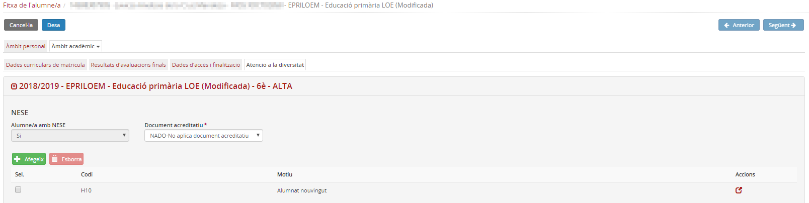
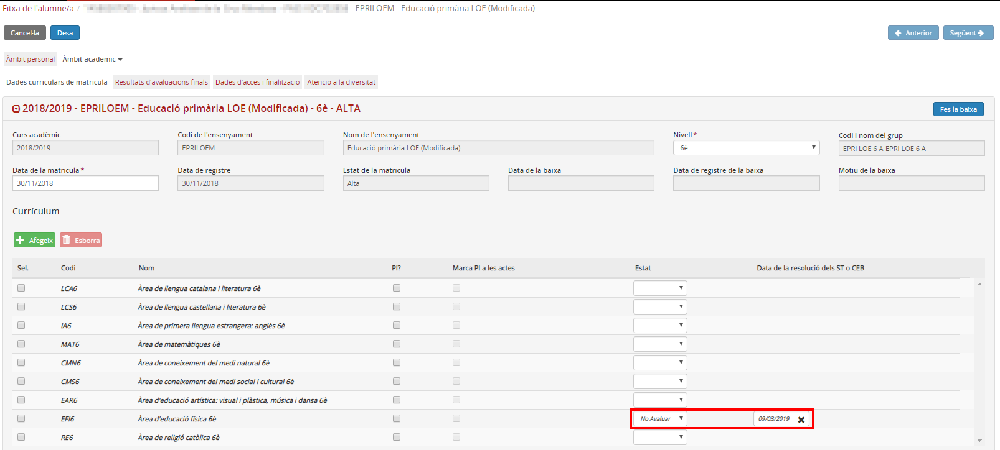

## Especificitats de l'educació primària

Els casos singulars propis de l'educació primària són:

* [Marcar les matèries que no s'avaluen](fda-aa-esp_epri.md#marcar-les-matèries-que-no-savaluen)

### Marcar les matèries que no s'avaluen

Per tal de poder marcar com a "No avaluar" un contingut, **cal demanar la resolució** pertinent als ST o CEB.

- A la pantalla **Atenció a la diversitat** de l'àmbit acadèmic:
  
  
1. Indicar que té un NESE, afegint-hi com a motiu "**H-10 Alumnat nouvingut**":  
  
*Imatge 1 - Indicar que l'alumne/a té una NESE*

2. Indicar que té un PI, afegint-hi com a motiu "**Nouvinguts incorporats tardanament al sistema educatiu**".

3. Si el centre disposa d'**aula d'acollida**, se li ha d'assignar a l'apartat "Mesures i suports disponibles per a tots els centres".

- A la pantalla **Dades curriculars de matrícula**:  
  
4. Triar l'opció **"No avaluar" del desplegable "Estat"** en les matèries corresponents.  
  
5. . Afegir la **data de la resolució** dels ST o CEB:  
*Imatge 2 - Indicar la matèria a no avaluar i la data de la resolució*

