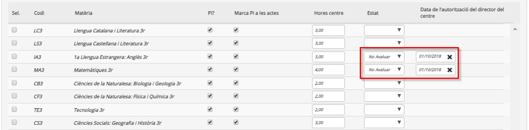
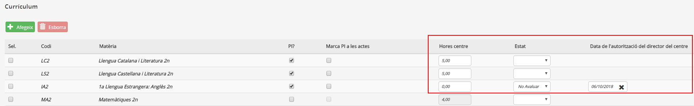
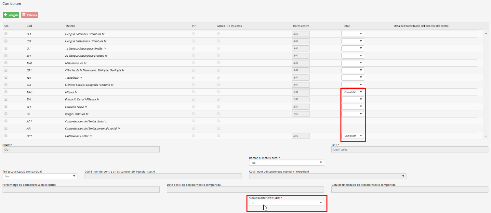
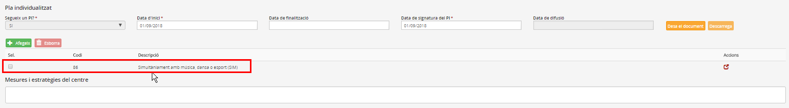

## Especificitats de l'ESO

Els casos singulars propis de l'ESO són:

* [Gestió de matèries optatives](fda-aa-esp_eso.md#gestio-de-materies-optatives)
* [Programes de diversificació curricular](fda-aa-esp_eso.md#programes-de-diversificacio-curricular)
* [Concreció del PI en el currículum de l'alumne](fda-aa-esp_eso.md#concrecio-del-pi-en-el-curriculum-de-lalumne)
* [Simultaneïtat d'estudis](fda-aa-esp_eso.md#simultaneitat-destudis)

### Gestió de matèries optatives

A l'**organització curricular de 1r a 3r d'ESO** hi ha 2h per a les matèries optatives, que el centre pot destinar a:

* **Matèries optatives d'oferta obligatòria** (Segona Llengua Estrangera, Cultura Clàssica, Emprenedoria). En el cas dels alumnes amb una matèria optativa normativa no poden tenir en el currículum optatives de centre
* **Matèries optatives de centre**: En el cas dels alumnes amb una matèria optativa de centre no poden tenir en el currículum optatives normatives.
* **Ampliar la dedicació horària d'alguna matèria del currículum**: Si s'ha ampliat el currículum de les matèries comuns, els alumnes poden no tenir matèries optatives.

Per facilitar la gestió de l'assignació de les matèries optatives, és aconsellable crear un currículum de centre exclusivament amb les matèries optatives.

### Programes de diversificació curricular

### Concreció del PI en el currículum de l'alumne

Si en el detall del PI s'estableix que l'alumne s'ha d'avaluar d'algunes matèries amb criteris diferents a la resta, s'ha d'enregistrar primer al programa el detall del PI, i posteriorment, a la pestanya de currículum, posar un xec a la columna "PI?" i "PI a les actes" als continguts que s'han d'avaluar amb criteris diferents.
  
*Imatge 1 - Identificació a la fitxa de l'alumne avaluat amb criteris diferents en algunes matèries*

Si en el detall del PI de l'alumne s'estableix que aquest no s'ha de qualificar d'alguna de les matèries del currículum, s'ha d'enregistrar primer al programa el detall del PI, i a continuació, a la pestanya de currículum, seleccionar el valor "No avaluar" en aquells continguts que no s'han d'avaluar, i informar de la data en què el director del centre ho autoritza.
  
*Imatge 2 - Detall de les matèries de les quals no s'avalua l'alumne*

Si en el detall del PI s'estableix una dedicació horària diferent a la normativa per a algunes matèries, s'ha d'enregistrar de la manera següent:
  
1. Primer en el detall del PI, a la pestanya **Atenció a la diversitat**
  
2. A la pestanya **Dades curriculars de matrícula** modificar el pes de les matèries a les quals s'incrementa o redueix la docència.

*Imatge 3 - Detall de la modificació horària*

### Simultaneïtat d'estudis

En el cas d'alumnes que simultaniegen estudis, cal:

1. A la pantalla **Dades curriculars de matrícula**:
Primer cal triar l'opció "Sí" del desplegable "Simultaneïtat d'estudis?", i a continuació triar l'opció "Convalidat" del desplegable "Estat" en les matèries corresponents.  
  
*Imatge 4 - Indicar simultaneïtat d'estudis i matèries convalidades*

2. Si escau, a la pantalla **Atenció a la diversitat**:
Indicar que té un PI, afegint-hi com a motiu "Simultaneïtat amb música, dansa o esport (SIM)":  
  
*Imatge 5 - Indicar PI per simultaneïtat*

