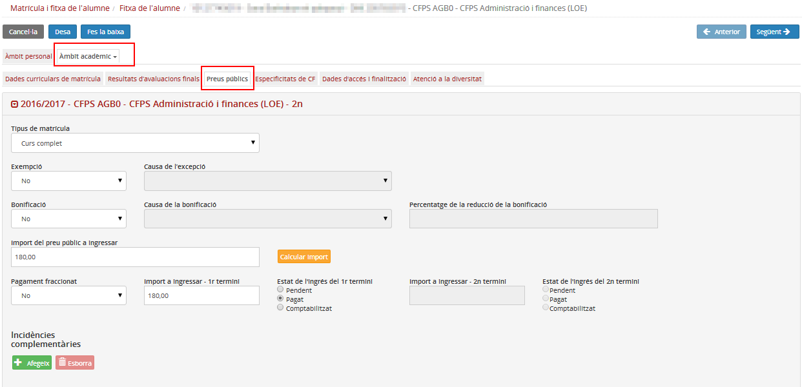
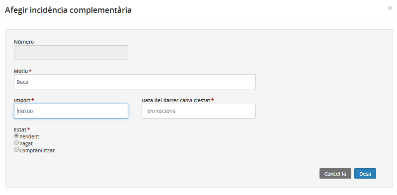

## Preus públics

Les operacions que es poden fer en aquesta pestanya són les següents:

* [Enregistrar el pagament del preu públic](fda-aa-preus_publics.md#enregistrar-el-pagament-del-preu-public)
* [Enregistrar les incidències complementaries](fda-aa-preus_publics.md#enregistrar-les-incidencies-complementaries)

### Enregistrar el pagament del preu públic

Aquesta pestanya només és visible per als ensenyaments afectats per preus públics.

*Imatge 1 - FDA - Àmbit acadèmic - Preus públics*

La matrícula d'un ensenyament amb preus públics no es podrà formalitzar si no s'han emplenat els camps obligatoris de la pestanya "Preus públics". Posteriorment es podran editar sempre que els canvis s'ajustin als controls del sistema.

Els camps són:

* **Tipus de matrícula**

  + Curs complet
  + Per mòduls
* **Exempció**: Sí/No.
* **Causa de l'exempció**: Desplegable que només s'activa si en el camp Exempció hi consta "Sí".
* **Bonificació**: Sí/No.
* **Causa de la bonificació**: Desplegable que només s'activa si en el camp Exempció hi consta "Sí".
* **Percentatge de la reducció de la bonificació**: Aquest camp no és editable i recull la reducció que s'aplicarà al preu públic segons la normativa vigent.
* **Import del preu públic per ingressar**: Camp numèric editable. Clicant al botó  el sistema informa de l'import del preu públic que s'ha d'ingressar, però si el centre ho considera (per exemple un alumne que hagi canviat de centre i ja hagi pagat aquest preu públic) se'n pot canviar el valor.
* **Pagament fraccionat**: Sí/No
* **Import per ingressar - 1r termini**: Camp editable. Si s'ha especificat que no es fracciona el pagament, el valor serà igual que l'import del preu públic per ingressar, si no, l'import del preu públic ha de ser la suma de l'import per ingressar en el 1r termini i el 2n termini.
* **Estat de l'ingrés del 1r termini**: És un camp informatiu, no està enllaçat amb el mòdul de **Gestió econòmica**.

  + Pendent
  + Pagat
  + Comptabilitzat
* **Import per ingressar - 2n termini**: Camp editable i tant sols s'activa si s'ha especificat que el pagament es farà fraccionat. El programa comprova que l'import del preu públic sigui la suma de "l'Import per ingressar 1r termini" i "2n termini".
* **Estat de l'ingrés del 2n termini** : És un camp informatiu, no està enllaçat amb el mòdul de **Gestió econòmica**.

  + Pendent
  + Pagat
  + Comptabilitzat

---

### Enregistrar les incidències complementàries

L'apartat d'incidències complementàries serveix per:

* enregistrar una devolució, per exemple si un alumne ha pagat el preu públic i li comuniquen que té una beca;
* enregistrar un nou pagament, per exemple, per la matriculació d'un nou mòdul.

El procediment a seguir és:

* Clicar al botó .

*Imatge 2 - Afegiment d'incidència complementària*

Si es tracta d'una devolució, el valor del camp Import s'enregistra en negatiu.

Finalment cal emplenar tots els camps obligatoris i desar-ho.

Cal recordar que per mantenir els canvis a la fitxa de l'alumne cal prémer el botó  de la part superior esquerra.