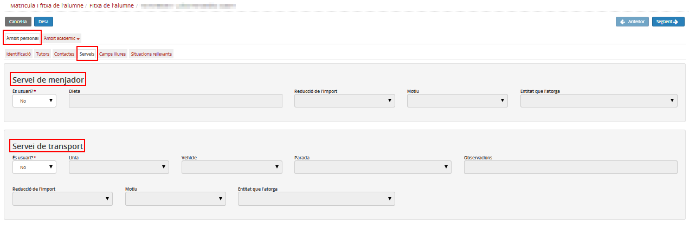
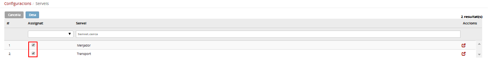
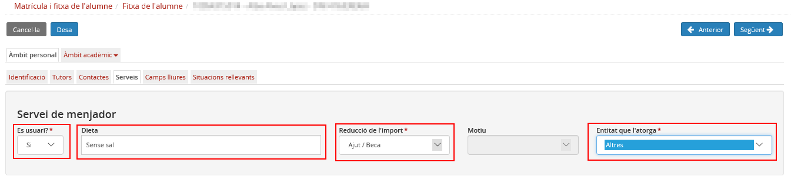
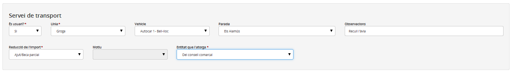

## Serveis

Les dades que es troben en aquesta pestanya corresponen als serveis que utilitza l'alumne i poden ser els següents:

* [Servei de menjador](fda-ap-serveis.md#servei-de-menjador)
* [Servei de transport](fda-ap-serveis.md#servei-de-transport)

**NOTA**: Tant el servei de menjador com el servei de transport es defineixen prèviament al mòdul **Configuracions**.
**Matrícula i FDA > FDA > Àmbit personal > Serveis**

*Imatge 1 - Accés a la pestanya Serveis de la fitxa de l'alumne*

En aquesta pestanya s'especifiquen, si escau, els serveis de menjador i els serveis de transport que fa servir l'alumne.  
Ambdós serveis s'han d'haver seleccionat i definit prèviament al mòdul **Configuracions**.

*Imatge 2 - Configuracions - Serveis*

### Servei de menjador

Si l'alumne utilitza el servei de menjador cal emplenar els camps següents:

* Dieta
* Reducció de l'import
* Motiu
* Entitat que l'atorga

Si l'alumne té una reducció de l'import, cal indicar-ne el motiu; i si té un ajut, cal indicar l'entitat que el proporciona.

*Imatge 3 - FDA - Àmbit personal - Servei de menjador*

---

### Servei de transport

Si l'alumne utilitza el servei de transport, cal emplenar els camps següents:

* Línia
* Vehicle
* Parada
* Observacions
* Reducció de l'import
* Motiu
* Entitat que l'atorga

Cal haver especificat prèviament al mòdul **Configuracions** totes les dades relacionades amb el servei de transport.

*Imatge 4 - Dades del servei de transport de la fitxa de l'alumne*

A les observacions s'hi poden fer anotacions.

Si l'alumne té una reducció de l'import, cal indicar-ne el motiu; i si té un ajut, cal indicar l'entitat que el proporciona.

---