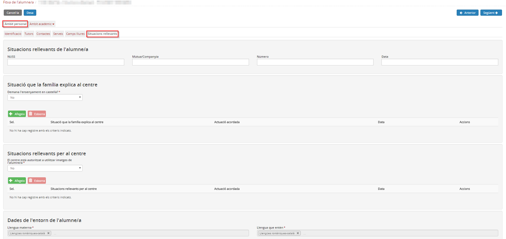

## Situacions rellevants

En aquesta pestanya es desen les dades relacionades amb les situacions rellevants de l'alumne.  
Les dades s'han agrupat en:

* [Situacions rellevants de l'alumne/a](fda-ap-sit_rellevants.md#situacions-rellevants-de-lalumnea)
* [Situacions que la família explica al centre](fda-ap-sit_rellevants.md#situacions-que-la-família-explica-al-centre)
* [Situacions rellevants per al centre](fda-ap-sit_rellevants.md#situacions-rellevants-per-al-centre)
* [Dades de l'entorn de l'alumne/a](fda-ap-sit_rellevants.md#dades-de-lentorn-de-lalumnea)

S'accedeix des de la pestanya **Situacions rellevants** de l'**Àmbit personal** de la fitxa de l'alumne.

*Imatge 1 - Situacions rellevants de la fitxa de l'alumne*

### Situacions rellevants de l'alumne/a

En aquest primer bloc es pot emplenar el número d'usuari a la Seguretat Social (NUSS), o bé les dades de la mútua/companyia, el número i la data.
  
  

---

### Situacions que la família explica al centre

Aquí s'hi poden afegir situacions rellevants que la família informi al centre i que es considerin oportunes tenir-ne constància.

Cal especificar quan la família demani l'ensenyament en castellà.

Per especificar una situació rellevant, cal prémer el botó  que hi ha sobre la taula.
En una nova finestra cal emplenar els camps següents:

* Situació
* Actuació acordada
* Data

Els camps amb asterisc (\*) són obligatoris.  
En prémer el botó DESA, aquesta situació s'afegirà a la taula.
  
  

---

### Situacions rellevants per al centre

Cal especificar en aquest apartat si la família autoritza al centre a utilitzar imatges de l'alumne/a, seleccionant l'opció del desplegable.

A vegades es poden produir determinades situacions relacionades amb l'alumne que el centre pot determinar que han de quedar enregistrades.  
És en aquest apartat on es poden fer constar aquests aspectes, de la mateixa manera que s'explica a l'apartat anterior (situacions que la família explica al centre).
  
  

---

### Dades de l'entorn de l'alumne/a

En aquest bloc cal especificar les llengües maternes i les llengües que entén l'alumne.
Per fer-ho cal clicar a sobre el quadre de text. S'obrirà una finestra amb els camps:

* Família lingüística
* Llengua
* Altres (cal emplenar aquest camp quan al camp anterior s'hi especifiqui "Altres").

---