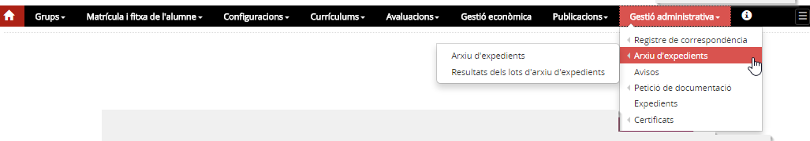
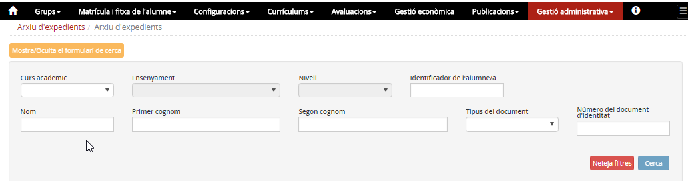
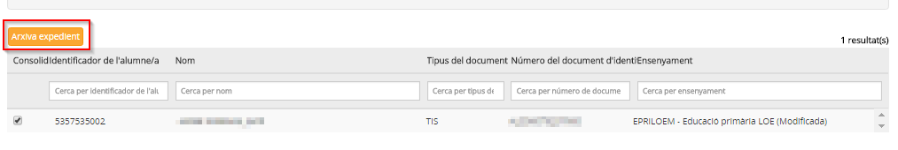
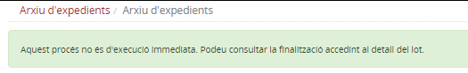
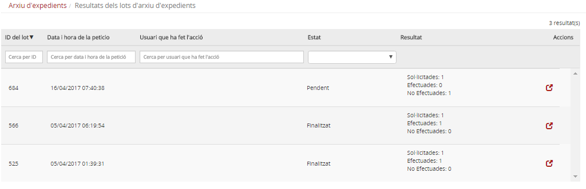

# Arxiu d'expedients

* [Què és](arx_expe.md#que-es)
* [Com s’hi accedeix](arx_expe.md#com-shi-accedeix)
* [Quines operacions es poden fer](arx_expe.md#quines-operacions-es-poden-fer)

  + [Cercar alumnes](arx_expe.md#cercar-alumnes)
  + [Crear un lot d'arxiu d'expedients](arx_expe.md#crear-un-lot-darxiu-dexpedients)
  + [Consultar el resultat d'un lot d'arxiu d'expedients](arx_expe.md#consultar-el-resultat-dun-lot-darxiu-dexpedients)

### Què és

Arxivar un expedient és un procés que prepara la informació acadèmica de l'alumne a fi i efecte de poder traspassar la custòdia a un altre centre o de deixar-la consolidada quan quan l’alumne finalitza un ensenyament (infantil, primària, ESO o batxillerat).
  
  
Aquest procés només arxiva la informació acadèmica (resultats de l'avaluació final, dades d'accés i finalització, i atenció a la diversitat) d'un o més nivells si l'alumne **no té cap matrícula en estat "Alta"**.
  
  
Això fa que, habitualment, caldrà arxivar la informació dels alumnes que finalitzen un ensenyament, i també d'aquells alumnes que marxen del centre tot i no haver finalitzat l'ensenyament.
  
  
No són objecte d'arxiu els resultats de les avaluacions parcials.

---

### Com s'hi accedeix

S'accedeix a través del mòdul **Gestió administrativa**.
*Imatge 1 - Accés al menú Arxiu d'expedients*
  

---

### Quines operacions es poden fer

Aquest menú inclou dues opcions:

* Arxiu d'expedients
* Resultats dels lots d'arxiu d'expedients

#### Arxiu d'expedients

Per arxivar informació a l'expedient d'uns alumnes cal seguir dos passos:

1. Cercar alumnes
2. Crear un lot d'arxiu d'expedients

##### Cercar alumnes

En accedir es mostra la pantalla de cerca.
Es pot cercar un alumne concret, ja sigui amb l'**IdRALC** de l'alumne o amb el **nom i cognoms**, o bé es pot cercar els alumnes d'un **ensenyament i nivell**.
  
  
*Imatge 2 - Cercar alumnes*

Un cop introduïts els criteris de cerca s'ha de clicar el botó [**Cerca**], així es mostrarà la relació d'alumnes que compleixen els criteris indicats.

##### Crear un lot d'arxiu d'expedients

Per procedir a arxivar els expedients dels alumnes només cal seleccionar els alumnes i clicar el botó [**Arxivar expedients**]:
  
  
*Imatge 3 - Resultat de la cerca*
  
  
Aquest procés es realitza en diferit, és a dir, queda preparat el lot d'arxiu d'expedients que es processarà tan aviat com l'aplicació disposi dels recursos necessaris per a fer-ho. Per aquest motiu es mostra un avís:
  
  
*Imatge 4 - Avís de lot preparat*

#### Consultar el resultat d'un lot d'arxiu d'expedients

Des del menú Resultats dels lots d'arxiu d'expedients es pot consultar en qualsevol moment l'estat dels lots d'arxiu que s'hagin preparat:
  
  
*Imatge 5 - Estat dels lots preparats*
  
  
A la pantalla sempre es mostra l'estat del lot que pot ser **Pendent** o **Finalitzat**, així com un petit resum del lot:

* **Sol·licitades**: nombre d'expedients que s'ha demanat arxivar
* **Efectuades**: nombre d'expedients arxivats
* **No efectuades**: nombre d'expedients que no s'han pogut arxivar

Si el lot ja està **Finalitzat**, accedint-hi es mostrarà la relació d'alumnes dels quals no s'ha pogut arxivar l'expedient.
  
  
Quan l'arxiu d'un lot està finalitzat, els resultats de les avaluacions finals de l'ensenyament han estat incorporats a l'expedient de l'alumne i ja es poden consultar també des de l'opció del menú **Expedients** del mòdul **Gestió administrativa**.

---