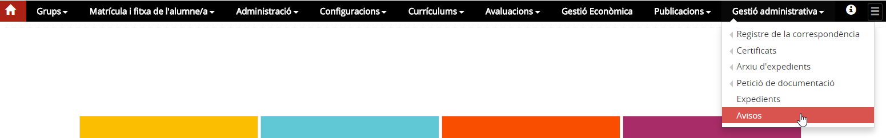
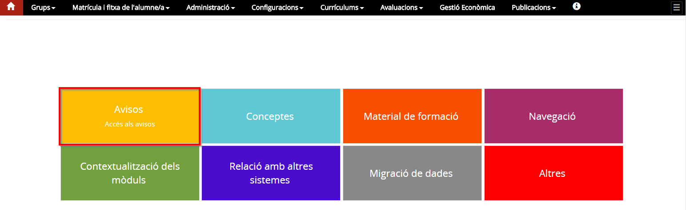
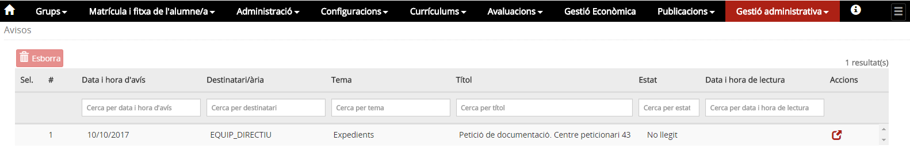
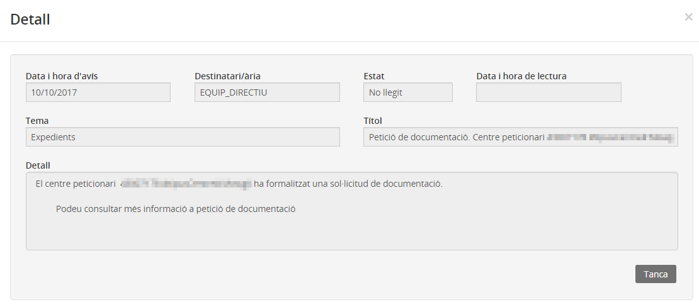

# Avisos

* [Què són](avisos.md#que-son)
* [Com s’hi accedeix](avisos.md#com-shi-accedeix)
* [Quines operacions s'hi poden fer](avisos.md#quines-operacions-shi-poden-fer)

  + [Llegir un avís](avisos.md#llegir-un-avis)
  + [Esborrar un avís](avisos.md#esborrar-un-avis)

### Què són

Els avisos són les notificacions que emet l'aplicació, que permeten assabentar-se ràpidament de les accions més rellevants per tal de poder gestionar-les.
  

---

### Com s'hi accedeix

S'hi accedeix seleccionant l'opció del menú **Avisos** del mòdul de **Gestió administrativa**:

 *Imatge 1 - Accés al menú Avisos*

L'aplicació, a més a més, disposa d'un accés directe des de la pantalla principal que permet visualitzar fàcilment si hi ha algun avís.

*Imatge 2 - Accés al menú Avisos*

En accedir-hi es mostra la relació d'avisos que ha rebut el centre i els filtres per poder fer la cerca, si escau.

*Imatge 3 - Relació d'avisos i filtres*

Els filtres són els següents:

* Data i hora d'avís
* Destinatari/ària
* Tema
* Títol
* Estat: "Llegit" / "No llegit"
* Data i hora de lectura

---

### Quines operacions s'hi poden fer

A la pantalla "Avisos" s'hi poden fer les següents actuacions:

1. Llegir un avís
2. Esborrar un avís

L'acció de marcar com a visualitzat un avís i l'acció d'esborrar-lo només està habilitada si l'usuari ha accedit amb el rol corresponent al qual s'adreça l'avís.

#### Llegir un avís

Per llegir un avís, cal clicar la icona  i a continuació s'obrirà una finestra emergent que mostra el detall de cada avís.

*Imatge 4 - Detall de l'avís*

#### Esborrar un avís

Per esborrar un avís que ja s'ha llegit, s'ha de seleccionar i clicar el botó 

