# Certificats

* [Què són](certif.md#que-son)
* [Com s’hi accedeix](certif.md#com-shi-accedeix)
* [Tipus de certificats](certif.md#tipus-de-certificats)

  + [Certificat de qualificacions](certif.md#certificat-de-qualificacions)
  + [Certificat de matrícula](certif.md#certificat-de-matricula)
  + [Certificat d'haver estat matriculat](certif.md#certificat-dhaver-estat-matriculat)
  + [Certificat genèric d'alumnes](certif.md#certificat-generic-dalumnes)
  + [Certificat de personal](certif.md#certificat-de-personal)
  + [Certificat genèric](certif.md#certificat-generic)
  + [Registre de certificats](certif.md#registre-de-certificats)

### Què són

Esfer@ ofereix una eina per generar certificats i registrar-los.
  
  

---

### Com s'hi accedeix

Per elaborar un certificat s'ha d'accedir al menú **Certificats** del mòdul de **Gestió administrativa**.
  
  
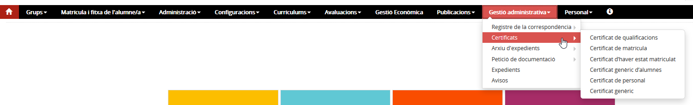*Imatge 1 - Accés al menú certificats*
  
  

---

### Tipus de certificats

L'aplicació ofereix diversos tipus de certificats, uns **genèrics**, que permeten personalitzar-los amb el contingut necessari i altres més **habituals** que incorporen continguts estàndards.
  
  
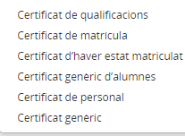*Imatge 2 - Tipus de certificats*
  
  
Per elaborar un certificat sempre s'ha de començar fent la **cerca** de la persona (alumne/a o personal del centre) sobre qui es vol emetre un certificat.
  
  
En el cas de certificats dels alumnes del centre la pantalla de cerca incorpora els següents camps:

* Identificador de l'alumne/a
* Nom
* Primer cognom
* Segon cognom
* Tipus de document d'identitat
* Número del document d'identitat
* Ensenyament
* Nivell
* Curs acadèmic

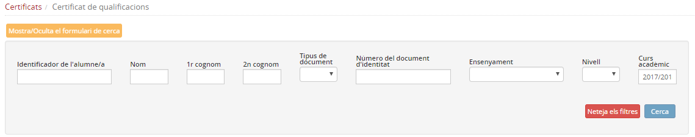*Imatge 3 - Cerca d'alumnes*
  
  
Es pot utilitzar el cercador amb la combinació de camps que es desitgi. Un cop determinats els criteris de cerca cal prémer el botó [**Cerca**], a la part inferior de la pantalla es mostraran els resultats de la cerca:
  
  
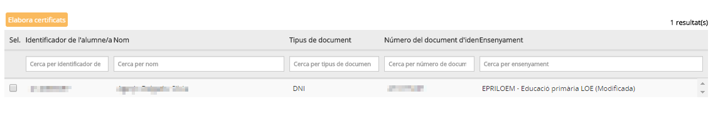*Imatge 4 - Resultat de la cerca*
  
  
A continuació cal marcar l'alumne o alumnes que es necessiti i prémer el botó [**elabora certificats**]
  
Els certificats es generen en format **RTF**, la qual cosa permet ajustar el format i el contingut a les necessitats, obrint-lo amb el Word o amb l'Open Office.

#### Certificat de qualificacions

Per elaborar un certificat de qualificacions cal cercar l'alumne i l'ensenyament del qual es volen certificar les qualificacions.
  
  
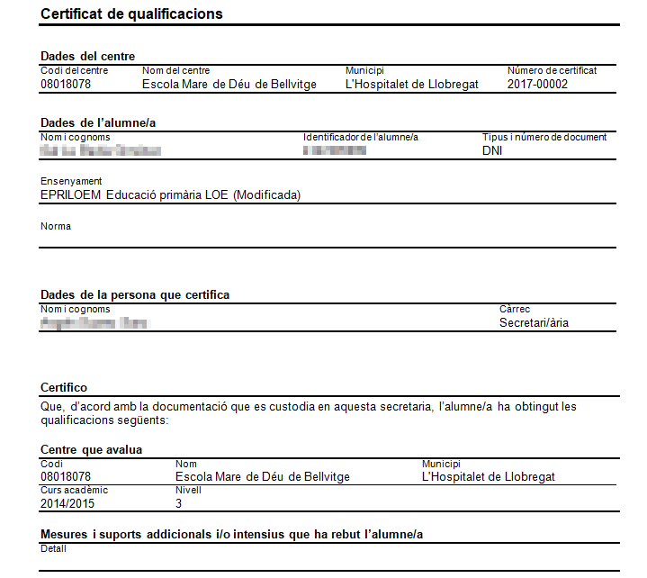*Imatge 5 - Certificat de qualificacions: primera part*
  
  
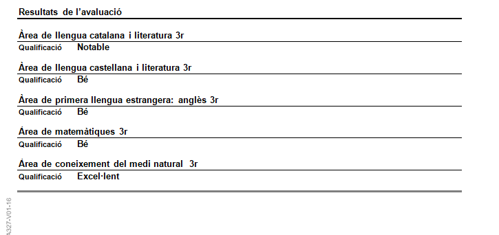*Imatge 6 - Certificat de qualificacions: segona part*

#### Certificat de matrícula

És un document que certifica que l'alumne/a té una matrícula al centre en estat **Alta**:
  
  
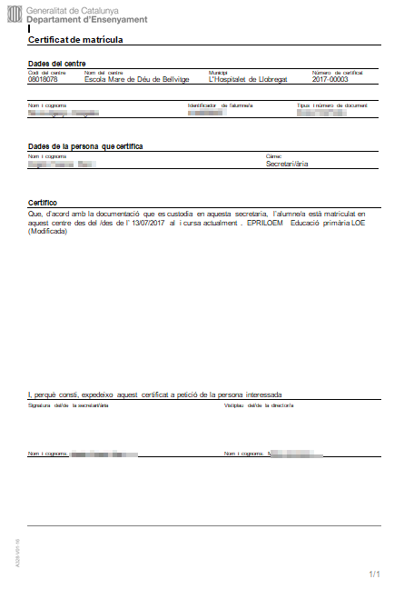*Imatge 7 - Certificat de matrícula*

#### Certificat d'haver estat matriculat

Es tracta d'un document que certifica que un alumne va tenir una matrícula activa en el centre tot i que, en el moment d'emetre el certificat, ja no la tingui.
  
  
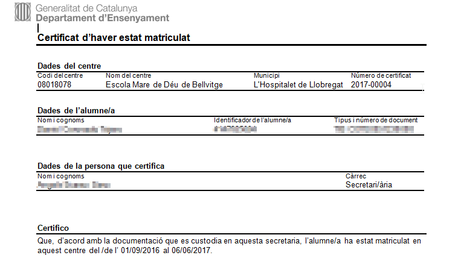*Imatge 8 - Certificat d'haver estat matriculat*

#### Certificat genèric d'alumnes

És un model de certificat que segueix el model estàndard de certificats de centre, que incorpora les dades identificatives de l'alumne/a seleccionat però que requereix de l'usuari l'edició del contingut del certificat.
  
  
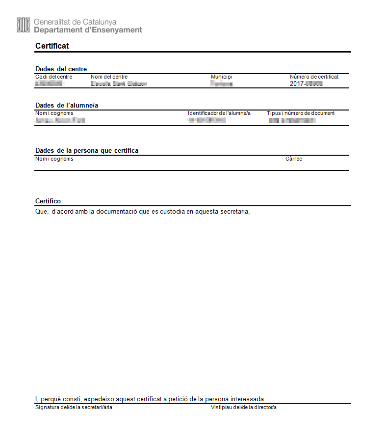*Imatge 9 - Certificat genèric d'alumnes*

#### Certificat de personal

En aquest cas no es presenta pantalla de cerca. En accedir-hi es mostra la relació de personal del centre des de la qual es poden seleccionar la persona o persones sobre les quals es vol elaborar un certificat.
  
En aquest cas, l'usuari també ha de redactar el contingut del certificat.
  
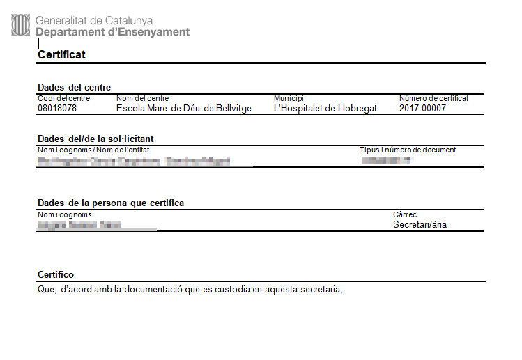*Imatge 10 - Certificat de personal*

#### Certificat genèric

És un model de certificat que permet elaborar-ne un d'un exalumne/a, per exemple, del qual no consten a Esfer@ les seves dades.
  
En aquest cas cal, en primer lloc, informar a l'aplicació les dades de la persona:
  
  
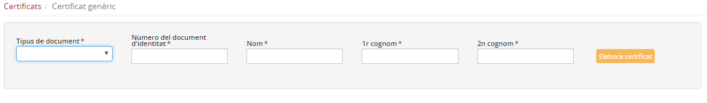*Imatge 11 - Introducció de les dades de la persona*
  
  
El certificat que es genera també s'haurà de completar amb el contingut que es necessiti.
  
  
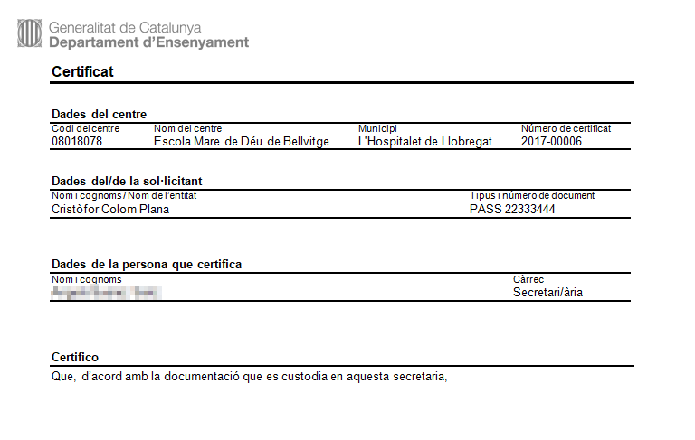*Imatge 12 - Certificat genèric*

#### Registre de certificats

El Registre de certificats és una funcionalitat que permet consultar i exportar el registre dels certificats generats pel centre.

Per realitzar una consulta, es pot cercar un certificat concret fent ús dels filtres emplenant alguns dels camps, o bé es pot realitzar una cerca general on apareixeran tots els certificats generats fins al moment:

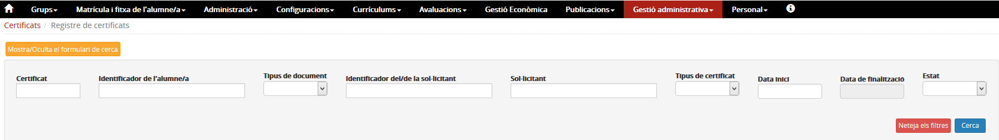*Imatge 13 - Filtres de cerca del Registre de certificats*

Cal destacar el botó “Mostra/oculta el formulari de cerca”, i el botó “Neteja els filtres” que buida els filtres utilitzats en l'anterior cerca.

Una vegada s'ha realitzat la cerca, a la capçalera de les columnes hi ha el nom del camp. A sota, hi ha uns filtres per buscar informació detallada.

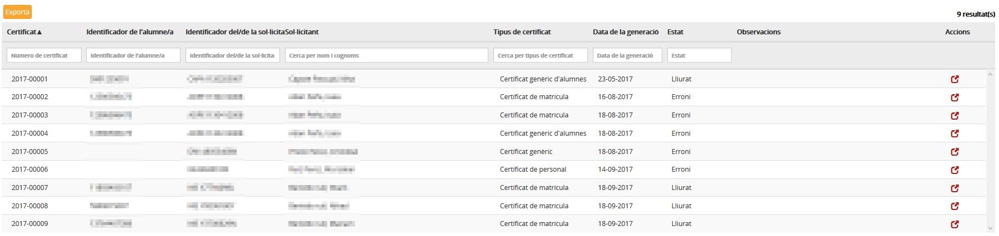*Imatge 14 - Resultat de la cerca de certificats*

Al final de cada registre hi ha la icona , que permet accedir al detall del registre.

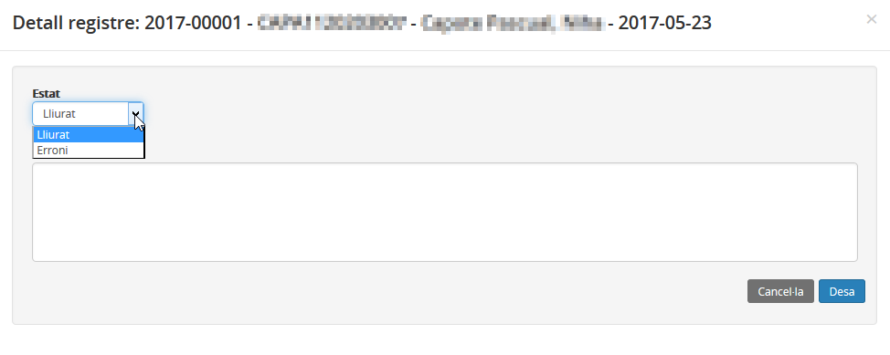*Imatge 15 - Accés al detall del registre*

En aquesta pantalla es poden adjuntar observacions. També es pot modificar l'estat del certificat, que pot ser "Lliurat" o "Erroni". En cas que sigui "erroni", el número de certificat es manté i el registre no s'esborra.

Amb el botó “Exporta” es genera un arxiu de tipus "csv" amb la selecció dels certificats cercats.

---