# Expedients

* [Què són](exped.md#què-són)
* [Com s’hi accedeix](exped.md#com-shi-accedeix)
* [Quines operacions es poden fer](exped.md#quines-operacions-es-poden-fer)

  + [Consultar l'expedient](exped.md#consultar-lexpedient)
  + [Introduir diligències a l'expedient](exped.md#introduir-diligències-a-lexpedient)
  + [Obtenir documents](exped.md#obtenir-documents)

### Què són

L'expedient d'un alumne és el conjunt d'informacions acadèmiques de l'alumne en relació a un ensenyament.
  
Un alumne tindrà tants expedients com ensenyaments cursi o hagi cursat, així, habitualment un alumne pot tenir els expedients de:

* Educació Infantil, segon cicle
* Educació Primària LOE
* Educació Primària LOEM
* …

---

### Com s'hi accedeix

S'hi accedeix seleccionant l'opció **Expedients** del mòdul de **Gestió administrativa**:

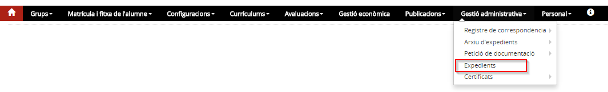*Imatge 1 - Accés al menú Expedients*

En accedir-hi es mostra un formulari de cerca de l'alumne. L'alumne es pot cercar per qualsevol dels camps indicats o per un conjunt de camps.

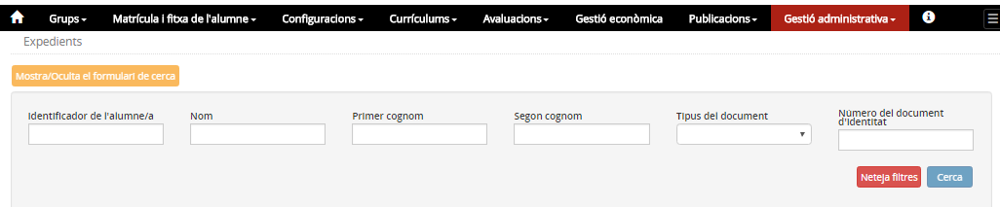*Imatge 2 - Formulari de cerca*

En clicar el botó [**Cerca**] es mostrarà el resultat:

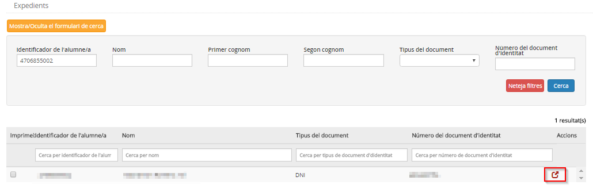*Imatge 3 - Resultat de la cerca*

Clicant la icona s'accedeix al detall de l'expedient.

---

### Quines operacions es poden fer

A l'expedient d'un alumne s'hi poden fer les següents actuacions:

1. Consultar l'expedient
2. Introduir diligències a l'expedient
3. Obtenir documents: Expedient acadèmic i Historial acadèmic

#### Consultar l'expedient

S'accedeix a una versió reduïda de la fitxa de l'alumne en què només es mostren algunes pestanyes totes elles en mode de consulta:

* **Identificació**:

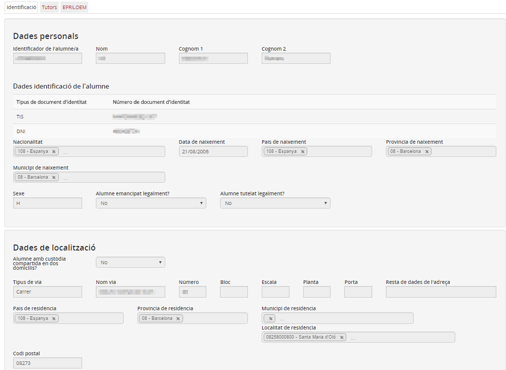*Imatge 4 - Identificació de l'alumne/a*

* **Tutors**:

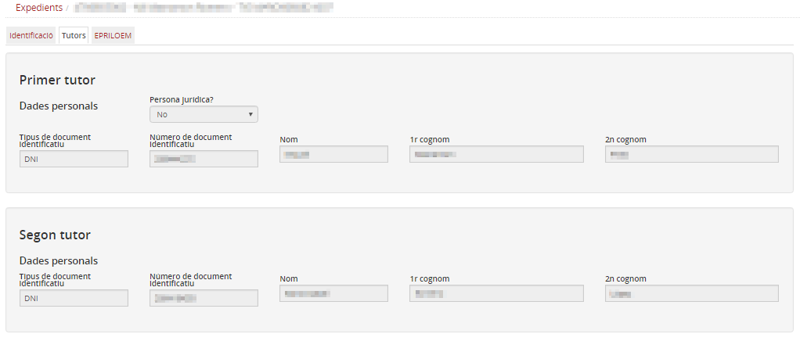*Imatge 5 - Dades dels tutors*

* **Ensenyament**: es mostrarà una pestanya per a cadascun dels ensenyaments que hagi cursat l'alumne. Actualment només es mostra l'ensenyament on està matriculat l'alumne, més endavant es mostraran també els ensenyaments cursats anteriorment.

En aquesta pantalla es mostren tres subpestanyes:

* **Resultats de les avaluacions finals**
* **Dades d'accés i finalització**
* **Atenció a la diversitat**

##### Resultats de les avaluacions finals

Per a cada curs acadèmic de l'ensenyament seleccionat es mostren els resultats de les avaluacions finals:

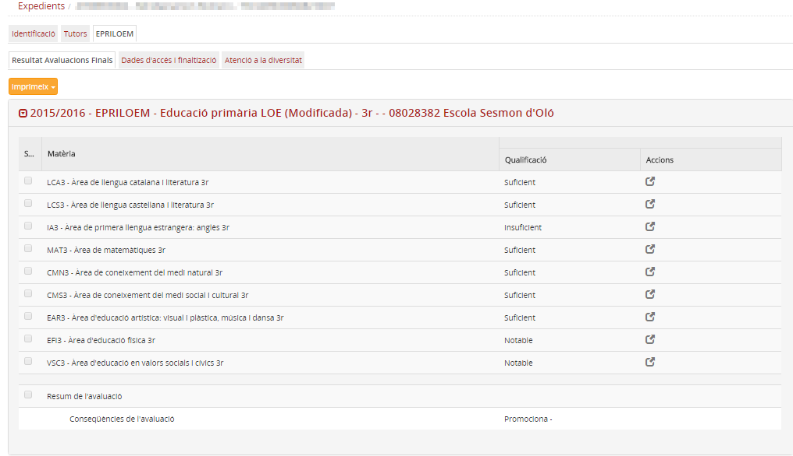*Imatge 6 - Resultats de les avaluacions finals*

#### Introduir diligències a l'expedient

Els resultats de les avaluacions mai es poden modificar directament. Si es donés el cas que calgui fer alguna modificació a una o més dades, seria necessari introduir diligències.

Una **diligència** és un document que es produeix per a acreditar un tràmit administratiu, en aquest cas, constatar la modificació d'una qualificació.

  
  
Hi ha dos tipus de diligències:

* **Diligències a l'acta**: és una modificació d'una qualificació, que s'introdueix a una qualificació quan l'avaluació final a la qual correspon ha estat realitzada al propi centre en el sistema Esfer@.

Les diligències a l'acta s'introdueixen des de l'apartat de **Resultat de les avaluacions finals** de l'àmbit acadèmic de la Fitxa de l'alumne.

* **Diligències a l'expedient**: és una modificació d'una qualificació, que s'introdueix a una qualificació quan l'avaluació final a la qual correspon ha estat realitzada per un altre centre o al propi centre però no al sistema Esfer@ (qualificacions migrades des de SAGA).

Les diligències a l'expedient s'enregistren des del menú **Expedient** de Gestió administrativa.
  
  
Per introduir una diligència a una qualificació de l'expedient d'un alumne, s'ha de clicar la icona que hi ha al costat de la qualificació que s'ha de modificar. Llavors s'obrirà una finestra emergent on s'enregistrarà la nova qualificació:

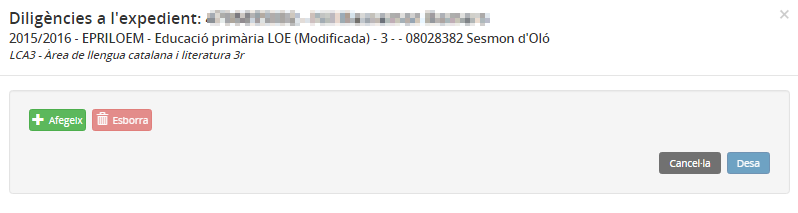*Imatge 7 - Diligència a l'expedient*
  
  
Per introduir la diligència cal clicar el botó [**Afegeix**], posar la nova qualificació i acabar clicant el botó [**Desa**]:

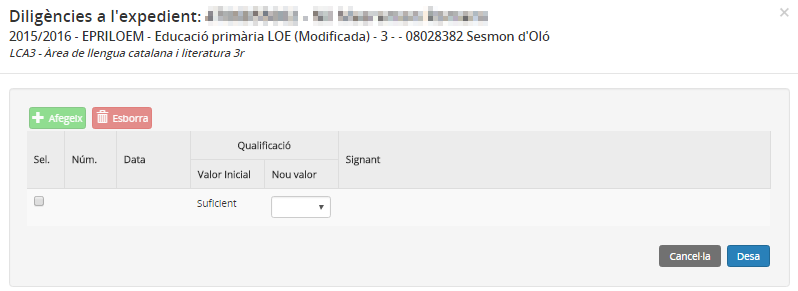*Imatge 8 - Desar diligència*
  
  
Es poden enregistrar tantes diligències com sigui necessari. A una mateixa qualificació s'hi pot enregistrar més d'una diligència.
  
  
Una diligència la pot enregistrar el personal de suport administratiu, però no és definitiva, resta "pendent de signar":
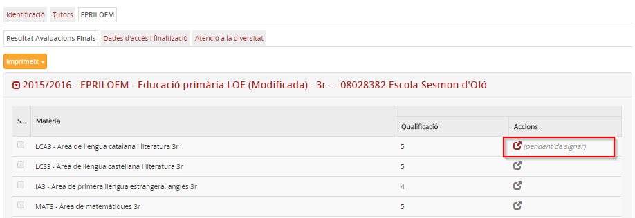*Imatge 9 - Diligència pendent de signar*
  
  
Una diligència només la pot signar el secretari o director del centre. Quan s'accedeix a una diligència de l'expedient d'un alumne amb uns dels rols autoritzats, es mostra també la icona per signar-la:
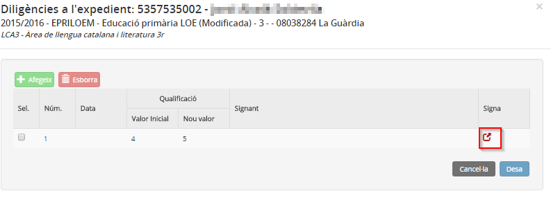*Imatge 10 - Signar una diligència*
  
  
En signar-la quedarà enregistrat també el nom de la persona que l'ha signada:
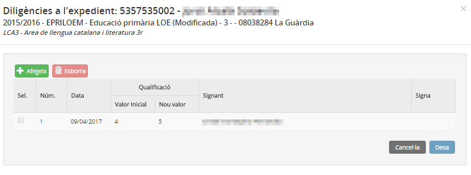*Imatge 11 - Diligència signada* 
  
  

Una diligència no està totalment efectuada fins que no estigui signada.  
La diligència es pot esborrar mentre no estigui signada.

  
  
El botó [**Imprimeix**] que es mostra damunt dels resultats acadèmics permet imprimir les diligències.

##### Atenció a la diversitat

Mostra les mesures i suports que ha tingut l'alumne a l'ensenyament i nivell seleccionat:
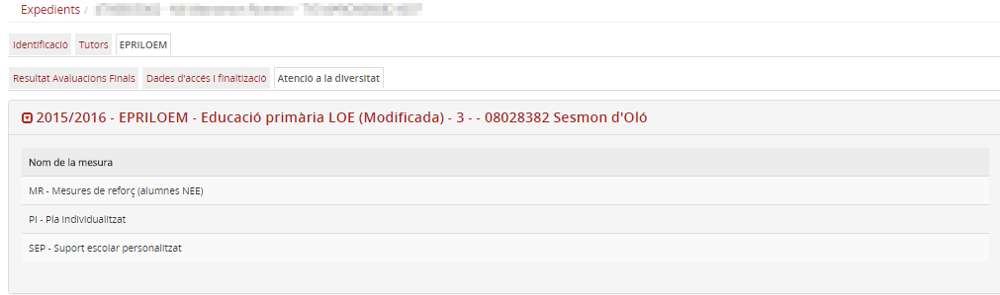*Imatge 12 - Atenció a la diversitat*

#### Obtenir documents

##### Dades d'accés i finalització

En aquesta pantalla es mostra la informació relacionada amb l'accés de l'alumne a l'ensenyament i la finalització de l'ensenyament, si és el cas:
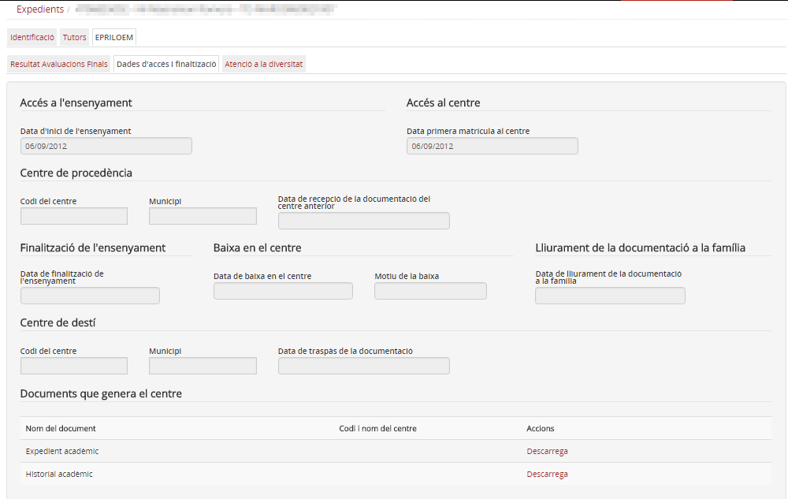*Imatge 12 - Dades d'accés i finalització* 
  
  
També es poden obtenir els documents:

* **Expedient acadèmic**
* **Historial acadèmic**

des de l'acció "**Descarrega**"

---