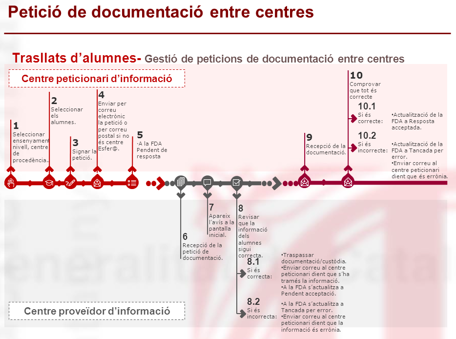
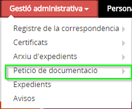

# Petició de la custòdia (de l'expedient de l'alumne/a)

* [Què és](peticio_documentacio.md#què-és)
* [Com s’hi accedeix](peticio_documentacio.md#com-shi-accedeix)
* [Quines operacions es poden fer](peticio_documentacio.md#quines-operacions-es-poden-fer)

  + [Petició de documentació](peticio_documentacio/peticio_doc.md)
  + [Resposta petició de documentació](peticio_documentacio/respota_peticio_docum.md)
  + [Recepció de documentació](peticio_documentacio/recepcio-docum.md)
  + [Gestió manual](peticio_documentacio/gestio_manual.md)

## Què és

Cada alumne/a té un **únic expedient per a un ensenyament**. L'expedient recull la informació acadèmica de l'alumne de l'ensenyament corresponent. El centre on inicia l'ensenyament custodia l'expedient de l'alumne/a i l'anirà completant amb els resultats acadèmics de cada nivell fins a finalitzar l'ensenyament. Llavors l'expedient quedarà tancat.
  
Quan un centre ha matriculat un alumne/a que ja havia iniciat l'ensenyament en un altre centre, per tant ja té expedient, ha de sol·licitar l'expedient al centre del que procedeix.
  
Quan un alumne es trasllada d'un centre a un altre i ambdós estan gestionats amb Esfer@ parlem de **Traspàs de custòdia de l'expedient**. En aquest cas tot el procediment es realitza directament a l'aplicació.
  
En aquest procés intervenen dos centres:

* Centre del que ha marxat l'alumne: centre **proveïdor**, el que té la custòdia de l'expedient (en endavant **Centre A**).
* Centre on s'ha matriculat l'alumne: centre **peticionari**, el que sol·licita la custòdia de l'expedient (en endavant **Centre B**).

Cadascun dels centres ha de fer la seva gestió en aquest procediment, que bàsicament consta de tres passos:

1. El centre B efectua la **petició de documentació** al centre A.
2. El centre A fa la **tramesa de la documentació** al centre B.
3. El centre B **rep la tramesa**.

Per tant, el procés l'ha d'iniciar el centre B, el centre que demana la custòdia de l'expedient.

---

## Com s'hi accedeix

S'accedeix a través de l'opció del menú **Petició de documentació** del mòdul **Gestió administrativa**.
*Imatge 1 - Accés al menú Petició de documentació*
  

---

## Quines operacions es poden fer

Donat que no tots els centres de procedència o destinació estan gestionats amb Esfer@, es poden donar diverses situacions depenent de l'eina de gestió dels centres que intervenen en el trasllat de l'alumne:

1. L'alumne es trasllada d'un centre a un altre ambdós gestionats amb **Esfer@**.
2. L'alumne es trasllada d'un centre **Esfer@** a un centre **NO Esfer@**.
3. L'alumne es trasllada d'un centre **NO Esfer@** a un centre **Esfer@**.

En cada cas la forma d'actuació serà diferent, tal com presenta la taula següent:

Més informació:

* [Petició de documentació](peticio_documentacio/peticio_doc.md)
* [Resposta petició de documentació](peticio_documentacio/respota_peticio_docum.md)
* [Recepció de documentació](peticio_documentacio/recepcio-docum.md)
* [Gestió manual](peticio_documentacio/gestio_manual.md)

Per a més informació del procés entre dos centres Esfer@, [visualitzeu el vídeo enllaçat](https://docs.google.com/presentation/d/15MTCSqK4A_szbiXJBVMIqdTz5Bp1J1UW3wlh8S-Y-CY/edit).

  
  

---