# Gestió manual

* [Què és](gestio_manual.md#què-és)
* [Com s’hi accedeix](gestio_manual.md#com-shi-accedeix)
* [Quines operacions es poden fer](gestio_manual.md#quines-operacions-es-poden-fer)

  + [Actuacions prèvies](gestio_manual.md#actuacions-prèvies)
  + [Enregistrar les dades](gestio_manual.md#enregistrar-les-dades)
  + [Revisar les dades i signar la documentació](gestio_manual.md#revisar-les-dades-i-signar-la-documentació)

## Què és

Aquesta funcionalitat permet completar l'expedient electrònic de l'alumne/a dins de l'aplicació amb les dades d'escolarització anteriors cursades a altres centres (no gestionats amb Esfera).
  

## Com s’hi accedeix

Accedir a la funcionalitat **Gestió manual**:

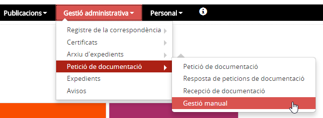*Imatge 1 - Accés al menú Gestió manual*

## Quines operacions es poden fer

### Actuacions prèvies

Per tal de poder tenir disponible aquesta funcionalitat, cal que s'hagin **informat prèviament** les **dades del centre de procedència**  a la pestanya **[Dades d'accés i finalització](../../fda/fda-aa-acces_i_fi.md)** de l'àmbit acadèmic al mòdul Matrícula i fitxa de l'alumne/a, i que s'hagi **[formalitzat la petició de custòdia corresponent](peticio_doc.md#formalitzat-la-petició-de-custòdia-corresponent)**.
  
  
En el moment en el qual s'enregistra una petició manual de documentació, **automàticament l'aplicació arxiva l'expedient** de l'alumne/a, per la qual cosa cal esperar a rebre l'avís assegurant que s'ha arxivat correctament l'expedient de l'alumne/a o comprovant-ho a l'opció del menú **Resultats dels lots d'arxiu d'expedients**.
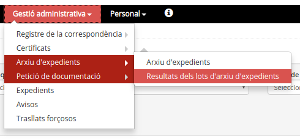*Imatge 2 - Accés al menú Resultat dels lots d'arxiu d'expedients*
  
  

### Enregistrar les dades

1. Entrar les dades del centre proveïdor i l'ensenyament.
  
  
2. Prémer el botó [**Cerca**]
  
  
3. Prémer la icona d'accés al detall de l'alumne/a
  
  
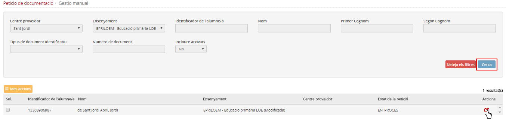*Imatge 3 - Accés al detall de l'alumne/a* 
  
  
4. Actualitzar el camp "Data d’inici de l’ensenyament" per poder introduir dades dels cursos anteriors
  
  
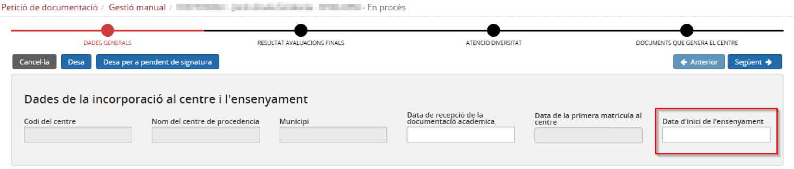*Imatge 4 - Finestra emergent Dades de l'escolarització* 
  
  
5. Prémer el botó [**Afegeix**] per obrir la finestra emergent "**Dades de l'escolarització**"
  
  
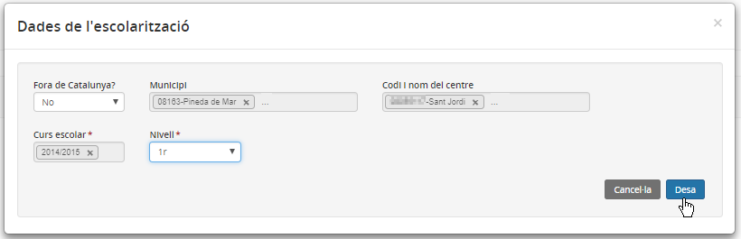*Imatge 5 - Finestra emergent Dades de l'escolarització* 
  
  
6. Emplenar les de dades de l'escolarització
  
  
7. Prémer el botó [**Desa**]
  
  
Repetir aquest procés tantes vegades com sigui necessari.
  
  

\* Es poden entrar diferents centres.  
\* Es pot posar més d’un centre per curs.

  
  
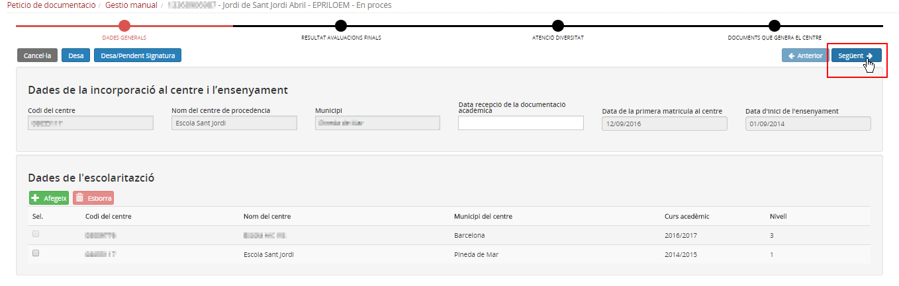*Imatge 6 - Registre de dades de l'escolarització* 
  
  
8. Prémer el botó [**Següent**]
  

En el cas d'**alumnes provinents d’altres comunitats**, si les qualificacions no corresponen a les del sistema català (literals d’assoliment), només s’ha d’enregistrar el nom del centre de procedència.   
Cal annexar el document rebut en paper tal com s’indica al pas 18.
  
A l'avaluació final de 4t d'ESO, en el cas que l'alumne/a superi l'etapa, caldrà calcular a mà la qualificació d'etapa i enregistrar-la a Esfer@.

9. Desplegar el curs a completar
  
  
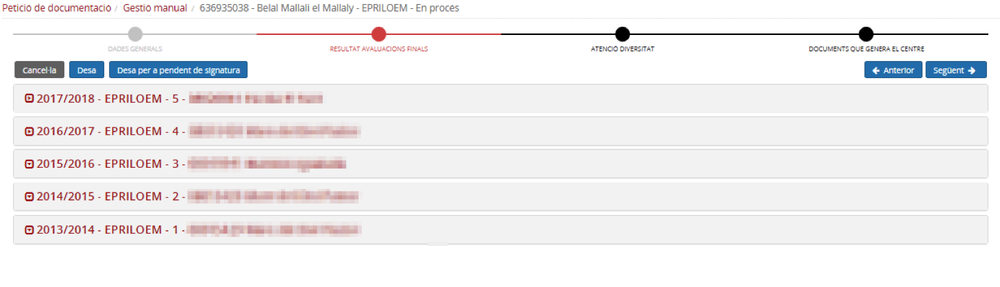*Imatge 7 - Accés al detall del curs* 
  
  
10. Prémer el botó [**Afegeix**] per obrir la finestra emergent "**Resultats d'avaluacions finals**"
  
  
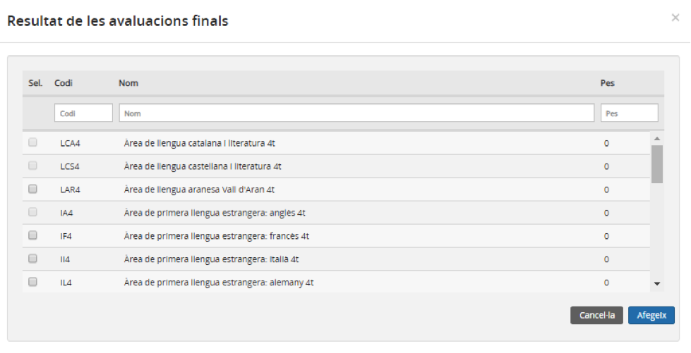*Imatge 8 - Accés al detall del curs* 
  
  
11. Seleccionar el currículum i prémer el botó [**Afegeix**]
  
  
12. Seleccionar els continguts i prémer el botó [**Afegeix**]
  
  
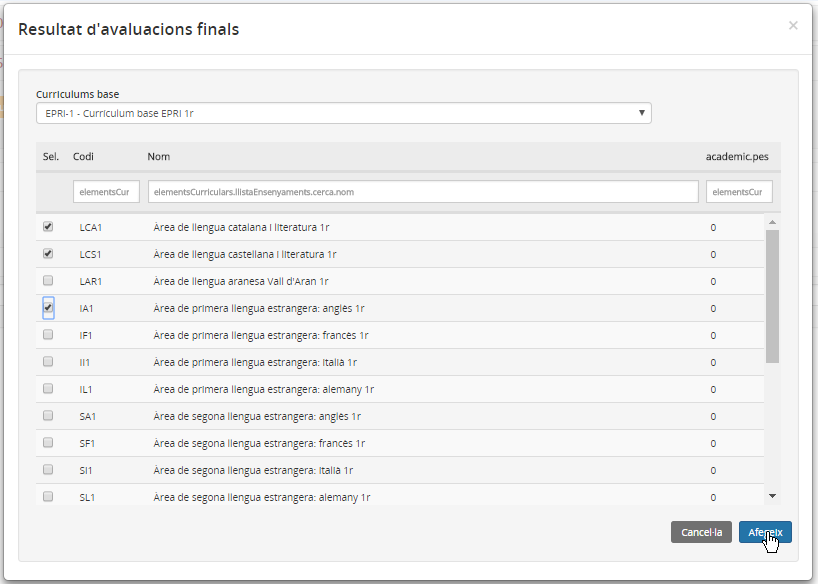*Imatge 9 - Selecció dels continguts* 
  
  
13. Indicar les **qualificacions** i les **conseqüències de l'avaluació**, d'acord a l'ensenyament:

* Educació primària

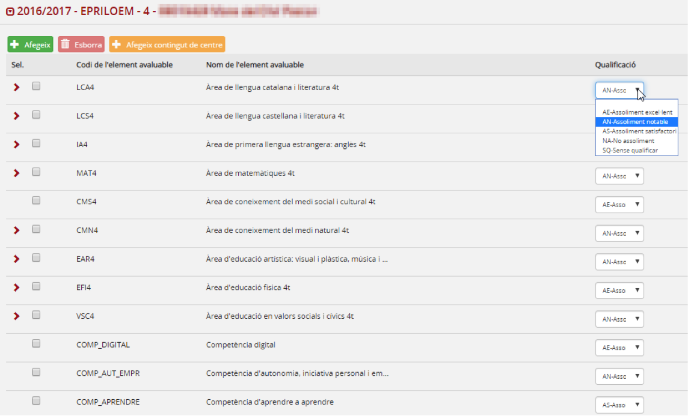*Imatge 10 - Enregistrament de les qualificacions finals d'educació primària*
  
\* ESO
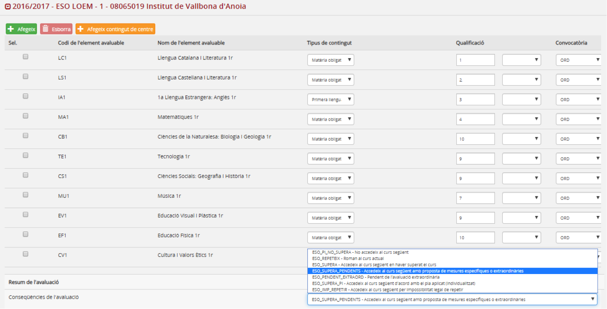*Imatge 11 - Enregistrament de les qualificacions finals d'ESO*

* Batxillerat

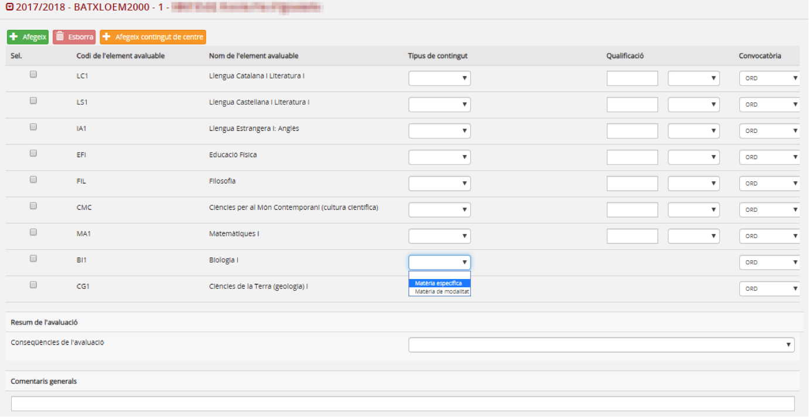*Imatge 12 - Enregistrament de les qualificacions finals de batxillerat*
  

En els desplegables que només tenen una opció, aquesta no cal seleccionar-la, es carrega automàticament en desar.

  
14. Prémer el botó [**Següent**]
  
  
15. Si escau, afegir la descripció de les **mesures d'atenció a la diversitat** que corresponguin, i prémer el botó [**Desa**]
  
  
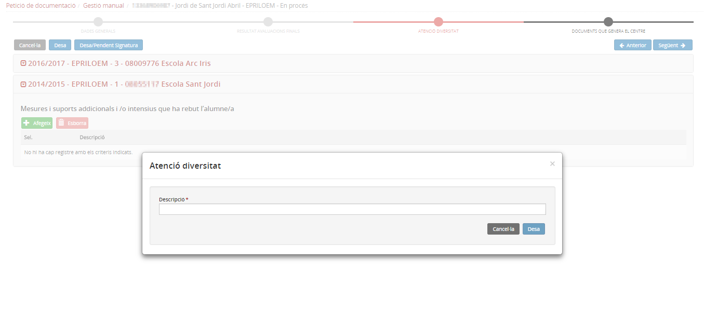*Imatge 13 - Enregistrament de les mesures d'atenció a la diversitat*
  
  
16. Prémer el botó [**Següent**]
  
  
17. Repetir aquest procés per a cadascuna de les escolaritzacions anteriors.
  
  
18. Es pot annexar el document rebut en paper, carregant-lo en format PDF  
  
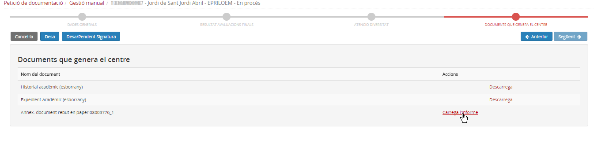*Imatge 14 - Càrrega del document rebut en paper*
  
  
19. Prémer el botó [**Desa**]
  
  
Si les dades ja estan totes enregistrades, cal prémer el botó [**Desa pendent de signatura**], pendent de la validació per part del director/a.
  
  
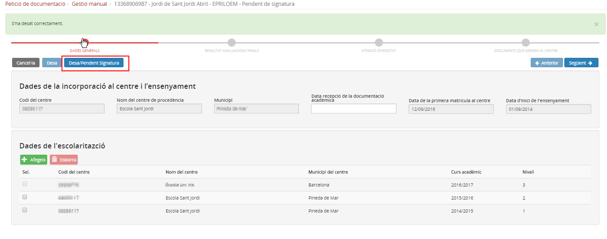*Imatge 15 - Dades de l'escolarització pendents de signatura*
  
  

### Revisar les dades i signar la documentació

El director/a ha de revisar les dades i,si són correctes, signar la documentació.
  
  
1. Prémer el botó [**Més accions**]
  
  
2. Seleccionar l'opció del desplegable **Imprimir esborrany**
  
  
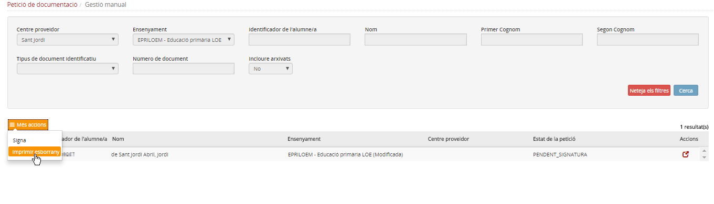*Imatge 16 - Impressió de l'esborrany*
  
  
- Si les **dades són correctes**:
  
  
1. Prémer el botó [**Més accions**]
  
  
2. Seleccionar l'opció del desplegable **Signar**
  
  
3. Prémer el botó [**Confirma**]
  
  
Els resultats de les avaluacions finals de cursos anteriors, entrats manualment, quedaran incorporats a l’Expedient i l’Historial de l’alumne/a, i també a la pestanya Resultats de les avaluacions finals de l’apartat Àmbit acadèmic de la Fitxa de l'alumne/a.
  
  
- Si les **dades són incorrectes**:
  
  
1. En l'opció de menú **Recepció de documentació**, cercar l'alumne/a i marcar la resposta com a **"Resposta no adient"**.
  
  
2. En l'opció de menú **Petició de documentació**, cercar la petició i prémer el botó [**Esborra**].
  
  
La petició quedarà esborrada, i, si escau, es pot iniciar de nou la petició.
  
  

Les dades entrades manualment es validen des del menú **Gestió manual**, no des del menú Recepció de documentació.

