# Petició de documentació

* [Què és](peticio_doc.md#que-es)
* [Com s’hi accedeix](peticio_doc.md#com-shi-accedeix)
* [Quines operacions es poden fer](peticio_doc.md#quines-operacions-es-poden-fer)

  + [Actuacions prèvies](peticio_doc.md#actuacions-previes)
  + [Cercar alumnes](peticio_doc.md#cercar-alumnes)
  + [Formalitzar la petició de documentació](peticio_doc.md#formalitzar-la-peticio-de-documentacio)
  + [Iniciar la gestió manual](peticio_doc.md#iniciar-la-gestio-manual)
  + [Signar la petició de documentació](peticio_doc.md#signar-la-peticio-de-documentacio)

## Què és

Aquesta funcionalitat permet que quan el centre B (centre destí) es gestiona amb Esfer@, pugui efectuar la **petició de documentació** al centre A (centre proveïdor):

* De forma **telemàtica** quan el centre A (centre proveïdor), és també un centre Esfer@.
* De forma **manual**, quan el centre A (centre proveïdor) és un centre no Esfer@.

Aquesta funcionalitat actualment està operativa entre:

* Cursos del mateix ensenyament.
* Primària i primer d'ESO per traspassar la documentació.

## Com s’hi accedeix

Accediu a la **Petició de documentació**:
  
  
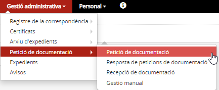*Imatge 1 - Accés al menú Petició de documentació*
  
El programa mostra tres apartats:

* **Formulari de cerca**
* **Alumnes que no tenen formalitzada la petició de documentació**
* **Alumnes amb petició**

## Quines operacions es poden fer

### Actuacions prèvies

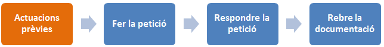

Abans d'iniciar el procés del traspàs de custòdia, el centre de destí ha de **consultar les dades de procedència** a la pestanya **Dades d'accés i finalització** de l'apartat Àmbit acadèmic de la fitxa de l'alumne/a, després d'haver-lo matriculat:

* Si l’alumne/a ja té creat un expedient per a l'ensenyament en algun altre **centre Esfer@**, l’apartat **Expedient electrònic** mostra els camps **Centre que custodia l’expedient** i **Data d’inici de l’ensenyament (a l’arxiu)** ja emplenats.

* Si l’alumne/a procedeix d’un **centre no Esfer@**, cal emplenar els camps següents de les dades de procedència:

  + **És de fora de Catalunya?**: desplegable amb els valors Sí/No
  + **Municipi**: indicar el municipi del centre d'origen
  + **Codi i nom del centre de procedència**: escollir, del desplegable, les dades corresponents
  + **Data de la primera matrícula al centre**: per defecte s'emplena amb la data de la matrícula al centre, però en cas de donar error, cal modificar-la perquè mostri el mateix valor que el camp **Data d'inici de l'ensenyament**.

Per formalitzar les dades cal prémer el botó [**Desa**].

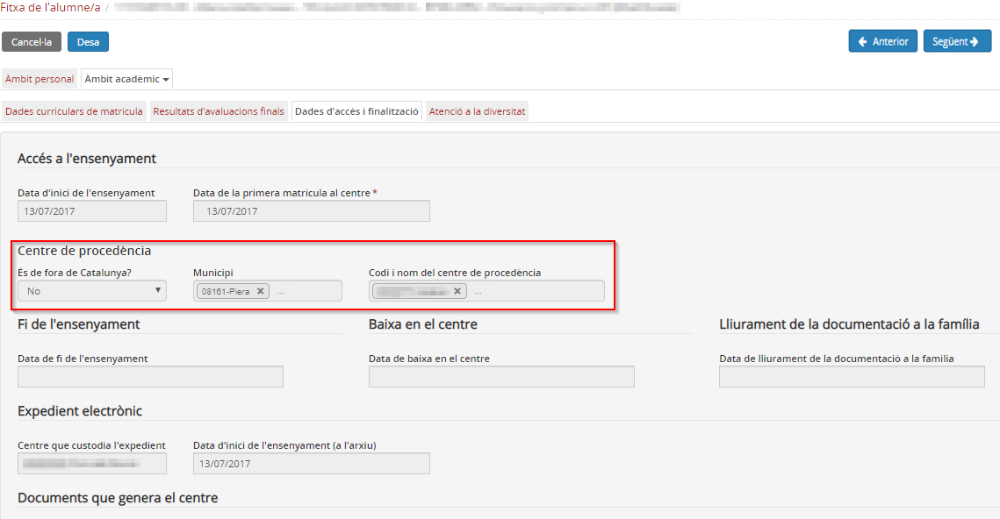*Imatge 2 - Completar les dades del centre de procedència*

Si el centre d'origen es gestiona amb Esfera, abans calia **[arxivar l'expedient l'alumne/a](../arx_expe.md)** després d'haver-lo donat de baixa. Ara **l'arxivament es fa automàticament en donar de baixa la matrícula**.

  

### Cercar alumnes

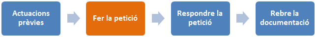

Per seleccionar l'alumne/a de qui es vol gestionar l'expedient cal, en el formulari de cerca, emplenar els camps de **Cerca**, tenint en compte que:
\* **Centre que custodia l’expedient**: en el cas de l’alumne/a que **ja té un Expedient electrònic** en un altre centre Esfer@ (centre origen)
\* **Centre de procedència**: mostra la relació de centres dels alumnes que prèviament s’ha informat a l'aplicació, i correspon a alumnes que **no tenen Expedient electrònic** creat, tal com s'explica a l'apartat **Actuacions prèvies**.
  

El desplegables Centre que custodia l’expedient i Centre de procedència, **són excloents** entre ells, només cal seleccionar-ne un.

  
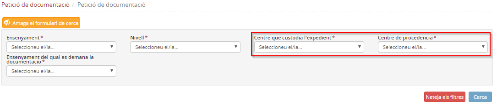*Imatge 3 - Cerca dels alumnes* 
  
  

### Formalitzar la petició de documentació

En aquesta secció es poden marcar els alumnes als quals s'ha de demanar la custòdia de l’expedient electrònic.

#### En el cas d'alumnes dels quals el centre de procedència es gestiona amb Esfer@

1. Cercar l'alumne/a:

* Seleccionar **l’Ensenyament** i el **Nivell** actual on està matriculat l'alumne/a.
* Seleccionar el nom del centre en el camp **Centre que custodia l’expedient**. El camp Centre de procedència, queda desactivat automàticament.
* Al camp **Ensenyament del qual es demana la documentació**, escollir la mateixa opció seleccionada en el primer camp.

2. Seleccionar l'alumne/a i prémer el botó [**Nova petició**]. La petició estarà creada i en estat **Pendent de signatura**.
  
  
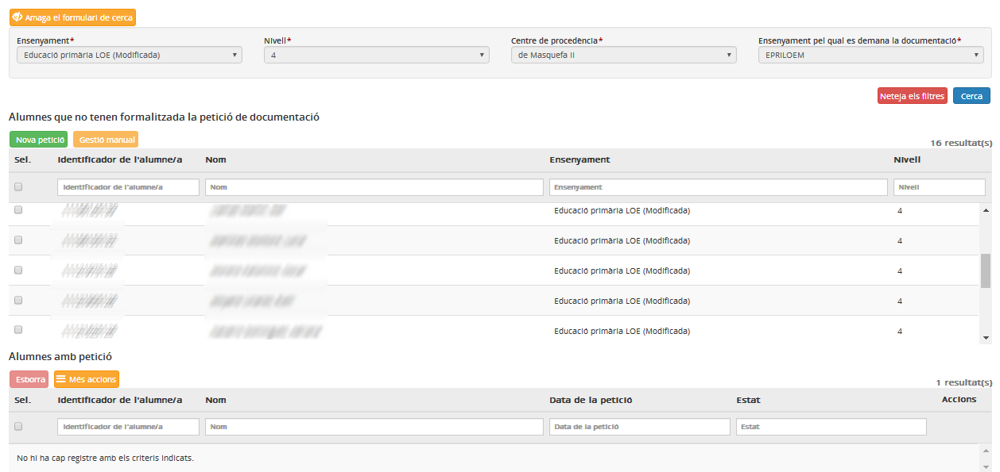*Imatge 4 - Selecció dels alumnes* 
  
  
3. **Signar la petició** de documentació:

* Seleccionar la petició
* Prémer el botó [Més accions]
* Punxar l'opció **Signa petició**. La petició de documentació quedarà "Pendent de resposta".

Aquesta acció l'ha de fer el Director del centre.

#### En cas que el centre proveïdor no es gestioni amb Esfer@

1. **Cercar l’alumne/a** informant els camps obligatoris:

* Seleccionar l'**Ensenyament** i el **Nivell** on està matriculat actualment l'alumne/a.
* Seleccionar el nom del centre en el camp **Centre de procedència** (prèviament informat a la Fitxa de l'alumne/a). El camp **Centre que custodia l'expedient**, queda desactivat automàticament.
* En el camp **Ensenyament del qual es demana la documentació**, escollir la mateixa opció seleccionada en el primer camp.

En aquest cas, l'aplicació únicament activa l'opció de **gestió manual**.

  
  
2. Seleccionar l'alumne/a
  
  
3. Prémer el botó [**Gestió manual]**, que s’ha activat automàticament
  
  
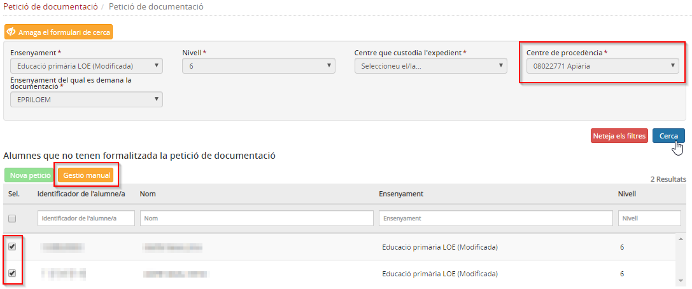*Imatge 5 - Selecció opció Gestió manual* 
  
  
4. Acceptar l'avís
  
  
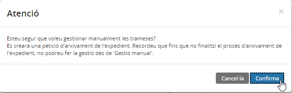*Imatge 6 - Arxivament automàtic de l’Expedient* 
  
  
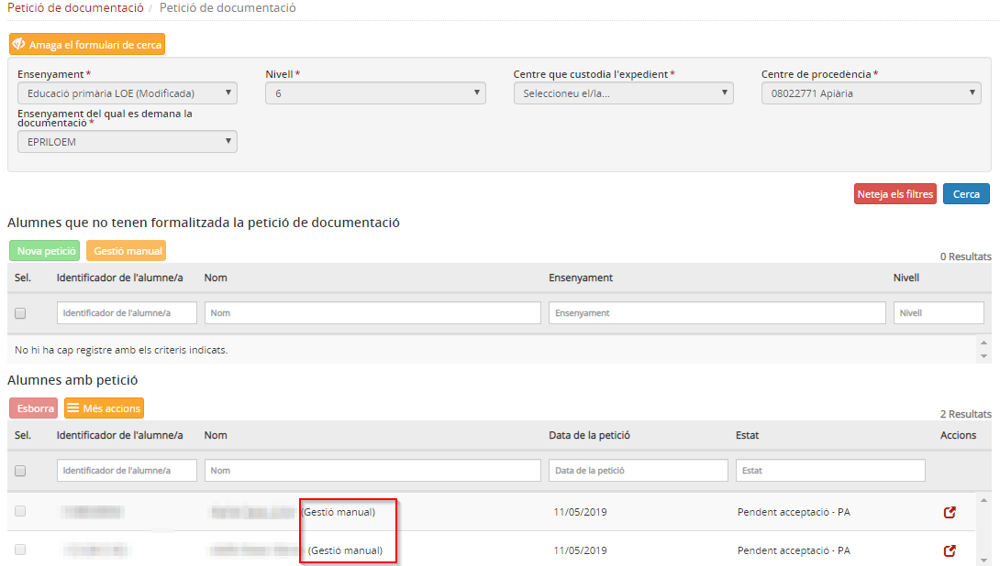*Imatge 7 - Pendent de la Gestió Manual* 
  
  
5. Seguidament l'aplicació realitza l'arxivament de l'expedient de l'alumne/a i, un cop executat, cal continuar el procés completant les dades de l'escolarització anterior a l'opció del menú **Gestió manual**.
  
  

### Iniciar la gestió manual

Abans d'iniciar aquest procediment, cal revisar que la data d'inici a l'ensenyament sigui correcte, a la pestanya **Dades d'accés i finalització**.

  
1. Premeu el botó [**Gestió manual**]
  
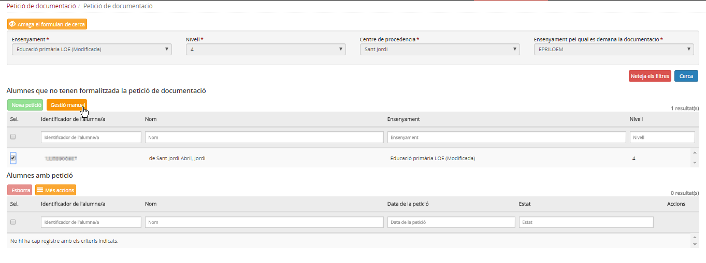*Imatge 8 - Selecció opció Gestió manual* 
  
  
2. Accepteu l'avís
  
  
Seguidament el programa realitza l'arxivament de l'expedient de l'alumne i, un cop executat, cal continuar el procés completant les dades de l'escolarització anterior a l'opció del menú **[Gestió manual](gestio_manual.md)**.
  
  

### Signar la petició de documentació

Aquesta funcionalitat s'activa només quan el centre proveïdor es gestiona també amb Esfera

  
La signatura de la petició l'ha de fer la **Direcció** del centre. Es tracta únicament de seleccionar la petició, prémer el botó [**Més accions**] i clicar a l'opció **Signa petició**. La petició de documentació quedarà **Pendent de resposta**.
  
  
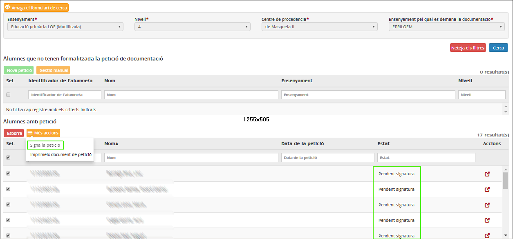*Imatge 9 - Signar la petició de documentació* 
  
  
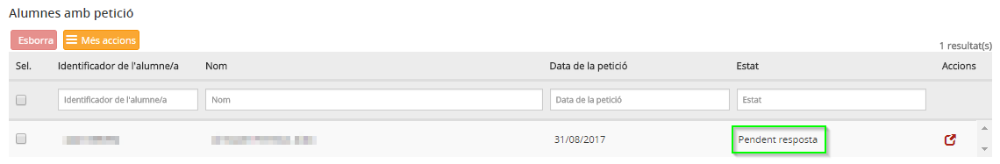*Imatge 10 - Petició pendent de resposta* 
  
  

---