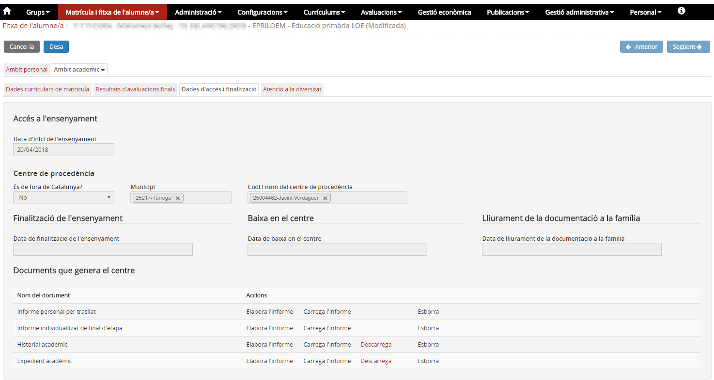
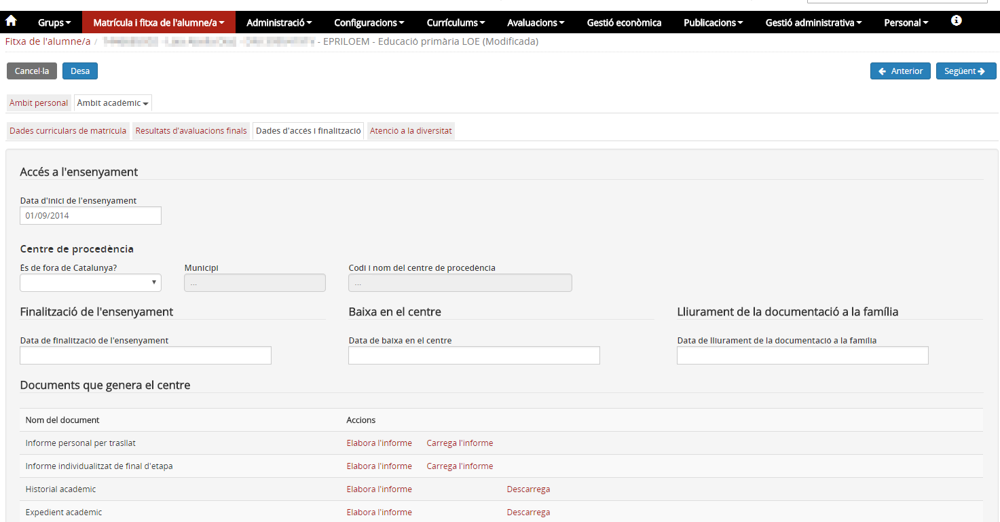

# Recepció de documentació

* [Què és](recepcio-docum.md#què-és)
* [Com s’hi accedeix](recepcio-docum.md#com-shi-accedeix)
* [Quines operacions es poden fer](recepcio-docum.md#quines-operacions-es-poden-fer)

  + [Cercar peticions](recepcio-docum.md#cercar-peticions)
  + [Acceptar la resposta de documentació](recepcio-docum.md#acceptar-la-resposta-de-documentació)
  + [Rebutjar la resposta de documentació](recepcio-docum.md#rebutjar-la-resposta-de-documentació)

## Què és

Quan el centre proveïdor (centre A) ha fet la tramesa de la documentació, el centre B ha de comprovar que és correcta, i acceptar-la o rebutjar-la en cas contrari.
  
  

## Com s’hi accedeix

Cal anar a **Recepció de documentació** de l'opció del menú **Petició de documentació** del mòdul **Gestió administrativa**:
  
  
*Imatge 1 - Accés a recepció de documentació* 
  
  

## Quines operacions es poden fer

### Cercar peticions

**Cercar** la petició de la qual s'ha rebut la custòdia:
  
  
*Imatge 2 - Cerca petició* 
  
  
Veure de quin o quins alumnes s'ha rebut la informació i **comprovar** la informació rebuda a **Dades d'accés i finalització** a l'opció del menú de l'**àmbit acadèmic** del mòdul **fitxa de l'alumne/a**.

*Imatge 3 - Accés a Comprovar els documents amb la informació acadèmica rebuda*
  
  

### Acceptar la resposta de documentació

Descarregar **l'Expedient i/o l'Historial**. Si es mostra la informació de tots els cursos anteriors correctament, s'ha d'acceptar la documentació.
  
  
Accedir novament al menú **Recepció de documentació**, **cercar** la tramesa, **seleccionar-la**
  
  
*Imatge 4 - Cerca petició revisada* 
  
  
Prémer el botó [**Més accions**] i clicar l'opció **Resposta acceptada**.
  
  
*Imatge 5 - Resposta acceptada* 
  
  
Els resultats de les avaluacions finals de cursos anteriors quedaran incorporats a la fitxa de l'alumne i el centre peticionari (centre B) ja tindrà la custòdia de l'expedient, per la qual cosa podrà generar la documentació acadèmica de l'alumne (expedient i historial) quan ho necessiti.
  
  
*Imatge 6 - Resposta acceptada* 
  
  

### Rebutjar la resposta de documentació

Si en revisar la informació rebuda de l'alumne s'observa que està incompleta o que les dades no corresponen a l'alumne sol·licitat, s'ha de rebutjar la documentació.
  
En aquest cas, després de **cercar** la tramesa, **seleccionar-la**, s'ha de prémer el botó [**Més accions**] i clicar l'opció **Resposta no adient**.
  
  
*Imatge 7 - Resposta no adient*
  
  
Amb aquesta acció la petició ha quedat tancada. El centre peticionari (centre B) haurà d'iniciar una **nova petició**.
  
  
*Imatge 8 - Nova petició d'una amb resposta no adient*
  
  
Per a una bona gestió del seguiment de les peticions, es recomana que les peticions incorrectes siguin esborrades de la llista:  
1. Seleccionar les peticions en "**Estat**": "Tancada per error" i "Resposta no adient".  
2. Prémer el botó [**Esborra**]  
  
