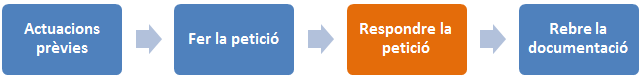
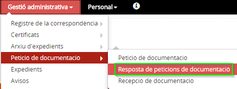
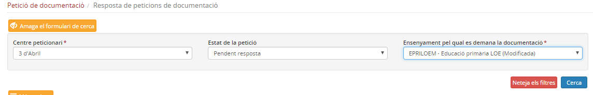
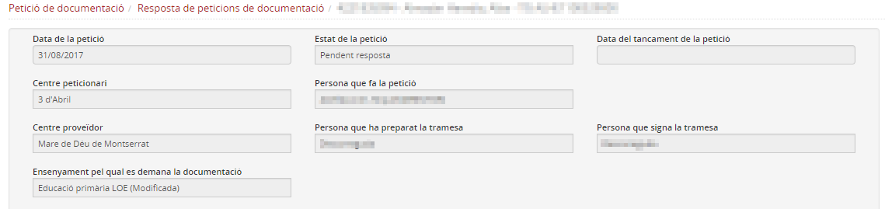
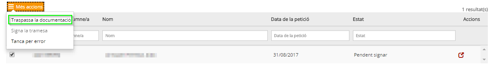
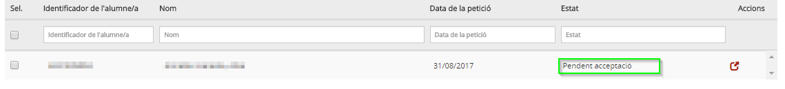
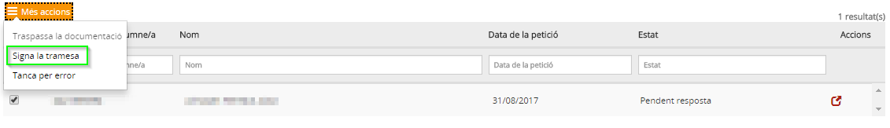
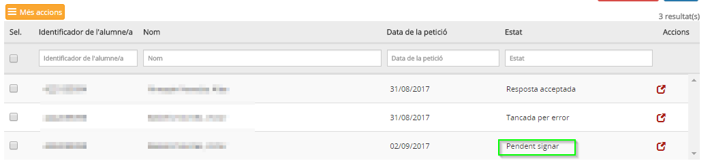
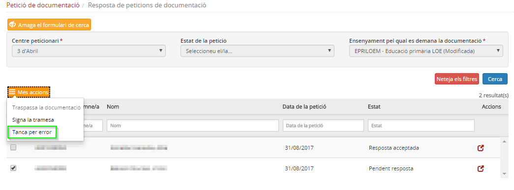
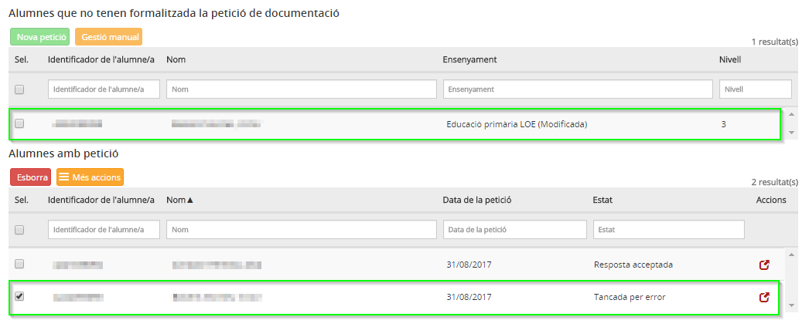

# Resposta petició de documentació

* [Què és](respota_peticio_docum.md#què-és)
* [Com s’hi accedeix](respota_peticio_docum.md#com-shi-accedeix)
* [Quines operacions es poden fer](respota_peticio_docum.md#quines-operacions-es-poden-fer)

  + [Accedir al detall](respota_peticio_docum.md#accedir-al-detall)
  + [Traspassar la documentació](respota_peticio_docum.md#traspassar-la-documentació)
  + [Signar la tramesa](respota_peticio_docum.md#signar-la-tramesa)
  + [Tancar per error](respota_peticio_docum.md#tancar-per-error)

## Què és

Aquesta funcionalitat permet que, en els casos en que tant el centre de destí com el proveïdor es gestionin amb Esfer@, que el centre on estava matriculat l'alumne/a i que té la seva custòdia pugui trametre la documentació al nou centre.
  
  

## Com s’hi accedeix

Accediu al menú **Resposta de peticions de documentació**:
  
  
*Imatge 1 - Accés a Resposta de peticions de documentació* 
  
  

## Quines operacions es poden fer

El programa mostra un formulari de cerca, en el desplegable **Centre peticionari** es mostra la relació de centres que ens han fet petició de documentació. És imprescindible triar el **centre peticionari** (el que ha emès la petició) i l'**ensenyament** del qual es demana la custòdia:
  
  
*Imatge 2 - Cerca de peticions*

### Accedir al detall

Opcionalment podeu consultar el **detall** de la petició clicant la icona de detall.
  
  
*Imatge 3 - Detall de la petició* 
  
  

Recordeu que per poder fer el traspàs, cal que la matrícula de l'alumne estigui en estat de baixa i haver arxivat l'expedient.

Seleccionant la petició s'activen les opcions del botó [**Més accions**]. Aquestes opcions són:

* **Traspassa la documentació**
* **Signa la tramesa**
* **Tanca per error**

### Traspassar la documentació

Heu de fer aquesta segona acció per fer efectiu el traspàs de la documentació, per la qual cosa, s'ha de seleccionar la petició signada, prémer de nou el botó [**Més accions**] i clicar l'opció **Traspassa la documentació**.
  
  
*Imatge 4 - Traspassa la documentació* 
  
  
El traspàs estarà pendent de l'acceptació del centre peticionari (Centre B).
  
  
*Imatge 5 - Documentació pendent d'acceptació* 
  
  

### Signar la tramesa

Si la petició és correcta, s'ha de clicar aquesta opció. Recordeu que només ho pot fer la **Direcció**.
  
  
*Imatge 6 - Signa la tramesa* 
  
  
La petició quedarà **Pendent de signar**:

*Imatge 7 - Petició pendent de signar* 
  
  

### Tancar per error

Si la petició és errònia (d'un alumne que no estava al centre, per exemple), cal seleccionar aquesta opció. En aquest cas es finalitza el procés. El centre que havia fet la petició podrà iniciar una altra si és el cas.
  
  
*Imatge 8 - Tanca per error* 
  
  
El centre peticionari veurà que la seva petició ha estat tancada:
  
  
*Imatge 9 - Petició Tancada per error*
  
  
  

Si el centre A **no** ha arxivat l'expedient, l'aplicació respondrà amb un missatge informant "No hi ha cap expedient per l'alumne i l'ensenyament". Per poder reprendre el procediment, cal esborrar la petició de documentació i iniciar-la novament.

  

---