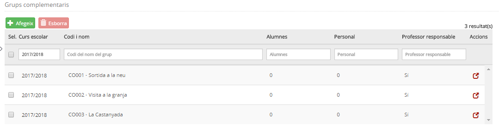
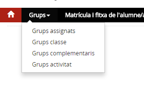
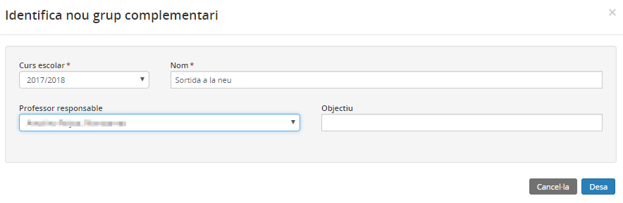
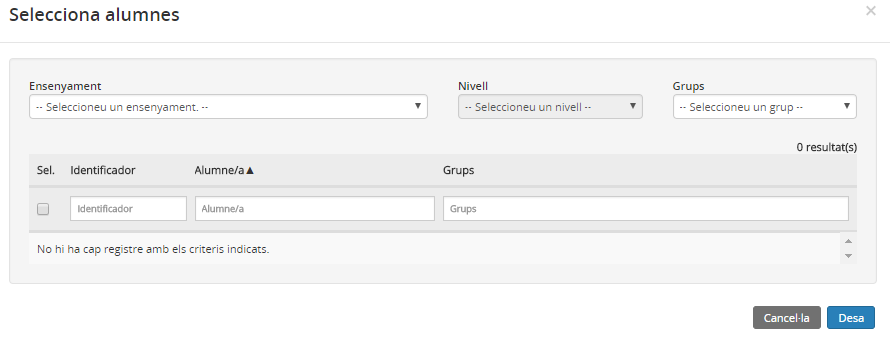
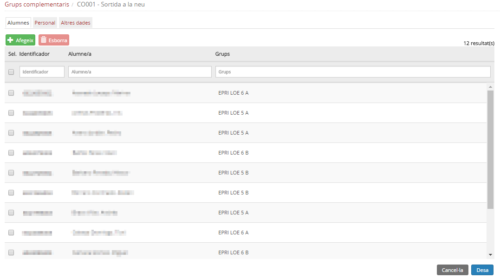
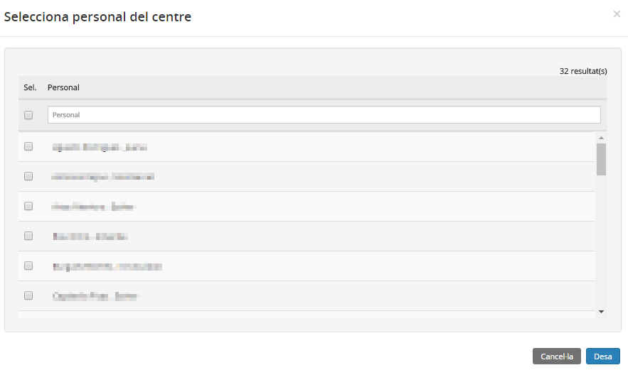
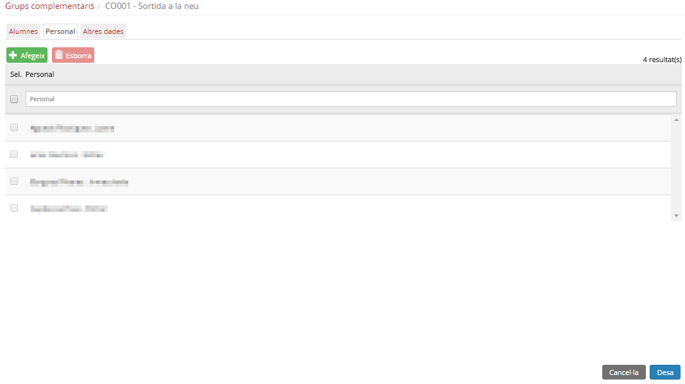
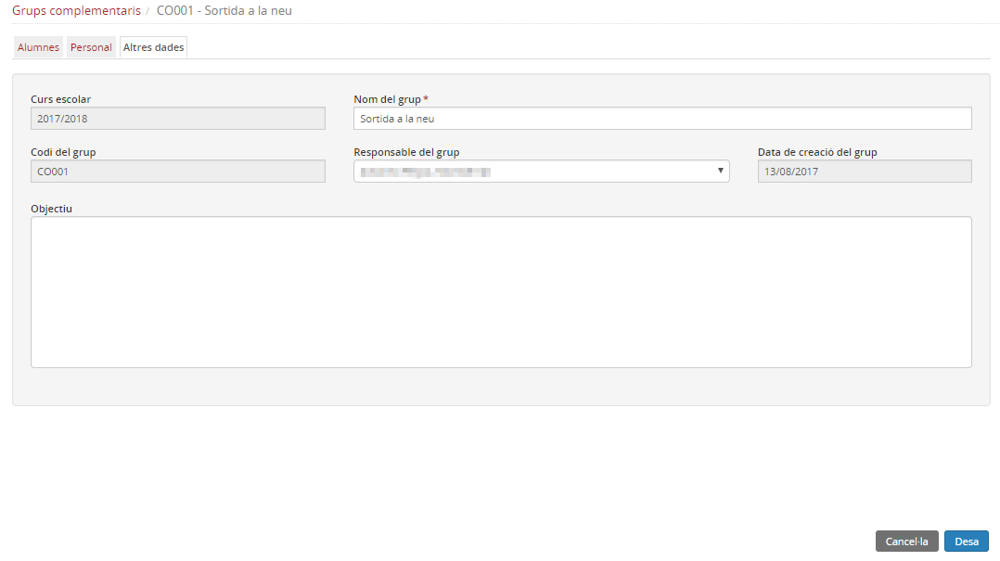

# Grups complementaris

* [Què són](gid-gcom.md#que-son)
* [Com s’hi accedeix](gid-gcom.md#com-shi-accedeix)
* [Quines operacions s'hi poden fer](gid-gcom.md#quines-operacions-shi-poden-fer)

  + [Crear un grup complementari](gid-gcom.md#crear-un-grup-complementari)
  + [Esborrar un grup complementari](gid-gcom.md#esborrar-un-grup-complementari)
  + [Modificar un grup complementari](gid-gcom.md#modificar-un-grup-complementari)

### Què són

Els grups complementaris són grups que permeten agrupar alumnes del centre que tenen en comú alguna activitat, com ara una sortida, i un adult responsable del grup.
  
  
Un grup complementari pot incloure personal del centre però en aquest tipus de grups pot ser docent o no docent.
  
  

Els grups complementaris no tenen continguts assignats i, per tant, no estan subjectes d'avaluació.

  
  
Quan el centre té grups complementaris creats, la pantalla mostra una taula amb la informació següent:

* **Curs escolar**
* **Codi - Nom**: El codi i el nom del grup complementari.
* **Alumnes**: Nombre d'alumnes que formen part del grup.
* **Personal**: Nombre de personal assignat al grup.
* **Professor responsable**: "Sí/No" segons si s'ha especificat o no el professor responsable del grup.
* **Accions**: Icona mitjançant la qual es pot accedir al detall del grup.

*Imatge 1 - Llista de grups complementaris del centre*
  
  

---

### Com s’hi accedeix

Per accedir, s'ha d'escollir l'opció **Grups complementaris** del mòdul **Grups**

*Imatge 2 - Accés als grups complementaris*
  
  
Damunt la relació de grups hi ha un conjunt de camps que faciliten la cerca.
  
També és possible variar l'ordre en què es mostren els grups per pantalla clicant sobre cada capçalera.
  
  

---

### Quines operacions s'hi poden fer

* [Crear un grup complementari](gid-gcom.md#crear-un-grup-complementari) - Per crear nous grups complementaris.
* [Modificar un grup complementari](gid-gcom.md#modificar-un-grup-complementari) - Per veure la composició del grup, és a dir, la relació d'alumnes i personal i modificar-lo, si és el cas.
* [Esborrar un grup complementari](gid-gcom.md#esborrar-un-grup-complementari) - El programa permet esborrar un grup complementari sempre que no tingui alumnes, personal ni responsable.

---

#### Crear un grup complementari

* [Identificar el grup](gid-gcom.md#identificar-el-grup)
* [Afegir/treure alumnes del grup](gid-gcom.md#afegirtreure-alumnes-del-grup)
* [Afegir/treure personal al grup](gid-gcom.md#afegirtreure-personal-al-grup)

En primer lloc s'ha de clicar el botó .
Aquesta acció obrirà una finestra modal on introduir les dades generals.
  
  

---

##### Identificar el grup

* **Curs escolar**: Camp obligatori. S'ha de seleccionar del desplegable el curs escolar a què correspon el grup..
* **Nom del grup**: Camp opcional on s'especifica el nom per identificar el grup a les diferents pantalles de l'aplicació.
* **Responsable**: Camp opcional que permet seleccionar d'entre la relació de personal del centre, la persona responsable del grup.
* **Objectiu**: Camp opcional que permet escriure allò que ajudi a identificar el grup.

*Imatge 3 - Identificació d'un grup complementari*
  
  
Per gestionar el grup, és a dir, posar-hi els alumnes, el personal i el responsable cal clicar la icona del grup seleccionat.
  
  

---

##### Afegir/treure alumnes del grup

La primera pestanya **Alumnes**, permet veure els alumnes que hi ha al grup i permet afegir-ne i treure'n.
  
Per afegir alumnes al grup cal clicar el botó .
  
  
S'obrirà una finestra modal que permetrà cercar qualsevol alumne del centre.
  
  
*Imatge 4 - Cerca d'alumnes*
  
  
Cal marcar els alumnes que es desitgi incorporar al grup i acabar clicant al botó .
  
Els alumnes passaran a mostrar-se a la llista d'alumnes del grup.
  
*Imatge 5 - Llista d'alumnes del grup*
  
La taula d'alumnes del grup disposa de la informació següent:

* **Identificador de l'alumne/a**
* **Nom i cognoms de l'alumne/a**
* **Grups**: codi del grup classe al qual pertany l'alumne i codi de tots els altres grups i agrupacions a les quals està inclòs l'alumne.

Si cal treure algun alumne del grup, cal seleccionar-lo de la llista d'alumnes i a continuació clicar al botó .
  
  

---

##### Afegir/treure personal al grup

La segona pestanya **Personal**, permet veure el personal que hi ha al grup i permet afegir-ne i treure'n.
  
Per afegir personal al grup cal clicar el botó .
  
  
S'obrirà una finestra modal que permetrà cercar qualsevol treballador del centre.
  
  
*Imatge 6 - Cerca de personal*
  
  
Cal marcar les persones que es desitgi incorporar al grup i acabar clicant al botó .
  
Les persones passaran a mostrar-se a la llista de personal del grup.
  
*Imatge 7 - Llista de personal del grup*

Si cal treure alguna persona del grup, cal seleccionar-lo de la llista i a continuació clicar al botó .
  
  

---

#### Esborrar un grup complementari

A la pantalla principal es mostra la llista de grups complementaris que hi ha. Aquí es poden també esborrar els grups creats.
  
Només es pot esborrar un grup si no conté alumnes, personal ni responsable.
Cal marcar el grup o grups i prémer el botó .
  

---

#### Modificar un grup complementari

Clicant la icona d'acció d'un grup s'accedeix a la seva composició i a les seves dades d'identificació.
  
És possible modificar el nom del grup, les observacions i la composició, tant pel que fa als alumnes, personal i responsable.
  
  
*Imatge 8 - Altres dades del grup*
  
  

---