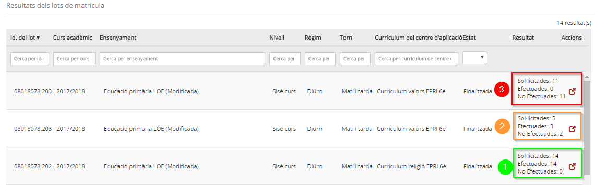
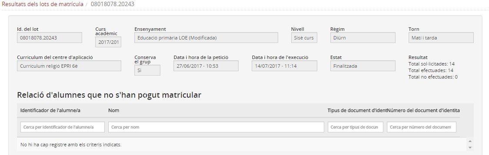
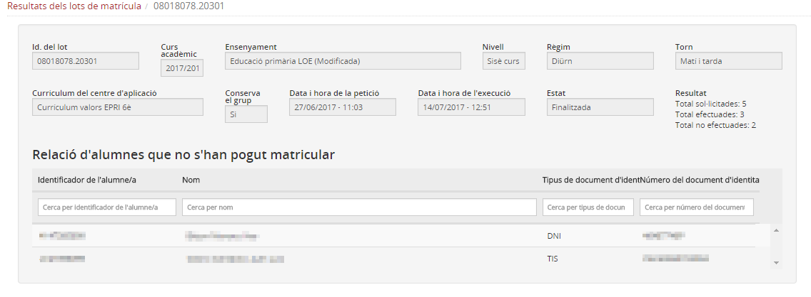
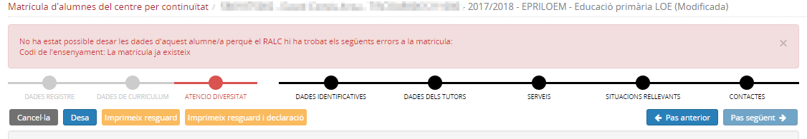

# Resultats dels lots de matrícula

* [Què són](mat_lot.md#què-són)
* [Com s'hi accedeix](mat_lot.md#com-shi-accedeix)
* [Quines operacions s'hi poden fer](mat_lot.md#quines-operacions-shi-poden-fer)

### Què són

Quan es matricula un conjunt d'alumnes que continuen al centre, cal consultar el resultat del procés a l'opció del menú **Resultats dels lots de matrícula** del mòdul **Matrícula i fitxa del alumne/a**.
Permet als usuaris comprovar tots els lots de matrícula del centre i en quin estat es troben.
  
 

---

### Com s'hi accedeix

Per accedir-hi, heu de seleccionar l'opció del menú **Resultats del lot de matrícula** del mòdul **Matrícula i fitxa de l'alumne/a**.
  
*Imatge 1 - Accés als Resultats dels lots de matrícula* 
  
  
 

---

### Quines operacions s'hi poden fer

#### Visualitzar els resultats

Quan se selecciona aquesta opció del menú **Resultats dels lots de matrícula** es mostra una llista dels lots de matrícula iniciats pel centre amb les dades següents:

* **Identificació del lot**: El número que identifica el lot.
* **Curs escolar**: El curs escolar de les matrícules del lot.
* **Ensenyament**: L'ensenyament a què fan referència les matrícules del lot.
* **Nivell**: El nivell a què fan referència les matrícules del lot.
* **Règim**: El règim a què fan referència les matrícules del lot.
* **Torn**: El torn a què fan referència les matrícules del lot.
* **Currículum del centre d’aplicació**: El currículum que s'ha assignat a les matrícules del lot.
* **Estat**: Pendent, en procés i finalitzat.
* **Resultat**: Total de matrícules sol·licitades, total de matrícules efectuades i total de matrícules no efectuades.

Només es mostren els lots del curs escolar del valor especificat al camp **Valor per defecte de la matrícula** del mòdul **Configuracions** o de cursos superiors.

  
  
*Imatge 2 - Resultats dels lots de matrícula* 
  
  
Amb la icona  es pot accedir a la informació del lot seleccionat.  
*Imatge 3 -Detall d'un lot correctament processat* 
  

Una vegada ja s'ha efectuat la matrícula de l'alumnat, s'ha de distribuir en els **Grups classe**.

.
  
Especialment, quan en el resultat d'un lot s'observa que hi ha matrícules no efectuades, cal accedir per veure la relació d'alumnes que no s'han pogut matricular.  
*Imatge 4 -Detall d'un lot amb alumnes no matriculats* 
  
  
La pantalla únicament mostra les dades dels alumnes que no s'han pogut matricular, sense especificar el motiu de la falla.
  
En aquest cas cal investigar quin ha estat el motiu o motius que han produït la fallada.  
Si ha fallat la matrícula de tots els alumnes del lot:

* el currículum que s'ha assignat en preparar el lot no reuneix les condicions necessàries: hi ha més d'una llengua estrangera o religió, manquen àrees curriculars,…
* RALC està ocasionalment fora de servei i no ha pogut fer el registre de les matrícules
* La comunicació Esfer@ - RALC no ha funcionat correctament
* S'ha preparat un lot erròniament amb alumnes que ja estan matriculats

Si ha fallat la matrícula d'algun alumne del lot:

* l'alumne està matriculat en un altre centre pel mateix ensenyament, nivell i curs escolar
* l'alumne no reuneix els requisits per a ser matriculat

Si l'errada es produeix en alumnes concrets és recomanable provar de matricular l'alumne individualment. D'aquesta manera, en desar la matrícula, es mostrarà el detall de la circumstància que no ho permet.
  
*Imatge 5 -Error en matricular un alumne* 
  
  
En aquest cas caldria comprovar a RALC a quin centre l'alumne ja disposa d'una matrícula registrada.
  
  
 

---