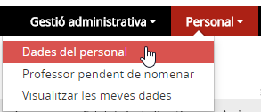
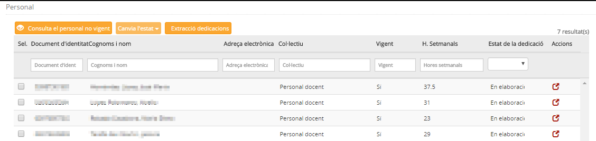
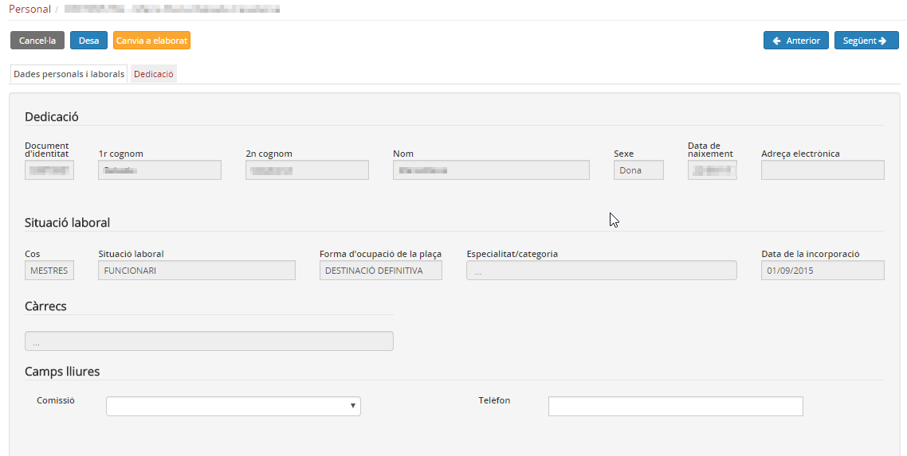
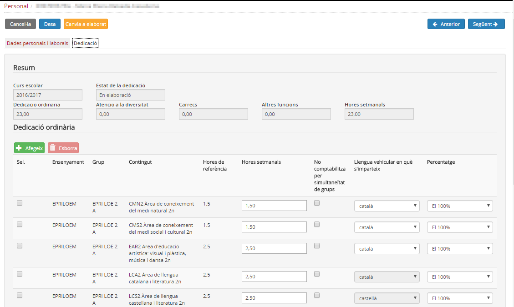
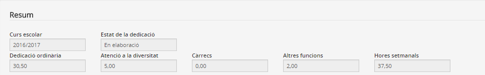
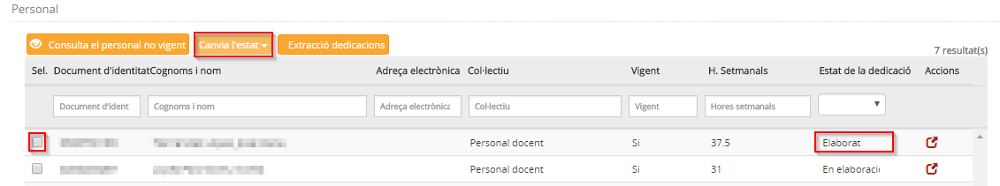
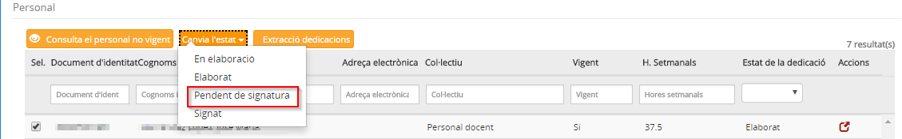
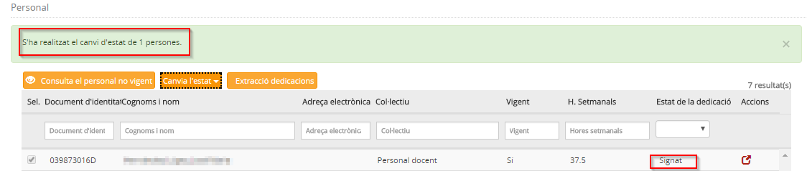

## Dades del personal

* [Què és](per-per.md#què-és)
* [Com s'hi accedeix](per-per.md#com-shi-accedeix)
* [Quines operacions s'hi poden fer](per-per.md#quines-operacions-shi-poden-fer)

### Què és

En aquesta opció del mòdul **Personal** es du a terme la gestió de la dedicació laboral del personal del centre.
  
  
Els professors o personal d'administració i serveis són els responsables d'introduir les dades de la seva dedicació horària i, quan completen aquesta tasca, el director o directora del centre de signar-ho.
  
Per facilitar la tasca al director o directora del centre, la dedicació horària passa per diferents estats intermedis fins a "Pendent de signatura", que és quan el director o directora ho supervisa. El personal d'administració i serveis revisa aquests estats intermedis i, si és correcte, ho envia a "Pendent de signatura" perquè el director o directora en doni el vistiplau.
  
  
 

---

### Com s'hi accedeix

Per accedir-hi, cal seleccionar l'opció del menú **Personal** del mòdul **Personal**.
  
*Imatge 1 - Accés al menú Personal* 
  
  
 

---

### Quines operacions s'hi poden fer

* [Consultar la llista del personal vigent del centre](per-per.md#consultar-la-llista-del-personal-vigent-del-centre)
* [Gestionar la dedicació](per-per.md#gestionar-la-dedicació)

#### Consultar la llista del personal vigent del centre

En entrar al submòdul **Personal**, l'aplicació mostra una llista del personal vigent del centre.
  
A la part superior hi ha dos botons que permeten visualitzar el personal que no és vigent.
  
  
*Imatge 2 - Relació de personal del centre* 
  
Els camps de la llista del personal són els següents:

* **Casella de verificació**: Permet seleccionar el personal.
* **Document i número del document d'identitat**: Identificació del personal.
* **Nom i cognoms**: Nom i cognoms del personal.
* **Correu electrònic**
* **Col·lectiu**: S'hi especifica si és personal docent o personal d'administració i serveis.
* **Vigent**: "Sí"/"No".
* **Hores setmanals**: Només en el cas del personal docent.
* **Estat de la dedicació**
* **Acció**: Icona  que serveix per veure més dades del personal.

Es poden consultar les dades laborals i la dedicació laboral.
  
  
Si es prem la icona  s'accedeix a la fitxa del personal seleccionat.
  
  
*Imatge 3 - Fitxa del personal* 
  
A la part superior, es mostren les dades identificatives del personal (nom i cognoms i document d'identitat). En cas de ser un professor o professora pendent de nomenar, se'n visualitza només el nom. Si el personal és no vigent, s'especifica amb una etiqueta.
  
Les dades del personal s'agrupen en dos blocs:

* Dades personals i laborals
* Dedicació

#### Dades personals i laborals

Es mostra una pantalla amb les dades següents:

* **Dades identificatives**:

  + Document d'identificació
  + Noms i cognoms
  + Sexe
  + Data de naixement
  + Adreça electrònica
* **Situació laboral**:

  + Cos
  + Situació laboral
  + Forma d'ocupació
  + Especialitat/categoria
  + Data de la incorporació

\* **Càrrecs**
\* **Camps lliures** (si se n'han definit)
  
  

Les dades que es mostren es corresponen amb la informació que hi ha a la base de dades de personal del Departament d'Ensenyament. Si alguna dada no és correcta, s'ha de sol·licitar el canvi als Serveis Territorials corresponents.

  
  
 

---

#### Gestionar la dedicació

La dedicació laboral del personal docent comporta un procés d'elaboració que finalitza amb la signatura del director/a del centre.
La dedicació passa pels següents estats:

* **En elaboració**: mentre s'hi està treballant per part de l'equip directiu o el mestre l'està completant.
* **Elaborat**: quan el mestre finalitza la compleció de la dedicació l'ha de posar en aquest estat. Aquest estat permet revisar la dedicació de cada persona i fer-hi modificacions si és el cas. Aquesta revisió la pot fer l'auxiliar administratiu o l'equip directiu. Si tot és correcte, s'ha de canviar l'estat a **Pendent de signatura**.
* **Pendent de signatura**: és l'estat que indica que tot és correcte i només manca la signatura del director/a.
* **Signat**: en aquest estat es mostra la dedicació que ha estat signada pel director/a.

Quan l'equip directiu ha gestionat els grups classe i les agrupacions organitzatives, ha de sol·licitar l'**obertura de la dedicació**.
  
  
El procés d'**obertura de la dedicació**, que ha fet l'equip directiu, omple, a la fitxa de cada mestre/a, l'apartat de la dedicació ordinària amb la informació dels grups i continguts, i amb la càrrega horària que determinat el Sistema d'Informació d'Ensenyaments (SIENS).
  
La dedicació es distribueix en quatre apartats:

* **Dedicació ordinària**: és la que s'obté de la gestió dels grups classe i agrupacions organitzatives. Conté la següent informació:

  + **Ensenyament**: codi de l'ensenyament
  + **Grup**: codi del grup. Pot ser un grup classe o una agrupació organitzativa.
  + **Contingut**: nom del contingut
  + **Hores de referència**: hores que determina SIENS
  + **Hores setmanals**: hores que determina el centre
  + **No comptabilitza per simultaneïtat de grups**: xec per marcar si les hores del contingut es fan simultàniament amb un altre contingut.
  + **Llengua vehicular en què s'imparteix**: pot ser català, aranès, castellà, anglès, … Per defecte es mostra català.
  + **Percentatge**: és el percentatge del temps que es treballa en la llengua vehicular indicada. Per defecte es mostra 100%

*Imatge 4 - Dedicació ordinària* 
  
  
El mestre accedeix a la seva fitxa per revisar i completar la dedicació ordinària. Les entrades que es mostren es poden **esborrar**, **marcar que no comptablitzin**, **canviar la llengua vehicular** i el **percentatge** d'ús.
  
Si és necessari també se'n poden **afegir**:
  
  
*Imatge 5 - Afegir dedicació ordinària* 
  
  
A continuació es mostren els altres apartats de la dedicació:
  
  
*Imatge 6 - Altres dedicacions*

* **Atenció a la diversitat**: permet indicar les hores setmanals que el mestre dedica a mesures d'atenció a la diversitat, sempre que aquestes estiguin autoritzades i/o s'hagin activat en el mòdul de **Configuracions**.

*Imatge 7 - Afegir dedicació d'atenció a la diversitat*

* **Càrrecs**: els càrrecs que comporten un "nomenament", com ara els de l'equip directiu, tutor/a, coordinador, etc., es mostren carregats. L'usuari només ha de completar les hores de dedicació.

Si la persona ocupa un càrrec intern del centre s'haurà d'afegir:
  
  
*Imatge 8 - Afegir càrrec de centre*

* **Altres funcions**: permet incloure altres funcions de la persona en el centre que comportin temps de dedicació setmanal.

*Imatge 9 - Afegir altres funcions*
  
  
Han de quedar completats tots els apartats necessaris:
  
  
*Imatge 10 - Dedicació complet*
  
  
Cal observar que a la part superior de la pantalla es mostra un resum de la dedicació de la persona:
  
  
*Imatge 11 - Resum horari de la dedicació*
  
  
Si tot és correcte, cal canviar l'estat prement el botó 
  
  
L'estat de la dedicació canviarà a **Elaborat**:
  
  
*Imatge 12 - Dedicació en estat elaborat*
  
  
A partir d'aquest moment correspon a l'equip directiu i al personal de suport administratiu revisar la dedicació i canviar l'estat:
  
  
*Imatge 13 - Dedicació en estat pendent de signatura*
  
  
Finalment el director/a signa i la dedicació queda en estat signat:
  
  
*Imatge 14 - Dedicació en estat signat*
  
  
 

---