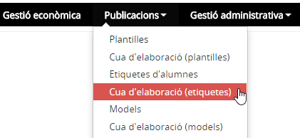
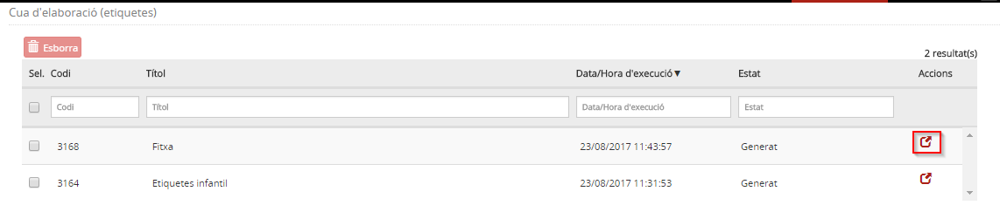
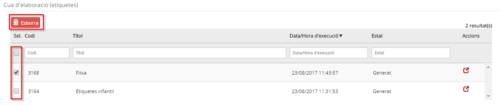

# Cua d'elaboració (etiquetes)

* [Què és](men_cua_eti.md#que-es)
* [Com s’hi accedeix](men_cua_eti.md#com-shi-accedeix)
* [Quines operacions s'hi poden fer](men_cua_eti.md#quines-operacions-shi-poden-fer)

## Què són

En aquesta opció del mòdul **Publicacions** es troben les etiquetes que l'usuari ha elaborat.
L'elaboració d'etiquetes no es fa immediatament sinó que es du a terme en diferit. Això permet que la persona que ha donat l'ordre per elaborar el document, pugui continuar treballant amb l'aplicació.
  

---

## Com s’hi accedeix

Per accedir-hi, heu de seleccionar l'opció del menú **Cua de generació (etiquetes)** del mòdul **Publicacions**.

*Imatge 1 - Pantalla per seleccionar Cua d'elaboració (etiquetes)*
  

---

## Quines operacions s'hi poden fer

La pantalla que es mostra conté informació de les etiquetes que s'han elaborat.
  
  
L'**estat** de les etiquetes indica si s'estan elaborant (**Pendent**), si s'han elaborat (**Generat**) o si s'ha produït un error (**Error**).  
  
*Imatge 2 - Cua d'elaboració d'etiquetes* 
  
Es poden fer dues operacions:

* [Visualitzar les etiquetes elaborades](men_cua_eti.md#visualitzar-les-etiquetes-elaborades)
* [Esborrar les etiquetes elaborades](men_cua_eti.md#esborrar-les-etiquetes-elaborades)

### Visualitzar les etiquetes elaborades

Per visualitzar unes etiquetes, cal fer clic a la icona .

### Esborrar les etiquetes elaborades

Per esborrar unes etiquetes, cal fer clic a la casella de selecció i prémer el botó .  
  
*Imatge 3 - Esborrar etiquetes* 
  

---