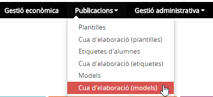
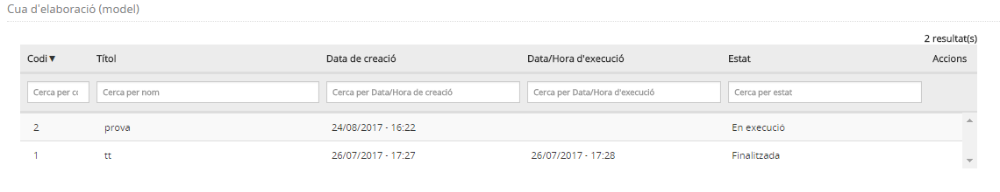

# Cua d'elaboració (models)

* [Què és](men_cua_mod.md#què-és)
* [Com s’hi accedeix](men_cua_mod.md#com-shi-accedeix)
* [Quines operacions s'hi poden fer](men_cua_mod.md#quines-operacions-shi-poden-fer)

## Què són

En aquesta opció del menú **Publicacions** es troben els models que l'usuari ha elaborat.
  

---

## Com s’hi accedeix

Per accedir-hi, heu de seleccionar l'opció del menú **Cua d'elaboració (models)** del mòdul **Publicacions**.

*Imatge 1 - Pantalla per seleccionar Cua d'elaboració (models)*
  

---

## Quines operacions s'hi poden fer

La pantalla que es mostra conté informació dels models que s'han elaborat.
  
  
L'**estat** dels models indica si s'estan elaborant (**En execució**), si s'han elaborat (**Finalitzada**) o si s'ha produït un error (**Error**).  
  
*Imatge 2 - Cua d'elaboració de models* 
  
Es poden fer dues operacions:

* [Visualitzar els models](men_cua_mod.md#visualitzar-els-models)
* [Esborrar els models](men_cua_mod.md#esborrar-els-models)

### Visualitzar els models

Per visualitzar un model, cal fer clic a la icona .

### Esborrar els models

Per esborrar un model, cal fer clic a la casella de selecció i prémer el botó .

---