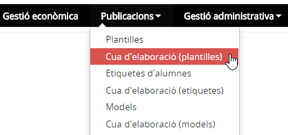
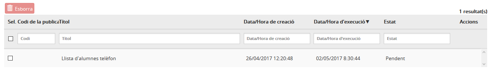

# Cua d'elaboració (plantilles)

* [Què és](men_cuad.md#que-es)
* [Com s’hi accedeix](men_cuad.md#com-shi-accedeix)
* [Quines operacions s'hi poden fer](men_cuad.md#quines-operacions-shi-poden-fer)

## Què és

En aquesta opció del menú **Publicacions** es troben les llistes i els documents que l'usuari ha elaborat.
L'elaboració de les llistes i dels documents no es fa immediatament, sinó que es du a terme en diferit. Això permet que la persona que ha donat l'ordre per elaborar el document, pugui continuar treballant amb l'aplicació.
  

---

## Com s’hi accedeix

Per accedir-hi, heu de seleccionar l'opció del menú **Cua de generació (plantilles)** del mòdul **Publicacions**.

*Imatge 1 - Pantalla per seleccionar Cua d'elaboració (plantilles)*
  

---

## Quines operacions s'hi poden fer

La pantalla que es mostra conté informació dels documents que s'han elaborat o estan en procés d'elaboració.  
  
L'**estat** del document ens indica si el document s'està elaborant (**Pendent**), si s'ha elaborat (**Generat**) o si s'ha produït un error (**Error**).  
  
*Imatge 2 - Pantalla per veure les plantilles que s'han elaborat o estan en procés d'elaboració*
  
Es poden fer dues operacions:

* [Visualitzar els documents elaborats](men_cuad.md#visualitzar-els-documents-elaborats)
* [Esborrar els documents elaborats](men_cuad.md#esborrar-els-documents-elaborats)

### Visualitzar els documents elaborats

Per visualitzar un document, cal fer clic a la icona .

### Esborrar els documents elaborats

Per esborrar un document, cal fer clic a la casella de selecció i prémer el botó .

---