# Extraccions

* [Què són](men_ext.md#que-son)
* [Com s’hi accedeix](men_ext.md#com-shi-accedeix)
* [Quines operacions s'hi poden fer](men_ext.md#quines-operacions-shi-poden-fer)

## Què són

En aquesta opció del menú **Publicacions** es defineixen i s'executen les extraccions creades pel centre.  
  

És molt important distingir la **definició de l'extracció** de **l'execució**. La definició comprèn els passos per determinar els camps que es volen, el format de sortida, els filtres que s'hi aplicaran… i en canvi l'execució és la generació de l'extracció amb dades.

  
  

---

## Com s’hi accedeix

Per accedir-hi, heu de seleccionar l'opció del menú **Extraccions** del mòdul **Publicacions**.
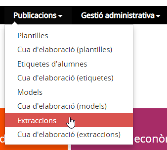*Imatge 1 - Pantalla per seleccionar Extraccions*
  

---

## Quines operacions s'hi poden fer

Les operacions que s'hi poden fer són:

* [Afegir una extracció nova](men_ext.md#afegir-una-extraccio-nova)
* [Esborrar una extracció existent](men_ext.md#esborrar-una-extraccio-existent)
* [Fer una còpia d'una extracció existent](men_ext.md#fer-una-copia-duna-extraccio-existent)
* [Modificar una extracció existent](men_ext.md#modificar-una-extraccio-existent)
* [Executar una extracció existent](men_ext.md#executar-una-extraccio-existent)

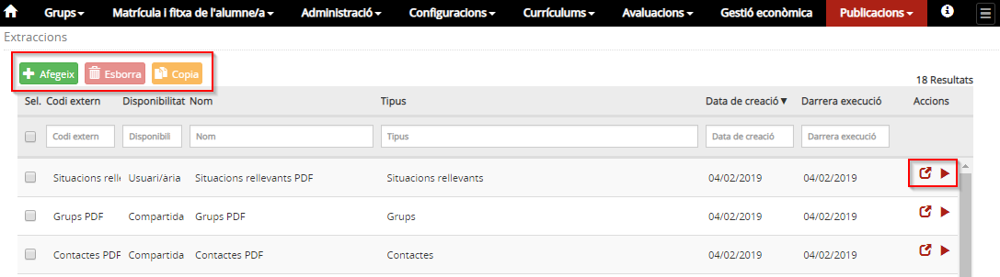*Imatge 2 - Pantalla amb les operacions que es poden fer a Extraccions*

### Afegir una extracció nova

Per afegir una nova extracció, cal prémer el botó .  
  
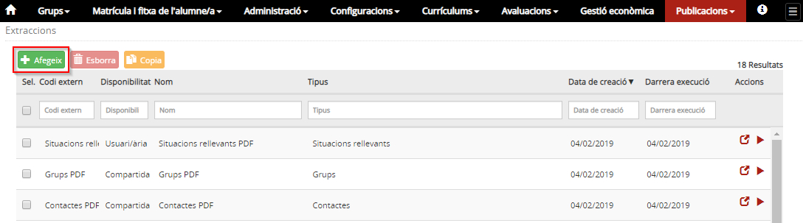*Imatge 3 - Pantalla per afegir una extracció* 
  
A continuació, caldrà emplenar les dades necessàries per configurar l'extracció.  
  
Aquestes dades estan separades en tres blocs:

* [Dades generals](men_ext.md#dades-generals)
* [Format](men_ext.md#format)
* [Filtres](men_ext.md#filtres)
* [Camps seleccionables](men_ext.md#camps-seleccionables)

#### Dades generals

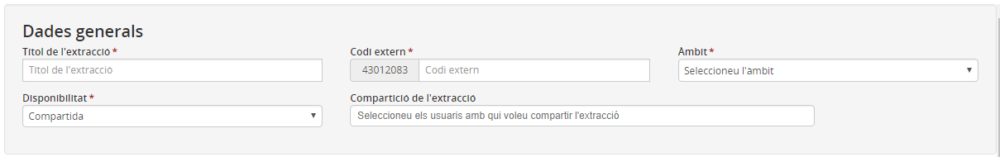*Imatge 4 - Pantalla per especificar les dades generals de l'extracció* 
  
Les dades generals de l'extracció que cal especificar són:

* **Títol de l'extracció**: És el nom amb què s'identificarà la llista.
* **Codi extern**: A cada extracció se li donarà un codi d'identificació.
* **Àmbit**: Cal seleccionar l'àmbit de les dades que es volen extreure.
* **Disponibilitat**: Les extraccions poden ser visibles només per l'usuari/ària o bé compartida.
* **Compartició de l'extracció**: En cas de ser una extracció compartida, cal seleccionar el col·lectiu amb el qual es compartirà.

#### Format

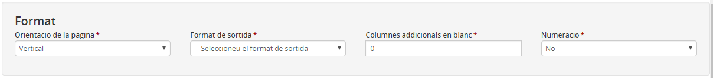*Imatge 5 - Pantalla per especificar les característiques de format de l'extracció* 
  
Les característiques del format que cal definir són:

* **Orientació de pàgina**: Es pot escollir entre "horitzontal" o "vertical".
* **Format de sortida**: Es pot escollir entre ".PDF", ".XLS" o ".RTF".
* **Columnes addicionals en blanc**: En cas que es vulguin columnes addicionals, cal especificar-ne quantes se'n volen.
* **Numeració**: Opció que incorpora una columna per numerar totes les files de l'extracció.

#### Filtres

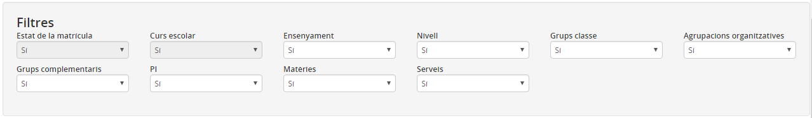*Imatge 6 - Pantalla per especificar els filtres de l'extracció* 
  
En aquest bloc s'han de seleccionar els filtres que, en el moment de l'execució, l'usuari podrà utilitzar. Aquests filtres poden ser:

* **Llista només d'alumnes**: Si s'especifica "Sí", la llista serà d'alumnes.
* **Curs escolar**: Si s'especifica "Sí", l'usuari podrà escollir de quin curs escolar vol la llista.
* **Ensenyament**: Si s'especifica "Sí", l'usuari podrà seleccionar de quins ensenyaments vol obtenir la llista en el moment d'executar l'extracció .
* **Nivell**: Si s'especifica "Sí", l'usuari podrà seleccionar de quin nivell vol obtenir la llista en el moment d'executar l'extracció .
* **Grups classe**: Si s'especifica "Sí", l'usuari podrà filtrar pels grups classe quan executi l'extracció .
* **Matèries**: Si s'especifica "Sí", l'usuari podrà filtrar per les matèries quan executi l'extracció .
* **Serveis**: Si s'especifica "Sí", l'usuari podrà filtrar pels serveis quan executi l'extracció .

#### Camps seleccionables

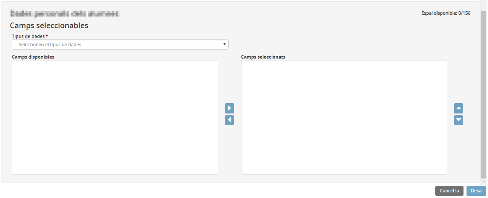*Imatge 7 - Espai per inserir els camps de l'extracció*
  
Segons l'àmbit seleccionat a [Dades generals](men_ext.md#dades-generals), l'aplicació permet seleccionar diferents tipus de dades.
  
Al costat de cada camp es mostra el nombre de caràcters que aquest ocupa, i a la part superior dreta es pot veure el nombre de caràcters que ocupen els camps seleccionats. Aquesta dada es fa servir quan el format de sortida és ".RTF" o ".PDF".  
  
Els botons 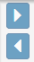 serveixen per afegir o treure camps de l'extracció; i els botons  per ordenar-ne els camps.  
  
Quan s'han emplenat les dades generals, les característiques del format i els filtres, i s'han seleccionat els camps, cal prémer el botó .  
  

---

### Esborrar una extracció existent

Per esborrar una o més extraccions, cal seleccionar les caselles de selecció corresponents i clicar al botó , tal com es mostra a la imatge següent:  
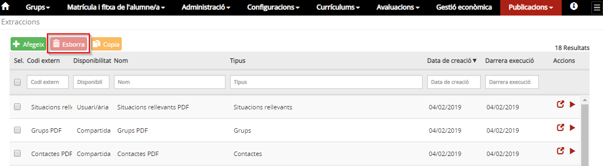*Imatge 8 - Esborrar una extracció*
  
  

---

### Fer una còpia d'una extracció existent

Aquesta opció serveix per dissenyar una extracció a partir d'una creada anteriorment.  
Per fer una còpia d'una extracció cal clicar a la casella de verificació i prémer el botó .

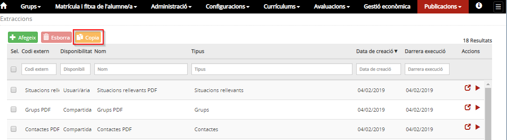*Imatge 9 - Duplicar una extracció*
  
A continuació es mostren les mateixes dades de l'extracció original, excepte els camps obligatoris **Títol de l'extracció** i **Codi extern** que han de tenir valors diferents.  
  
  

---

### Modificar una extracció existent

Per modificar una extracció cal seleccionar el botó .  
  
A continuació es mostren totes les dades de l'extracció agrupades en tres blocs tal com s'explica a [Afegir una extracció nova](men_ext.md#afegir-una-extraccio-nova).  
  
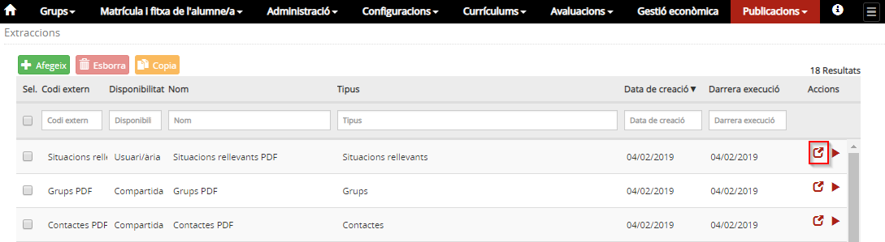*Imatge 10 - Pantalla per modificar una extracció*
  

---

### Executar una extracció existent

Aquesta funció serveix per generar una llista a partir d'una extracció.  
*Imatge 11 - Pantalla per executar una extracció*
  
Cal prémer el botó .  
  
A continuació es mostra una finestra amb els filtres que s'han definit per aquesta extracció i que serviran per filtrar les dades que sortiran a la llista generada.  
  
Per executar l'extracció, cal prémer el botó 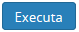. Aquest procés es fa en diferit, la qual cosa vol dir que es pot continuar treballant amb l'aplicació mentre s'elabora el document.  
  

Per consultar l'estat en què es troba l'elaboració del document, cal prémer l'opció del menú **Cua d'elaboració (extraccions)** del mòdul **Publicacions.**

  
  

---