# Plantilles

* [Què són](men_pla.md#que-son)
* [Com s’hi accedeix](men_pla.md#com-shi-accedeix)
* [Quines operacions s'hi poden fer](men_pla.md#quines-operacions-shi-poden-fer)

## Què són

En aquesta opció del menú **Publicacions** es defineixen i s'executen les plantilles creades pel centre.  
  

És molt important distingir la **definició de la plantilla** de **l'execució**. La definició comprèn els passos per determinar els camps que es volen, el format de sortida, els filtres que s'hi aplicaran… i en canvi l'execució és la generació de la plantilla amb dades.

  
  

---

## Com s’hi accedeix

Per accedir-hi, heu de seleccionar l'opció del menú **Plantilles** del mòdul **Publicacions**.

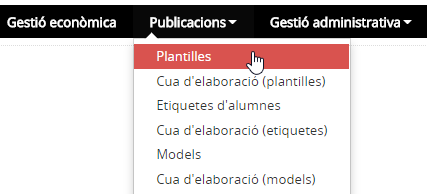*Imatge 1 - Pantalla per seleccionar Plantilles*
  

---

## Quines operacions s'hi poden fer

Les operacions que s'hi poden fer són:

* [Afegir una plantilla nova](men_pla.md#afegir-una-plantilla-nova)
* [Esborrar una plantilla existent](men_pla.md#esborrar-una-plantilla-existent)
* [Fer una còpia d'una plantilla existent](men_pla.md#fer-una-copia-duna-plantilla-existent)
* [Modificar una plantilla existent](men_pla.md#modificar-una-plantilla-existent)
* [Executar una plantilla existent](men_pla.md#executar-una-plantilla-existent)

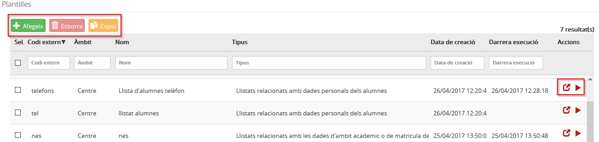*Imatge 2 - Pantalla amb les operacions que es poden fer a Plantilles*

### Afegir una plantilla nova

Per afegir una nova plantilla, cal prémer el botó .  
  
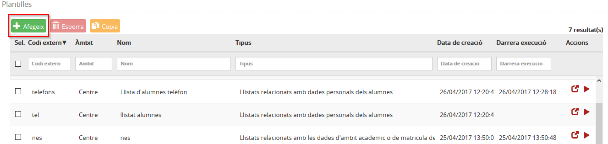*Imatge 3 - Pantalla per afegir una plantilla*
  
A continuació, caldrà emplenar les dades necessàries per a configurar la plantilla.  
  
Aquestes dades estan separades en tres blocs:

* [Dades generals](men_pla.md#dades-generals)
* [Filtres](men_pla.md#filtres)
* [Camps seleccionables](men_pla.md#camps-seleccionables)

#### Dades generals

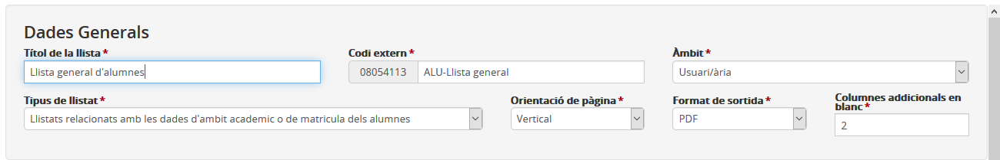*Imatge 4 - Pantalla per especificar les dades generals de la plantilla*
  
Les dades generals de la plantilla que cal especificar són:

* **Títol de la llista**: És el nom amb què s'identificarà la llista.
* **Codi extern**: A cada llista se li donarà un codi d'identificació.
* **Àmbit**: Les llistes poden ser visibles només per l'usuari o bé per tot el centre.
* **Tipus de llistat**: La llista pot contenir dades personals de l'alumne o dades de l'àmbit acadèmic.
* **Orientació de pàgina**: Es pot escollir entre "horitzontal" o "vertical".
* **Format de sortida**: Es pot escollir entre "word", "excel" o "PDF".
* **Columnes addicionals en blanc**: En cas que es vulguin columnes addicionals, cal especificar-ne quantes se'n volen.

#### Filtres

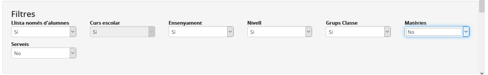*Imatge 5 - Pantalla per especificar els filtres de la plantilla*
  
En aquest bloc s'han de seleccionar els filtres que, en el moment de l'execució, l'usuari podrà utilitzar. Aquests filtres poden ser:

* **Llista només d'alumnes**: Si s'especifica "Sí", la llista serà d'alumnes.
* **Curs escolar**: Si s'especifica "Sí", l'usuari podrà escollir de quin curs escolar vol la llista.
* **Ensenyament**: Si s'especifica "Sí", l'usuari podrà seleccionar de quins ensenyaments vol obtenir la llista en el moment d'executar la plantilla.
* **Nivell**: Si s'especifica "Sí", l'usuari podrà seleccionar de quin nivell vol obtenir la llista en el moment d'executar la plantilla.
* **Grups classe**: Si s'especifica "Sí", l'usuari podrà filtrar pels grups classe quan executi la plantilla.
* **Matèries**: Si s'especifica "Sí", l'usuari podrà filtrar per les matèries quan executi la plantilla.
* **Serveis**: Si s'especifica "Sí", l'usuari podrà filtrar pels serveis quan executi la plantilla.

#### Camps seleccionables

Si en el camp "Tipus de llista" del bloc de [Dades generals](men_pla.md#dades-generals) s'ha escollit "Llistes relacionades amb les dades personals dels alumnes", els camps que es poden seleccionar estan agrupats en les següents pestanyes:

* Identificació
* Tutors
* Contactes
* Serveis
* Situacions rellevants

i corresponen a les dades de l'àmbit personal de la fitxa de l'alumne/a tal com es mostra a la imatge següent:  
  
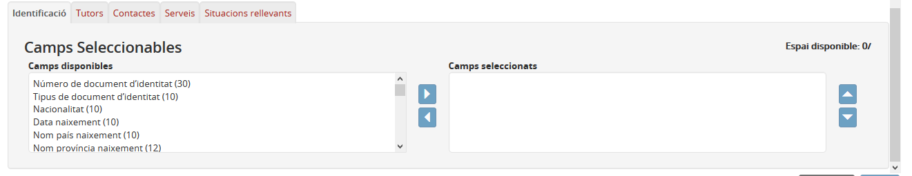*Imatge 6 - Pantalla per seleccionar els camps de l'alumne/a de l'àmbit personal*
  
Al costat de cada camp es mostra el nombre de caràcters que aquest ocupa, i a la part superior dreta es pot veure el nombre de caràcters que ocupen els camps seleccionats. Aquesta dada es fa servir quan el format de sortida és "word" o "PDF".  
  
Els botons  serveixen per afegir o treure camps de la plantilla; i els botons  per ordenar-ne els camps.  
  
Si en el camp "Tipus de llista" del bloc [Dades generals](men_pla.md#dades-generals) s'ha escollit "Llistes relacionades amb les dades de l'àmbit acadèmic o de matrícula", els camps que es poden seleccionar estan agrupats en les següents pestanyes:

* Dades de la matrícula
* Dades d'accés i de finalització
* Atenció a la diversitat

i corresponen a les dades de l'àmbit acadèmic de la fitxa de l'alumne/a tal com es mostra a la imatge següent:  
  
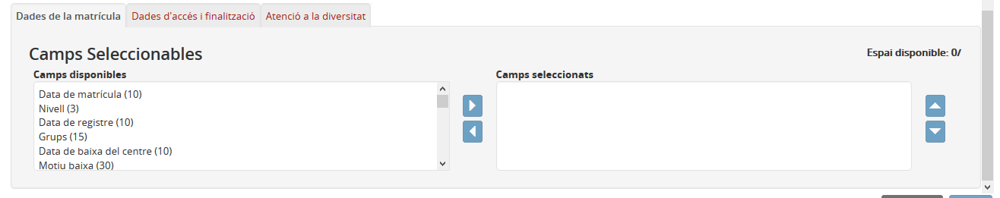*Imatge 7 - Pantalla per seleccionar els camps de l'alumne/a de l'àmbit acadèmic*
  
Quan s'han emplenat les dades generals i els filtres, i s'han seleccionat els camps, cal prémer el botó .  
  

---

### Esborrar una plantilla existent

Per esborrar una o més plantilles, cal seleccionar les caselles de selecció corresponents i clicar al botó , tal com es mostra a la imatge següent:  
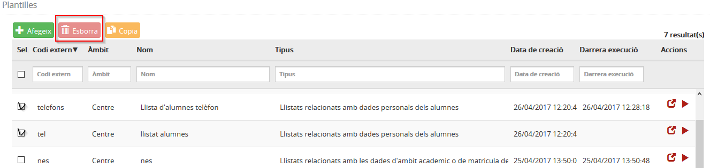*Imatge 8 - Pantalla per esborrar una plantilla*
  
  

---

### Fer una còpia d'una plantilla existent

Aquesta opció serveix per dissenyar una plantilla a partir d'una creada anteriorment.  
Per fer una còpia d'una plantilla cal clicar a la casella de verificació i prémer el botó .

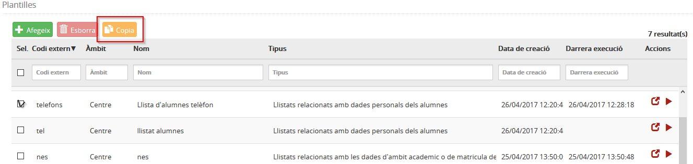*Imatge 9 - Pantalla per duplicar una plantilla*
  
A continuació es mostren les mateixes dades de la plantilla original, excepte els camps **Títol de la llista** i **Codi extern** que han de tenir valors diferents.  
  
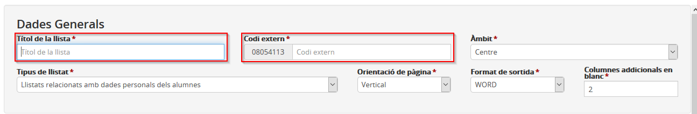*Imatge 10 - Pantalla per especificar el títol de la llista i el codi extern*
  

---

### Modificar una plantilla existent

Per modificar una plantilla cal seleccionar el botó .  
  
A continuació es mostren totes les dades de la plantilla agrupades en tres blocs tal com s'explica a [Afegir una plantilla nova](men_pla.md#afegir-una-plantilla-nova).  
  
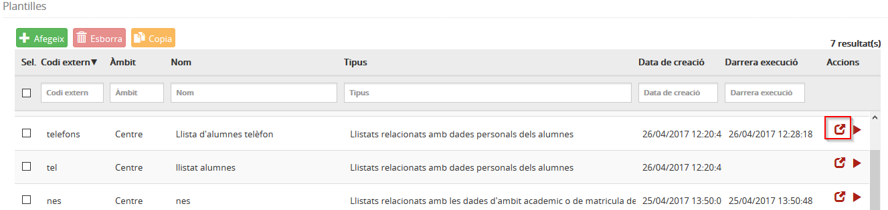*Imatge 11 - Pantalla per modificar una plantilla*
  

---

### Executar una plantilla existent

Aquesta funció serveix per generar una llista a partir d'una plantilla.  
*Imatge 12 - Pantalla per executar una plantilla*
  
Cal prémer el botó .  
  
A continuació es mostra una finestra amb els filtres que s'han definit per aquesta plantilla i que serviran per filtrar les dades que sortiran a la llista generada.

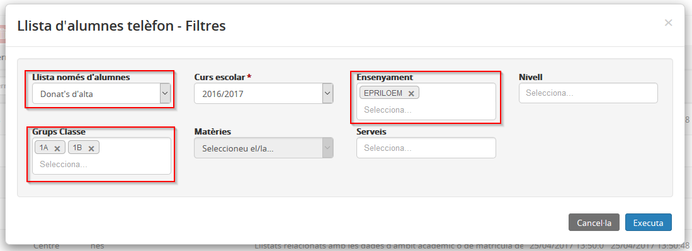*Imatge 13 - Pantalla per seleccionar tots els alumnes donats d'alta dels grups 1A i 1B*
  
Per executar la plantilla, cal prémer el botó . Aquest procés es fa en diferit, la qual cosa vol dir que es pot continuar treballant amb l'aplicació mentre s'elabora el document.  
  

Per consultar l'estat en què es troba l'elaboració del document, cal prémer l'opció del menú **Cua d'elaboració (plantilles)** del mòdul **Publicacions.**

  
  

---