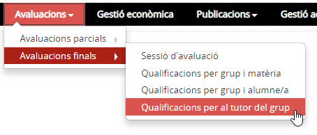
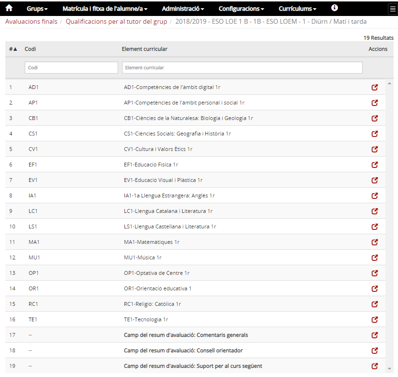
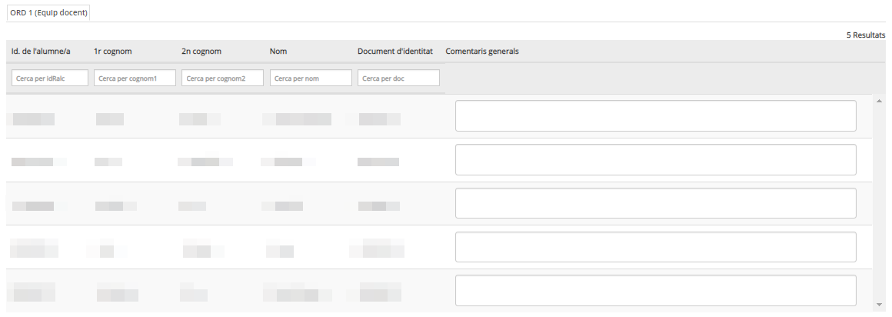

# Qualificacions per al tutor del grup

* [Què és](aftutor.md#que-es)
* [Com s'hi accedeix](aftutor.md#com-shi-accedeix)
* [Quines operacions s'hi poden fer](aftutor.md#quines-operacions-shi-poden-fer)

### Què és

Des d'aquesta opció del menú els tutors, en estat equip docent, poden preparar la sessió d'avaluació.

### Com s'hi accedeix?

Per accedir s'ha de seleccionar l'opció de menú Qualificacions per al tutor del grup del submòdul Avaluacions finals del mòdul Avaluacions.

*Imatge 1 - Accés al menú d'Avaluacions finals pel tutor*

### Quines operacions s'hi poden fer

Aquesta opció li permet al tutor veure les qualificacions de tots els alumnes matèria per matèria:

* Entrar el resum del consell orientador (ESO)
* Entrar les comentaris generals a l'avaluació de tots els alumnes
* Informar, si escau, la proposta de mesures d'atenció a l'alumnat (ESO)

*Imatge 2 - Llista de matèries del grup classe*

*Imatge 3 - Detall de la pantalla Comentaris generals*