## Banc de frases

* [Què són](apbancsf.md#què-són)
* [Com s'hi accedeix](apbancsf.md#com-shi-accedeix)
* [Quines operacions s'hi poden fer](apbancsf.md#quines-operacions-shi-poden-fer)

### Què són

El banc de frases és una col·lecció de frases codificades que el centre estableix per a complementar les qualificacions a les avaluacions parcials.

### Com s'hi accedeix

Per accedir-hi, heu de seleccionar l'opció del menú **Banc de frases** del submòdul **Avaluacions parcials** del mòdul **Avaluacions**.
  
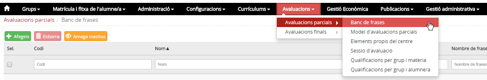*Imatge 1 - Accés al menú Banc de frases del mòdul Avaluacions parcials*
  
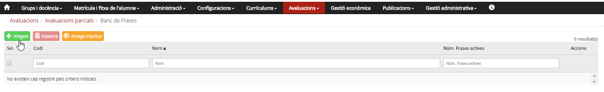*Imatge 2 - Taula de banc de frases*

Es mostra la taula del banc de frases del centre.

* Hi ha els camps **Codi, Nom, Número de frases actives i Accions**
* Hi ha camps en blanc per aplicar filtres, si cal.
* A sobre de la taula hi ha tres botons 

### Quines operacions s'hi poden fer

* [Crear banc de frases](apbancsf.md#crear-banc-de-frases)
* [Editar banc de frases](apbancsf.md#editar-banc-de-frases)

  + [Afegir frases al banc](apbancsf.md#afegir-frases-al-banc)
  + [Associar el banc als elements avaluables](apbancsf.md#associar-el-banc-als-elements-avaluables)

#### Crear banc de frases

Per crear un banc de frases, s'ha de prémer el botó  que hi ha sobre de la taula.
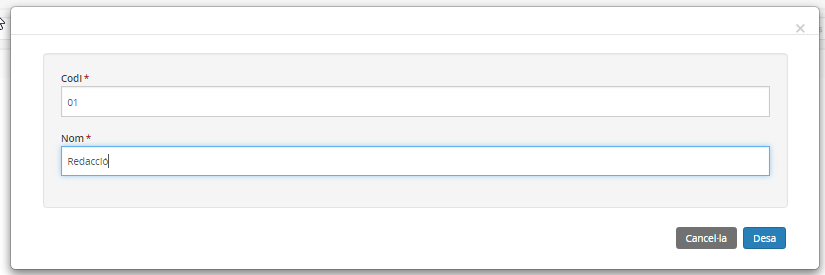*Imatge 3 - Formulari de creació d'un banc de frases*   
Heu d'entrar un codi i un nom i prémer el botó .  
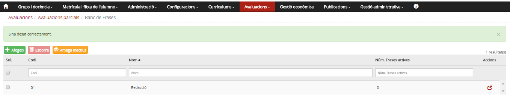*Imatge 4 - Taula de bancs de frases 1*

Després de desar, surt el missatge assegurant que la frase s'ha afegit a la taula.

#### Editar banc de frases

Per editar les dades d'un banc de frases, heu de prémer la icona .  
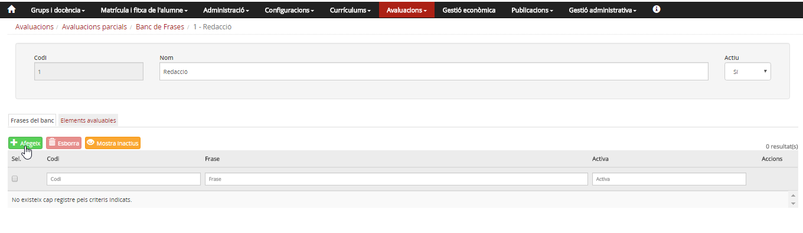*Imatge 5 - Pantalla d'edició d'un banc de frases*

A la part superior de la pantalla hi ha el codi, el nom i un desplegable que permet activar o desactivar el banc de frases.  
Hi ha les pestanyes **Frases del banc** i **Elements avaluables**.

#### Afegir frases al banc

Per afegir frases al banc, a la pestanya **Frases del banc**, s'ha de prémer el botó  que hi ha sobre de la taula.  
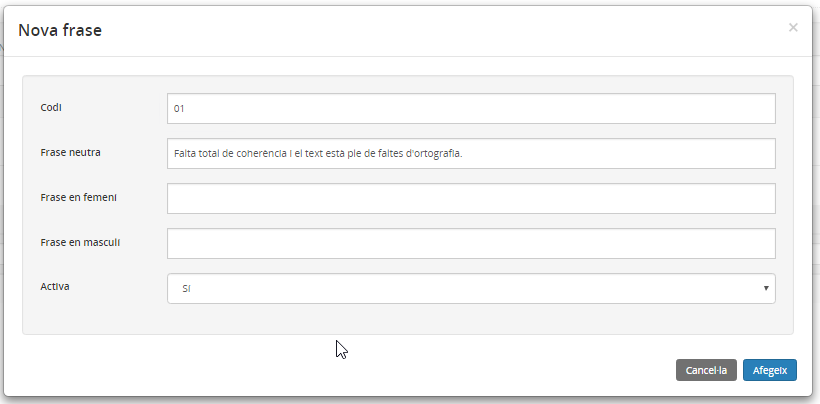*Imatge 6 - Pantalla d'entrada de frases a un banc*
  
Cal introduir la informació següent:

* El **codi**
* La **frase**, on s'ha d'escriure una frase neutra o bé dues frases diferents (una en masculí i una altra en femení) que el programa assignarà en funció del sexe de l'alumne.
* S'ha de seleccionar si la frase està activa.

Després d'entrar les dades s'ha de prémer .

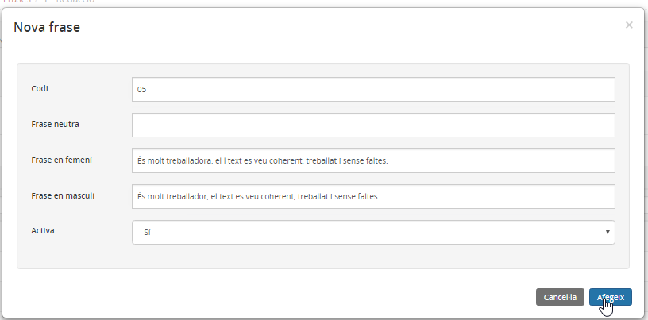*Imatge 7 - Pantalla d'entrada de frases a un banc, en masculí i en femení*

Després de prémer , la frase es mostra a la taula de frases del banc.
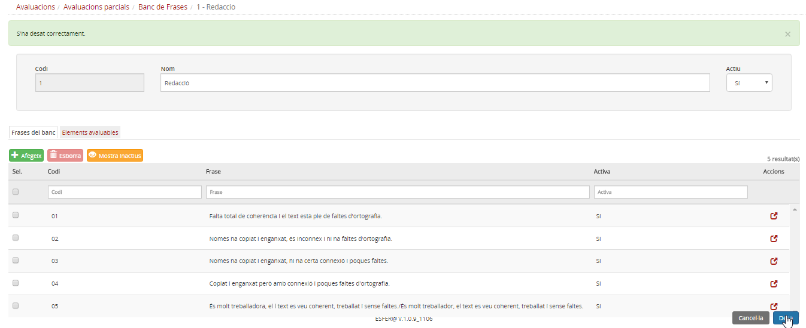*Imatge 8 - Taula de frases d'un banc de frases*

#### Associar el banc als elements avaluables

Abans d'iniciar aquest procés, cal haver seleccionat el tipus de model d'avaluació parcial a l'opció del menú **Model d'avaluacions parcials** del mòdul **Avaluacions**.

Per associar el banc a elements avaluables, s'ha de seleccionar la pestanya **Elements avaluables**.
  
La pantalla mostra la taula d'elements avaluables associats al banc:

* Els camps **Codi, Nom i Nivell**.
* Hi ha unes caixes per entrar filtres, per facilitar la cerca.
* En la part superior hi ha dos botons  i  .

S'ha de prémer el botó .

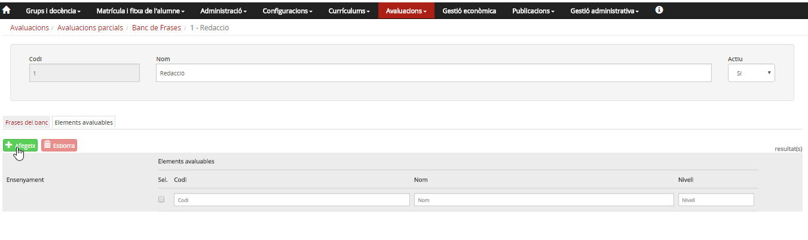*Imatge 9 - Selecció de la pestanya Elements avaluables*
  
S'ha de seleccionar l'ensenyament al qual es vol associar el banc.

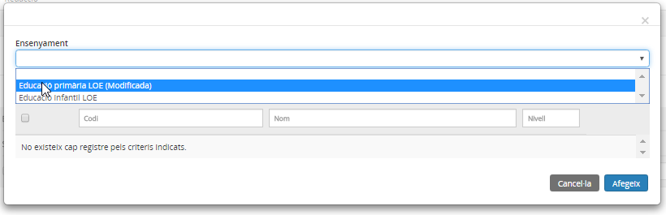*Imatge 10 - Selecció de l'ensenyament*

Després de seleccionar l'ensenyament s'han de marcar els elements que es volen associar al banc, i prémer .

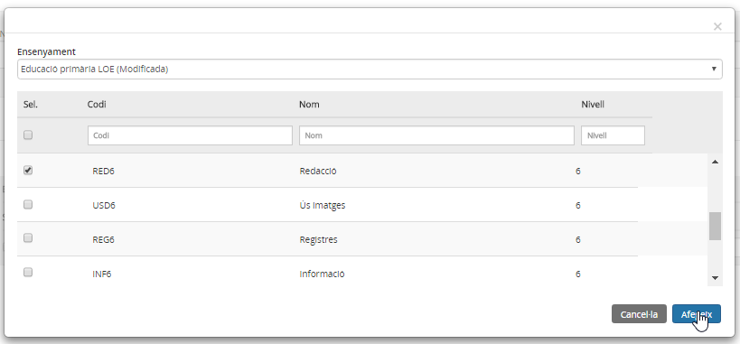*Imatge 11 - Selecció dels elements avaluables*

Per finalitzar l'associació i desar totes les dades s'ha de prémer el botó .

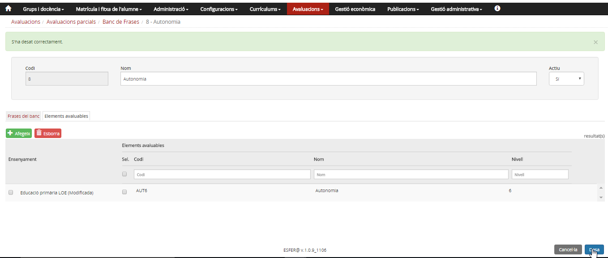*Imatge 12 - Pantalla d'associació d'un banc als elements avaluables*

Els bancs de frases faciliten l'entrada de comentaris [1)](apbancsf.md#1) a les avaluacions parcials.

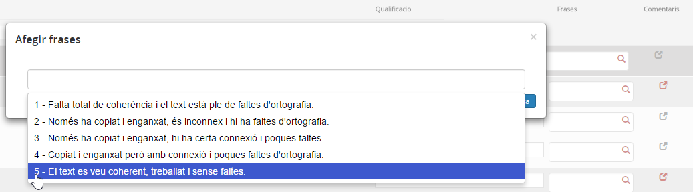*Imatge 13 - Exemple de frases codificades a la pantalla de l'avaluació*

[1)](apbancsf.md#1)
A comentaris de l'alumne s'afegeix una frase "estàndard" que ha creat el centre, que un cop desada es pot editar.