## Model d'avaluacions parcials

* [Què són](aptipolo.md#què-són)
* [Com s'hi accedeix](aptipolo.md#com-shi-accedeix)
* [Quines operacions s'hi poden fer](aptipolo.md#quines-operacions-shi-poden-fer)

### Què són

L'opció del menú [Model d'avaluacions parcials](aptipolo.md#model-davaluacions-parcials) permet que el centre estableixi com vol fer les avaluacions parcials.[1)](aptipolo.md#1)

* **[Model d'avaluació parcial basada en la normativa](aptipolo.md#model-davaluació-parcial-basada-en-la-normativa)**: S'avaluen els elements curriculars que l'alumne té a la matrícula amb els literals que la normativa estableix per a l'ensenyament.
* **[Model d'avaluació parcial pròpia del centre](aptipolo.md#model-davaluació-parcial-pròpia-del-centre)**: S'avaluen els elements i amb els literals que disposi el centre d'acord amb el seu projecte educatiu.

Podeu canviar el model de les avaluacions mentre no s'hagi iniciat l'avaluació de cap grup de l'ensenyament.[2)](aptipolo.md#2)  
Un cop iniciades no es pot canviar el model d'avaluació de l'ensenyament.

En triar un model d'avaluació parcial, **es genera automàticament la 1a sessió d'avaluació parcial** per a l'ensenyament corresponent en estat "Secretaria". Mentre tots els grups classe de l'ensenyament es mantinguin en aquest estat, es pot seguir treballant amb les mateixes condicions que abans de seleccionar el model d'avaluació.

### Com s'hi accedeix

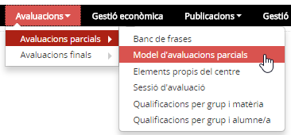*Imatge 1 - Accés a la definició del model de les avaluacions parcials*

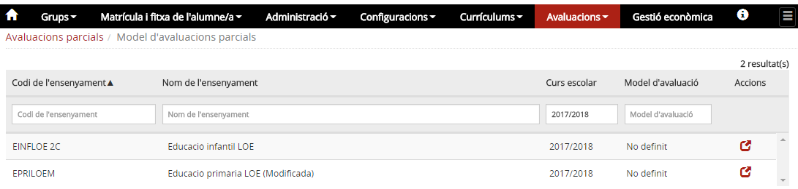*Imatge 2 - Llista d'ensenyaments del centre*   
A la pantalla es mostra una llista dels ensenyaments del centre. El model d'avaluació parcial serà "No definit" fins que no s'hagi escollit un model concret.

### Quines operacions s'hi poden fer

#### Model d'avaluació parcial basada en la normativa

Si es volen fer les avaluacions parcials com les finals:

* Accedir a l'opció del menú **Model de les avaluacions parcials** del submòdul **Avaluacions parcials** del mòdul **Avaluacions**.
* Prémer la icona  corresponent a l'ensenyament.
* Triar l'opció **Basada en la normativa**
* Prémer el botó .

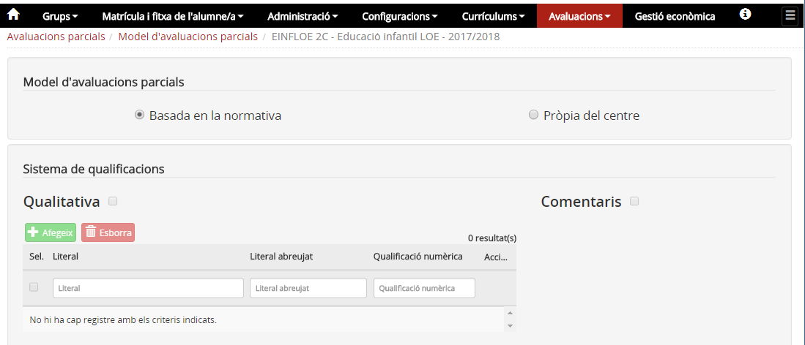*Imatge 3 - Definició del model de les avaluacions parcials com les finals*  
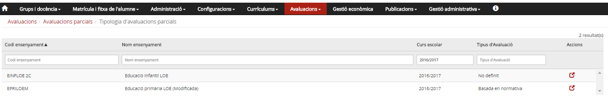*Imatge 4 - Visualització del model de les avaluacions parcials*

Aquesta opció no està operativa per a l'educació infantil, donat que no correspon.

#### Model d'avaluació parcial pròpia del centre

Si es volen fer les avaluacions parcials amb el model d'avaluació pròpia del centre:

* Accedir a l'opció del menú **Model de les avaluacions parcials** del submòdul **Avaluacions parcials** del mòdul **Avaluacions**.
* Prémer la icona  corresponent a l'ensenyament.

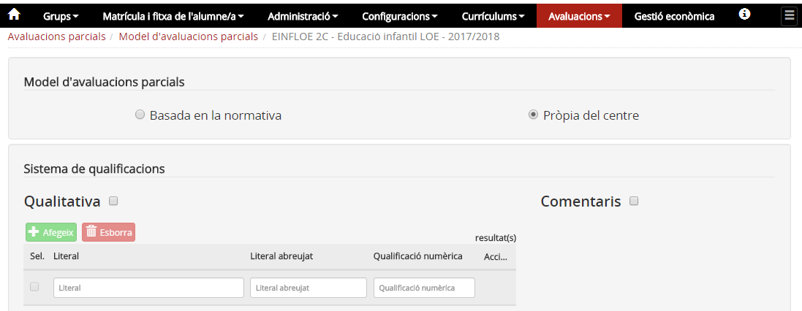*Imatge 5 - Definició del model de les avaluacions parcials amb el model d'avaluació pròpia del centre*

* Escollir l'opció **Pròpia del centre**.
* Triar els literals:

  + Si es volen avaluar els elements propis del centre però utilitzar per a l'avaluació els **literals que estableix la normativa** per a l'ensenyament cal:

    - Prémer el botó .
  + Si per a l'avaluació es volen fer servir **literals propis del centre**, cal:

    - Seleccionar els literals normatius i prémer el botó .

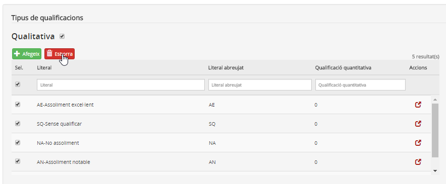*Imatge 6 - Eliminació dels literals normatius* 
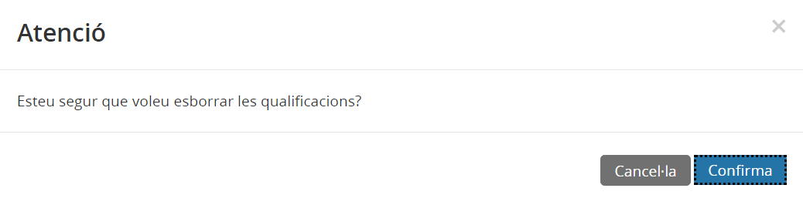*Imatge 7 - Missatge de confirmació de l'eliminació*

* **Afegir/modificar els literals propis del centre:**

Els literals **no es mantenen d'un curs per un altre**. Cal afegir-los en seleccionar el model d'avaluació parcial pròpia del centre.

* Prémer el botó .

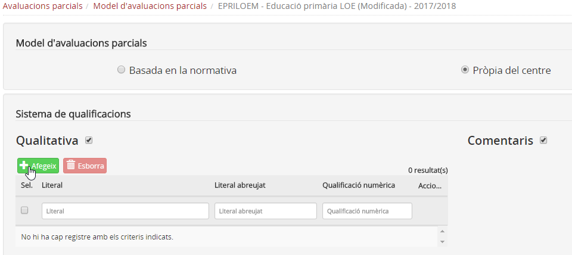*Imatge 8 - Edició de les dades dels literals de centre*

* Entrar les dades del literal: **Literal**, **Literal abreujat** [3)](aptipolo.md#3) i **Qualificació quantitativa** [4)](aptipolo.md#4).
* Prémer el botó 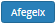.

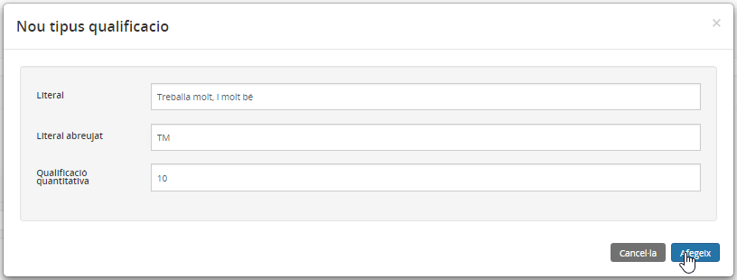*Imatge 9 - Literal creat pel centre*   

L'aplicació limita a **10 literals** i a una extensió màxima de **30 caràcters** de longitud per a cadascun.

* Repetir el procés fins a tenir tots els literals.

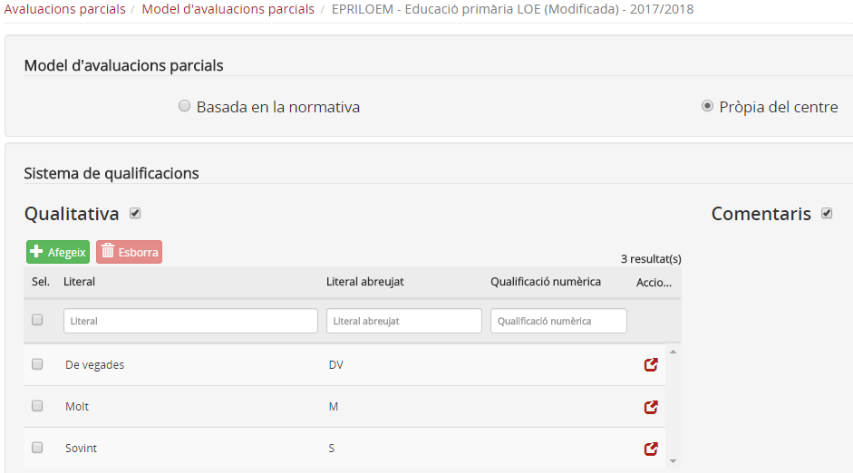*Imatge 10 - Llista de literals del centre*

* Per finalitzar, heu de prémer el botó  que hi ha al peu de la pantalla.

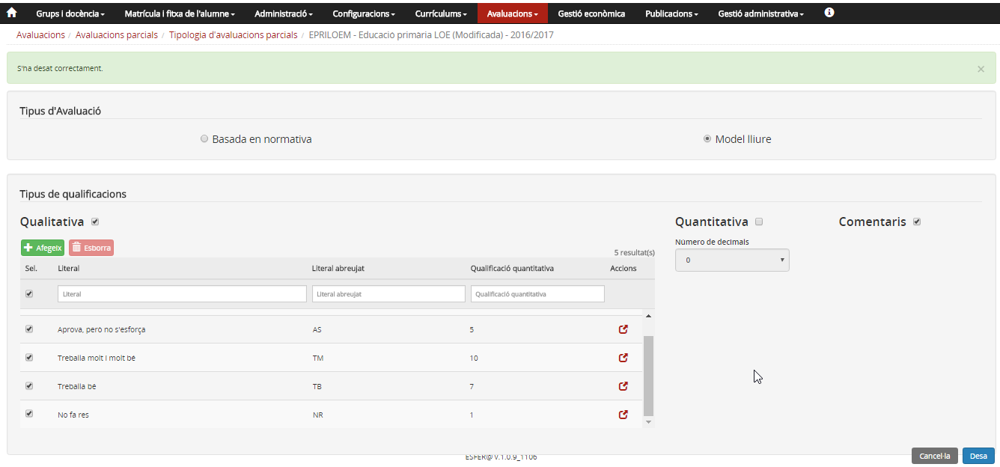*Imatge 11 - Llista de literals que ha definit el centre*  
Després de desar els literals apareix el missatge de confirmació.

* **Fer la baixa/Activar els literals propis del centre:**

  + Seleccionar la casella corresponent al literal a donar de baixa.
  + Prémer el botó .
  + Confirmar l'acció a la pantalla emergent.
* Per finalitzar, heu de prémer el botó  que hi ha al peu de la pantalla.

#### Entrada de qualificacions numèriques

Aquesta opció no es preveu per a l'educació infantil i l'educació primària.

El centre pot decidir entrar les qualificacions de forma numèrica, en aquest cas cal:

* Accedir a l'opció del menú **Model de les avaluacions parcials** del submòdul **Avaluacions parcials** del mòdul **Avaluacions**.
* Prémer la icona  corresponent a l'ensenyament.
* Marcar l'entrada de qualificacions **Numèrica**.
* Prémer el botó.

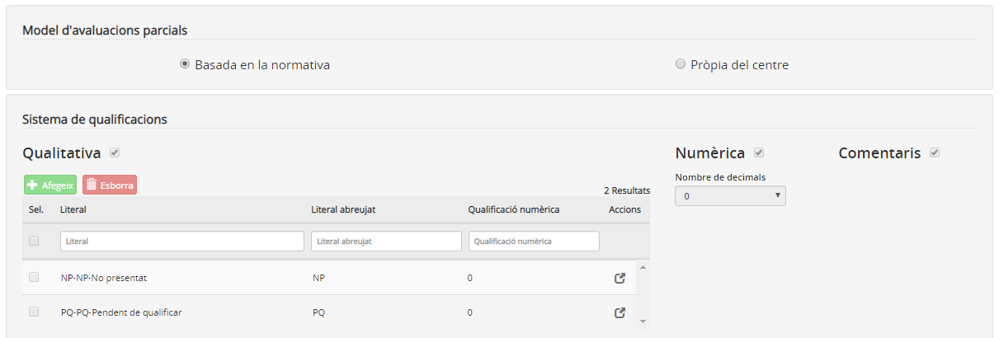*Imatge 12 - Selecció de l'entrada de qualificacions numèrica*   
En aquest cas el centre pot escollir el nombre de decimals que vol utilitzar.
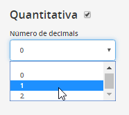*Imatge 13 - Selecció del nombre de decimals*

[1)](aptipolo.md#1)
Per cada curs escolar i ensenyament.

[2)](aptipolo.md#2)
O bé no s'han creat les sessions o bé es troben en estat **secretaria**.

[3)](aptipolo.md#3)
Codi per facilitar l'entrada.

[4)](aptipolo.md#4)
Correspondència numèrica de la qualificació.