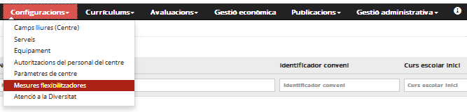
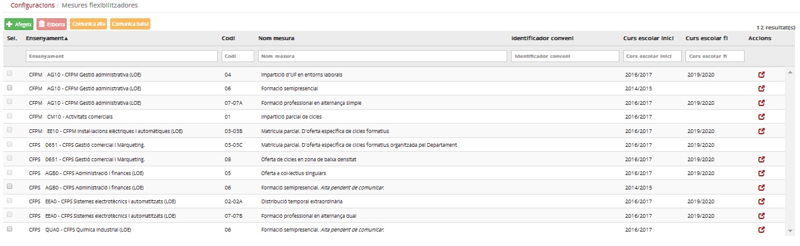

# Mesures flexibilitzadores

* [Què són](mf.md#què-són)
* [Com s’hi accedeix](mf.md#com-shi-accedeix)
* [Quines operacions s'hi poden fer](mf.md#quines-operacions-shi-poden-fer)

## Què són

Les mesures flexibilitzadores permeten validar els aprenentatges adquirits amb l’experiència laboral i acreditar determinats continguts curriculars (mòduls professionals i unitats formatives) d’un cicle formatiu. Tenen com a finalitat:

* facilitar la formació al llarg de la vida;
* millorar la qualificació professional de les persones;
* afavorir l'adaptació dels estudis a les situacions personals i professionals;
* millorar l'oferta i la qualitat de l'educació.

Esfer@ permet enregistrar les mesures que el centre aplicarà a l'alumne i reflectir-ho en els seus resultats acadèmics.

---

## Com s’hi accedeix

Per accedir-hi, heu de seleccionar l'opció del menú **Mesures flexibilitzadores** del mòdul **Configuracions**.  
  
*Imatge 1 - Accés a les Mesures flexibilitzadores*

*Imatge 2 - Llista de mesures flexibilitzadores*

---

## Quines operacions s'hi poden fer

Les mesures que s'han d'aplicar **es gestionen des del mòdul Configuracions**. En la majoria de casos les ha d'autoritzar el Departament i en un cas, és el centre qui ha de comunicar al Departament que la implanta.

| Codi de la mesura | Nom de la mesura flexibilitzadora | Observacions |
| --- | --- | --- |
| 01 | Impartició parcial de cicles | L'autoritza el Departament. |
| 02-02A | Distribució temporal extraordinària | L'autoritza el Departament. |
| 03-03B | Matrícula parcial. D'oferta específica de cicles formatius | L'autoritza el Departament. |
| 03-03C | Matrícula parcial. D'oferta específica de cicles formatius organitzada pel Departament | L'autoritza el Departament. |
| 04 | Impartició d’unitats formatives en entorns laborals | L'autoritza el Departament. |
| 05 | Oferta a col·lectius singulars | L'autoritza el Departament. |
| 06 | Formació semipresencial | El centre comunica al Departament que la impartirà. |
| 07-07A | Formació professional en alternança simple | L'autoritza el Departament. |
| 07-07B | Formació professional en alternança dual | L'autoritza el Departament. |
| 08 | Oferta de cicles en zones de baixa densitat | L'autoritza el Departament. |

Segons la mesura cal emplenar camps diferents.

|  |  |  |  |
| --- | --- | --- | --- |
| Codi de la mesura | Nom de la mesura flexibilitzadora | Indicacions del centre |  |
| 01 | Impartició parcial de cicles | - Marcar que no s'implanta el cicle complet.  - Mòduls i unitats formatives que s'implanten. |  |
| 02-02A | Distribució temporal extraordinària | - Marcar que s'implanta la mesura en el centre amb indicació de la durada. |  |
| 03-03B | Matrícula parcial. D'oferta específica de cicles formatius | - Marcar que s'implanta la mesura en el centre.  - NIF i nom de l'empresa, i país si és estrangera.  - Identificador del conveni en l'aplicació departamental. | Múltiple |
| 03-03C | Matrícula parcial. D'oferta específica de cicles formatius organitzada pel Departament | - Marcar que s'implanta la mesura en el centre. | Múltiple |
| 04 | Impartició d’unitats formatives en entorns laborals | - Marcar que s'implanta la mesura en el centre.  - Unitats formatives i hores que es fan a l'empresa.  - NIF i nom de l'empresa, i país si és estrangera.  - Identificador del conveni de l'aplicació departamental. |  |
| 05 | Oferta a col·lectius singulars | - Marcar l'alumne que s'hi acull.  - Si no té els requisits d'accés marcar-ho en el camp corresponent.  - Identificador del conveni (aplicació departamental).  - NIF i nom de l'empresa (si és estrangera s'ha d'especificar-ne el país). |  |
| 06 | Formació semipresencial | - Marcar que el centre ofereix aquesta modalitat.  - En fer-ho es trametrà un correu a determinades persones dels serveis territorials i dels serveis centrals per comunicar-los que el centre ofereix aquesta modalitat. |  |
| 07-07A | Formació professional en alternança simple | - Marcar que s'implanta la mesura en el centre.  - NIF i nom de l'empresa, i país si és estrangera.  - Identificador del conveni en l'aplicació departamental. | Múltiple |
| 07-07B | Formació professional en alternança dual | - Marcar que s'implanta la mesura en el centre.  - Mòduls que s'ofereixen.  - NIF i nom de l'empresa, i el país si és estrangera.  - Identificador del conveni en l'aplicació departamental.  - Tipus d'organització currícular (A/B). | Múltiple |
| 08 | Oferta de cicles en zones de baixa densitat | - Marcar que no s'imparteix el cicle complet.  - Mòduls i unitats formatives que s'imparteixen. |  |

A la fitxa de l'alumne cal emplenar les mesures corresponents:

| Codi de la mesura | Nom de la mesura flexibilitzadora | Indicacions sobre l'alumne |
| --- | --- | --- |
| 01 | Impartició parcial de cicles | - - |
| 02-02A | Distribució temporal extraordinària | -Indicar que l'alumne s'hi acull. |
| 03-03B | Matrícula parcial. D'oferta específica de cicles formatius | - Indicar que l'alumne s'hi acull.  - Si no té els requisits d'accés marcar-ho en el camp corresponent.  - Identificador del conveni (cal escollir el conveni dels disponibles per a la mesura segons el mòdul Configuracions).  - NIF i nom de l'empresa (si és estrangera cal especificar-ne el país). Seleccionar l'empresa de les disponibles per a la mesura, segons el mòdul Configuracions. |
| 03-03C | Matrícula parcial. D'oferta específica dels cicles formatius organitzada pel Departament | - Indicar que l'alumne s'hi acull.  - Si no té els requisits d'accés marcar-ho en el camp corresponent. |
| 04 | Impartició d’unitats formatives en entorns laborals | - - |
| 05 | Oferta a col·lectius singulars | - Indicar que l'alumne s'hi acull.  - Si no té els requisits d'accés marcar-ho en el camp corresponent.  - Identificador del conveni (cal escollir el conveni dels disponibles per a la mesura segons el mòdul Configuracions).  - NIF i nom de l'empresa (si és estrangera, cal especificar-ne el país). Seleccionar l'empresa de les disponibles per a la mesura, segons el mòdul de configuracions. |
| 06 | Formació semipresencial | - Indicar que l'alumne s'hi acull.  -Mòdul professional i unitat formativa que farà en aquesta modalitat (en aquest cas s'han de mostrar els continguts que l'alumne tingui en el seu currículum). |
| 07-07A | Formació professional en alternança simple | - Indicar que l'alumne s'hi acull.  - Nombre d'hores que fa a la empresa.  - Identificador del conveni (cal escollir el conveni dels disponibles per a la mesura segons el mòdul Configuracions).  - NIF i nom de l'empresa (si és estrangera cal especificar-ne el país). |
| 07-07B | Formació professional en alternança dual | - Indicar que l'alumne s'hi acull.  - Mòduls professionals i unitats formatives que es fan en dual.  - Hores a l'empresa dels mòduls professionals i de les unitats formatives que es cursa en dual.  - NIF i nom de l'empresa (si és estrangera cal especificar-ne el país).  - Identificador del conveni (cal escollir el conveni dels disponibles per a la mesura segons el mòdul Configuracions).  - País on es fa el projecte. |
| 08 | Oferta de cicles en zona de baixa densitat | - - |

