# Serveis

* [Què són](serveis.md#què-són)
* [Com s'hi accedeix](serveis.md#com-shi-accedeix)
* [Quines operacions s'hi poden fer](serveis.md#quines-operacions-shi-poden-fer)

  + [Servei de menjador](serveis.md#servei-de-menjador)
  + [Servei de transport](serveis.md#servei-de-transport)

    - [Línies](serveis.md#línies)
    - [Vehicles](serveis.md#vehicles)
    - [Parades](serveis.md#parades)

## Què són

Els centres educatius necessiten un conjunt de serveis escolars complementaris, singulars i de suport, que facilitin la tasca docent que duen a terme.

Entre aquests serveis cal considerar els serveis complementaris de transport i menjador escolar, especialment per a tots aquells alumnes que per ser escolaritzats han de ser traslladats a un municipi diferent del de la seva residència i que tenen dret a la gratuïtat d'aquests serveis. Però també per
a tots aquells alumnes que viuen molt allunyats del centre docent o que tenen necessitats socioeconòmiques, als quals de vegades també se'ls concedeix
el servei de transport escolar.

Als centres que ofereixen el servei de menjador i/o el de transport, els interessa categoritzar la informació per facilitar la gestió dels alumnes que són usuaris d’aquests serveis. Això implica enregistrar la informació de les línies, les parades, els vehicles, etc. Aquesta informació es farà servir quan s'assignin els serveis a l'alumne.  
  
  

---

## Com s'hi accedeix

S'ha d'escollir l'opció **Serveis** del mòdul **Configuracions**.

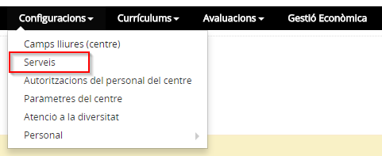*Imatge 1 - Accés a l'apartat Serveis*

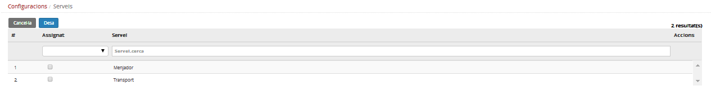*Imatge 2 - Pantalla per seleccionar els serveis*

  
  
  

---

## Quines operacions s'hi poden fer

Es poden definir les dades complementàries del servei de menjador i les línies, vehicles i parades del servei de transport.  
  
  

---

### Servei de menjador

Per accedir a la configuració del servei del menjador, cal marcar-lo a la pantalla de la llista de serveis i prémer la icona .

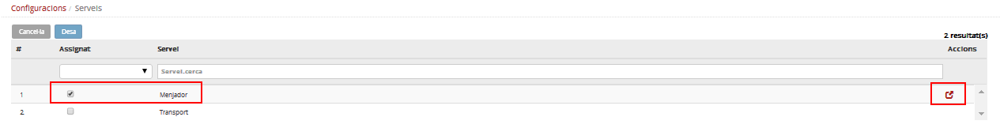*Imatge 3 - Selecció del servei del menjador*

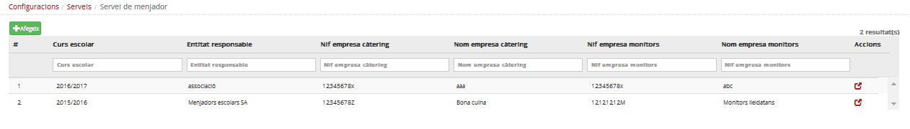*Imatge 4 - Llista de les entitats responsables del servei de menjador*

Aquesta pantalla mostra la llista d'entitats responsables que el centre ha enregistrat.

Per enregistrar una nova entitat cal prémer el botó .

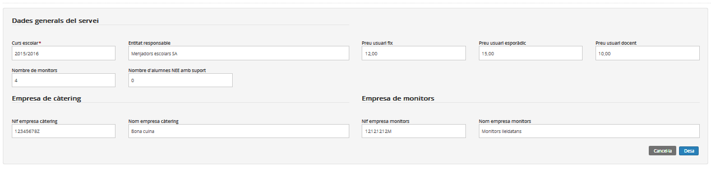*Imatge 5 - Edició de les dades d'una empresa del servei de menjador*

Per editar un servei del menjador ja registrat, cal prémer la icona  de la columna "Accions".

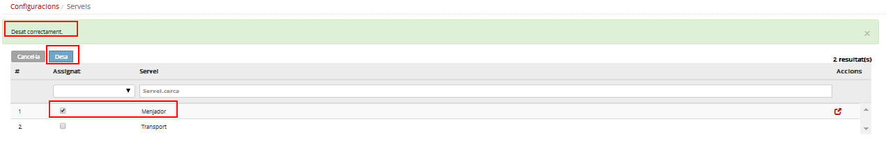*Imatge 6 - Pantalla per seleccionar els serveis*

Si no es prem el botó  de la pantalla **Serveis**, no es podrà marcar que s'utilitza aquest servei en la fitxa de l'alumne.

  
  
 

---

### Servei de transport

Per organitzar aquest servei s'han d'emplenar les dades de:

* [les línies;](serveis.md#les-línies)
* [els vehicles;](serveis.md#els-vehicles)
* [les parades.](serveis.md#les-parades)

#### Línies

En primer lloc, s'han de definir les línies.

A la pantalla **Configuracions > Serveis** es marca **Transport** i es clica a la icona .

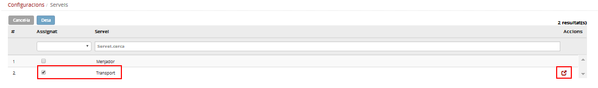*Imatge 7 - Pantalla per seleccionar el servei de transport*

En aquesta pantalla es mostra la llista de línies definides pel centre. Per afegir-ne una de nova es prem el botó .

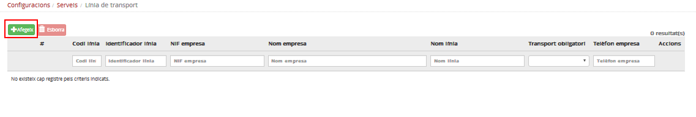*Imatge 8 - Pantalla per afegir un servei de transport*

Cal emplenar els camps i prémer el botó .

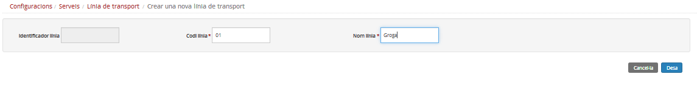*Imatge 9 - Edició de les dades del servei de transport*

En prémer el botó  es mostren tres pestanyes. En primer lloc cal emplenar la pestanya **Línia de transport** amb les dades de l'empresa.

Les altres pestanyes no són accessibles fins que no es prem el botó .

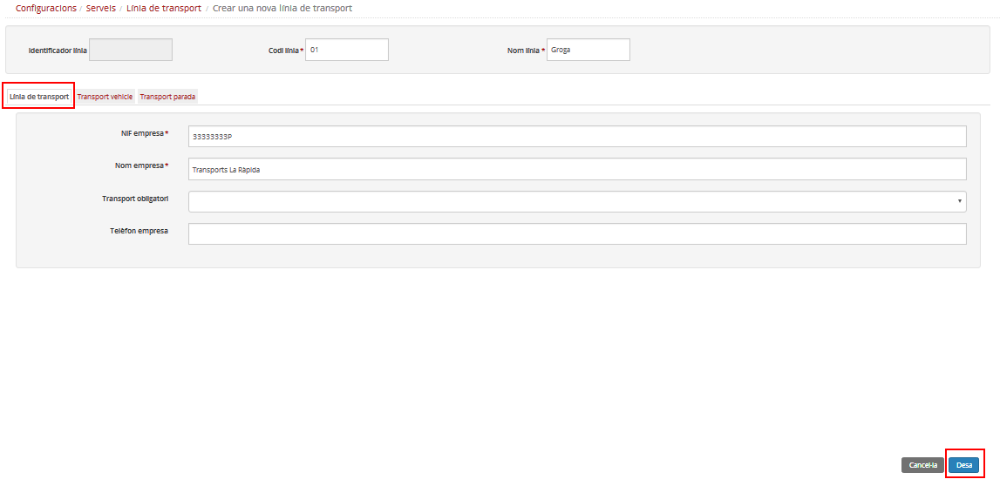*Imatge 10 - Edició de les dades d'una línia de transport*
  
  
 

---

#### Vehicles

Per definir els vehicles s'ha d'accedir al detall de la línia i prémer la pestanya **Vehicle de transport**.

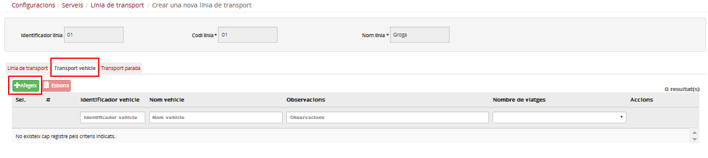*Imatge 11 - Pantalla per afegir un vehicle de transport*

Per definir un vehicle es prem el botó  i s'enregistra el nom del vehicle i el nombre de viatges.

S'ha de prémer el botó  de la finestra emergent per afegir el vehicle a la llista.

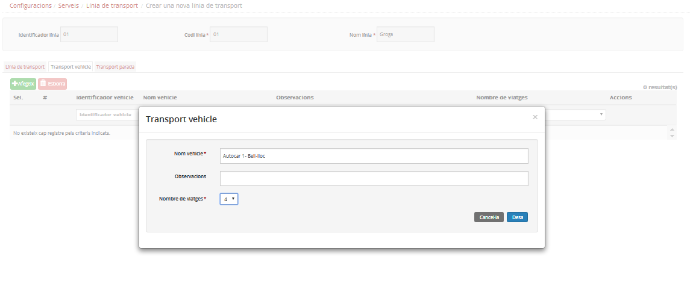*Imatge 12 - Edició de les dades del vehicle de transport*

En acabar de confegir la llista de vehicles, s'ha de prémer el botó  de la pestanya, per desar-ho.

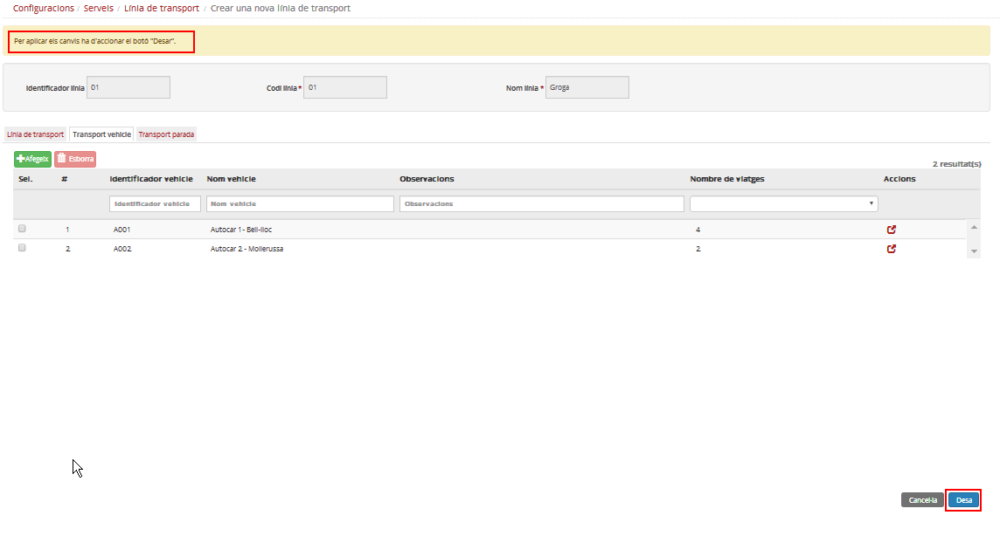*Imatge 13 - Llista dels vehicles de transport definits*
  
  
 

---

#### Parades

Per definir les parades s'ha d'accedir al detall de la línia i prémer la pestanya **Parada de transport**.

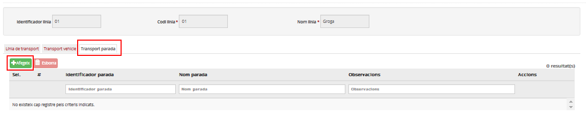*Imatge 14 - Pantalla per afegir una Parada de transport*

Es prem el botó  i s'emplena del nom de la parada. Es prem el botó  de la finestra emergent per afegir la parada a la llista.

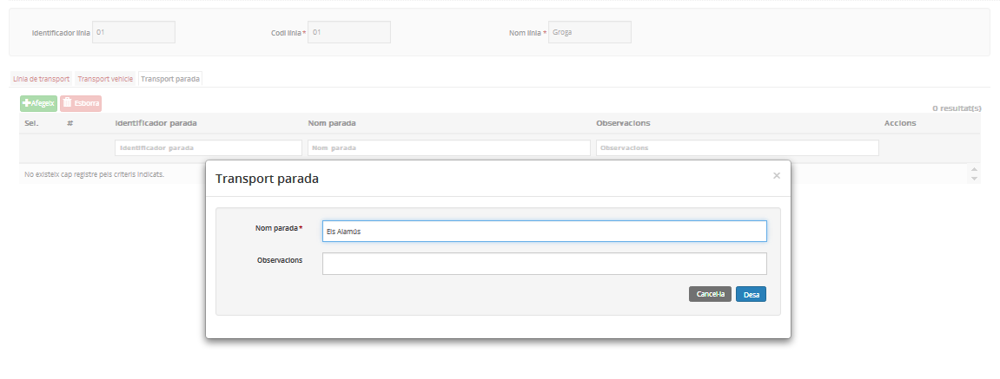*Imatge 15 - Edició de les dades d'una Parada de transport*

Un cop s'han definit les parades, s'ha de prémer el botó  de la pestanya **Parades de transport** per desar-ho tot.

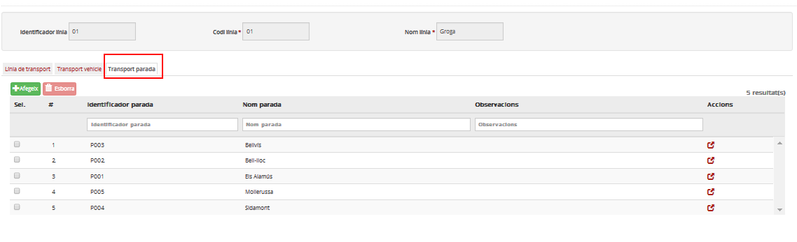*Imatge 16 - Llista de les parades de transport*

Un cop definides les línies, els vehicles i les parades, ja es pot assignar el servei de transport als alumnes que en siguin usuaris a la fitxa de l'alumne.
  
  
 

---