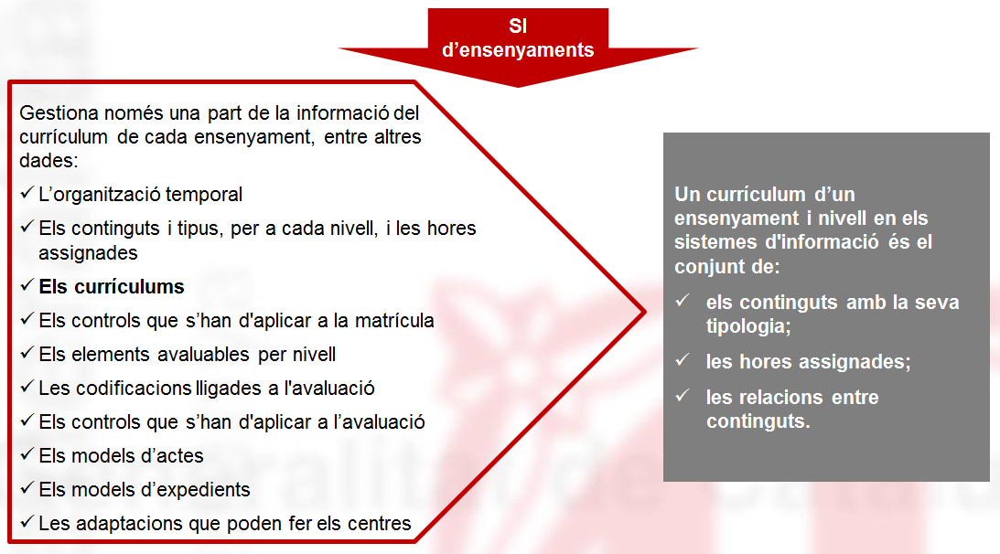
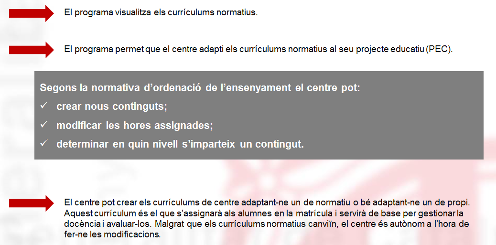
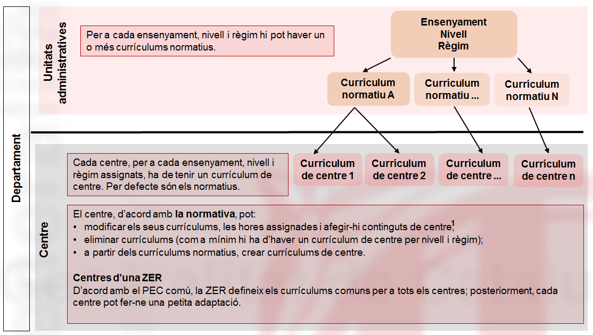
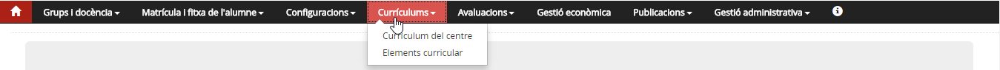

# Currículums

* [Contextualització](index.md#contextualitzacio)
* [Funcions](index.md#funcions)
* [D’on vénen les dades](index.md#don-venen-les-dades)
* [A quin lloc de l’aplicació es fan servir aquestes dades](index.md#a-quin-lloc-de-laplicacio-es-fan-servir-aquestes-dades)
* [Qui hi pot accedir](index.md#qui-hi-pot-accedir)
* [Com s’hi accedeix](index.md#com-shi-accedeix)
* [Organització](index.md#organitzacio)

### Contextualització

Segons l’**article 52 de la LEC**, “El currículum comprèn, per a cadascuna de les etapes i cadascun dels ensenyaments del sistema educatiu, els objectius, els continguts, els mètodes pedagògics i els criteris d’avaluació. En els nivells bàsics, el currículum inclou també les competències bàsiques. El currículum guia les activitats educatives escolars, en concreta les intencions i proporciona guies d’acció adequades al professorat, que té la responsabilitat última a l’hora de concretar-ne l’aplicació”.
  
  
L’avenç en la societat comporta noves tendències en l’educació: com més gran és l’autonomia dels centres per adaptar els ensenyaments a les necessitats dels alumnes, millors resultats se n’obtenen. En les noves normatives d’ordenació dels ensenyaments, que publica el Departament, ja es preveu aquesta llibertat perquè el centre els adapti a la seva realitat, i els concreti en el seu projecte educatiu.
  
  
Una altra situació que cal tenir en compte és el cas de les ZER, en què la normativa diu que totes les escoles comparteixen el mateix projecte educatiu (PEC) i la mateixa programació general anual. Tot i això, cada centre pot adaptar el currículum a les seves necessitats.

Els **sistemes d'informació** només gestionen una part de la informació del currículum de cada ensenyament.

* **Currículum:**

  + **[Educació infantil, segon cicle](https://educacio.gencat.cat/ca/departament/publicacions/colleccions/curriculum/curriculum-infantil-2cicle/)**
  + **[Educació primària](https://educacio.gencat.cat/ca/departament/publicacions/colleccions/curriculum/curriculum-ed-primaria/)**
  + **[Educació secundària obligatòria](https://educacio.gencat.cat/ca/departament/publicacions/colleccions/curriculum/curriculum-eso/)**
  + **[Batxillerat](https://educacio.gencat.cat/ca/departament/publicacions/colleccions/curriculum/curriculum-batxillerat/)**
* **Documents d'organització i gestió del centre:**

  + **[Portal de centre](https://espai.educacio.gencat.cat/Normativa/DOIGC/Pagines/default.aspx)**

*Imatge 1 - Els currículums en els sistemes d'informació*

### Funcions

Aquest mòdul permet que el centre pugui concretar l'oferta curricular a cada un dels ensenyaments i nivells i, si és el cas, crear elements curriculars del centre.

*Imatge 2 - Els currículums a Esfer@*

Per cada un dels nivells i ensenyaments, en funció de les necessitats i característiques, el centre pot crear els currículums de centre que cregui convenients.
  
  
[1)](index.md#1)*Continguts de centre: S’han d’identificar amb un codi únic. Tenen un nom, una assignació d’hores i, si cal, se’ls assigna un tipus segons l’ensenyament.**Imatge 3 - Currículums normatius i de centre*

### D’on vénen les dades

Les dades dels currículums del centre es creen a partir d'una còpia de les taules departamentals on, per cada ensenyament i nivell, hi ha la relació d'elements curriculars (àrees, matèries, unitats formatives…) que hi corresponen.  
  
En determinats ensenyaments (ESO, batxillerat i cicle formatiu), a més dels elements curriculars normatius, hi ha també els elements curriculars de centre, que el centre ha creat al llarg dels anys.

### A quin lloc de l’aplicació es fan servir aquestes dades

El currículum del centre es fa servir per poder fer la matrícula de l'alumne, amb el detall d'àrees, matèries i mòduls que cursarà i dels quals serà avaluat.

### Qui hi pot accedir

El personal de secretaria hi té accés en mode de consulta: pot veure tots els currículums del centre i els elements curriculars que corresponen als ensenyaments del centre.

L'equip directiu i les persones que el director o directora autoritzi, hi tenen accés complet per fer el manteniment dels currículums del centre existents i, si és el cas, crear matèries optatives o unitats formatives i mòduls de centre.

### Com s’hi accedeix

S'hi accedeix seleccionant el mòdul **Currículums** a la barra de menús del programa.
  
  
*Imatge 4 - Accés al mòdul Currículum*

### Organització

Està organitzat en dos submòduls:
  
  
**Elements curriculars**

* Consulta
* Manteniment
* Creació de continguts del centre
* Manteniment i creació de continguts de centre (si és el cas)

**Currículums del centre**

* Consulta
* Manteniment
* Creació de nous currículums (mitjançant una còpia o creant-ne un a partir d'un currículum de base)

[1)](index.md#1)
Continguts de centre: S’han d’identificar amb un codi únic. Tenen un nom, una assignació d’hores i, si cal, se’ls assigna un tipus segons l’ensenyament.