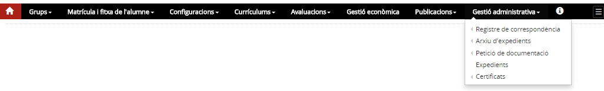

# Gestió administrativa

* [Contextualització](index.md#contextualitzacio)
* [Funció d’aquest mòdul](index.md#funcio-daquest-modul)
* [D’on venen les dades](index.md#don-venen-les-dades)
* [Qui hi pot accedir](index.md#qui-hi-pot-accedir)
* [Com s’hi accedeix](index.md#com-shi-accedeix)
* [Organització del mòdul](index.md#organitzacio-del-modul)

### Contextualització

Aquest mòdul agrupa una bona part de les tasques administratives de la secretaria d'un centre docent.
L'objectiu és facilitar la feina administrativa del personal de secretaria del centre des d'un mòdul exclusiu per aquestes tasques.

### Funció d’aquest mòdul

La gestió administrativa comprèn les funcions de:

* Arxiu i custòdia d'expedients
* Traspàs de documentació acadèmica entre centres
* Gestió de la correspondència
* Gestió d'avisos
* Certificats: elaboració i registre

### D'on venen les dades

Cada submenú d'aquest mòdul té una funció diferenciada per la qual cosa les dades provenen de mòduls diferents.

1. **Registre de correspondència**: aquesta funcionalitat té sentit en ella mateixa, les dades no procedeixen de cap altra mòdul de l'aplicació.
2. **Arxiu d'expedients**: les dades que es mostren en arxivar l'expedient d'un alumne provenen exclusivament de les avaluacions finals.
3. **Petició de documentació**: és la funcionalitat que permet gestionar el traspàs d'expedients entre centres o efectuar la petició o la tramesa de documentació amb un centre que no treballi amb Esfer@. Les dades que es reben o trameten formen part de l'expedient de l'alumne, per tant, aquesta funcionalitat té un lligam molt estret amb els expedients.
4. **Expedients**: les dades que es mostren a l'expedient d'un alumne provenen de l'avaluació final, del traspàs de custòdia de l'expedient de l'alumne o de la introducció de l'expedient en el cas d'un alumne procedent d'un centre que no treballi amb Esfer@.
5. **Certificats**: Des d'aquesta funcionalitat s'elaboren i registren certificats que emet el centre. En funció del tipus de certificat les dades procedeixen de la l'àmbit personal de la fitxa de l'alumne, de l'àmbit acadèmic de la fitxa de l'alumne o de la fitxa de personal.
6. **Avisos**: els avisos que es mostren en aquest apartat provenen de la mateixa aplicació o d'altres sistemes relacionats amb ella com ara RAL o GEDAC.

### Qui hi pot accedir

L'equip directiu i el personal de secretaria, així com les persones que el Director autoritzi, hi tenen accés complet per fer les tasques de gestió administrativa.

### Com s’hi accedeix

S'hi accedeix a través de la barra de menús de l'aplicació:
*Imatge 1 - Gestió administrativa*

### Organització del mòdul

El mòdul està organitzat en els següents apartats:

* [Registre de correspondència](../../mgac/gadmin/reg_corre.md)
* [Arxiu d'expedients](../../mgac/gadmin/arx_expe.md)
* [Petició de documentació](../../mgac/gadmin/peti_docu.md)
* [Expedients](../../mgac/gadmin/exped.md)
* [Certificats](../../mgac/gadmin/certif.md)
* [Avisos](../../mgac/gadmin/avisos.md)