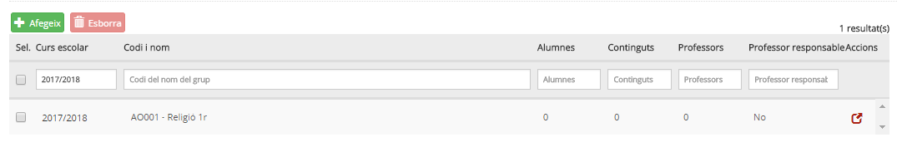
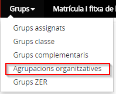
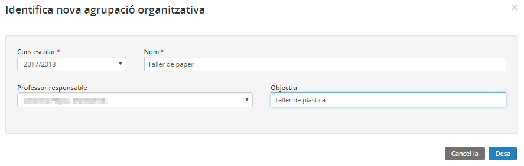
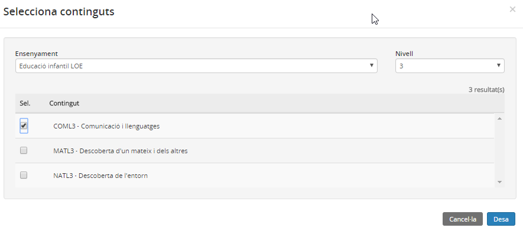
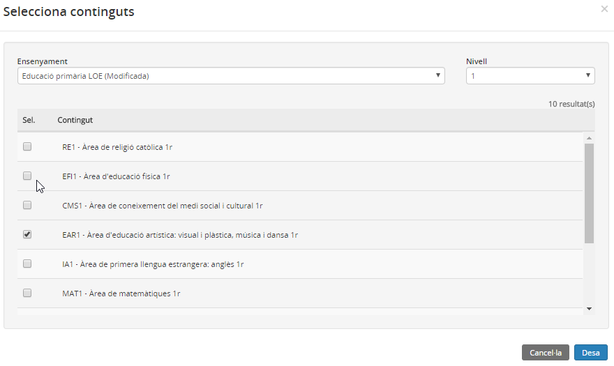
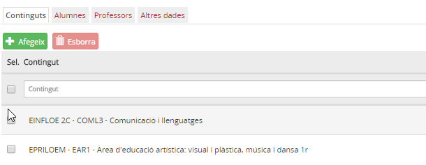
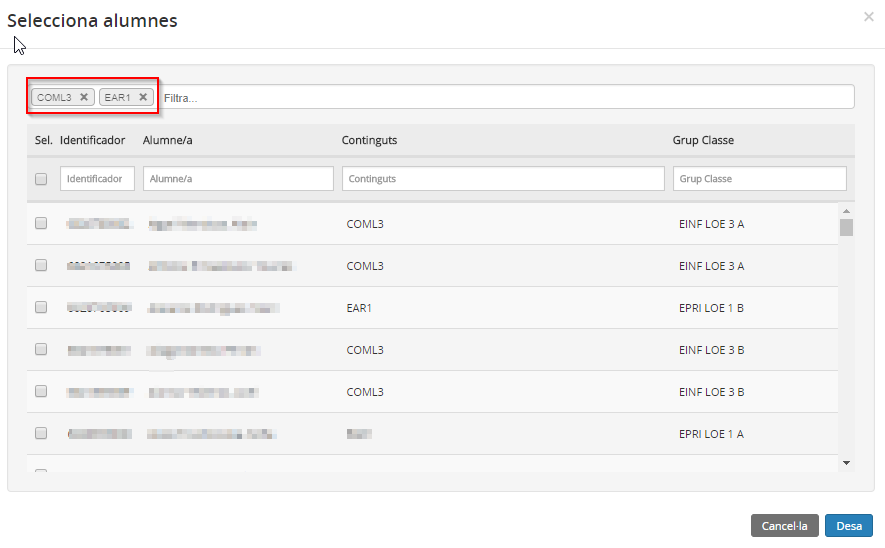
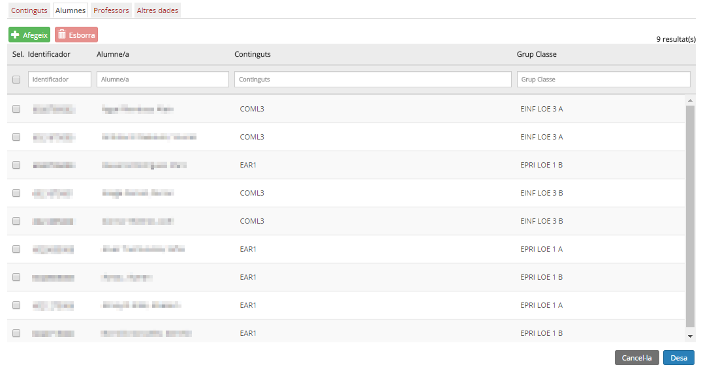
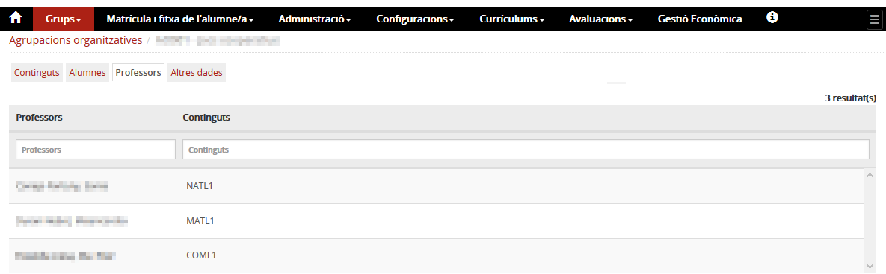
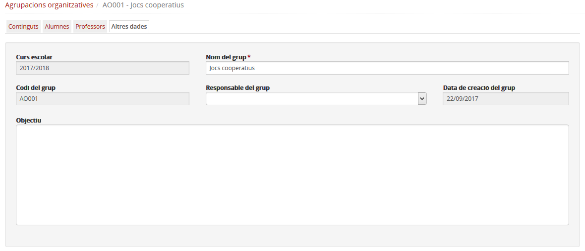

# Agrupacions organitzatives

* [Què són](agrup_organ.md#que-son)
* [Com s’hi accedeix](agrup_organ.md#com-shi-accedeix)
* [Quines operacions s'hi poden fer](agrup_organ.md#quines-operacions-shi-poden-fer)

  + [Crear una agrupació organitzativa](agrup_organ.md#crear-una-agrupacio-organitzativa)
  + [Esborrar una agrupació organitzativa](agrup_organ.md#esborrar-una-agrupacio-organitzativa)
  + [Modificar una agrupació organitzativa](agrup_organ.md#modificar-una-agrupacio-organitzativa)

### Què són

Una agrupació organitzativa és un tipus d'agrupació d'alumnes que realitzen alguna activitat docent junts. Els alumnes poden ser de diferents grups classe, de diferents nivells i, fins i tot de diferents ensenyaments.

Per tal de poder gestionar la totalitat de les funcions d'aquest apartat, és imprescindible haver definit prèviament els grups classe amb els alumnes, els continguts i els professors.

L'agrupació organitzativa conté:

* Continguts

Que els selecciona el centre al crear/editar l'agrupació. A una agrupació si poden assignar continguts de diferents nivells i/o ensenyaments.

* Alumnes

Que selecciona el centre a partir dels alumnes que tenen al currículum algun dels continguts assignats al grup.

* Professors

Que corresponen als que tenen assignats els continguts seleccionats en els grups classe dels alumnes de l'agrupació.

Quan el centre té agrupacions organitzatives creades, la pantalla mostra una taula amb la informació següent:

* **Curs escolar**
* **Codi - Nom**: El codi i el nom de l'agrupació.
* **Alumnes**: Nombre d'alumnes que formen part de l'agrupació.
* **Continguts**: Nombre de continguts assignats a l'agrupació.
* **Professors**: Nombre de professors assignats a l'agrupació.
* **Professor responsable**: "Sí/No" segons si s'ha especificat o no el professor responsable de l'agrupació.
* **Accions**: Icona mitjançant la qual es pot accedir al detall de l'agrupació.

*Imatge 1 - Llista d'agrupacions organitzatives del centre*
  
  

---

### Com s'hi accedeix

S'ha d'escollir l'opció **Agrupació organitzativa** del mòdul **Grups**.

*Imatge 2 - Accés a les agrupacions organitzatives*
  
  
Damunt la relació d'agrupacions hi ha un conjunt de camps que faciliten la cerca.
  
També és possible variar l'ordre en què es mostren les agrupacions per pantalla clicant sobre cada capçalera.

---

### Quines operacions s'hi poden fer

* [Crear una agrupació organitzativa](agrup_organ.md#crear-una-agrupacio-organitzativa) - Per crear noves agrupacions.
* [Modificar una agrupació organitzativa](agrup_organ.md#modificar-una-agrupacio-organitzativa) - Per veure la composició de l'agrupació, és a dir, la relació d'alumnes, continguts i professors que imparteixen cada contingut a l'agrupació i per modificar-lo, si és el cas.
* [Esborrar una agrupació organitzativa](agrup_organ.md#esborrar-una-agrupacio-organitzativa) - El programa permet esborrar una agrupació sempre que no tingui alumnes, continguts, professors i professor/a responsable.

---

#### Crear una agrupació organitzativa

* [Identificar l'agrupació](agrup_organ.md#identificar-lagrupacio)
* [Afegir/treure continguts a l'agrupació](agrup_organ.md#afegirtreure-continguts-a-lagrupacio)
* [Afegir/treure alumnes a l'agrupació](agrup_organ.md#afegirtreure-alumnes-a-lagrupacio)
* [Revisar i modificar els professors de l'agrupació](agrup_organ.md#revisar-i-modificar-els-professors-de-lagrupacio)

En primer lloc s'ha de clicar el botó .
Aquesta acció obrirà una finestra modal on introduir les dades generals.
  
  

---

##### Identificar l'agrupació

* **Curs escolar**: Camp obligatori. S'ha de seleccionar del desplegable el curs escolar a què correspon l'Agrupació.
* **Nom de l'agrupació**: Camp opcional on s'especifica el nom per identificar l'agrupació a les diferents pantalles de l'aplicació.
* **Professor responsable**: Camp opcional que permet seleccionar d'entre la relació de professors del centre, professor responsable de l'agrupació.
* **Objectiu**: Camp opcional que permet escriure allò que ajudi a identificar l'agrupació.

*Imatge 3 - Identificació d'una agrupació organitzativa*

---

Per gestionar l'agrupació, és a dir, posar-hi els alumnes, els continguts, els professors i el responsable, cal clicar la icona de l'agrupació seleccionada.

##### Afegir/treure continguts a l'agrupació

La pantalla mostra, a la part superior, algunes dades de la identificació de l'agrupació: **codi** (que ha posat l'aplicació automàticament) i **nom**.
  
La primera pestanya, **Continguts**, permet treure i afegir continguts a l'agrupació.
  
Per afegir continguts a l'agrupació cal clicar el botó .
  
A la pantalla es mostren uns desplegables que permeten cercar continguts per ensenyament (obligatori) i nivell (opcional), marcar els continguts desitjats i clicar al botó  per incorporar-los a l'agrupació.
  
  
*Imatge 4 - Cerca de continguts d'educació infantil*
  
  
A continuació s'hi poden afegir continguts d'altres nivells i/o d'altres ensenyaments:
  
  
*Imatge 5 - Cerca de continguts d'educació primària*
  
  
Un cop desat, a la pestanya "Continguts", es mostraran tots els continguts seleccionats de l'ensenyament i nivell.
  
  
*Imatge 6 - Continguts de l'agrupació organitzativa*
  
  
Per eliminar els continguts de l'agrupació cal seleccionar-los i clicar al botó .
  
  

---

##### Afegir/treure alumnes a l'agrupació

La segona pestanya **Alumnes**, permet veure els alumnes que hi ha a l'agrupació i permet afegir-ne i treure'n.
  
Per afegir alumnes a l'agrupació cal clicar el botó .
  
  
S'obrirà una finestra modal que mostrarà els alumnes que tenen, en el currículum de la matrícula activa, algun dels continguts inclosos a l'agrupació.
  
  
*Imatge 7 - Llista d'alumnes que tenen algun contingut de l'agrupació*
  
  
Cal marcar els alumnes que es desitgi incorporar a l'agrupació i acabar clicant al botó .
  
Els alumnes passaran a mostrar-se a la llista d'alumnes de l'agrupació.
  
*Imatge 8 - Llista d'alumnes de l'agrupació*
  
La taula d'alumnes del grup disposa de la informació següent:

* **Identificador de l'alumne/a**
* **Nom i cognoms de l'alumne/a**
* **Continguts**: Codi del contingut de l'agrupació que cursa l'alumne.
* **Grup classe**: Codi del grup classe al qual pertany l'alumne.

Si cal treure algun alumne de l'agrupació, cal seleccionar-lo de la llista d'alumnes i a continuació clicar al botó .
  
  

---

##### Revisar i modificar els professors de l'agrupació

Un cop estan els continguts assignats a l'agrupació, l'aplicació incorpora els professors que, al grup classe, s'ha determinat com a responsables dels continguts seleccionats.
  

La incorporació del professorat és automàtica, d'acord al que s'ha assignat anteriorment per a cada contingut. Aquesta atribució no es pot modificar en aquest apartat. En cas de necessitar canviar professorat, cal determinar-ho a **Continguts**, a l'opció del menú **Grups classe** del mòdul **Grups**.

  
*Imatge 9 - Professors de l'agrupació*
  
  
La darrera pestanya **Altres** permet modificar el nom de l'agrupació, posar, treure o modificar el professor responsable i afegir observacions si escau.
  
*Imatge 10 - Altres dades de l'agrupació*
  
  

---

#### Esborrar una agrupació organitzativa

A la pantalla principal es mostra la llista d'agrupacions organitzatives que hi ha. Aquí es poden també esborrar les agrupacions creades.
  
Només es pot esborrar una agrupació si no conté alumnes, continguts, professors ni responsable.
Cal marcar l'agrupació o agrupacions i prémer el botó .
  

---

#### Consultar/Modificar

Clicant la icona d'acció d'una agrupació s'accedeix a la seva composició i a les seves dades d'identificació.
  
És possible modificar el nom de l'agrupació, les observacions i la composició, tant pel que fa als alumnes, professors, continguts i responsable de l'agrupació.

---